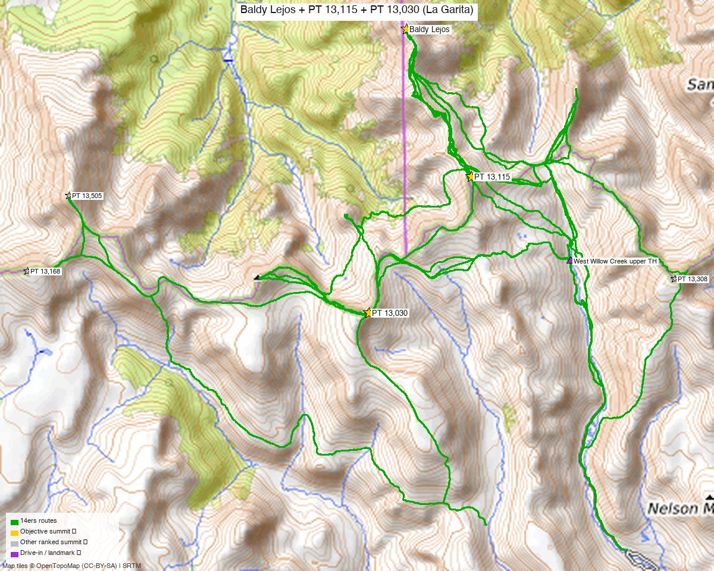

# "Baldy Lejos" + PT 13,115 + PT 13,030 — La Garita Wilderness (West Willow / Creede)

**Researched:** 2026-06-09
**Report type:** Day trip — a Class 2 tundra trio north of San Luis Pass
**CalTopo research map:** https://caltopo.com/m/4278RCG
**Status in DB:** all three unclimbed.

> Western half of the seven-peak La Garita narrow-down. The **eastern four (13,408 / 13,308 / 13,166 / 13,026)** are a separate report ([Phoenix Park group](phoenix_park_group.md)) — a different Creede trailhead.

*[Interactive CalTopo map](https://caltopo.com/m/4278RCG)* — 6 source GPX tracks (14ers library), layered by source; 3 summit markers + the West Willow upper TH.

---

<!-- CLIMBERS_START -->
**Other climbers:** Emily Sharpe — not yet · Shawn D Keil — not yet
<!-- CLIMBERS_END -->

## Quick stats

| | "Baldy Lejos" | PT 13,115 | PT 13,030 |
|---|---|---|---|
| Elevation | 13,118' | 13,115' | 13,030' |
| Lat / Lon | 37.9941, −107.0006 | 37.9694, −106.9872 | 37.9466, −107.0083 |
| Class | 1+ / 2 (tundra) | 2 | 2 |
| CO Rank | 553 | 556 | 619 |
| Also known as | formerly UN 13,100 E | — | formerly UN 13,034 |
| Weather | [NOAA](https://forecast.weather.gov/MapClick.php?lat=37.9941&lon=-107.0006) | [NOAA](https://forecast.weather.gov/MapClick.php?lat=37.9694&lon=-106.9872) | [NOAA](https://forecast.weather.gov/MapClick.php?lat=37.9466&lon=-107.0083) |
| 14ers.com | [10562](https://www.14ers.com/php14ers/peak.php?peakid=10562) | [10554](https://www.14ers.com/php14ers/peak.php?peakid=10554) | [10591](https://www.14ers.com/php14ers/peak.php?peakid=10591) |
| LoJ | [714](https://listsofjohn.com/peak/714) | [701](https://listsofjohn.com/peak/701) | [788](https://listsofjohn.com/peak/788) |
| peakbagger | [84932](https://peakbagger.com/peak.aspx?pid=84932) | [84934](https://peakbagger.com/peak.aspx?pid=84934) | [84927](https://peakbagger.com/peak.aspx?pid=84927) |
| Peak DB id | 714 | 701 | 788 |

All three sit on the **divide north of San Luis Pass**, within ~3 mi of each other — Baldy Lejos (north) → 13,115 (middle) → 13,030 (south).

---

## Recommended day — West Willow Creek upper TH (San Luis Pass) ⭐

An **easy, mostly Class 2 tundra walk** — climb13ers calls Baldy Lejos a "Class 1+, mostly tundra hike … may provide opportunity to view a moose."

| | |
|---|---|
| Peaks | Baldy Lejos + PT 13,115 + PT 13,030 |
| **Clean trio (full 4WD start)** | **~10.2 mi / ~2,630'** (climb13ers, from the high TH near San Luis Pass) |
| Recorded GPX range | **12–20 mi / ~5,000–7,000'** — parties who started lower and/or added the unranked bumps (13,005, 12,951, 12,583, 12,471) |
| Class | 2 (1+ tundra on Baldy Lejos) |
| Trailhead | **West Willow Creek upper TH (~11,500' with full 4WD)** |

### Route sequence
1. From the **West Willow Creek upper TH** near **San Luis Pass**, climb onto the tundra divide.
2. Traverse north over **PT 13,030** and **PT 13,115** — *"most will go over 13,115 to reach Baldy Lejos"* (climb13ers).
3. Continue to **"Baldy Lejos" (13,118')**, the north end. Return the way you came (or loop over the unranked 13,005 if you want a longer day).

> **It's all about the road:** with full high-clearance 4WD up West Willow Creek you start high (~11,500') and the three go quickly (~10 mi / ~2,600'). With a lower start it's a much bigger day (the recorded tracks run 12–20 mi). **Vehicle clearance is the single biggest variable here.**

---

## Drive + approach

| | |
|---|---|
| **Drive from Boulder** | **[~5 h to Creede via Google Maps](https://www.google.com/maps/dir/?api=1&origin=1162+Peakview+Circle,+Boulder,+CO+80302&destination=37.84913,-106.92766)** then the rough West Willow Creek 4WD road above town. |
| Access | From Creede (Mineral County Courthouse), go up **Willow Creek Rd (FR 503)** ~¾ mi to the **East Willow / West Willow junction**; bear onto **West Willow Creek Rd** and climb toward San Luis Pass. **Last ~1.5 mi is moderate 4WD.** |
| Trailhead | **West Willow Creek upper TH**, ~37.9553, −106.9665, **~11,500'** (high-clearance 4WD) — lower parking adds mileage. |
| Land | **La Garita Wilderness** (GMUG / Rio Grande NF) — **no permits/fees, foot travel only** beyond the TH; dispersed camping allowed. |

> **Pairs with the Phoenix Park group via Creede, not via the mountains.** The eastern four use the **East Willow → Phoenix Park** fork (the roads split ¾ mi above Creede). Base in Creede; the two upper trailheads are ~2–3 h of rough driving apart even though they're close as the crow flies.

---

## Conditions / season

- **Best window:** **July through September.** High, remote La Garita; the West Willow road and upper basins open late.
- **Terrain:** benign — rolling alpine tundra, Class 2 with chiprock up high. The challenge is length + altitude + the 4WD approach, not difficulty.
- **Storms:** wide-open tundra with no fast escape — start early, watch the sky.

---

## Cell coverage

- **14ers.com community DB:** no reception reports for these summits.
- **Geographic reasoning:** deep in the La Garita — **treat as dead** at the TH and on the peaks.
- **Recommendation:** carry an **InReach / satellite messenger**.

---

## Trip reports & GPX (all sources)

**Sources confirmed logged in:** 14ers.com ("letsgocu"), listsofjohn.com (logged in), peakbagger.com (logged in). **6 GPX tracks** swept from the 14ers library — all on the CalTopo map.

### 14ers.com GPX library (logged in, "letsgocu")
Several recorded outings cover the trio (often with extra unranked bumps); a few showed elevation-sensor noise (one track logged an impossible 37k′ — ignored).

### listsofjohn.com (logged in)
Combo TRs confirm the trio is climbed as a set: [17186](https://listsofjohn.com/tr?Id=17186), [2180](https://listsofjohn.com/tr?Id=2180) (Baldy Lejos + 13,115 + 13,030 + unranked bumps), and [24545](https://listsofjohn.com/tr?Id=24545) / [5946](https://listsofjohn.com/tr?Id=5946) (the trio **+ the eastern bridge peak 13,308** for a longer day).

### peakbagger.com (logged in)
Pages verified for all three; **ownership = La Garita Wilderness** (GMUG / Rio Grande NF).

### climb13ers.com
[Baldy Lejos route](https://www.climb13ers.com/colorado-13ers/un13100--e--baldy-lejos) — "WEST WILLOW CK – SAN LUIS PASS – CREEDE," **10.2 mi / 2,630'**, recommends combining with 13,115 + 13,030.

**Sources checked:** 14ers.com ✓ (logged in, "letsgocu") · listsofjohn.com ✓ (logged in) · peakbagger.com ✓ (logged in) · climb13ers.com ✓

---

## TL;DR

- **Three ranked La Garita 13ers in one easy Class 2 tundra day** north of San Luis Pass: Baldy Lejos (13,118') + PT 13,115 + PT 13,030.
- **~10.2 mi / ~2,630' with full 4WD** to the West Willow Creek upper TH; **12–20 mi** if you start low or add the unranked bumps — **vehicle clearance is the crux.**
- **Trailhead:** West Willow Creek upper TH (~11,500'), up the rough road from Creede (¾ mi above town the road forks E/W Willow — take West Willow).
- **La Garita Wilderness** — no permits, foot-only, dispersed camping OK.
- **Drive:** ~5 h Boulder→Creede, then the 4WD road. Cell dead — InReach.
- **Pairs with the [Phoenix Park four](phoenix_park_group.md) on a Creede-based trip** (separate trailhead, ~2–3 h of rough driving apart).
- **Research map:** https://caltopo.com/m/4278RCG
