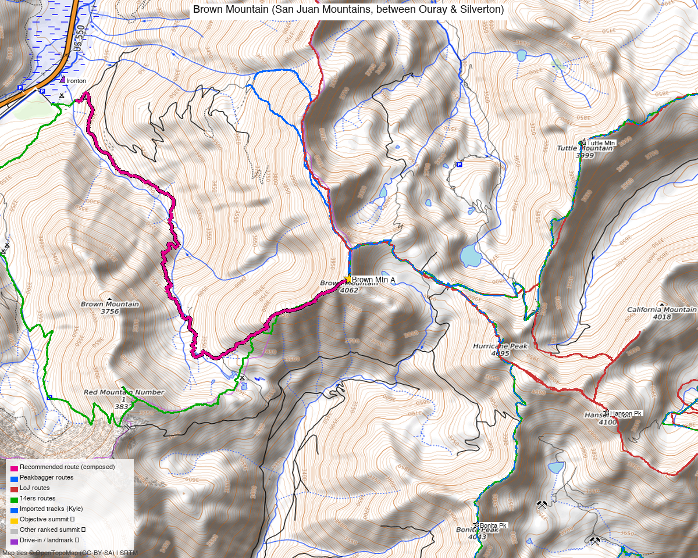

# Brown Mountain (San Juan Mountains, between Ouray & Silverton)

<!-- QUICKSTATS_START -->

!!! tip "At a glance — recommended day"
    **8.9 mi** · **3,739 ft** gain · **Class 2** · 1 peak · ~6.3 h drive

<!-- QUICKSTATS_END -->

**Researched:** 2026-05-14 (rev 4 — cluster status confirmed 5/15)

!!! weather ""
    **NOAA weather link:** [Brown Mountain Weather](https://forecast.weather.gov/MapClick.php?lat=37.92078&lon=-107.63785)

!!! map ""
    **CalTopo research map:** https://caltopo.com/m/Q2C5650

**Status in your sheet:** 0 ascents (unclimbed). **Cluster status (Kyle confirmed 5/15):**
- ✓ Done: Houghton, Tuttle, UN 13078, Hanson
- ✗ **Unclimbed ranked 13ers nearby — pair with Brown:** **Bonita Pk** (1.81 mi from Brown), **Proposal Pk** (2.74 mi from Brown). See Multi-peak link-ups below.
- N/A: Hurricane, California, Emery are unranked 12ers, not tracked.

---

<!-- CLIMBERS_START -->
**Other climbers:** Emily Sharpe — not yet · Shawn D Keil — ✓ climbed
<!-- CLIMBERS_END -->

<!-- PROVENANCE_START -->
*Note: the recommended route was distilled from **6 recorded GPS tracks** of real trips (14ers.com · ListsofJohn · peakbagger) — all layered on the [interactive CalTopo research map](https://caltopo.com/m/Q2C5650).*
<!-- PROVENANCE_END -->

---

## The peak

| | [Brown Mountain (DUCO BM)](https://www.14ers.com/peaks/10441) |
|---|---|
| Elevation (LiDAR) | 13,347' (climb13ers + 14ers consensus); your sheet says 13,339' |
| Lat / Lon | 37.92078, −107.63785 |
| 14ers.com peak page | https://www.14ers.com/peaks/10441/13er-brown-mountain-a |
| Range | San Juan Mountains |
| Class (standard) | 2 |
| Note | 3-mile ridgeline; high point is "DUCO Benchmark" |

---

## Multi-peak link-ups

**Cluster status (rev 4 — confirmed):**

| Peak | Dist from Brown | In sheet? | Status |
|---|---|---|---|
| Tuttle Mtn | 1.66 mi | ranked | ✓ done |
| Hanson Pk | 1.77 mi | ranked | ✓ done |
| **Bonita Pk** | **1.81 mi** | **ranked** | **✗ unclimbed** |
| **Proposal Pk** | **2.74 mi** | **ranked** | **✗ unclimbed** |
| Houghton Mtn | 3.12 mi | ranked | ✓ done |
| UN 13078 | nearby | ranked | ✓ done |
| Hurricane Pk | 0.98 mi | unranked 12er | N/A — not tracked |
| California Mtn A | 1.75 mi | unranked 12er | N/A — not tracked |
| Emery Pk | 2.42 mi | unranked 12er | N/A — not tracked |

**Bottom line:** Don't drive to this cluster just for Brown. There are **two ranked unclimbed 13ers** within easy ridge-walking distance. The whileyh 8-peak track on the research map already chains Brown ↔ Bonita ↔ Proposal — the connecting ridges are proven Class 2.

### Option A — Brown + Bonita + Proposal mega-day (RECOMMENDED) ⭐

The whileyh 8-peak loop (8/2/2019, GPX on the research map) chains all three plus 5 already-done summits in one outing. For your purposes, drop the already-done peaks and just hit the three unclimbed ranked ones.

**Best start: Silverton CR 25** (whileyh's TH) rather than Corkscrew Pass — the chain naturally runs east-side from Silverton.

**Estimated stats** (just the three unclimbed peaks; need to measure exact figures from the whileyh GPX):
- ~10–12 mi RT, ~4,000–4,500 ft gain, Class 2
- Likely **at or above your 4,500 ft filter** depending on how much of the loop you cut
- Long ridge day — early start, off the ridge before afternoon storms

**Exact distance/gain TBD:** measure the whileyh GPX between just the three summits to firm up the number. Could come in under 4,500 ft if the connecting ridges don't drop much between summits.

### Option B — Brown + Bonita only (shorter, skip Proposal for a future trip)

If 4,500 ft is a hard cap or weather is iffy, do Brown + Bonita from the Corkscrew Pass road approach (Option A from the original route table below). Drive to the Brown saddle (~11,755 ft), hit Brown, then traverse the ridge east-southeast to Bonita.
- Estimate ~6–8 mi RT, ~2,800–3,500 ft gain, Class 2
- Saves Proposal for a separate trip with whatever's still nearby
- Bonita summit at ~37.9050, −107.6294 (verify against your "All" map)

### Option C — Brown alone

Only makes sense if you're hitting Bonita + Proposal from a different approach in a different trip. Otherwise the per-peak driving cost is wasted.

---

## Recommended approach — drive up Corkscrew Pass road from US 550 (Ironton)

The Corkscrew Pass / Hurricane Pass 4WD road starts off US 550 at the Ironton ghost-town area, ~7.8 mi south of Ouray. Same general direction as the Ironton TH — **no driving around to Silverton needed**. Three viable park-and-hike points depending on how much driving vs hiking you want:

| Option | Park elev | Hike route | Distance RT | Gain | When to use |
|---|---|---|---|---|---|
| **A. Drive partway, park at Brown saddle (~11,755 ft)** ⭐ | 11,755' | NE up steep grass to Brown summit ridge, deal with false summits | **~3 mi** | **~1,600 ft** | **Sweet spot.** Skip the road-walking grind, save the technical 4WD section. |
| **B. Drive all the way to Hurricane Pass top (~12,500 ft)** | ~12,500' | W along ridge to Brown summit | ~2–3 mi | ~700–900 ft | Shortest hike. Drives the hardest 4WD section (narrow switchbacks). |
| **C. Park at Ironton, hike full loop** | ~9,800' | Full Neapolitan loop via Corkscrew + Red No.1 + Gray Copper | 10 mi | 4,380 ft | If you want the workout, no 4WD, or aspen color in fall. |

### The road itself

| | |
|---|---|
| TH location | Off US 550, ~7.8 mi south of Ouray (near Ironton) — turn left at "dam" with wood bridge and large parking |
| Drive from Boulder | **[6h 21m via Google Maps](https://www.google.com/maps/dir/?api=1&origin=1162+Peakview+Circle,+Boulder,+CO+80302&destination=37.94,-107.6688)** (328 mi, origin: 1162 Peakview Circle) |
| Length, US 550 → Hurricane Pass top | ~7.1 mi (4.8 mi to Corkscrew Pass at ~12,200', +2.3 mi to Hurricane Pass at ~12,500') |
| Difficulty | "Easy 2" / Moderate. Wide and graded most of the way. |
| Crux | Narrow switchbacks at the top approaching Hurricane Pass — intimidating but not technically hard |
| Vehicle | High-clearance 4WD recommended. Stock 4WD fine, no lockers. Your high-clearance vehicle handles this. |
| When wet | Significantly harder — slippery clay soil. Don't go right after rain. |
| Season | June–September. Impassable winter. |

### Recommended sequence — Option A (Brown saddle drive-in)

1. From US 550 / Ironton, take the Corkscrew Pass road east up Corkscrew Gulch
2. Drive ~3-4 miles up the road to the saddle area at **37.91106, −107.65022 (~11,755 ft)** — there are some small ponds here. Park off the road (room for a vehicle)
3. Hike NE up the **steep grassy slopes** about 1.5 miles to Brown's summit ridge — ~1,600 ft of gain
4. **Beware multiple false summits** on the ridge (per vonmackle's TR — "endless chain of false summits"); the true summit is further along
5. Return same way

### When Option B (drive to Hurricane Pass top) makes sense

- You want the shortest possible hike
- Conditions are dry and you're comfortable with the narrow switchback section near the top
- Approach Brown via the W ridge from the pass area (longer ridge walk than Option A's grass slope, but less elevation gain)

### When Option C (full hike from Ironton) makes sense

- Aspen viewing season — vonmackle specifically called out the colors on US 550 in late September
- You want a true mountain day with significant elevation gain
- Avoiding 4WD road traffic / dust on dry summer days

**Beware the Neapolitan TR caveat:** vonmackle did the full hike on a snowy/cloudy day. The grassy slopes between saddle and summit can be wet and slippery — phone GPS recommended for visibility-limited conditions.

---

## Alternate routes (lower priority for you)

### B. Silverton / Alaska Basin east approach
Earthline 8/11/2020 — 7.6 mi / 2,500' from Pt 12,947' high TH. Bags Brown + Abrams (unranked). Less mileage but you've done all the other east-side cluster peaks, so the long 4WD drive doesn't pay off.

### C. The 8-peak Silverton CR 25 mega-loop
14ers GPX library entry from whileyh (8/2/2019, 1 GPX track on the research map): Proposal + Emery + Bonita + Hurricane + Brown + Tuttle + UN 13078 + Houghton in one outing from Silverton CR 25. Useful as a reference for what's possible in the area, but **not relevant for you** — you've done 7 of those 8 peaks.

---

## Trailhead — Ironton (W approach)

- **Approx location:** 37.94, −107.6688 (verify; ghost-town parking off US 550)
- **Vehicle:** anything (paved highway access)
- **Start elevation:** ~9,800' (lower than Silverton-side, hence the longer hike to summit)
- **Drive:** ~10 min south of Ouray on US 550 (Million Dollar Highway)
- No facilities at the pullout

---

## Gear & season

- **Best window:** mid-June through early October. Expect snow patches on N aspects into July
- **September observations** (per TR 22851): cold mornings, cloud/snow possible, beautiful aspen color on US 550
- **Hazards:** false summits on Brown ridge; steep grass slopes can be slippery wet/icy; standard storm exposure on a long ridge
- **4WD road traffic:** Corkscrew Gulch sees lots of 4WD traffic in summer — can mean dust on dry days. Wet days much quieter
- **US 550 (Million Dollar Highway):** open year-round but check CDOT for winter closures (avalanche control)
- **Permits / access:** Uncompahgre / San Juan National Forest — no permits, no fees. Standard wilderness rules don't apply (this is mostly mining-era public land outside designated wilderness)

---

## Trip reports (14ers.com authenticated)

| Date | Source | Stats | Notes |
|---|---|---|---|
| 9/22/2024 | [14ers.com TR 22851 (vonmackle)](https://www.14ers.com/php14ers/tripreport.php?trip=22851) | 10 mi, 4,380' | **Recommended route.** Ironton loop via Corkscrew + Gray Copper. Brown + Red Mtn No.1. Class 2. **GPX downloaded.** |
| 8/2/2019 | [14ers.com GPX library upload](https://www.14ers.com/php14ers/gpxlib_locator.php?peakid=10441) | 1 track, 8 peaks | whileyh — Proposal + Emery + Bonita + Hurricane + Brown + Tuttle + UN 13078 + Houghton from Silverton CR 25. Reference only — you've done 7 of these 8. **GPX downloaded.** |
| 8/11/2020 | [Earthline (van Winegarden)](https://debravanwinegarden.blogspot.com/2020/08/brown-mountain-13339-traverse-to-abrams.html) | 7.6 mi, 2,500' | East approach from Silverton/Alaska Basin (4WD high TH). Brown + Abrams (unranked). |
| route info | [climb13ers.com Brown Mtn](https://www.climb13ers.com/colorado-13ers/brown-mountain) | not stated | SW Ridge route description. |
| route info | [SummitPost Brown Mtn](https://www.summitpost.org/brown-mountain/151748) | partial | West approach via Brown Mtn Rd from US 550 (different start than Ironton). |

---

## .gpx files (in `gpx/brown_mountain/`)

**Public 14ers.com downloads (NEW):**
- `brown_red_mtn1_neapolitan_amble_14ers_TR22851.gpx` — vonmackle's actual track from the recommended Ironton loop (the one to use for your trip)
- `brown_8peak_loop_silverton_cr25_14ers_gpxlib_72823.gpx` — whileyh's 8-peak mega-loop track for reference

**Generated:**
- `brown_mountain_peaks_only.gpx` — Brown summit + Hurricane + California (yellow markers on map)
- `brown_mountain_landmarks.gpx` — Alaska Basin TH, Brown Mtn Rd jct, Hurricane Pass, Gold Prince Mine TH (red markers)
- `brown_mountain_landmarks_v2.gpx` — Ironton TH (red marker, added rev 2)

**Your existing imported tracks (in `_kyle_existing/`):**
- `kyle_proposal_pea_1_R7AHHPK.gpx` — passes within 12 m of Brown's summit (the 8-peak loop, possibly the same source as the 14ers upload)
- `kyle_hanson_group_C105AEV.gpx` — your Hanson cluster planning data (the eastern peaks you've now done)

**All layered on the CalTopo research map.**

---

**Sources checked:** 14ers.com · listsofjohn.com · peakbagger.com
