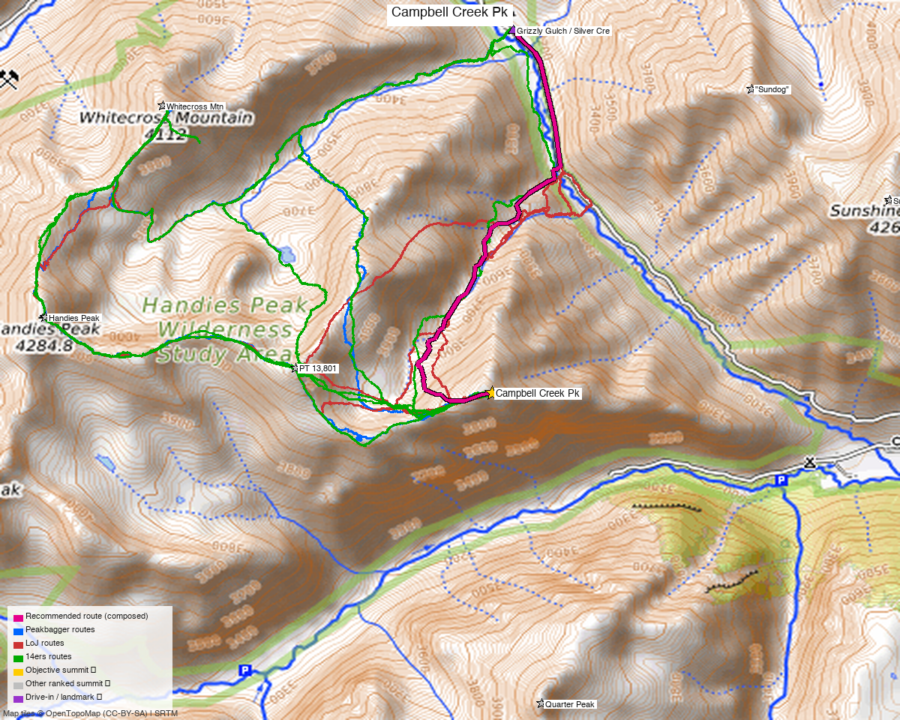

# Campbell Creek Pk (13,461') — standalone from Grizzly Gulch

<!-- QUICKSTATS_START -->

!!! tip "At a glance — recommended day"
    **5.7 mi** · **3,443 ft** gain · **Class 2** · 1 peak · ~5.75 h drive · [weather](https://forecast.weather.gov/MapClick.php?lat=37.9067&lon=-107.4629)

<!-- QUICKSTATS_END -->

**Researched:** 2026-06-15
**Report type:** Single peak — your last unclimbed ranked 13er in the Handies cluster, climbed **on its own** (no add-on peaks).
**CalTopo research map:** https://caltopo.com/m/4CBBN9L
**Status in DB:** unclimbed. **Every ranked 13er within 4 miles is already done** (PT 13,801, Quarter, Sundog, Handies, Sunshine, Whitecross, American, Half, Redcloud…) — this is the lone cleanup peak.

> A grassy **Class 2** 13er on the divide SE of Handies. Recorded parties always bag it alongside Handies / PT 13,801 / Whitecross, but it stands alone as a short, direct out-and-back from the **Grizzly Gulch TH** — which is what's mapped here.

*[Interactive CalTopo map](https://caltopo.com/m/4CBBN9L)* — 3 recorded 14ers-library tracks (green; all multi-peak) + the **standalone recommended out-and-back in bold magenta**; summit marker + Grizzly Gulch TH.

---

<!-- CLIMBERS_START -->
**Other climbers:** Emily Sharpe — not yet · Shawn D Keil — not yet
<!-- CLIMBERS_END -->

## Quick stats

| | Campbell Creek Pk |
|---|---|
| Elevation | 13,461' (LiDAR; 13,454' previous) |
| Lat / Lon | 37.90666, −107.46294 |
| Class | **2** (grass/tundra) |
| CO Rank | 284 |
| Range / County | San Juan / Hinsdale |
| Recommended climb | **~5.7 mi / ~3,443'** (DEM, standalone out-and-back) |
| 14ers.com | [10399](https://www.14ers.com/php14ers/peak.php?peakid=10399) |
| LoJ | [357](https://listsofjohn.com/peak/357) |
| peakbagger | [84977](https://peakbagger.com/peak.aspx?pid=84977) |
| Peak DB id | 357 |

---

## The standalone climb — Grizzly Gulch TH ⭐

A direct out-and-back, **~5.7 mi / ~3,443′, Class 2** — no neighboring summits required. Every recorded track does Campbell Creek as part of a Handies-area multi-peak day; this is the shortest line that tags **only** Campbell Creek.

| | |
|---|---|
| Peak | Campbell Creek Pk (13,461') |
| **Recommended route** | **~5.7 mi / ~3,443′ (DEM), out-and-back** |
| Class | **2** — mostly grass and tundra; **stay on the grass to avoid loose scree/dirt** near the top |
| Trailhead | **Grizzly Gulch / Silver Creek TH, ~10,400'** — Lake Fork (Cinnamon Pass) road; **4WD/high-clearance**. Same lot as the Handies NE-slopes route, across the valley from Redcloud/Sunshine. |

### Route
1. From the **Grizzly Gulch TH**, take the good trail through the woods up to **open tundra** (the start of the Handies/Grizzly Gulch trail).
2. Leave the main trail and climb **south up grass slopes** toward Campbell Creek Pk's north ridge. A web of **game trails** leads onto the ridge; **stay on grass** — the direct gully just below the summit is loose scree/dirt, so swing right and come back left up grass.
3. Easy grass to the summit. Return the **same way**.

> **Do not descend the Campbell Creek drainage** (the obvious-looking loop SE off the summit). Per the one Campbell-focused TR it's a "willow fight" with a sketchy Lake Fork river crossing — "American Basin great and Campbell Creek not so much." The clean line is the Grizzly Gulch out-and-back.

---

## Drive + approach

| | |
|---|---|
| **Drive from Boulder** | **[~5h 45m via Google Maps](https://www.google.com/maps/dir/?api=1&origin=1162+Peakview+Circle,+Boulder,+CO+80302&destination=37.93684,-107.46068)** — ~5 h to **Lake City**, then the **Lake Fork / Cinnamon Pass road** (CR 30) up to the Grizzly Gulch TH. |
| Trailhead | **Grizzly Gulch / Silver Creek TH**, ~37.937, −107.461, **~10,400'**. The Lake Fork road to here is **rough — high-clearance 4WD** (same access as Handies' Grizzly Gulch route). |
| Land | **Handies Peak Wilderness Study Area** (BLM) — no permits/fees, foot travel beyond the TH. |

---

## Conditions / season

- **Best window:** **July–September.** The Lake Fork road and upper basin open late; north-facing grass holds snow into early summer.
- **Terrain:** benign **Class 2 grass/tundra** — the difficulty is altitude and a bit of routefinding to stay on grass, not scrambling.
- **Storms:** wide-open tundra, no shelter high — early start, watch the afternoon.
- **Cell:** dead — carry an InReach.

---

## Trip reports & GPX (all sources)

**Sources confirmed logged in:** 14ers.com ("letsgocu"), listsofjohn.com, peakbagger.com (Kyle Knutson). **3 14ers-library tracks** (all multi-peak — Campbell + Handies/13801/Whitecross) are layered green; the standalone recommended out-and-back is magenta.

- **14ers.com:** 101 member ascents; GPX library has 3 tracks (all bundle Campbell Creek with Handies-area peaks). Key TR: [piper14er — "American Basin great and Campbell Creek not so much"](https://www.14ers.com/php14ers/tripreport.php?trip=17871) (Grizzly Gulch start; the willow-fight warning on the Campbell Creek descent).
- **listsofjohn.com:** [peak 357](https://listsofjohn.com/peak/357) — Class 2, San Juan/Hinsdale, isolation 1.0 mi.
- **peakbagger.com:** [pid 84977](https://peakbagger.com/peak.aspx?pid=84977) — ownership = BLM (Handies Peak WSA).
- **climb13ers.com:** no dedicated route page (sub-13,500 unranked-interest peak); class/approach corroborated by the 14ers TR + tracks.

**Sources checked:** 14ers.com ✓ (logged in, "letsgocu") · listsofjohn.com ✓ · peakbagger.com ✓ (logged in, "Kyle Knutson") · climb13ers.com ✓

---

## TL;DR

- **Your last unclimbed 13er in the Handies cluster** — **~5.7 mi / ~3,443′, Class 2** grass, **standalone** from the **Grizzly Gulch TH** (no add-on peaks needed).
- **Stay on grass** near the top (loose scree otherwise), and **out-and-back the Grizzly side** — don't descend the Campbell Creek drainage (willow fight + river crossing).
- **4WD** up the Lake Fork road; ~5h45 drive (Lake City). Cell dead — InReach.
- **Research map:** https://caltopo.com/m/4CBBN9L
