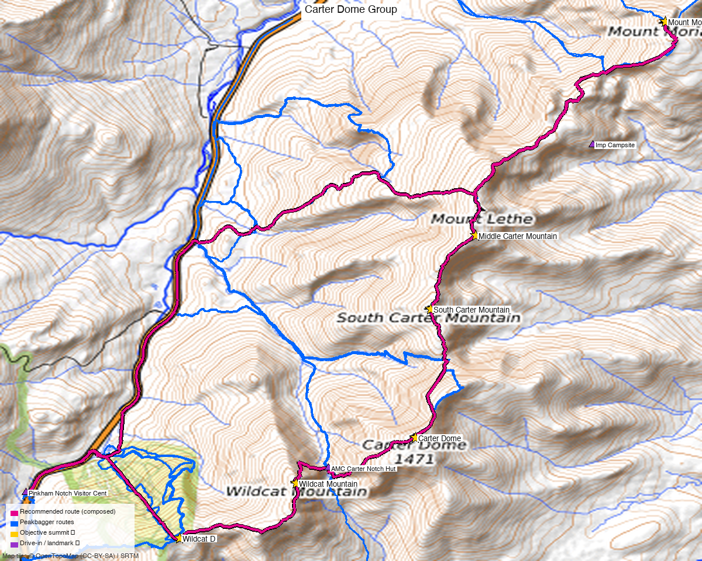

<!-- CLIMBERS_START -->
**Other climbers:** Emily Sharpe — not yet · Shawn D Keil — not yet
<!-- CLIMBERS_END -->

# Carter Dome Group — day traverse (Carter-Moriah Range)

<!-- QUICKSTATS_START -->

!!! tip "At a glance — recommended day"
    **7,525 ft** gain · **Class 1** · 6 peaks · ~32 h drive

<!-- QUICKSTATS_END -->

**Researched:** 2026-06-04
**Report type:** Day trip (6 peaks)
**CalTopo research map:** https://caltopo.com/m/AAFUQQ1
**Status in DB:** Unclimbed — NH 48 peaks, no prior ascents logged

*[Interactive CalTopo map](https://caltopo.com/m/AAFUQQ1)*

---

## Quick Stats

| | Wildcat D | Wildcat A | Carter Dome | South Carter | Middle Carter | Mount Moriah |
|---|---|---|---|---|---|---|
| **Elevation** | 4,059.6 ft | 4,399.2 ft | 4,839.4 ft | 4,445.3 ft | 4,623.4 ft | 4,047.3 ft |
| **Prominence** | 306 ft | 1,014 ft | 2,827 ft | 227 ft | 715 ft | 921 ft |
| **Lat / Lon** | 44.24945, -71.22355 | 44.25902, -71.20166 | 44.26756, -71.17917 | 44.28997, -71.17627 | 44.30308, -71.16775 | 44.34043, -71.13177 |
| **Weather** | [NOAA](https://forecast.weather.gov/MapClick.php?lat=44.24945&lon=-71.22355) | [NOAA](https://forecast.weather.gov/MapClick.php?lat=44.25902&lon=-71.20166) | [NOAA (primary)](https://forecast.weather.gov/MapClick.php?lat=44.26756&lon=-71.17917) | [NOAA](https://forecast.weather.gov/MapClick.php?lat=44.28997&lon=-71.17627) | [NOAA](https://forecast.weather.gov/MapClick.php?lat=44.30308&lon=-71.16775) | [NOAA](https://forecast.weather.gov/MapClick.php?lat=44.34043&lon=-71.13177) |
| **Class** | 1 | 1 | 1 | 1 | 1 | 1 |
| **Range** | Carter-Moriah Range | Carter-Moriah Range | Carter-Moriah Range | Carter-Moriah Range | Carter-Moriah Range | Carter-Moriah Range |
| **NH 48 rank** | #44 | #20 | #8 | #19 | #12 | #41 |
| **Peakbagger** | [pid=6985](https://www.peakbagger.com/peak.aspx?pid=6985) | [pid=6981](https://www.peakbagger.com/peak.aspx?pid=6981) | [pid=6980](https://www.peakbagger.com/peak.aspx?pid=6980) | [pid=6978](https://www.peakbagger.com/peak.aspx?pid=6978) | [pid=6977](https://www.peakbagger.com/peak.aspx?pid=6977) | [pid=6974](https://www.peakbagger.com/peak.aspx?pid=6974) |
| **LoJ** | [100592](https://listsofjohn.com/peak/100592) | [100574](https://listsofjohn.com/peak/100574) | [17087](https://listsofjohn.com/peak/17087) | [100573](https://listsofjohn.com/peak/100573) | [100566](https://listsofjohn.com/peak/100566) | [100597](https://listsofjohn.com/peak/100597) |

**[~32h drive via Google Maps](https://www.google.com/maps/dir/?api=1&origin=1162+Peakview+Circle+Boulder+CO+80302&destination=44.2574,-71.2530)** (origin: Boulder, CO) — fly trip in practice: MHT (Manchester) or BOS (Boston) + ~2h rental car drive to Pinkham Notch.

---

## Why these together

The Carter-Moriah Range forms a continuous ridgeline running SW–NE along the east side of Pinkham Notch, with the Wildcat peaks anchoring the south end and Mount Moriah the north. All six are connected by the AT/Carter-Moriah Trail and Wildcat Ridge Trail with no off-ridge detours required.

The Wildcat–Carter–Moriah full traverse is a well-established big day in the White Mountains, knocking out 6 of the NH 48 in a single point-to-point outing. Multiple Peakbagger ascent logs confirm this is a genuine combo done regularly, not just a geographic coincidence — most notably Collin Sweeney (2022-09-03, all 6 peaks), Jim Wilkinson (2019-07-30), and a detailed 2019 Protean Wanderer TR documenting the full day start to finish.

For context on the scale options:

| Configuration | NH 48 peaks | Distance | Gain |
|---|---|---|---|
| Carters only (loop) | 3 | ~13 mi | ~4,500 ft |
| Carters + Wildcats (loop) | 5 | ~18 mi | ~6,600 ft |
| **Full traverse (this report)** | **6** | **~20 mi** | **~7,400–7,650 ft** |

---

## Drive + Approach

**South trailhead (start):** AMC Pinkham Notch Visitor Center, NH-16, Gorham, NH. Parking fee (~$5). Well-staffed AMC facility with water, bathrooms, and gear shop. This is also the trailhead for the Presidential Traverse — plan for a full lot on summer weekends.

**North trailhead (end):** Rattle River Trailhead, RT 2, Shelburne, NH. Free roadside parking.

**Shuttle:** ~10 miles by road between the two trailheads. Options:
- **2-car spot** — leave one car at Rattle River before driving to Pinkham.
- **Rattle River Hostel shuttle** — the hostel on RT 2 in Shelburne runs hiker shuttles to Pinkham Notch for ~$20. Call ahead.
- Gorham town center is an alternate north-end option if exiting via Stony Brook Trail or the Carter-Moriah trailhead off US-2 (slightly shorter to Moriah, but adds road walking).

---

## Recommended Plan ⭐

**Direction: South to North (Pinkham → Gorham).** The Wildcat climb is the steepest, most exposed section — ~2,000 ft in ~1 mile off Lost Pond Trail. Getting it done early when legs are fresh is the standard advice.

**Start time: 6:00–7:00 AM.** The 2019 TR below logged a 6 AM departure finishing at Rattle River at ~9:30 PM — a long day. An 0630 start in good conditions targets a ~8:00 PM finish.

**Route (S→N):**

| Segment | Trail | Notes |
|---|---|---|
| Pinkham Notch → Wildcat D | Lost Pond Trail → Wildcat Ridge Trail | ~2,000 ft gain in ~1 mi, the steepest section of the day |
| Wildcat D → Wildcat A | Wildcat Ridge Trail | B and C summits are non-4k subpeaks; pass them without formality |
| Wildcat A → Carter Notch | Wildcat Ridge Trail | Long steep descent into the notch; AMC Carter Notch Hut here — water, short rest |
| Carter Notch → Carter Dome | Carter-Moriah Trail (AT) | Steep re-ascent; ~1,800 ft in ~1.5 mi |
| Carter Dome side trip | Carter Dome Trail spur | **Mt. Hight** (0.8 mi from Dome) is the best viewpoint on the ridge — nearly every TR recommends tagging it. Not on NH 48 but nearly universal |
| Carter Dome → South Carter | Carter-Moriah Trail (AT) | ~0.8 mi ridge walk |
| South Carter → Middle Carter | Carter-Moriah Trail (AT) | ~1.3 mi; wooded summits, views in between |
| Middle Carter → North Carter → Moriah | Carter-Moriah Trail (AT) | North Carter (not NH 48) at 0.9 mi; Moriah ~3.5 mi from Middle Carter total; **Imp Campsite** on this stretch — last reliable water |
| Moriah → Rattle River TH | Kenduskeag Trail or Rattle River Trail → RT 2 | Rattle River Trail is the most direct exit to RT 2 |

**Combo stats:** ~20 miles, ~7,400–7,650 ft gain, 12–13.5 hours car-to-car.

---

## Per-Peak Route Notes

**Wildcat D & A:** Both accessed via Wildcat Ridge Trail from Pinkham Notch. The Wildcat Mountain Ski Area gondola services Wildcat D (open in summer for sightseeing) — if doing the Wildcats standalone or with energy to spare, it's a shortcut option, but irrelevant for a S→N traverse. Wildcat A summit has a viewing platform.

**Carter Dome:** The high point of the traverse at 4,839 ft. Open summit with views toward the Presidentials. Carter Notch Hut (~1,900 ft below) is a natural resupply/water point before the final push up to Dome.

**South & Middle Carter:** Wooded summits with no views from the top, but the connecting ridge between them has excellent sightlines toward Washington. Often feels anti-climactic after Carter Dome — just keep moving.

**North Carter** (not NH 48): Passed en route to Moriah. Wooded, no reason to linger.

**Mount Moriah:** The northernmost summit and a different animal from the Carters — the approach from the south (Carter-Moriah Trail) feels remote and long after 15+ miles of hiking. But the summit opens up nicely with views north. Descent via Kenduskeag/Rattle River to RT 2 is straightforward.

---

## Alternates

**Abort at Carter Dome:** If energy flags, descend via Nineteen Mile Brook Trail back to NH-16 (Carter Dome → Carter Notch → Nineteen Mile Brook Trail, ~4 mi). Requires a car at the 19 Mile Brook Trailhead (or road walk ~1.5 mi back to Pinkham).

**Skip Moriah, exit at Imp Campsite area:** The IMP Trail off North Carter drops directly to NH-16 — bails out of Moriah and cuts the day to ~16 mi.

**Reverse (N→S):** Some prefer starting in Gorham with Moriah first. The Wildcat descent is very steep — knees will know it at the end of a 20-mile day.

**Wildcats standalone:** Wildcat A + D as a standalone loop from Pinkham Notch is ~8.5 mi, ~3,200 ft gain — a good standalone NH 48 day.

---

## Conditions / Season / Permits

**Season:** Late May through October for a comfortable day hike. The Wildcat climb can hold ice well into May. Winter crossings of this full traverse are rare; the Wildcats in winter are a serious undertaking.

**Wildcat A gondola:** Open summer/fall weekends (check Wildcat Mountain Ski Area calendar). Not useful for the S→N traverse but relevant for a standalone.

**Permits:** None required for day hiking. White Mountain National Forest — no fee for day use at most trailheads. Pinkham Notch lot charges a day-use fee.

**Weather:** Summit weather on the Carter Range can be severe — this ridge sits in the full brunt of storms off Pinkham Notch. Mt. Washington Observatory weather applies. Start early; be off Moriah before dark if possible.

**Water:** Carter Notch Hut (restrooms, tap water available — donation expected). Imp Campsite on the AT between Middle Carter and Moriah. Carry 2–3L minimum; the stretch from Carter Notch to Imp is long with no reliable sources.

---

## Trip Reports

### Peakbagger (logged in: Kyle Knutson)

All 6 peaks on the same day:

- **[Collin Sweeney, 2022-09-03](https://www.peakbagger.com/climber/PeakAscents.aspx?pid=6980&year=2022)** — logged all 6 peaks including Moriah on the same date
- **[Jim Wilkinson, 2019-07-30](https://www.peakbagger.com/climber/PeakAscents.aspx?pid=6981&year=2019)** — TR-26 across Wildcat A, Wildcat D, Carter Dome on same date
- **[Scott Dresser, 2018-01-21](https://www.peakbagger.com/climber/ascent.aspx?aid=926162)** — TR-1,047 on Carter Dome; detailed winter report

Floyd Greenwood did a 461-word report (2022-10-16) covering all Carter peaks and Wildcats in one day.

### LoJ — listsofjohn.com

No published trip reports for any of these 6 peaks (confirmed logged in as "letsgocu", 2026-06-04). LoJ's trip report feature is not used for these NH peaks — only ascent counts are logged.

Ascent counts: Carter Dome 117 · Wildcat A 105 · Wildcat D 97 · South Carter 96 · Middle Carter 97 · Moriah 104. No GPX tracks available from this source.

Peak pages: [Carter Dome](https://listsofjohn.com/peak/17087) · [Wildcat A](https://listsofjohn.com/peak/100574) · [Wildcat D](https://listsofjohn.com/peak/100592) · [Middle Carter](https://listsofjohn.com/peak/100566) · [South Carter](https://listsofjohn.com/peak/100573) · [Moriah](https://listsofjohn.com/peak/100597)

### Web sources

- **[Protean Wanderer, 2019-08-22](https://www.proteanwanderer.com/2019/08/23/trip-report-wildcat-carter-moriah-traverse/)** — full traverse TR with per-summit timestamps; Pinkham 0800 → Wildcat D 1025 → Carter Dome 1400 → South Carter 1540 → Middle Carter 1610 → Moriah 1855 → Rattle River 2130. ~7,400 ft gain, 20+ miles. Used Rattle River Hostel shuttle ($20) to get back to Pinkham.
- **[The Big Outside](https://thebigoutside.com/the-hardest-20-miles-a-dayhike-across-new-hampshires-rugged-wildcat-carter-moriah-range/)** — "The Hardest 20 Miles" — route details, gear notes for the full traverse
- **[Carter Mountain and Wildcat Loop — AllTrails](https://www.alltrails.com/trail/us/new-hampshire/carters-and-wildcats-loop)** — 17.9 mi loop (Wildcats + Carters, no Moriah), 101 reviews, ~12h avg
- **[SectionHiker — Leave No Stragglers](https://sectionhiker.com/leave-no-stragglers-how-to-hike-the-white-mountain-4000-footers/)** — standard NH 48 combo reference

---

## TL;DR

The full Wildcat–Carter–Moriah traverse is the Carter-Moriah Range's signature big day: 6 NH 48 peaks, ~20 miles, ~7,500 ft gain, ~12–13 hours, point-to-point Pinkham Notch → Shelburne with a 2-car spot or ~$20 Rattle River Hostel shuttle. Go S→N so the brutal Wildcat climb is early. Tag Mt. Hight (0.8 mi detour off Carter Dome) — it's the best view on the ridge. Water at Carter Notch Hut and Imp Campsite. Start by 0630; Moriah is farther than it looks on the map.

---

**Sources checked:** 14ers.com — N/A (NH peaks) · listsofjohn.com ✓ (logged in "letsgocu" — no trip reports published, ascent counts only) · peakbagger.com ✓ (logged in, "Kyle Knutson")
