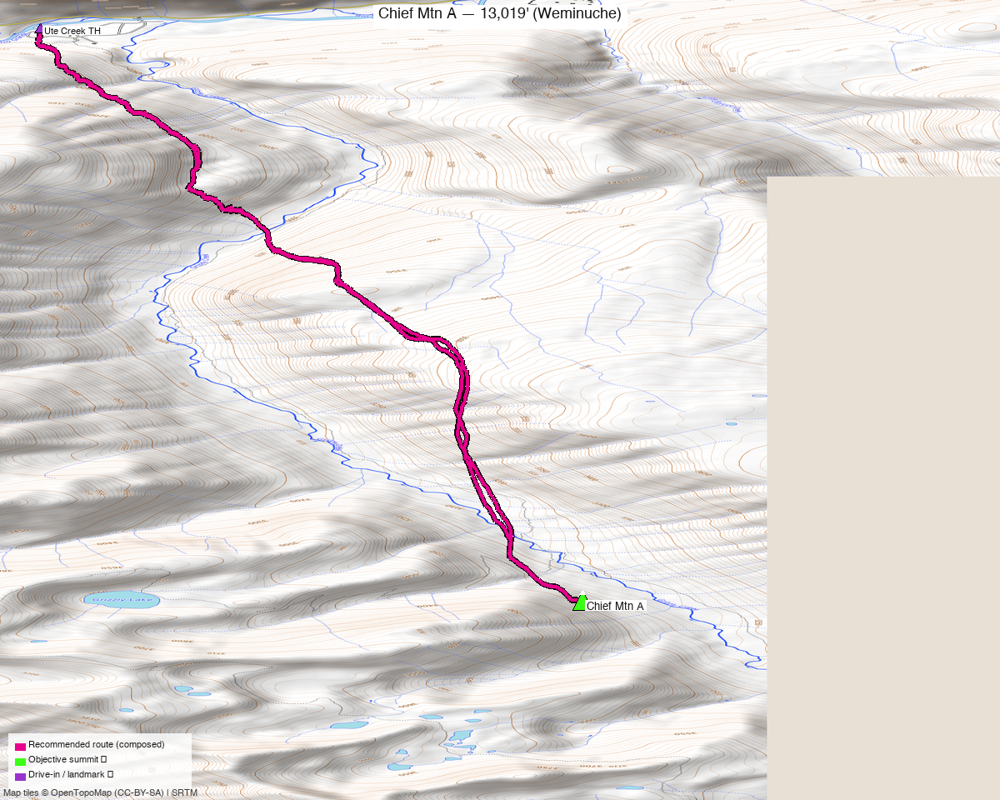

<!-- CLIMBERS_START -->
**Other climbers:** Emily Sharpe — not yet · Shawn D Keil — ✓ climbed
<!-- CLIMBERS_END -->

# Chief Mtn A — 13,019' (Weminuche)

<!-- QUICKSTATS_START -->

!!! tip "At a glance — recommended day"
    **15.5 mi** · **4,093 ft** gain · **Class 2** · 1 peak · ~5.75 h drive

<!-- QUICKSTATS_END -->

**Researched:** 2026-07-21

!!! weather ""
    **NOAA weather link:** [Chief Mtn A Weather](https://forecast.weather.gov/MapClick.php?lat=37.636&lon=-107.209)

!!! map ""
    **CalTopo research map:** <https://caltopo.com/m/306L9V1>

**Status in DB:** unclimbed. A ranked (CO #625), gentle **Class 2** 13er deep in the
**Weminuche Wilderness** — no ranked neighbors within 4 miles, so it's a standalone
tick with a long approach. Its whole difficulty is the distance, not the climbing.

<!-- PROVENANCE_START -->
*Note: the recommended route was distilled from **5 recorded GPS tracks** of real trips (14ers.com · ListsofJohn) — all layered on the [interactive CalTopo research map](https://caltopo.com/m/306L9V1).*
<!-- PROVENANCE_END -->

---

## The peak

A **long, gentle Weminuche day** — the climbing is easy Class 2 tundra and talus; the
work is the **~7.7-mi Ute Creek approach** from the Thirtymile / Rio Grande Reservoir
trailhead (the same trailhead complex as the Rio Grande Pyramid group, up a different
drainage). Realistically a big day or an easy overnight.

| | [Chief Mtn A](https://www.14ers.com/peaks/10603) |
|---|---|
| Elevation | 13,019' |
| Lat / Lon | 37.6365, −107.2091 |
| Route | Ute Creek → SW/W slopes |
| Class | 2 |
| CO rank | #625 |
| listsofjohn.com | [807](https://listsofjohn.com/peak/807) |
| peakbagger.com | [15195](https://peakbagger.com/peak.aspx?pid=15195) |

---

## Recommended route — Ute Creek from Thirtymile ⭐

The composed line follows a recorded Ute Creek track that summits Chief and starts at
the trailhead — **~15.5 mi · ~4,090 ft, Class 2**.

### Route sequence
1. From the **Thirtymile / Rio Grande Reservoir TH (~9,300')**, take the **Ute Creek
   Trail** south up the Ute Creek drainage, climbing steadily through timber then into
   the open Ute Lakes basin.
2. Leave the trail below Chief's north/northwest side and climb **grass and talus
   slopes** to the summit ridge — Class 2 throughout, easy route-finding.
3. Reverse the approach. A tundra-and-talus walk-up start to finish; no scrambling.

---

## Getting there — Thirtymile / Rio Grande Reservoir TH

| | |
|---|---|
| **Drive from Boulder** | **[~5h 45m via Google Maps](https://www.google.com/maps/dir/?api=1&origin=1162+Peakview+Circle,+Boulder,+CO+80302&destination=37.7233,-107.259)** — via Creede / South Fork to the **Rio Grande Reservoir** (FR 520), then the Thirtymile trailhead. |
| Trailhead | **Thirtymile / Rio Grande Reservoir TH**, ~37.7233, −107.259, **~9,300'** — **2WD** (passenger car to the Thirtymile campground / trailhead). |
| Access corridor | Ute Creek Trail south from the reservoir (the E branch off the Weminuche Trail junction). |
| Land | **Weminuche Wilderness** (Rio Grande NF) — no permits/fees, **foot/stock only**; dispersed/backpack camping allowed. |

---

## Gear & season

- **Best window:** **July–September** — deep, high Weminuche; the long approach and
  north slopes hold snow into early summer.
- **Terrain:** Class 2 tundra/talus, no technical sections — the challenge is mileage
  and altitude, not difficulty.
- **Storms:** you're a long way from the car — start very early, or camp in the Ute
  Creek basin and summit on a short morning.
- **Cell:** dead, deep wilderness — **InReach essential.**

---

## Other considerations

**Consider a backpack ⛺** — like the neighboring Rio Grande Pyramid peaks, this is
classic backpack country. An easy pack-in up Ute Creek to a **basin camp** turns a
~15.5-mi push into a short summit morning, and sets up other Ute Creek / Rincon La Osa
ranked 13ers (Ute Ridge, Middle Ute, etc.) on the same trip if you want to link them.

**Southern approach (alternate):** Chief can also be reached from the **Pine River /
Vallecito** side to the south, but every recorded track in the sweep uses the Ute Creek
(Thirtymile) approach — it's the standard line and what this route follows.

---

## Trip reports & GPX (all three sources swept)

**Sources confirmed logged in:** 14ers.com ("Basin"), listsofjohn.com ("letsgocu"),
peakbagger.com ("Kyle Knutson"). **5 unique tracks** — 1 from the 14ers.com library,
4 from listsofjohn trip reports; peakbagger's 2 ascent tracks were byte-identical
duplicates of those (same trips uploaded to multiple sites). All layered on the
[research map](https://caltopo.com/m/306L9V1); recommended route magenta.

**listsofjohn.com** — the useful beta: a **15.4-mi Ute Creek round trip** ([14251](https://listsofjohn.com/gpx/14251.gpx), the recommended line) and a 16.9-mi variant ([12793](https://listsofjohn.com/gpx/12793.gpx)); the 30- and 53-mi tracks are multi-peak Weminuche traverses.

**14ers.com** — one long library track through the Ute Creek zone (a mega-traverse; used for corridor context, not the route).

**peakbagger.com** — 2 ascent tracks, both duplicates of the LoJ trips above.

**Sources checked:** 14ers.com · listsofjohn.com · peakbagger.com · climb13ers.com
