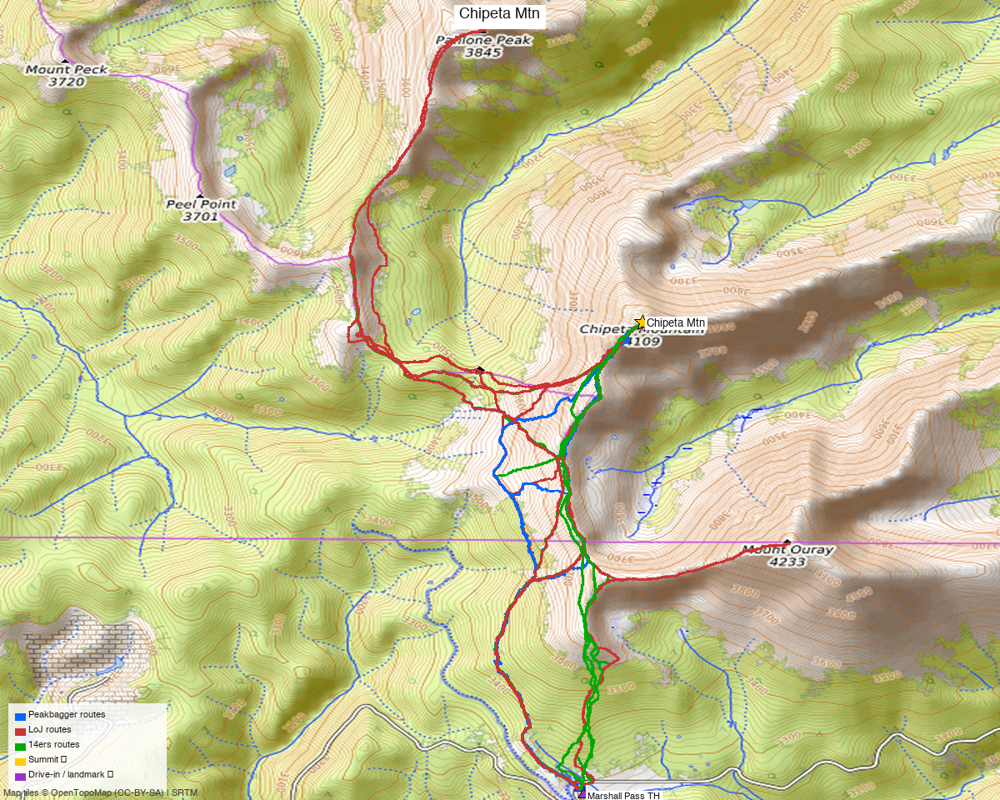

# Chipeta Mountain (southern Sawatch, Marshall Pass)

<!-- QUICKSTATS_START -->

!!! tip "At a glance — recommended day"
    **8.3 mi** · **3,362 ft** gain · **Class 2** · 1 peak · ~4.2 h drive

<!-- QUICKSTATS_END -->

**Researched:** 2026-06-02

**CalTopo research map:** https://caltopo.com/m/CDMT01G

**Trip NOAA weather:** [NOAA point forecast](https://forecast.weather.gov/MapClick.php?lat=38.44767&lon=-106.24077) (same target as 14ers / LoJ / peakbagger weather links)

**Status in DB:** 0 ascents (unclimbed). **Cluster status:**
- ✗ **No unclimbed ranked 13er within 8 mi** — the nearby high points are sub-13k (Chipeta Mtn South 12,874', Pahlone Peak 12,670') and don't count as ranked combos.
- **Mt Ouray** (13,979', ~3 mi NW) is the one ranked neighbor and the classic big-day pairing (josephnephi did Chipeta + Ouray), but it's a substantial separate climb — see Multi-peak note.
- **Effectively a standalone day** at standard execution.

<!-- PROVENANCE_START -->
*Note: the recommended route was distilled from **10 recorded GPS tracks** of real trips (recorded trips) — all layered on the [interactive CalTopo research map](https://caltopo.com/m/CDMT01G).*
<!-- PROVENANCE_END -->

---

<!-- CLIMBERS_START -->
**Other climbers:** Emily Sharpe — ✓ climbed · Shawn D Keil — ✓ climbed
<!-- CLIMBERS_END -->

## Quick stats

| | Chipeta Mountain |
|---|---|
| Elevation (LiDAR) | 13,495' |
| Lat / Lon | 38.44767, −106.24077 |
| Class (standard) | 2 |
| Range | Sawatch (southern, Marshall Pass area) |
| 14ers.com peak page | [10745](https://www.14ers.com/peaks/10745/13er-chipeta-mountain) |
| listsofjohn.com | [337](https://listsofjohn.com/peak/337) |
| peakbagger.com | [pid 16206](https://peakbagger.com/peak.aspx?pid=16206) |
| Peak DB id | 337 |
| County | Chaffee / Saguache |

---

## Drive + approach

| | |
|---|---|
| **Drive from Boulder** | **[4h 13m via Google Maps](https://www.google.com/maps/dir/?api=1&origin=1162+Peakview+Circle,+Boulder,+CO+80302&destination=38.3942,-106.2472)** (181 mi, origin: 1162 Peakview Circle) |
| Trailhead | Marshall Pass (~10,842'), off US‑285 via Poncha Springs → CR 200 (gravel) |
| Vehicle | 2WD gravel to Marshall Pass in summer; the road is well-graded (old railroad grade) |
| Approach | From the pass the route follows the **Continental Divide / Colorado Trail** north over rolling tundra toward Chipeta's south ridge |

---

## Recommended route — Marshall Pass, NW up the Divide ⭐

A high, mellow tundra walk — one of the easier southern-Sawatch 13ers once you're at the pass.

**Stats (DEM-measured from the recorded tracks):** **~7.7 mi RT / ~3,450 ft** from Marshall Pass (more if you chain Chipeta South). Class 2 throughout. *(The 2,630′ net climb from the 10,842′ pass to the 13,472′ summit rules out the lower estimates some TRs cite.)*

1. From Marshall Pass, head **north/NW along the Continental Divide** (Colorado Trail / Monarch Crest corridor) on tundra.
2. Follow the broad ridge over (or around) **Chipeta Mtn South** (12,874') toward Chipeta's south slopes.
3. Final tundra/talus climb to the summit — no scrambling on the standard line.
4. Return the same way.

> Several TRs link **Chipeta South** (12,874') and **Pahlone Peak** (12,670') on the same outing — fun bonus summits, but both sub-13k, so they don't change the "ranked" tally.

---

## Multi-peak note — Chipeta + Mt Ouray (big day)

**Mt Ouray** (13,979', ~3 mi NW, ranked, unclimbed) is the standout combo (josephnephi 2023: Chipeta + Ouray). It roughly **doubles the day** (Ouray is a steeper, more prominent peak with its own ~2,500'+ climb) and is usually approached from the Marshall Pass side too. If you want two ranked summits per the long drive, this is the pairing — plan a long alpine day rather than the short Chipeta-only outing.

---

## Conditions / season

- **Best window:** June through October for the dry Marshall Pass road + tundra. The high, open Divide makes this a good early/late-season pick when higher Sawatch peaks are snowy.
- **Snow:** whileyh climbed late May (snow lingering); by mid-June the tundra is mostly dry.
- **Storms:** fully exposed on the Divide — early start, off the ridge by early afternoon.
- **Wind:** the Marshall Pass / Monarch corridor is notoriously windy; bring layers.

---

## Permits / access

- San Isabel / Gunnison NF — no permits, no fees.
- Marshall Pass Rd (CR 200 / FR 200) is a maintained gravel road (former narrow-gauge grade) — 2WD friendly in summer; gated/snowed in winter.

---

## Cell coverage

- **14ers.com community DB:** no reports for the summit.
- **Geographic reasoning:**
  - **Marshall Pass TH (~10,842'):** likely **some signal** — high pass with LOS toward the Poncha Springs / Salida corridor (US‑50 towers ~15 mi E).
  - **Summit (13,495'):** likely **good** — high open Divide point with broad line-of-sight east to the Arkansas Valley.
- **Standard recommendation:** carry an InReach, but coverage on this corridor is better than most 13er areas.

---

## Trip reports & GPX (all three sources)

| Source | Notable TRs | GPX |
|---|---|---|
| **listsofjohn.com** | josephnephi 2023 (Chipeta + Ouray), whileyh 2020, Alyson Kirk 2014, James Hitch 2017, avalletta 2012 | [14805](https://listsofjohn.com/gpx/14805.gpx), [8126](https://listsofjohn.com/gpx/8126.gpx), [1500](https://listsofjohn.com/gpx/1500.gpx) |
| **14ers.com** | per-peak GPX library (TR + member uploads) | 4 files |
| **peakbagger.com** (logged in, Kyle Knutson) | ascent tracks | 3 files |

**GPX collected: 10 track files across all three sources** — layered on the [CalTopo research map](https://caltopo.com/m/CDMT01G).

**Sources checked:** 14ers.com · listsofjohn.com · peakbagger.com

