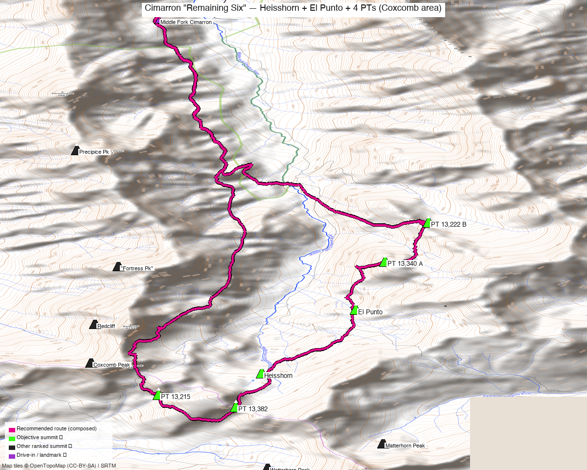

# Cimarron "Remaining Six" — Heisshorn + El Punto + 4 PTs (Coxcomb area)

<!-- QUICKSTATS_START -->

!!! tip "At a glance — recommended day"
    **13.3 mi** · **5,785 ft** gain · **Class 3** · 6 peaks · ~5.5 h drive

<!-- QUICKSTATS_END -->

**Researched:** 2026-06-15
**Report type:** Day trip (long) — a 6-peak loop of Kyle's remaining unclimbed ranked 13ers around Coxcomb, **minus Fortress + Precipice** (their [own report](fortress_precipice.md)).
**CalTopo research map:** https://caltopo.com/m/55M4430
**Status in DB:** all six unclimbed. (Coxcomb + Redcliff already done.)

> The remaining **Cimarron** ranked 13ers around Coxcomb, *other than* Fortress + Precipice. Loose, exposed San Juan scrambling — **not** a tundra walk.

*[Interactive CalTopo map](https://caltopo.com/m/55M4430)* — 14ers-library tracks + Kyle's CalTopo in green; **recommended composed loop in bold magenta**; 6 summit markers.

---

<!-- CLIMBERS_START -->
**Other climbers:** Emily Sharpe — not yet · Shawn D Keil — not yet
<!-- CLIMBERS_END -->

## Quick stats

| | "Heisshorn" | PT 13,382 | PT 13,215 | "El Punto" | PT 13,340 A | PT 13,222 B |
|---|---|---|---|---|---|---|
| Elevation | 13,418' | 13,382' | 13,215' | 13,319' | 13,350' | 13,220' |
| Lat / Lon | 38.0779, −107.5117 | 38.0717, −107.5148 | 38.0741, −107.5249 | 38.0898, −107.4996 | 38.0984, −107.4958 | 38.1057, −107.4902 |
| Class | 3 (loose) | 2+ | 2 | 3 (loose summit) | 2+ | 2 |
| CO Rank | 312 | 334 | 476 | 379 | 357 | 470 |
| 14ers.com | [10417](https://www.14ers.com/php14ers/peak.php?peakid=10417) | [10430](https://www.14ers.com/php14ers/peak.php?peakid=10430) | [10507](https://www.14ers.com/php14ers/peak.php?peakid=10507) | [10465](https://www.14ers.com/php14ers/peak.php?peakid=10465) | [10437](https://www.14ers.com/php14ers/peak.php?peakid=10437) | [10493](https://www.14ers.com/php14ers/peak.php?peakid=10493) |
| LoJ | [388](https://listsofjohn.com/peak/388) | [421](https://listsofjohn.com/peak/421) | [602](https://listsofjohn.com/peak/602) | [498](https://listsofjohn.com/peak/498) | [445](https://listsofjohn.com/peak/445) | [571](https://listsofjohn.com/peak/571) |
| peakbagger | [56704](https://peakbagger.com/peak.aspx?pid=56704) | [60336](https://peakbagger.com/peak.aspx?pid=60336) | [60337](https://peakbagger.com/peak.aspx?pid=60337) | [56703](https://peakbagger.com/peak.aspx?pid=56703) | [85976](https://peakbagger.com/peak.aspx?pid=85976) | [60335](https://peakbagger.com/peak.aspx?pid=60335) |
| Peak DB id | 388 | 421 | 602 | 498 | 445 | 571 |

Two sub-groups: a **south-of-Coxcomb trio** (Heisshorn / 13,382 / 13,215) and an **NE trio toward Silver Mtn** (El Punto / 13,340 A / 13,222 B) — linked into one loop.

---

## Recommended day — Middle Fork Cimarron loop over all six ⭐

A **composed loop** (shortest line through all six, stitched from recorded GPS; gain DEM-measured): **~13.3 mi / ~5,785′**, **Class 3**. Multiple parties do exactly this set in a day (4 recorded full-six tracks on 14ers).

| | |
|---|---|
| Peaks | all six |
| **Recommended loop** | **~13.3 mi / ~5,785′ (DEM)** |
| Class | **3** — and **loose**: Heisshorn is "a substantial scramble on loose, fragmented rock" (some want a rope); El Punto's final ~100′ is "Class 3, loose, exposed." The four PTs are easier (2/2+) but it's all rotten Cimarron rock. |
| Trailhead | **Middle Fork Cimarron (Trail #227), ~10,000'** — passenger car (with care over a few dips) |

### Route sequence (composed loop)
1. From the **Middle Fork Cimarron TH (#227)**, head up-valley and gain the NE peaks first: **PT 13,222 B → PT 13,340 A → "El Punto" (13,319')**.
2. Traverse SW/S along the divide to **"Heisshorn" (13,418')** — the high point and **loose Class 3 crux**.
3. Finish the south trio: **PT 13,382 → PT 13,215**, then descend back to the Middle Fork trail and out.

> **It's a loose-rock scramble day.** The two named peaks (Heisshorn, El Punto) carry Class 3 with notably rotten/exposed rock; the four PTs are Class 2/2+. Helmet advised; a rope is "mighty nice" for the exposed bits per recorded TRs. Long day at altitude — early start.

---

## Drive + approach

| | |
|---|---|
| **Drive from Boulder** | **[~5h 30m via Google Maps](https://www.google.com/maps/dir/?api=1&origin=1162+Peakview+Circle,+Boulder,+CO+80302&destination=38.143,-107.525)** — via US-50 to the **Cimarron** turnoff (E of Montrose), then the Cimarron / Middle Fork road south. |
| Trailhead | **Middle Fork Cimarron TH (Trail #227)**, ~38.143, −107.525 (upper) — passenger car reaches it with care. |
| Land | **GMUG National Forest** (Uncompahgre Wilderness covers the high terrain) — no permits/fees, foot-only. |

---

## Conditions / season

- **Best window:** **July–September** — high, remote, north-facing snow lingers.
- **Terrain:** Class 2–3 on **notoriously loose Cimarron rock** — slow, careful scrambling; helmet advised.
- **Storms:** long exposed divide — very early start; few quick bail points mid-loop.
- **Cell:** dead — carry an InReach.

---

## Trip reports & GPX (all sources)

**Sources confirmed logged in:** 14ers.com ("letsgocu"), listsofjohn.com, peakbagger.com (Kyle Knutson). **5 14ers-library tracks** (4 covering all six) + Kyle's CalTopo are layered; recommended loop drawn magenta. peakbagger has no downloadable ascent GPX for these.

- **14ers.com:** four recorded full-six tracks (2023–2025) — this exact loop is a known outing.
- **climb13ers.com:** [Heisshorn (NNE Ridge)](https://www.climb13ers.com/colorado-13ers/un-13411--heisshorn) · [El Punto (North Ridge)](https://www.climb13ers.com/colorado-13ers/un-13300--el-puntoun13300-f) — both flag loose/exposed Class 3.
- **listsofjohn.com:** per-peak TRs across the six (combo confirmed).
- Also [Stav is Lost — Heisshorn + El Punto](https://stavislost.com/hikes/trail/heisshorn-and-el-punto/) (Middle Fork #227 beta).

**Sources checked:** 14ers.com ✓ (logged in, "letsgocu") · listsofjohn.com ✓ · peakbagger.com ✓ (logged in, "Kyle Knutson") · climb13ers.com ✓ · Kyle's CalTopo ✓

---

## TL;DR

- **Your six remaining Coxcomb-area 13ers (minus Fortress/Precipice) in one loop** — **~13.3 mi / ~5,785′, Class 3**, from the **Middle Fork Cimarron TH (#227)**: NE trio (13,222 B / 13,340 A / El Punto) → Heisshorn → south pair (13,382 / 13,215).
- **Loose, exposed Cimarron rock** — Heisshorn + El Punto are the Class 3 cruxes (rotten rock, a rope "feels nice"); the four PTs are Class 2/2+. Helmet + early start.
- **GMUG NF / Uncompahgre Wilderness**; ~5h30 drive (US-50 → Cimarron). Cell dead — InReach.
- **Fortress + Precipice are a [separate report](fortress_precipice.md)** (West Fork side).
- **Part of the [Cimarron / Coxcomb 2-day trip](../trips/cimarron_coxcomb.md)** — pairs this loop with the West Fork pair to finish all 8 remaining Coxcomb 13ers.
- **Research map:** https://caltopo.com/m/55M4430
