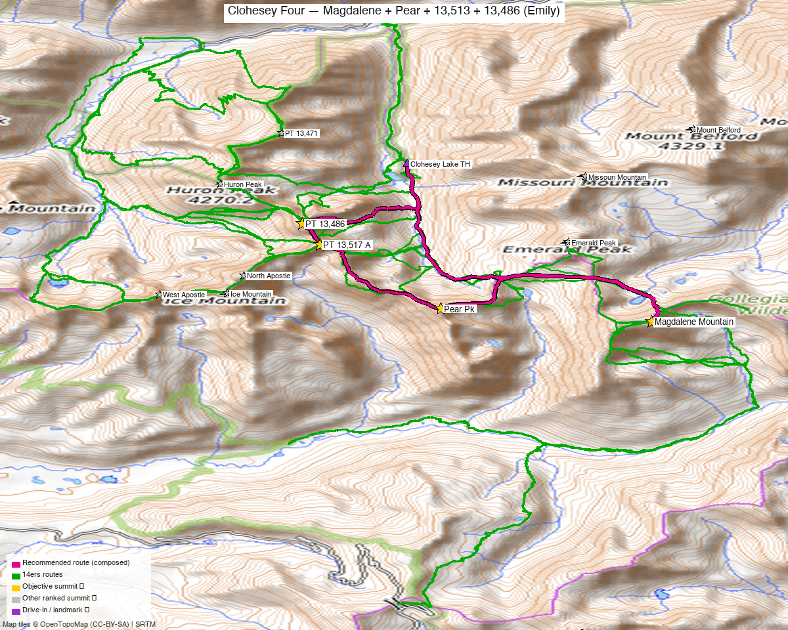

# Clohesey Four — Magdalene + Pear + 13,513 + 13,486 (Sawatch)

*Written for **Emily** — four ranked Sawatch 13ers above Clohesey Lake, linked in one day.*

**Report type:** Day trip (4 ranked 13ers, one link-up loop)
**CalTopo research map:** https://caltopo.com/m/P38PGQ6
**Status for Emily:** all four **unclimbed** (on her 14ers checklist). A tidy cluster above **Clohesey Lake** in the Collegiate Peaks, SW of Missouri/Belford.

> Four Class 2 ranked 13ers on the ridge above Clohesey Lake — **Magdalene Mtn, "Pear Pk", PT 13,517 A ("UN 13,513"), and PT 13,486**. They link into **one ~12 mi loop**; the only real catch is the **brutal 4x4 road to Clohesey Lake** (there's a walk-in alternative below).

*[Interactive CalTopo map](https://caltopo.com/m/P38PGQ6)* — the **recommended ~12 mi link-up loop in bold magenta**, over recorded 14ers-library tracks (green); 4 summit markers + the Clohesey Lake TH.

---

<!-- CLIMBERS_START -->
**Other climbers:** Kyle Knutson — not yet · Shawn D Keil — not yet
<!-- CLIMBERS_END -->

## Quick stats

| | Magdalene Mtn | "Pear Pk" | PT 13,517 A ("13,513") | PT 13,486 |
|---|---|---|---|---|
| Elevation | 13,780' | 13,459' | 13,513' (LiDAR) | 13,486' |
| Lat / Lon | 38.9070, −106.3676 | 38.9106, −106.4021 | 38.9283, −106.4218 | 38.9342, −106.4248 |
| Class (summit) | 2 | 2 | 2 | 2 |
| CO Rank | 118 | 285 | 249 | 270 (newly LiDAR-ranked) |
| 14ers.com | [10709](https://www.14ers.com/php14ers/peak.php?peakid=10709) | [10747](https://www.14ers.com/php14ers/peak.php?peakid=10747) | [10741](https://www.14ers.com/php14ers/peak.php?peakid=10741) | [10746](https://www.14ers.com/php14ers/peak.php?peakid=10746) |
| LoJ | [145](https://listsofjohn.com/peak/145) | [347](https://listsofjohn.com/peak/347) | [303](https://listsofjohn.com/peak/303) | [339](https://listsofjohn.com/peak/339) |
| peakbagger | [5687](https://peakbagger.com/peak.aspx?pid=5687) | [19618](https://peakbagger.com/peak.aspx?pid=19618) | [14667](https://peakbagger.com/peak.aspx?pid=14667) | [58396](https://peakbagger.com/peak.aspx?pid=58396) |
| Peak DB id | 145 | 347 | 303 | 339 |

All four are **ranked Class 2** Sawatch 13ers. They sit in a ~3 mi arc above Clohesey Lake: **13,486 + 13,517 A** at the NW end (~0.5 mi apart), **Pear** in the middle, **Magdalene** the high point at the SE end.

---

## The link-up — one loop over all four ⭐

**Yes, all four link in one outing** — a **~12.2 mi / ~5,700′ loop, Class 2+** from the **Clohesey Lake TH** (DEM-measured, stitched from recorded GPX):

- **Loop order:** Clohesey Lake TH → **PT 13,486 → PT 13,517 A** (the close NW pair) → **"Pear Pk"** → **Magdalene Mtn** → back to the lake (reverse works too).
- **Difficulty:** all four *summits* are Class 2. **The connectors are Class 2 to a max of Class 2+** — including the **13,517 A ↔ 13,486 link**, which a recorded TR ([2023](https://www.14ers.com/php14ers/tripreport.php?trip=22289)) specifically documents as "**class 2+ max**" (the author wrote it up precisely because there wasn't much beta on linking 13,513 with the newly LiDAR-ranked neighbor). Route also on the **Cooneys' climb13ers** site.
- Tundra and talus, no technical sections — the day is the mileage + ~5,700′ of gain, not difficulty.

---

## ⚠️ The Clohesey Lake road — and the walk-in alternative

**The road up to Clohesey Lake is a serious 4x4 obstacle, not a casual drive.** Per the 2023 TR: *"the initial hurdle on the road right out of Clear Creek is very impressive… requires an impressive 4x4 vehicle or the willingness to potentially damage whatever vehicle you take."* That party (in a stock Tacoma) **parked at the bottom and walked in.**

| Approach | What it means |
|---|---|
| **Drive to Clohesey Lake TH** (~11,000') | Only with a **capable, high-clearance 4x4** you don't mind scraping — the first ledge right off Clear Creek Rd is the crux. Gives the **~12.2 mi / ~5,700′** loop above. |
| **Park low + hike the road ⭐ (recommended for Emily)** | Park where the Clohesey road leaves **Clear Creek Rd** (~38.965, −106.405, 2WD/high-clearance) and **hike the rough road ~1.5–2 mi up to the lake.** Adds **~3–4 mi RT and ~1,000–1,200′** → a **~15–16 mi / ~6,800′ day**, but **no sketchy driving.** |

If the full day is too long on foot, the cluster also splits cleanly: **NW pair (13,486 + 13,517 A)** and **Pear + Magdalene** are each a shorter loop from the lake.

---

## Drive + approach (from Highland, Denver)

| | |
|---|---|
| **Drive from Denver** | **[~2h 45m via Google Maps](https://www.google.com/maps/dir/?api=1&origin=Highland,+Denver,+CO&destination=38.9650,-106.4050)** — via US-285 / Leadville to **US-24**, then **Clear Creek Rd (CR 390)** west toward Vicksburg; the **Clohesey Lake road** branches south off it. |
| Trailhead | **Clohesey Lake TH** (~38.951, −106.408, ~11,000') — **4x4 only** up the road. Park-low option at the **Clear Creek Rd / Clohesey road junction** (~38.965, −106.405). |
| Land | **San Isabel NF** (Collegiate Peaks area) — no permits/fees, foot travel beyond the TH. |

---

## Conditions / season

- **Best window:** **July–September.** High Sawatch tundra; the Clohesey road and upper basins melt out by early summer.
- **Terrain:** Class 2 tundra/talus on the summits; **Class 2+ max** on the connecting ridges (a little careful routefinding on the 13,517 A ↔ 13,486 link). No scrambling crux.
- **Storms:** open, exposed ridge for hours — early start, off the high points by early afternoon.
- **Cell:** unreliable to dead in the basin — carry an InReach.

---

## Trip reports & GPX (all sources)

**Sources confirmed logged in:** 14ers.com ("Basin"), listsofjohn.com, peakbagger.com. **All four peaks' GPX libraries swept and deduped** — the link-up tracks chain Magdalene + Pear + 13,513 (SE three) with Pear + 13,513 + 13,486 (NW three).

- **14ers.com:** key beta — [the 2023 13,517 A + new-LiDAR-peak link-up TR](https://www.14ers.com/php14ers/tripreport.php?trip=22289) ("class 2+ max", Clohesey road warning); plus recorded Magdalene/Pear/13,513 loops.
- **listsofjohn.com:** per-peak pages — all four ranked Class 2 Sawatch 13ers ([145](https://listsofjohn.com/peak/145) · [347](https://listsofjohn.com/peak/347) · [303](https://listsofjohn.com/peak/303) · [339](https://listsofjohn.com/peak/339)).
- **peakbagger.com:** pages verified for all four; San Isabel NF.
- **climb13ers.com:** the **Cooneys' route** for the 13,513 ↔ 13,486 link-up (cited in the 14ers TR).

**Sources checked:** 14ers.com ✓ (logged in, "Basin") · listsofjohn.com ✓ · peakbagger.com ✓ · climb13ers.com ✓

---

## TL;DR

- **Four ranked Class 2 Sawatch 13ers above Clohesey Lake** — Magdalene + Pear + 13,517 A ("13,513") + 13,486 — **link in one ~12.2 mi / ~5,700′ loop, Class 2+.**
- **The 13,513 ↔ 13,486 link is documented** (a 2023 TR + climb13ers) at **Class 2+ max** — not a problem.
- **The catch is the Clohesey Lake 4x4 road** (brutal first ledge). **Park low and hike the road up (~+3–4 mi / ~1,100′ → ~15–16 mi day)** to skip the driving — recommended.
- **~2h45 from Highland (Denver).** Cell dead — InReach.
