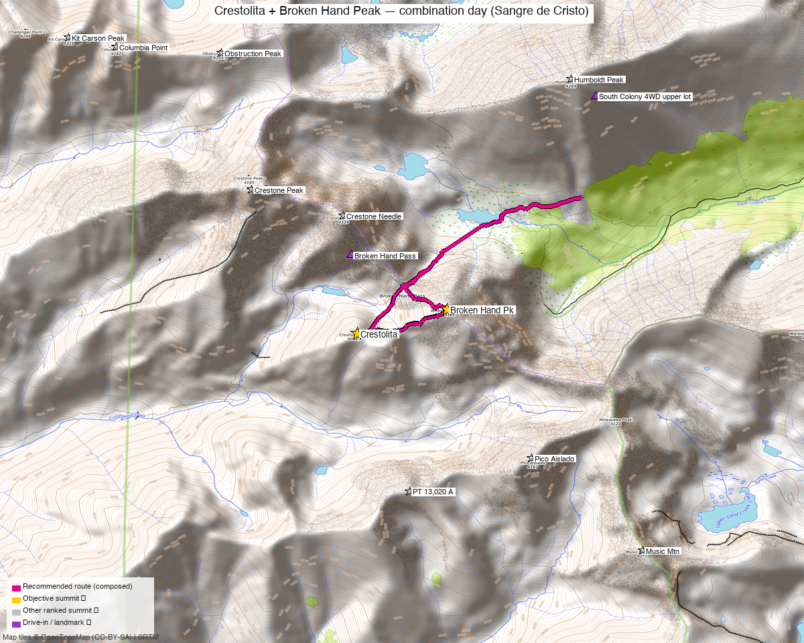

# Crestolita + Broken Hand Peak — combination day (Sangre de Cristo)

**Researched:** 2026-05-31
**Report type:** Day trip (2 ranked 13ers, one outing)
**CalTopo research map:** https://caltopo.com/m/6TKA0RH
**Status in DB:** Both 0 ascents (unclimbed). **Crestone group context:** Crestone Peak, Crestone Needle, and Humboldt Peak are all ✓ done — these two are the remaining ranked satellites of the South Colony / Cottonwood cirque.

*[Interactive CalTopo map](https://caltopo.com/m/6TKA0RH)*

---

## Quick stats

| | Broken Hand Peak | "Crestolita" |
|---|---|---|
| Elevation (LiDAR) | 13,575' | 13,264' |
| Lat / Lon | 37.95671, −105.56665 | 37.9549, −105.57561 |
| Weather | [NOAA forecast](https://forecast.weather.gov/MapClick.php?lat=37.95671&lon=-105.56665) (same target as 14ers / LoJ / peakbagger weather links) | [NOAA forecast](https://forecast.weather.gov/MapClick.php?lat=37.9549&lon=-105.57561) |
| Class (standard) | 3 | 2 (south face) |
| CO Rank | 205 | 431 |
| Prominence (LiDAR) | 649' | — |
| Range / Wilderness | Sangre de Cristo / Sangre de Cristo Wilderness | same |
| County | Custer & Saguache | Custer & Saguache |
| 14ers.com peak page | [10629](https://www.14ers.com/peaks/10629/13er-broken-hand-peak) | [10665](https://www.14ers.com/peaks/10665/13er-crestolita) |
| LoJ peak page | [258](https://listsofjohn.com/peak/258) | [524](https://listsofjohn.com/peak/524) |
| peakbagger | [pid 5910](https://peakbagger.com/peak.aspx?pid=5910) | [pid 32622](https://peakbagger.com/peak.aspx?pid=32622) |
| Peak DB id | 258 | 524 |

**The two summits are 0.6 mi apart** along the ridge SW of Crestone Needle — a natural, well-established pairing.

---

## Why these two together

This is a **standard combination**, not a forced pairing. Of the trip reports that hit either peak, the majority do both in one outing:

- **whileyh** (2025-06-11) — Crestolita + Broken Hand, the cleanest example of the exact combo
- **Alyson Kirk** (2014-08-21) — Crestolita + Broken Hand
- **Furthermore / Derek Wolfe** (2011-04-16) — Crestolita + Broken Hand (winter)
- **Marmot72 "Broken Hand Wrap Up"** (2023-08-19) — both, finishing the Sangres 13ers
- **josephnephi** (2025-09-06) — both as part of the full Crestone-group mega-day (Crestone Peak E/W + NE Crestone + Needle + Broken Hand + Crestolita)
- **supranihilest "Crest of Spring"** (2023-05-06) — both via snow couloirs

**Combos (ranked 13er+ rule):** Each counts as a true ranked-partner combo for the other (13,575' and 13,264', both ranked). The wider Crestone group (Peak/Needle/Humboldt) is already done, so this pairing is the efficient way to clean up what's left in the cirque in a single approach.

---

## Drive + approach

| | |
|---|---|
| **Drive from Boulder** | **[3h 58m via Google Maps](https://www.google.com/maps/dir/?api=1&origin=1162+Peakview+Circle,+Boulder,+CO+80302&destination=37.97592,-105.50657)** (199 mi, origin: 1162 Peakview Circle) |
| Primary trailhead | South Colony Lakes 2WD lot (~37.97592, −105.50657, ~9,880') |
| 4WD continuation | South Colony Road continues ~2.5 mi of rough 4WD to the upper lot (~11,000'). Marmot72 took a **stock '18 Subaru Forester** to ~¼ mi below the upper lot with careful driving — "smooth easy sections and rough rocky sections, almost always on inclines." |
| Alternate trailhead | Cottonwood Creek (longer, rougher approach from the Crestone/west side) — preferred only for the Crestolita south face as a standalone or for the north couloirs |

---

## Recommended plan — South Colony Lakes approach ⭐

The closer, more efficient approach for the pair (Marmot72 chose it over Cottonwood explicitly). Both peaks sit on the ridge above the South Colony basin, reached via **Broken Hand Pass** (the same saddle used on the standard Crestone Needle route).

**Combo stats (measured from TR GPX):**

| Source track | Distance | Gain | Notes |
|---|---|---|---|
| whileyh 2025 (LoJ 17727) | 14.3 mi | ~7,083' | Started low (8,400') — fuller road walk |
| Alyson Kirk 2014 (LoJ 1075) | 11.6 mi | ~6,372' | Higher start |

Expect roughly **~11–14 mi and ~6,400–7,100 ft** depending on how high you drive the South Colony 4WD road and which approach variant you take. **This is a big day, well over the 4,000 ft "short day" threshold** — plan it as a full alpine outing, not a half-day.

### Route sequence (South Colony → Broken Hand Pass)
1. From the South Colony 2WD/4WD lot, follow the South Colony Lakes trail toward the lakes / Crestone Needle junction
2. Ascend to **Broken Hand Pass** (~12,900'), the saddle between Crestone Needle and Broken Hand Peak
3. **Broken Hand Peak (13,575', Class 3):** from the pass, take the standard Class 3 line to the summit (NW/west side off the pass — *not* the south ridge, which is a hard technical variant; see below)
4. **Crestolita (13,264', Class 2):** the two summits do **not** connect at easy class via the direct ridge — that ridge is the 4th–low-5th "Analemma/South Ridge" traverse. For the non-technical pairing, return toward Broken Hand Pass and gain Crestolita via its **Class 2 south-facing summit gully** (drops from the summit; per the 23274 author it "allegedly goes at Class 2," adding some mileage/gain). This means some up-and-down rather than a clean ridge link.
5. Return over Broken Hand Pass to the South Colony trail

> **Honest caveat:** the cleanest *easy-class* way to bag both may actually be from **Cottonwood Creek**, where each peak has a Class 2 south side and you skip the Broken Hand Pass elevation — at the cost of a longer, rougher approach (see Alternate below). From South Colony you get a shorter approach but the link between the two involves descending/contouring, not a simple ridge walk.

### Crestolita route notes
- **Easiest line:** supranihilest — *"the easiest route is the Class 2 south face from Cottonwood Creek (the approach is harder than the climb of the peak)."* There's also a **south-facing summit gully** that reportedly goes Class 2 from the Broken Hand Pass side.
- **NE couloir / north couloirs:** moderate snow lines into early summer (Furthermore April, supranihilest May) — axe/crampons, couloir experience. Easy to spot conditions from Broken Hand Pass.

---

## Technical alternate — Analemma (NE Ridge) + South Ridge of Broken Hand 🪨

For scramblers, the classic hard linkup of these two is a separate, far more serious objective (TR [23274](https://www.14ers.com/php14ers/tripreport.php?trip=23274)):

| | |
|---|---|
| Route | Analemma (Crestolita NE Ridge) + South Ridge of Broken Hand Peak |
| Stats | ~12 mi, ~5,700' (Broken Hand Pass approach) |
| Class | **5.easy** (4th class to low-5th along Broken Hand's gendarmes) |
| Exposure | **Extreme** · Rockfall High (NE couloir descent) · Commitment **Extreme** |
| Bail | **None** once on the ridges/gendarmes — "you are committed, especially not to the East" |
| Season | Later summer (once Crestolita's NE couloir melts out) |

This is one of the range's premier non-standard scrambles on excellent conglomerate, but it is **not** the way to simply tick both summits — it's a committing 5th-class day. Only relevant if you specifically want the scramble.

---

## Alternate — Cottonwood Creek approach

Longer and rougher per Marmot72. Makes sense mainly if:
- You want Crestolita's **Class 2 south face** as the most direct line on that peak
- You're chasing the **north couloirs** for a snow climb (supranihilest, Furthermore did winter/spring lines here)
- You're approaching from the Crestone (west) side of the range

For the efficient two-peak day, South Colony is the better base.

---

## Conditions / season

- **Best window:** mid-June through September for the standard Class 2–3 lines (snow lingers in the couloirs and on N aspects into early summer)
- **Snow season:** the north couloirs on Crestolita are a legitimate spring objective (Furthermore April, supranihilest May) — bring axe/crampons and couloir experience
- **Rock:** Sangres conglomerate — the Crestone-group rock is famously grippy when dry, but loose blocks exist; Broken Hand is a true Class 3 scramble
- **Storms:** standard Sangres afternoon storm risk on exposed ridge — early start, off the ridge by early afternoon
- **South Colony fatalities note:** Marmot72 references multiple historic SAR/fatality incidents at South Colony over the years — the Crestone group terrain is unforgiving; respect the Class 3+ exposure

---

## Permits / access

- Sangre de Cristo Wilderness — no permits required
- Rio Grande / San Isabel National Forest — no fee
- South Colony Road: 2WD to the lower lot; high-clearance 4WD for the upper ~2.5 mi (drivable in a careful stock AWD per Marmot72)

---

## Cell coverage

- **14ers.com community DB:** 0 reports for both Broken Hand Peak and Crestolita (consistent with the broader Sangre de Cristo gap — these summits have no submitted reception data).
- **Geographic reasoning:**
  - **South Colony TH / approach:** likely **dead** — the trailhead and lower basin sit deep on the east side of the range, topographically shadowed from the San Luis Valley towers
  - **Broken Hand Pass / summits:** **possible signal on the high points** — the summits and the pass have line-of-sight west toward the San Luis Valley (Crestone/Moffat) and the high Sangres often catch signal even where approaches are dead. Don't count on it.
- **Standard recommendation:** carry an **InReach / satellite messenger** — community data is nonexistent here and the terrain is committing (especially the technical traverse, which has no bail).

---

## Trip reports & GPX (all three sources)

### listsofjohn.com
| Date | Author | Peaks | GPX |
|---|---|---|---|
| 2025-06-11 | whileyh | Crestolita + Broken Hand | [17727](https://listsofjohn.com/gpx/17727.gpx) ⭐ exact combo |
| 2014-08-21 | Alyson Kirk | Crestolita + Broken Hand | [1075](https://listsofjohn.com/gpx/1075.gpx) |
| 2025-09-06 | josephnephi | Full Crestone group incl. both | [18129](https://listsofjohn.com/gpx/18129.gpx) |
| 2011-04-16 | Furthermore | Crestolita + Broken Hand (winter) | — |
| 2020-07-29 | Bob Burd | Crestone-to-Milwaukee traverse incl. both | — |

### 14ers.com (21 Broken Hand TRs / 11 Crestolita TRs; 9 + 5 GPX library files)
| Trip | Author | Notes |
|---|---|---|
| [22287](https://www.14ers.com/php14ers/tripreport.php?trip=22287) | Marmot72 | "Broken Hand Wrap Up" — both, South Colony approach, road/driving beta |
| [22067](https://www.14ers.com/php14ers/tripreport.php?trip=22067) | supranihilest | "Crest of Spring" — both via north couloirs (snow) |
| [23274](https://www.14ers.com/php14ers/tripreport.php?trip=23274) | — | "Analemma and the South Ridge of BHP" — both, south ridge line |
| [18794](https://www.14ers.com/php14ers/tripreport.php?trip=18794) | — | "Crestones via Cottonwood Creek" — both, Cottonwood approach |

### peakbagger.com (logged in as Kyle Knutson)
8 ascent GPX tracks pulled — Broken Hand (pid 5910): 5 of 6 ascents had GPX; Crestolita (pid 32622): 3 of 3 ascents had GPX.

**GPX collected: 21 track files across all three sources** (LoJ + 14ers TR uploads + 14ers GPX library + peakbagger ascents) — all layered on the CalTopo research map.

**Sources checked:** 14ers.com ✓ (logged in, "Basin") · listsofjohn.com ✓ (logged in, "letsgocu") · peakbagger.com ✓ (logged in, "Kyle Knutson")

---

## TL;DR

- **The plan:** Crestolita + Broken Hand as one day via **Broken Hand Pass**. **Broken Hand = Class 3** standard from the pass; **Crestolita = Class 2** (south-facing gully / south face). The two do **not** link at easy class via the direct ridge — expect some up-and-down to bag both, ~11–14 mi and ~6,400–7,100 ft. **A big full day, not a half-day.**
- **Approach choice:** **South Colony Lakes** = shorter approach but the inter-peak link involves descending/contouring. **Cottonwood Creek** = longer/rougher but each peak has an easy-class south side (supranihilest's "easiest" for Crestolita).
- **Technical option:** the **Analemma NE Ridge + South Ridge of Broken Hand** traverse is a committing **5.easy / Extreme-exposure** scramble (~12 mi, 5,700', no bail) — a premier hard Sangres day, but *not* the way to simply tick both.
- **Well-established combo** — whileyh, Alyson Kirk, Furthermore, Marmot72, josephnephi all did both together. Each is a true ranked-13er partner for the other.
- **Cleans up the Crestone cirque** — Crestone Peak/Needle/Humboldt already done; these are the last two ranked satellites.
- **Drive:** [3h 58m / 199 mi](https://www.google.com/maps/dir/?api=1&origin=1162+Peakview+Circle,+Boulder,+CO+80302&destination=37.97592,-105.50657) from home to the South Colony 2WD lot; careful stock AWD gets most of the way up the 4WD road.
- **Snow option:** Crestolita's NE/north couloirs are a legit spring snow climb (axe/crampons).
- **Cell:** no community data; likely dead at the TH, possible signal on the summits. Carry an InReach.
- **Research map:** https://caltopo.com/m/6TKA0RH — 21 GPX tracks layered, colored by source.
