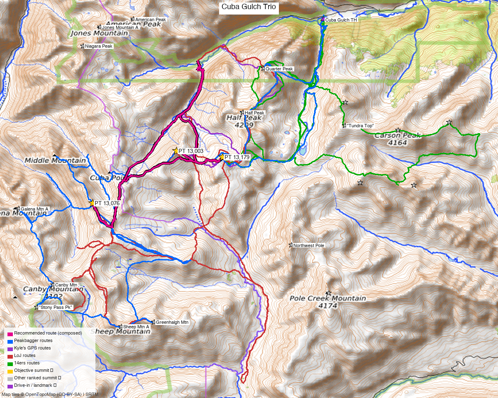

# Cuba Gulch Trio — PT 13,076 + Unnamed 13,003 + PT 13,179 (San Juan Mountains)

**Researched:** 2026-06-08
**Report type:** Day trip (3 peaks, one outing)
**CalTopo research map:** https://caltopo.com/m/DCQ8UKS
**Status in DB:** All three 0 ascents (unclimbed), all **ranked** San Juan 13ers. A natural **Cuba Gulch** day off the **Lake Fork (Lake City)** side, in the Half Peak / Cataract Gulch pocket.

> **Data note on PT 13,003:** it **is** a ranked peak_db peak (id 822, CO rank 635, Class 1) — but its peak_db row is **missing coordinates** (lat/lon and the 14ers cross-link are null), which is why automated geo-resolution initially missed it. Coordinates here come from LoJ (peak 822) / 14ers (peakid 10871). *peak_db fix needed: populate id 822 with lat 37.84968, lon −107.49465, fourteeners_id 10871.*

*[Interactive CalTopo map](https://caltopo.com/m/DCQ8UKS)*

---

<!-- CLIMBERS_START -->
**Other climbers:** Emily Sharpe — not yet · Shawn D Keil — not yet
<!-- CLIMBERS_END -->

## Quick stats

| | PT 13,076 | Unnamed 13,003 | PT 13,179 |
|---|---|---|---|
| Elevation | 13,076' | 13,003' | 13,179' |
| Lat / Lon | 37.82997, −107.52956 | 37.84968, −107.49465 | 37.84723, −107.47533 |
| Weather | [NOAA](https://forecast.weather.gov/MapClick.php?lat=37.82997&lon=-107.52956) | [NOAA](https://forecast.weather.gov/MapClick.php?lat=37.84968&lon=-107.49465) | [NOAA](https://forecast.weather.gov/MapClick.php?lat=37.84723&lon=-107.47533) (same target on all 3 sites) |
| Class (standard) | 2 | 1 | 2 |
| Rank | ranked (CO 589) | ranked (CO 635) | ranked (CO 497) |
| 14ers.com | [10577](https://www.14ers.com/php14ers/peak.php?peakid=10577) | [10871](https://www.14ers.com/peaks/10871/unnamed-13er-13003) | [10527](https://www.14ers.com/php14ers/peak.php?peakid=10527) |
| LoJ | [752](https://listsofjohn.com/peak/752) | [822](https://listsofjohn.com/peak/822) | [639](https://listsofjohn.com/peak/639) |
| peakbagger | [pid 15336](https://peakbagger.com/peak.aspx?pid=15336) | [pid 39877](https://peakbagger.com/peak.aspx?pid=39877) | [pid 39878](https://peakbagger.com/peak.aspx?pid=39878) |
| Peak DB id | 752 | 822 *(coords missing in peak_db — see note)* | 639 |

The three sit in a ~2.3 mi arc: **13,003 is the middle peak** (~1.1 mi from 13,179, ~2.3 mi from 13,076), so the natural order is 13,076 → 13,003 → 13,179 (or reverse). All three are **ranked** 13ers.

---

## Why these three together

A **standard Cuba Gulch outing** — the three are climbed together, confirmed by trip reports across all three sources **and Kyle's own GPS track** ("Cuba Gulch – 13076, 13003, 13179"). They share the single Cuba Gulch approach off the Lake Fork.

**Combos (ranked rule):** all three are **ranked** San Juan 13ers, so it's a true 3-ranked-peak day. The neighboring ranked peaks (Half Peak, Quarter Peak, Canby, Cataract, Sheep Mtn A) are already done — this cleans up what's left in the Cuba Gulch / Cataract pocket.

---

## Drive + approach

| | |
|---|---|
| **Drive from Boulder** | **[5h 52m via Google Maps](https://www.google.com/maps/dir/?api=1&origin=1162+Peakview+Circle,+Boulder,+CO+80302&destination=37.8993,-107.4332)** (~290 mi, origin: 1162 Peakview Circle; via US-285 + US-50 to Lake City) |
| Access corridor | **Lake Fork Rd (CR 30) → Cuba Gulch (CR 35) from Lake City** (the Lake San Cristobal / Cinnamon Pass direction) |
| Trailhead | **Cuba Gulch TH**, ~37.8993, −107.4332, **~9,540'**. High-clearance helpful on the upper road. |
| Note | A long-ish haul (~6 hr each way) — workable as a big day or an overnight out of Lake City. |

---

## Recommended plan — Cuba Gulch, the 13,076 ↔ 13,003 ↔ 13,179 ridge ⭐

The standard line, from the trip reports and Kyle's combining track.

**Combo stats (measured from TR GPX):**

| Source | Peaks | Distance | Gain |
|---|---|---|---|
| Clean trio (best LoJ/CalTopo track) | 13,076 + 13,003 + 13,179 | **~11 mi** | **~3,900 ft** |
| Bigger traverses (LoJ 8472, etc.) | + Half Peak / Cataract neighbors | up to 21.9 mi | up to ~12,500 ft |

Expect roughly **~11 mi and ~3,900 ft** for the clean three-peak day, Class 2 throughout (gain grows fast if you add the ranked neighbors — those are already done for Kyle).

### Route sequence
1. From the **Cuba Gulch TH (~9,540')**, head up Cuba Gulch toward the basin below the three peaks.
2. Climb the ridge over **PT 13,076 → Unnamed 13,003 → PT 13,179** (or reverse) — Class 2 tundra/talus on the connecting ridge.
3. Descend back into Cuba Gulch to the TH.

---

## Per-peak route notes

- **PT 13,076** — Class 2; the SW end of the arc. No formal 14ers route description (TR-only beta).
- **PT 13,003** — **Class 1**; the middle, gentlest peak. Ranked (peak_db id 822) — its coordinates were missing from peak_db (supplied from LoJ/14ers). Grabbed on the ridge between the other two.
- **PT 13,179** — Class 2; the NE end, ~1.1 mi from 13,003, near Half Peak's south ridge.

---

## Conditions / season

- **Best window:** **July through September.** High San Juan tundra; the Lake Fork / Cuba Gulch road opens late and the upper section is rough.
- **Storms:** standard San Juan afternoon monsoon exposure on the open ridge — early start, off the high ground by early afternoon.
- **Terrain:** Class 2 tundra/talus throughout the standard line — no technical sections.

---

## Permits / access

- **Uncompahgre / Gunnison NF–BLM** (Lake Fork / Cuba Gulch) — no permits; the summits are not in designated wilderness (per peak_db). Standard Leave No Trace.
- Cuba Gulch road: high-clearance recommended up high; check conditions.

---

## Cell coverage

- **14ers.com community DB:** no submitted reception reports for these summits.
- **Geographic reasoning:** the **Cuba Gulch approach and basin are almost certainly dead** — deep in the Lake Fork backcountry. Summits may catch intermittent signal but treat it as unreliable.
- **Standard recommendation:** carry an **InReach / satellite messenger**.

---

## Trip reports & GPX (all three sources)

**Sources confirmed logged in:** 14ers.com ("Basin"), listsofjohn.com ("letsgocu"), peakbagger.com ("Kyle Knutson"). **15 GPX tracks** swept (LoJ combos + peakbagger ascents) plus Kyle's own Cuba Gulch tracks — all layered on the CalTopo map, colored by source.

### listsofjohn.com
| GPX | Peaks |
|---|---|
| [8389](https://listsofjohn.com/gpx/8389.gpx) / [14398](https://listsofjohn.com/gpx/14398.gpx) | PT 13,076 (+combo) |
| [8472](https://listsofjohn.com/gpx/8472.gpx) / [14373](https://listsofjohn.com/gpx/14373.gpx) / [2271](https://listsofjohn.com/gpx/2271.gpx) | PT 13,179 + neighbors |
| [13242](https://listsofjohn.com/gpx/13242.gpx) | Unnamed 13,003 (+combo) |

### 14ers.com (logged in, "Basin")
Peak pages exist for all three (13,003 as "Unnamed 13003"); **no formal route descriptions** — route beta is TR-only.

### peakbagger.com (logged in, "Kyle Knutson")
Ascent GPX pulled for all three — PT 13,076 (pid 15336), Unnamed 13,003 (pid 39877), PT 13,179 (pid 39878), 3 tracks each — layered on the CalTopo map.

**Sources checked:** 14ers.com ✓ (logged in, "Basin") · listsofjohn.com ✓ (logged in, "letsgocu") · peakbagger.com ✓ (logged in, "Kyle Knutson")

---

## TL;DR

- **Three ranked San Juan 13ers in Cuba Gulch** — PT 13,076 + PT 13,003 + PT 13,179, in a ~2.3 mi arc off the **Lake Fork (Lake City)** side.
- **The plan:** Cuba Gulch TH (~9,540') → 13,076 → 13,003 → 13,179 ridge → out. **~11 mi, ~3,900 ft, Class 2** (13,003 itself is Class 1). A moderate day.
- **13,003 is a ranked peak_db peak** (id 822) whose coordinates are *missing* from peak_db — a data gap to fix (lat 37.84968, lon −107.49465, 14ers id 10871).
- **Confirmed combo** — done together in TRs across all three sources, and on Kyle's own "Cuba Gulch – 13076, 13003, 13179" track.
- **Drive:** [5h 52m](https://www.google.com/maps/dir/?api=1&origin=1162+Peakview+Circle,+Boulder,+CO+80302&destination=37.8993,-107.4332) to the Cuba Gulch TH via Lake City — a long day or an overnight.
- **Season:** July–September; rough road up high. Cell dead — carry an InReach.
- **Research map:** https://caltopo.com/m/DCQ8UKS
