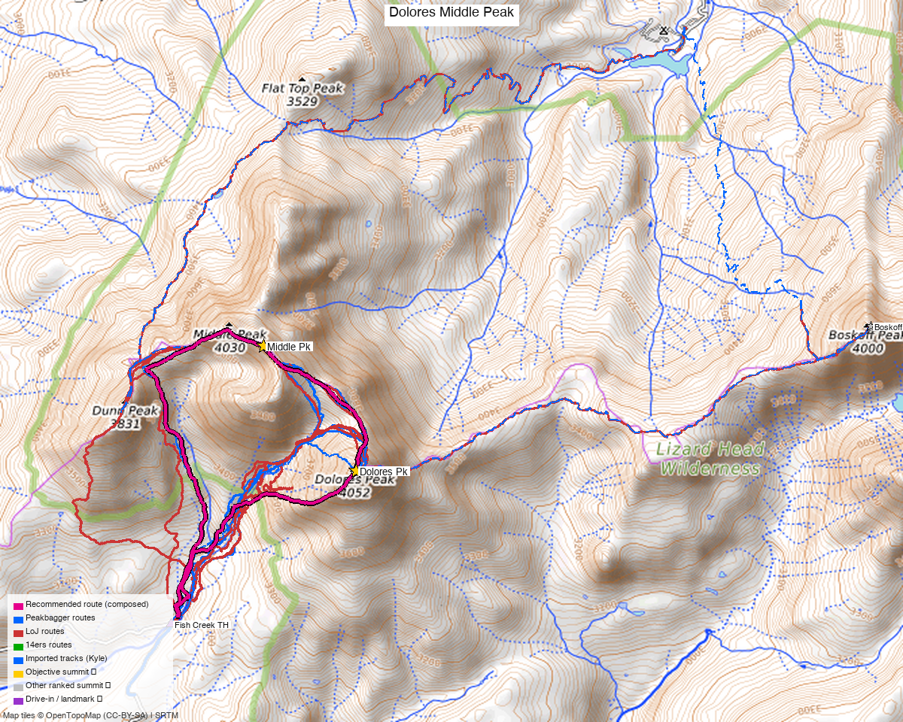

# Dolores Peak + Middle Peak (San Miguel Mountains, CO)

<!-- QUICKSTATS_START -->

!!! tip "At a glance — recommended day"
    **6.4 mi** · **3,921 ft** gain · **Class 2** · 2 peaks · ~7.5 h drive

<!-- QUICKSTATS_END -->

**Researched:** 2026-05-13

**CalTopo research map (with all GPX layered):** https://caltopo.com/m/R1KSN0U

**Status in your sheet:** Both 0 ascents (unclimbed). Same drainage divide as Mt. Wilson group, but a separate cluster.

---

<!-- CLIMBERS_START -->
**Other climbers:** Emily Sharpe — not yet · Shawn D Keil — ✓ all
<!-- CLIMBERS_END -->

## Quick stats

| | Dolores Peak | Middle Peak | Dunn Peak (bonus) |
|---|---|---|---|
| Elevation (LiDAR) | 13,289' | 13,305' | 12,612' |
| Prominence | 730' | **1,960'** | unranked |
| Lat / Lon | 37.84056, −108.09621 | 37.85368, −108.10804 | 37.84639, −108.12561 |
| Weather (Dolores Pk) | [NOAA forecast](https://forecast.weather.gov/MapClick.php?lat=37.84056&lon=-108.09621) — same target on all 3 sites; one link covers the whole cluster |
| Class (standard) | 2 | 2 (with exposure, false summit) | 2 |
| Range | San Miguel Mountains | San Miguel Mountains | San Miguel Mountains |
| Wilderness | Lizard Head | Lizard Head | Lizard Head |
| County | Dolores / San Miguel | Dolores / San Miguel | Dolores / San Miguel |
| LoJ name in your sheet | `Dolores Pk` | `Middle Pk` (also `"Middle Point"`) | not on your list |

Coordinates above are LiDAR-authoritative from the public CalTopo map "Fish Creek - Dolores & Middle Peaks" (CVV0). Wikipedia lists Dolores at 13,296 ft; the LiDAR value 13,289 is more current. Note Middle is ~16 ft higher and far more prominent (1,960' vs 730').

<!-- PROVENANCE_START -->
*Note: the recommended route was distilled from **7 recorded GPS tracks** of real trips (14ers.com · ListsofJohn · peakbagger) — all layered on the [interactive CalTopo research map](https://caltopo.com/m/R1KSN0U).*
<!-- PROVENANCE_END -->

---

## Multi-peak link-ups (read this first)

Realistic combinations from the **Fish Creek TH** (37.82419, −108.11985). Only ranked 13ers count as link-ups for you; sub-13ers and unranked summits are noted but not recommended.

### 1. Dolores + Middle (the standard pair) — recommended
**8.49 mi RT, 3,896' gain, Class 2.** Both ranked 13ers. Up from TH, into upper basin to Middle/Dolores saddle, hit Dolores first (right/SE from saddle), back to saddle, then Middle (left/NW from saddle). Return same route. ~6 hr moving. This is the ranked-peak optimum from this TH.

### 2. Dolores + Middle + Boskoff Peak (the only 3-ranked-13er option in this cluster)

Boskoff Peak: **13,134' LiDAR, 37.855305, −108.031375** — sits ~7 km east of Middle on the long ridge running from Wilson Peak westward. PeakVisor lists Mt. Wilson as parent, so it's not a "next door" peak to Middle/Dolores; it's a real ridge run away.

**Option A — Single push (long day, novel traverse).** A 3,312-pt track in Kyle's School Bus map (imported, source unknown) shows it's been done as a **~19.9-mi loop bagging all 4 cluster peaks** from a north-side TH at **37.8867, −108.0547**. Skipping Dunn shaves ~0.2 mi + 600' off that.
- ~19 mi, ~5,000–5,500' gain (one valley-floor ascent; rest is ridge undulations)
- Class 2 baseline + Middle's W-ridge Class 3+ if taken; **Middle→Boskoff connector ridge is the unknown** — climb13ers.com says about the 3-peak cluster: "it is possible to climb all three in one day but the effort is arduous and the ridge has sustained exposure." Plan for Class 3+ exposure.
- North TH access road not yet confirmed — likely FSR 611 from Beaver Park / Lone Cone area (per Robert Ormes' Dunn Peak description), but verify before driving out.

**Option B — Two days, two trailheads (clean, recommended).**
- **Day 1: Fish Creek TH → Dolores + Middle** (8.49 mi, 3,896' gain, Class 2, ~6 hr)
- Drive: Fish Creek → CO 145 → Fall Creek Rd / FSR 618 → Woods Lake. **~1.5–2 hr.**
- **Day 2: Woods Lake TH → Boskoff** (9.4 mi, 3,800' gain, Class 2+, 6–8 hr) — up Woods Lake Trail to Elk Creek Trail jct (3.3 mi), then SW ridge of Boskoff. One Class 2+ crux at 12,360' on loose rock.
- **Total: 17.89 mi, 7,696' gain.** Standard routes both days, no novel traverse beta needed.

| | Option A (single push) | Option B (two day) |
|---|---|---|
| Distance | ~19 mi | ~17.9 mi |
| Gain | ~5–5.5K' | 7.7K' |
| Days | 1 | 2 |
| Trailheads | 1 (north TH, unconfirmed road) | 2 (Fish Creek + Woods Lake) |
| Exposure | Middle W-ridge + Middle→Boskoff connector | Standard routes only |
| Best start | Counter-clockwise: Boskoff first (easy walk-up), Middle ridge in the middle with energy, easy descent off Dolores | **Day 1 at Fish Creek** for D+M; Boskoff Day 2 (mostly tundra walk) on tired legs |

**Recommendation:** Option B unless you specifically want the single-push challenge. Negligible mileage difference, no novel traverse beta required, and the gain spreads across two days.

**Open questions if pursuing Option A:** (1) exact road accessing 37.8867, −108.0547, (2) class rating on the Middle→Boskoff connector ridge.

### Linking with Wilson Group
Not realistic in the same trip — Mt. Wilson / El Diente / Wilson Peak / Gladstone are on the OTHER side of Lizard Head Wilderness (Kilpacker TH or Rock of Ages). Your existing CalTopo data shows Wilson group markers and tracks (verify against sheet — likely already climbed).

### Bonus elevation only (not ranked, won't count for you)
- **Dunn Peak (12,612', unranked).** Sits right next to Middle/Dolores and adds maybe 0.2 mi + 600' gain to a Fish Creek day. The Earthline 2015 loop bagged it as a casual add-on. **Skip unless you want the workout** — doesn't move the needle on any list.

---

## Route options (ranked)

### A. Standard out-and-back from Fish Creek TH — Dolores + Middle (best default)

**8.49 mi RT, 3,896' gain, Class 2, ~6 hr.** Source: Wild Wanderer, 9/19/2023.

**Sequence:**
1. From dispersed camping/parking, head **north across Fish Creek**. Cairn marks the crossing. Stay **right of the creek** on the faint game trail (1.3 mi to the climb start).
2. Ascend ridge NE to treeline, **avoid waterfall/gorge**.
3. Upper basin: **stay LOW on grass** instead of going high on talus. The high talus route is Class 2+ and "would not recommend."
4. Wind NE through rocky basin (stay left of creek) to the **Middle/Dolores saddle**.
5. **Dolores first**: from saddle, turn right (SE) up the ridge. Game trails through rock, Class 2.
6. Return to saddle, continue NW to **Middle**. Class 2 on talus/scree, **expect crumbly rock with exposure**, and a **false summit** — true summit is further northwest.
7. Descend by retracing — follow drainage down (right of waterfall), cross Fish Creek at the cairn, back to TH.

### B. Counterclockwise loop variant (more interesting terrain, optional Dunn add-on)

**~8.7 mi, 4,500' gain. Class 2 baseline; Middle Peak's west ridge is Class 3+ if you take it.** Source: Earthline, 10/1/2015.

Same first half as A. After Middle, take the **west ridge** for more scrambling, descending toward the Dunn area and looping back to Fish Creek. Dunn Peak (12,612', unranked) is right there — bag it if you want the extra elevation, skip it if you'd rather conserve energy.

**Class 3+ section on Middle's west ridge (if you take it for the scrambling):**
- Narrow ridge "razor sharp, only one foot wide in places"
- Serrations descend straight down center
- Upper descent section is "very steep and rubbly, perhaps ten feet wide"
- One spot has "a fin with a 20 foot drop" (possible Class 4 bypass)

If you don't want this exposure, descend Middle to the south side of the Middle/Dunn saddle on talus instead — Class 2.

### C. West-side talus from Dolores County Road 52 hairpin (cautionary)

**9.54 mi RT, 4,690' gain.** Source: 14ers.com TR 19949 (Nov 2019). Author **explicitly disabled GPX as a warning**. They went up Dolores's SW slopes and call it "incredibly dangerous" — 40-45° loose scree, ice axe + microspikes terrain. Don't go this way. They recommend the talus field WEST of Fish Creek instead (which is essentially route A but via a different entry).

Consider this a "what to avoid" data point.

### D. Telluride Mountain Club's loop variant
TMC describes a Middle Peak loop from the same parking spot with **Class 4 scrambling on the ridge to Middle Peak**. Off-trail, route-finding required. Lower stat detail. Probably the "go up the west ridge spine direct" version of route B. Worth a look if you want maximum scrambling.

---

## Trailhead — Fish Creek TH

- **Location:** 37.82419, −108.11985
- **Drive from Boulder:** **[7h 30m via Google Maps](https://www.google.com/maps/dir/?api=1&origin=1162+Peakview+Circle,+Boulder,+CO+80302&destination=37.82419,-108.11985)** (359 mi, origin: 1162 Peakview Circle)
- **Elevation:** ~10,250'
- **Vehicle:** 2WD dirt road, 5 miles from Dunton, CO. Your high-clearance vehicle is overkill — anything will make it. (TR notes "4WD option to park 50 yards further" but unnecessary.)
- **Parking:** Dispersed camping area. Plenty of room. No fees.
- **Restrooms / water:** None at TH. Fish Creek runs through the area but treat.
- **Approach driving:** From Dunton, follow the dirt road north 5 mi. The CVV0 map has a "Dunton Road Turnoff" waypoint at 37.77197, −108.99 if you need a routing reference (note: well south of the TH — that's an early junction, not the parking).
- **Camping:** Dispersed camping at the TH itself. Dunton has paid options if you want a hot springs night.

---

## Conditions / season

- **Best window:** July through early October (per most sources). Snow lingers in upper basin into June.
- **Dunton dirt road:** Closes in winter once snow stays. Verify before any shoulder-season trip.
- **Water:** Fish Creek + tributaries on the way up. Treat. None high above the basin.
- **Snow:** Northern and east aspects can hold snow patches into July. Earthline noted snow at the saddles even in June.
- **Cold mornings:** Wild Wanderer report (mid-Sept) mentions ground frost.
- **Hazards:** Exposed ridge on Middle Peak with crumbly rock; Class 3+/4 sections on Middle's west ridge; cliffs and waterfalls in eastern Fish Creek drainage (don't drift east on descent).

---

## Permits / access

- **Lizard Head Wilderness, San Juan National Forest** — no permits required, no fees.
- Standard wilderness regs: pack out everything, no motorized, group size ≤ 15, camp ≥ 100' from water.
- **Road status:** Verify Dunton Rd / Forest Road conditions in spring/late fall via [San Juan NF road conditions](https://www.fs.usda.gov/main/sanjuan/conditions).

---

## Recent trip reports

| Date | Source | Stats | Notes |
|---|---|---|---|
| 9/19/2023 | [Wild Wanderer](https://wildwanderertripreports.com/2023/09/19/dolores-peak-13289-and-middle-peak-13305/) | 8.49 mi, 3896' gain, 6 hr | Best beta. Dolores → Middle. "Stay LOW in upper basin." |
| 9/16/2023 | [14ers.com TR 22348](https://www.14ers.com/php14ers/tripreport.php?trip=22348) | 8.49 mi, 3896', Class 2 | Same trip pattern as Wild Wanderer. Frost AM. False summit on Middle. |
| 11/3/2019 | [14ers.com TR 19949](https://www.14ers.com/php14ers/tripreport.php?trip=19949) | 9.54 mi, 4690' | **WARNING route.** SW slopes of Dolores = "incredibly dangerous." GPX disabled. |
| 10/1/2015 | [Earthline (van Winegarden)](https://debravanwinegarden.blogspot.com/2015/10/dolores-peak-13290-middle-peak-13280.html) | 8.7 mi, 4500' | Trifecta loop adding Dunn. Class 3+ Middle west ridge described. |
| | [Telluride Mountain Club](https://www.telluridemountainclub.org/middle-peak-loop-hike/) | not stated | Loop variant with Class 4 scrambling option. |
| 10/12/2020 | [14ers.com TR 20798](https://www.14ers.com/php14ers/tripreport.php?trip=20798) | not yet read | Worth scanning. |

---

## GPX & sources (all 3 swept + deduped)

The CalTopo research map now layers **real recorded GPX from all three sources**
(the old hand-drawn CalTopo lines were replaced):

- **14ers.com** — recorded ascent tracks (Dolores peakid 10470 / Middle 10460); the cleanest is a **6.4-mi Dolores + Middle out-and-back** from Fish Creek TH (green).
- **listsofjohn.com** — 4 member trip-report tracks (peak [508](https://listsofjohn.com/peak/508) + [489](https://listsofjohn.com/peak/489)) (red).
- **peakbagger.com** — 2 ascent GPS tracks ([Dolores pid 5818](https://peakbagger.com/peak.aspx?pid=5818) / [Middle pid 14675](https://peakbagger.com/peak.aspx?pid=14675)) (blue).

**All 7 swept tracks summit *both* peaks** and start within ~0.6 mi of the Fish Creek TH — the **bold magenta recommended route** (~5.8 mi, composed off these tracks; trip reports run 6.4–8.5 mi) is DEM-measured. **Avoid** the Dolores SW slopes (14ers TR 19949 author disabled the GPX as a warning — "incredibly dangerous").

---

**Sources checked:** 14ers.com ✓ (logged in) · listsofjohn.com ✓ · peakbagger.com ✓ — all 3 swept for GPX (replacing the old hand-drawn CalTopo lines).
