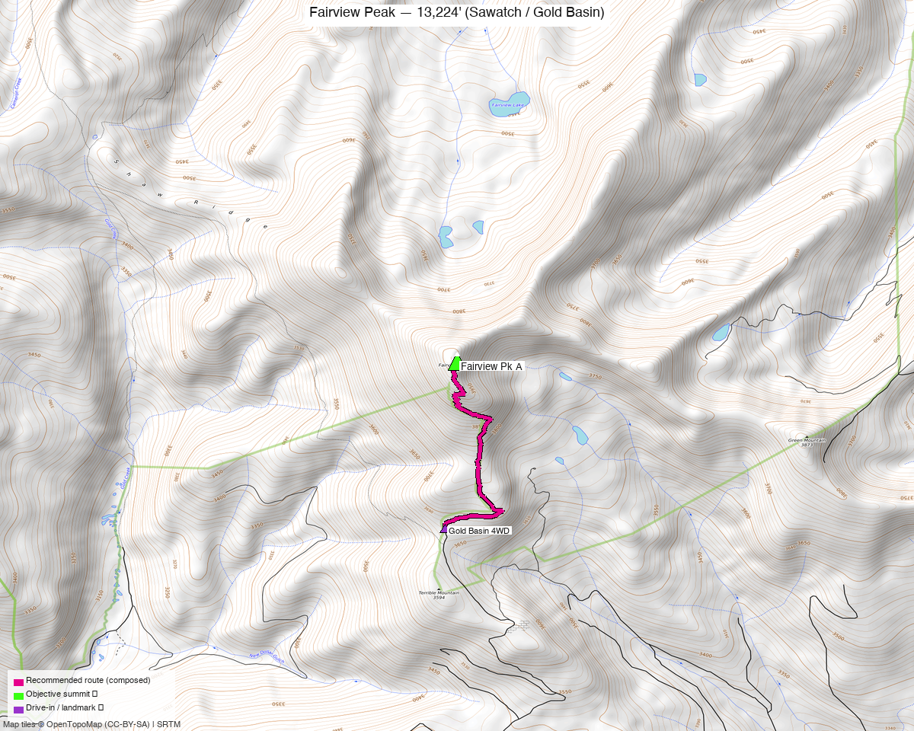

<!-- CLIMBERS_START -->
**Other climbers:** Emily Sharpe — not yet · Shawn D Keil — ✓ climbed
<!-- CLIMBERS_END -->

# Fairview Peak — 13,224' (Sawatch / Gold Basin)

<!-- QUICKSTATS_START -->

!!! tip "At a glance — recommended day"
    **2.8 mi** · **1,137 ft** gain · **Class 1** · 1 peak · ~5.5 h drive

<!-- QUICKSTATS_END -->

**Researched:** 2026-07-22

!!! weather ""
    **NOAA weather link:** [Fairview Peak Weather](https://forecast.weather.gov/MapClick.php?lat=38.68&lon=-106.54)

!!! map ""
    **CalTopo research map:** <https://caltopo.com/m/C57DGK4>

**Status in DB:** unclimbed. A ranked (CO #465), **Class 1** tundra summit above Gold
Basin, NE of Gunnison. Its whole difficulty is the **rough 4WD drive** up Gold Creek
Rd — the walk itself is short and easy. Natural pair with nearby [Henry Mountain](henry_mountain.md).

<!-- PROVENANCE_START -->
*Note: the recommended route was distilled from **6 recorded GPS tracks** of real trips (14ers.com · ListsofJohn · peakbagger) — all layered on the [interactive CalTopo research map](https://caltopo.com/m/C57DGK4).*
<!-- PROVENANCE_END -->

---

## The peak

A **short Class 1 walk-up** from high in Gold Basin — grass and gentle tundra to a broad
summit. The mileage depends entirely on **how far up the 4WD road you drive**: from the
upper Gold Basin start it's a **~2.8-mi / ~1,140-ft** round trip.

| | [Fairview Pk A](https://www.14ers.com/peaks/10796) |
|---|---|
| Elevation | 13,224' |
| Lat / Lon | 38.6831, −106.5365 |
| Route | Gold Basin → S slopes |
| Class | 1 |
| CO rank | #465 |
| listsofjohn.com | [591](https://listsofjohn.com/peak/591) |
| peakbagger.com | [15295](https://peakbagger.com/peak.aspx?pid=15295) |

---

## Recommended route — Gold Basin walk-up ⭐

From the **upper Gold Basin 4WD start (~12,030')**, a short tundra climb — **~2.8 mi ·
~1,140 ft, Class 1**.

### Route sequence
1. From where you park on the upper **Gold Creek Rd (FR 771)** in Gold Basin, hike north
   up open tundra slopes toward Fairview's broad south side.
2. Walk the easy grass/talus slope to the **summit (13,224')** — Class 1, no scrambling.
3. Return the same way.

---

## Getting there — Gold Basin (Gold Creek Rd, FR 771)

| | |
|---|---|
| **Drive from Boulder** | **[~5h 30m via Google Maps](https://www.google.com/maps/dir/?api=1&origin=1162+Peakview+Circle,+Boulder,+CO+80302&destination=38.6709,-106.5375)** — via US-285 / US-50 to Gunnison, then **Gold Creek Rd (FR 771)** up into Gold Basin. Most of the time is the rough road, not the hike. |
| Trailhead | **Upper Gold Basin, ~12,030'** — the recommended start. **Gold Creek Rd is a rough, high-clearance / 4WD** shelf road; **park where your vehicle tops out.** |
| Land | **GMUG NF** — no permits/fees; not designated wilderness. |

---

## Gear & season

- **Best window:** **late June–September** — the road melts out late and holds snow high.
- **Terrain:** Class 1 tundra, no technical sections — trail runners are plenty.
- **Storms:** short exposure up high, but still start early — afternoon thunderstorms are
  the norm.
- **Cell:** unreliable in Gold Basin; carry an **InReach**.

---

## Other considerations

- **How high to drive?** A recorded line starts even higher (~12,410') for a **~1.5-mi**
  round trip if the rough upper road is dry and your rig is willing; parties in a lower
  vehicle park down-basin and hike a **longer (~7 mi)** approach. The ~12,030' start is
  the sensible middle.
- **Pair with Henry Mountain:** [Henry Mtn](henry_mountain.md) is ~4.6 mi west in the
  same Gold Basin / Gold Creek system — the two make an easy weekend, though each has its
  own trailhead and this report keeps them separate.

---

## Trip reports & GPX (all three sources swept)

**Sources confirmed logged in:** 14ers.com ("Basin"), listsofjohn.com ("letsgocu"),
peakbagger.com ("Kyle Knutson"). **6 tracks** — 1 from the 14ers.com library, 2 from
listsofjohn TRs, 3 from peakbagger ascents; all confirm the short Gold Basin walk-up.
All layered on the [research map](https://caltopo.com/m/C57DGK4); recommended route magenta.

**listsofjohn.com** — Fairview (peak 591) trip reports, ~7-mi lines from lower in the basin.

**peakbagger.com** — 3 ascent tracks from varying points on the 4WD road (1.5–2.8 mi).

**14ers.com** — one library track from a high start.

**Sources checked:** 14ers.com · listsofjohn.com · peakbagger.com · climb13ers.com
