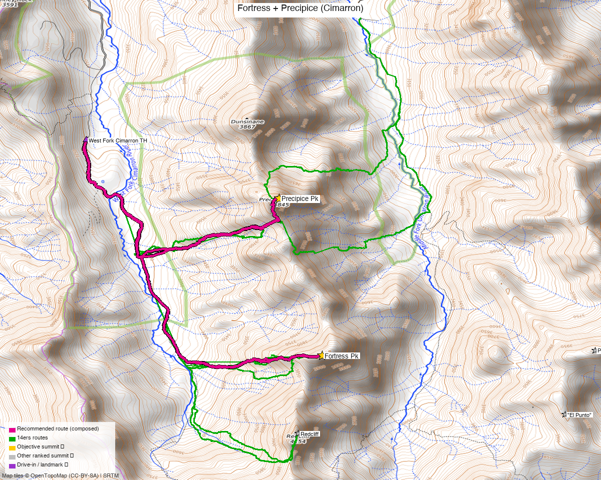

# Fortress Pk + Precipice Pk (Cimarron) — two individual climbs

<!-- QUICKSTATS_START -->

!!! tip "At a glance — 2-day trip"
    **2 peaks** · **~5.5 h drive**

    - **Day 1 (Fortress):** **6 mi** · **2,518 ft** gain · **Class 3** · 1 peak
    - **Day 2 (Precipice):** **4.6 mi** · **2,811 ft** gain · **Class 3** · 1 peak

<!-- QUICKSTATS_END -->

**Researched:** 2026-06-15
**Report type:** The two northern Cimarron peaks near Coxcomb, each climbed **on its own** from the West Fork. (No combo — the connecting ridge is broken by deep notches and no party has recorded a track linking them, so they're best done as two separate out-and-backs.)
**CalTopo research map:** https://caltopo.com/m/KTTS4F0
**Status in DB:** both unclimbed.

> The Coxcomb-area peaks you wanted handled separately from the [Cimarron six](cimarron_six.md). Both are **steep, loose Cimarron Class 3** — committing, rotten rock — and each is its own climb from the **West Fork Cimarron TH**.

*[Interactive CalTopo map](https://caltopo.com/m/KTTS4F0)* — 14ers-library tracks (Fortress + Precipice) + Kyle's CalTopo in green; the **two recommended solo routes in bold magenta** (Fortress S, Precipice N), each an out-and-back from the West Fork TH; 2 summit markers.

---

<!-- CLIMBERS_START -->
**Other climbers:** Emily Sharpe — not yet · Shawn D Keil — not yet
<!-- CLIMBERS_END -->

## Quick stats

| | "Fortress Pk" | Precipice Pk |
|---|---|---|
| Elevation | 13,246' | 13,141' |
| Lat / Lon | 38.0978, −107.5301 | 38.1191, −107.5355 |
| Class | 3 (loose) | 3 (steep, loose) |
| CO Rank | 445 | 536 |
| Recommended climb | **~6.0 mi / ~2,520'** (DEM, out-and-back) | **~4.6 mi / ~2,810'** (DEM, out-and-back) |
| 14ers.com | [10488](https://www.14ers.com/php14ers/peak.php?peakid=10488) | [10539](https://www.14ers.com/php14ers/peak.php?peakid=10539) |
| LoJ | [552](https://listsofjohn.com/peak/552) | [662](https://listsofjohn.com/peak/662) |
| peakbagger | [56705](https://peakbagger.com/peak.aspx?pid=56705) | [56707](https://peakbagger.com/peak.aspx?pid=56707) |
| Peak DB id | 552 | 662 |

Both sit just **N of Coxcomb** on the divide between the **West and Middle forks of the Cimarron**, ~1.5 mi apart — but **separated by deep notches**, so they're climbed as two individual out-and-backs from the West Fork, not a linked traverse.

---

## Precipice Pk — West Fork Cimarron ⭐

A short, steep out-and-back: **~4.6 mi / ~2,810'** (DEM, from a recorded track), **Class 3**. The classic approach (e.g. [debravanwinegarden 8/2025](https://debravanwinegarden.blogspot.com/2025/08/precipice-peak-13144-from-west-fork.html)): from the **West Fork Cimarron / Wetterhorn Basin TH (~10,430')**, a **faint, fragmented social trail and an ultra-steep footpath straight up through deep forest** to the divide, then a loose **Class 3** finish. Short but brutal and loose; few visitors.

## Fortress Pk — West Fork Cimarron ⭐

A bit longer out-and-back: **~6.0 mi / ~2,520'** (DEM, from a recorded track), **Class 3 on loose Cimarron rock**. Fortress sits further S toward Coxcomb off the same West Fork TH. Steep, rotten rock — careful scrambling, helmet.

> **Climb them separately.** The two summits are only ~1.5 mi apart but the connecting ridge is cut by **deep notches**, and no recorded GPS track links them — so the recommended plan is two out-and-backs from the West Fork TH (do them on different days, or as two separate climbs in one long day), not a ridge traverse.

---

## Drive + approach

| | |
|---|---|
| **Drive from Boulder** | **[~5h 30m via Google Maps](https://www.google.com/maps/dir/?api=1&origin=1162+Peakview+Circle,+Boulder,+CO+80302&destination=38.127,-107.5598)** — via US-50 to the **Cimarron** turnoff (E of Montrose), then the **West Fork Cimarron** road. |
| Trailhead | **West Fork Cimarron / Wetterhorn Basin TH**, ~38.127, −107.560, **~10,430'** (passenger car, with care). |
| Land | **GMUG National Forest** (Uncompahgre Wilderness covers the high terrain) — no permits/fees, foot-only. |

---

## Conditions / season

- **Best window:** **July–September** — high, remote; steep N-facing approaches hold snow.
- **Terrain:** steep, **loose Class 3** Cimarron rock — careful scrambling, helmet advised; the Precipice approach trail is faint and very steep.
- **Storms:** exposed divide — early start.
- **Cell:** dead — carry an InReach.

---

## Trip reports & GPX (all sources)

**Sources confirmed logged in:** 14ers.com ("letsgocu"), listsofjohn.com, peakbagger.com (Kyle Knutson). **4 Fortress + 5 Precipice 14ers-library tracks** + Kyle's CalTopo are layered; the two recommended solo routes are drawn magenta. peakbagger has no downloadable ascent GPX for these.

- **14ers.com:** multiple Fortress and Precipice tracks (solo) — both well-recorded.
- **listsofjohn.com:** per-peak TRs for each.
- **peakbagger.com:** pages verified for both (ownership = GMUG NF).
- **Web:** [Precipice from West Fork Cimarron (Earthline, 2025)](https://debravanwinegarden.blogspot.com/2025/08/precipice-peak-13144-from-west-fork.html).

**Sources checked:** 14ers.com ✓ (logged in, "letsgocu") · listsofjohn.com ✓ · peakbagger.com ✓ (logged in, "Kyle Knutson") · climb13ers.com ✓ · Kyle's CalTopo ✓

---

## TL;DR

- **Two northern Cimarron 13ers near Coxcomb**, both steep **loose Class 3**, each its own climb from the **West Fork Cimarron TH**.
- **Precipice:** ~4.6 mi / ~2,810' — short but **ultra-steep + faint trail**. **Fortress:** ~6.0 mi / ~2,520' — a bit longer, loose rock.
- **Climb them separately** — deep notches break the connecting ridge and no track links them; two out-and-backs, not a traverse.
- **GMUG NF / Uncompahgre Wilderness**; ~5h30 drive (US-50 → Cimarron). Cell dead — InReach.
- Pairs with the [Cimarron six](cimarron_six.md) report (Middle Fork side) to finish your remaining Coxcomb-area peaks.
- **Part of the [Cimarron / Coxcomb trip](../trips/cimarron_coxcomb.md)** — the six-peak Middle Fork loop + these two individual West Fork climbs = all 8 remaining Coxcomb 13ers.
- **Research map:** https://caltopo.com/m/KTTS4F0
