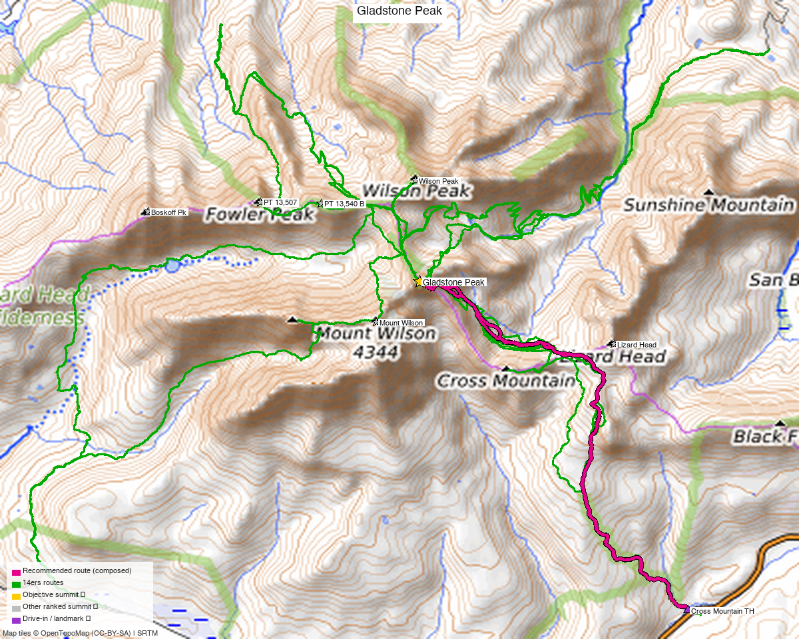

# Gladstone Peak — 13,923' Centennial (San Juan, Wilson group)

<!-- QUICKSTATS_START -->

!!! tip "At a glance — recommended day"
    **11.3 mi** · **4,976 ft** gain · **Class 4** · 1 peak · ~8 h drive · [weather](https://forecast.weather.gov/MapClick.php?lat=37.845&lon=-107.984)

<!-- QUICKSTATS_END -->

*Written for **Emily** — the standalone Centennial between Mount Wilson and El Diente, by the shortest recorded day route (Cross Mountain TH / Bilk Basin).*

**Report type:** Day climb (1 ranked Centennial 13er)
**CalTopo research map:** https://caltopo.com/m/1PV10HH
**Status for Emily:** **unclimbed** (on her 14ers checklist). CO rank **67**, a **Centennial** (highest 100 in Colorado) — the high prize of this trip.

> **Gladstone Peak (13,923')** is the pyramid wedged between **Mount Wilson** and **El Diente** in the Wilson group. Climbed on its own, the **shortest recorded line is from the Cross Mountain TH up Bilk Basin** — a **~11.3 mi / ~5,000 ft round trip** to a **short Class 4 move right below the summit** (with an easier **Class 3** line just left of it). The mountain is **notoriously loose**; the difficulty is the rock quality and that final summit block, not the mileage.

<!-- PROVENANCE_START -->
*The recommended route was distilled from **12 recorded GPS tracks** of real trips (14ers.com · ListsofJohn · peakbagger) — all layered on the [interactive CalTopo research map](https://caltopo.com/m/1PV10HH).*
<!-- PROVENANCE_END -->
*[Interactive CalTopo map](https://caltopo.com/m/1PV10HH)* — the **recommended Cross Mountain / Bilk Basin route in bold magenta** (DEM-measured off a recorded 14ers track), over the other library tracks (green); summit marker + the Cross Mountain TH.

---

<!-- CLIMBERS_START -->
**Other climbers:** Kyle Knutson — ✓ climbed · Shawn D Keil — ✓ climbed
<!-- CLIMBERS_END -->

## Quick stats

| | Gladstone Peak |
|---|---|
| Elevation | **13,923'** |
| Lat / Lon | 37.84513, −107.98415 |
| Class (standard route) | **4** (short crux move below summit; Class 3 alternative alongside) |
| CO Rank | **67** — Centennial |
| Range | San Juan (Wilson group, Lizard Head Wilderness) |
| 14ers.com | [peak 10278](https://www.14ers.com/php14ers/peak.php?peakid=10278) |
| LoJ | [84](https://listsofjohn.com/peak/84) |
| peakbagger | [Gladstone Peak](https://peakbagger.com/peak.aspx?pid=5817) |
| Peak DB id | 84 |

---

!!! danger "Class 4 summit move + very loose rock — this is the hard part"
    However you approach it, **Gladstone ends with a short Class 4 move pulling onto the summit block.** A recorded TR ([14ers #20763](https://www.14ers.com/php14ers/tripreport.php?trip=20763)) describes "**the true 'Class 4' move to pull to the top**," with "**a nice Class 3 alternative to the left of it**" — so the very top can be done at **stiff Class 3** if you pick the line carefully, but expect at least one committing move.
    The bigger theme is **rock quality:** the same party wrote "**I hardly trusted a rock all day.**" The upper mountain is **steep, loose talus and shifting blocks** — helmet on, test every hold, and don't climb it with people directly below you. Save it for **dry, stable conditions**; wet or snowy rock here is serious.

## The route — Cross Mountain TH / Bilk Basin ⭐

A **~11.3 mi / ~5,000′ round trip** (DEM-measured off a recorded 14ers track — the shortest clean **Gladstone-only day** in the library; the Navajo Basin/Rock-of-Ages side from the west is a longer day, usually done when combining the Wilsons). Class 4 at the summit, Class 2 talus and tundra below it.

- **Line:** **Cross Mountain TH** (CO-145 near Lizard Head Pass, ~10,000′) → **Lizard Head / Cross Mountain trail** into **Bilk Basin** (the SE cirque under the Wilson group) → up Gladstone's **southeast slopes** (steepening, loose talus) → the **short Class 4 crux just below the summit** (Class 3 line just left).
- **Why this side:** it's the **shortest standalone** approach to Gladstone — a roadside CO-145 trailhead, no long basin backpack and less gain than the western (Navajo Basin) approaches.
- **Effort, not just grade:** still a **long, high day** — ~5,000′ of gain and a steep, loose finish.

---

## Drive + approach (from Highland, Denver)

| | |
|---|---|
| **Drive from Denver** | **[~8h via Google Maps](https://www.google.com/maps/dir/?api=1&origin=Highland,+Denver,+CO&destination=37.7964,-107.9377)** — a far-SW-Colorado drive (US-285 / US-50 / US-550 corridor toward Telluride), then **CO-145 over Lizard Head Pass**. This is a **multi-hour drive — plan to camp.** (Verify the exact time in Maps.) |
| Trailhead | **Cross Mountain TH** — ~37.7964, −107.9377, ~10,000', a roadside pullout on **CO-145** just SW of **Lizard Head Pass**. The Cross Mountain / Lizard Head trail leads into Bilk Basin. |
| Land | **San Juan NF / Lizard Head Wilderness** — foot travel only beyond the TH; no permits/fees. |

---

## Conditions / season

- **Best window:** **mid-July through September**, once the upper basin and the loose summit slopes are dry and snow-free. The Class 4 crux is **much more dangerous with snow/ice or wet rock.**
- **Terrain:** trail + basin to talus; the **upper mountain is steep and notoriously loose** to a **Class 4** finish. Helmet strongly recommended.
- **Storms:** long exposed day at altitude — **very early start**, summit early, and be off the loose upper slopes before afternoon weather.
- **Cell:** unreliable to dead in Bilk Basin — carry an **InReach/satellite messenger.**

---

## Trip reports & GPX (all sources)

**All three sources swept** (counts verified, not assumed): **9 distinct recorded GPX tracks** all summit Gladstone — from both the **Cross Mountain / Bilk Basin** side (east) and **Navajo Basin** (west). The recommended route is the **shortest clean Gladstone-only day** (Cross Mountain, DEM-measured off that track).

- **14ers.com — 6 GPX tracks** (deduped from the 9 library entries). Route beta + the [#20763 trip report](https://www.14ers.com/php14ers/tripreport.php?trip=20763) documenting the **Class 4 summit move / Class 3 alternative** and the **loose rock** ("I hardly trusted a rock all day"). ([peak 10278](https://www.14ers.com/php14ers/peak.php?peakid=10278))
- **peakbagger.com — 3 GPX tracks** (ascents with uploaded GPS; [pid 5817](https://peakbagger.com/peak.aspx?pid=5817)). One independently starts at the Cross Mountain TH — corroborating the trailhead.
- **listsofjohn.com — no downloadable GPX** ([peak 84](https://listsofjohn.com/peak/84) hosts text trip reports only); used for class/rank confirmation (Class 3, CO rank 67).
- **climb13ers.com:** Gladstone Peak route notes (Wilson group).

**Sources checked:** 14ers.com ✓ (6 tracks) · peakbagger.com ✓ (3 tracks) · listsofjohn.com ✓ (no GPX, text TRs) · climb13ers.com ✓

---

## TL;DR

- **Gladstone Peak (13,923', CO rank 67, Centennial)** — the standalone prize of the Wilson group.
- **~11.3 mi / ~5,000′ round trip** from the **Cross Mountain TH** (CO-145 near Lizard Head Pass) up **Bilk Basin** — the shortest clean Gladstone-only day; Class 2 tundra/talus → steep **loose** upper slopes → a **short Class 4 move below the summit** (Class 3 line just left).
- **The hazard is loose rock + that summit move**, not the distance — **helmet, dry stable conditions, test every hold.**
- **Far SW Colorado — long drive (~8h), plan to camp.** Cell dead — InReach.
