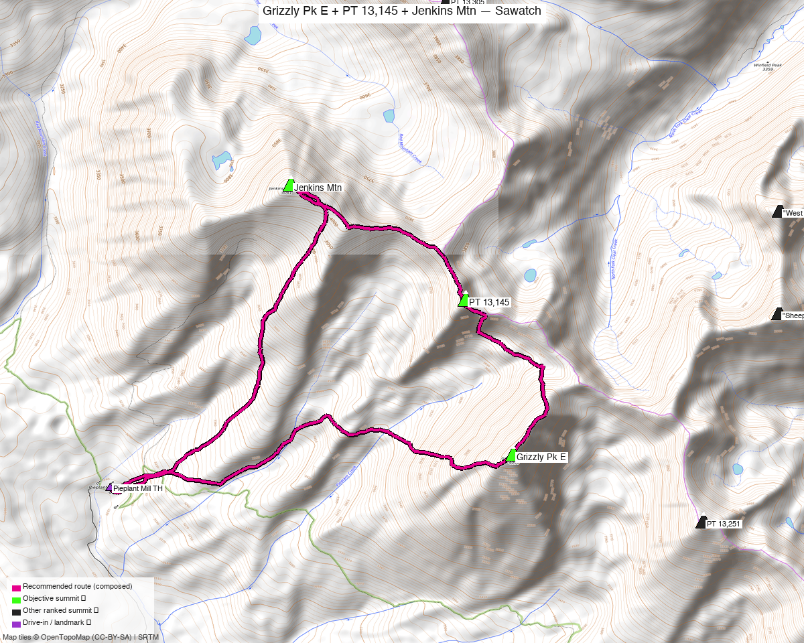

# Grizzly Pk E + PT 13,145 + Jenkins Mtn — Sawatch

<!-- QUICKSTATS_START -->

!!! tip "At a glance — recommended day"
    **7.5 mi** · **4,441 ft** gain · **Class 2+** · 3 peaks · ~4.2 h drive

<!-- QUICKSTATS_END -->

**Researched:** 2026-06-09

!!! weather ""
    **NOAA weather link:** [Grizzly Pk E + PT 13,145 + Jenkins Mtn Weather](https://forecast.weather.gov/MapClick.php?lat=38.96511&lon=-106.54299)

!!! map ""
    **CalTopo research map:** https://caltopo.com/m/38DBF6E

**Status in DB:** all unclimbed.

> **Which "Grizzly Peak"?** This is **Grizzly Peak E (13,309')** — the Pieplant/Taylor Park summit that links with Jenkins and PT 13,145 — **not** Grizzly Peak A (13,997', the famous near-14er near Independence Pass, a separate outing ~6 mi north).

<!-- PROVENANCE_START -->
*Note: the recommended route was distilled from **14 recorded GPS tracks** of real trips (14ers.com · ListsofJohn · peakbagger · Kyle's recordings) — all layered on the [interactive CalTopo research map](https://caltopo.com/m/38DBF6E).*
<!-- PROVENANCE_END -->

---

<!-- CLIMBERS_START -->
**Other climbers:** Emily Sharpe — not yet · Shawn D Keil — not yet
<!-- CLIMBERS_END -->

## Peaks covered

The three form a **N→S ridge chain**: Jenkins (north) → PT 13,145 (0.7 mi) → Grizzly Pk E (1.0 mi), climbed as one loop from Pieplant. (Nearby **["Lake Fork Pk"](lake_fork_peak.md)** — once bundled here as an optional 4th — is now its own report; it sits 5.6 mi north with a separate approach.)

| | [Jenkins Mtn](https://www.14ers.com/peaks/10754) | [PT 13,145](https://www.14ers.com/peaks/10807) | [Grizzly Pk E](https://www.14ers.com/peaks/10778) |
|---|---|---|---|
| Elevation | 13,440' | 13,145' | 13,309' |
| Lat / Lon | 38.96511, −106.54299 | 38.95539, −106.52653 | 38.94244, −106.52203 |
| Class | 2 | 2 | **2+** (boulder/talus) |
| CO Rank | 297 | 531 | 393 |
| Also known as | — | UN 13145 / "UN 13140 B" | (pre-LiDAR 13,281) |
| 14ers.com | [10754](https://www.14ers.com/php14ers/peak.php?peakid=10754) | [10807](https://www.14ers.com/php14ers/peak.php?peakid=10807) | [10778](https://www.14ers.com/php14ers/peak.php?peakid=10778) |
| LoJ | [370](https://listsofjohn.com/peak/370) | [666](https://listsofjohn.com/peak/666) | [515](https://listsofjohn.com/peak/515) |
| peakbagger | [15652](https://peakbagger.com/peak.aspx?pid=15652) | [84735](https://peakbagger.com/peak.aspx?pid=84735) | [55291](https://peakbagger.com/peak.aspx?pid=55291) |
| Peak DB id | 370 | 666 | 515 |

---

## Recommended route — Jenkins + PT 13,145 + Grizzly E loop from Pieplant ⭐

The standard outing: a **counter-/clockwise loop from the Pieplant Mill site** taking in all three. Per climb13ers, the loop is **9.15 mi / 4,810'** (GPX tracks below range ~7.5–9 mi and ~5,300–6,800', depending on line and how directly the ridge is followed). **Class 2+** overall — the "+" is Grizzly E's boulder-talus.

| | |
|---|---|
| Peaks | Jenkins Mtn + PT 13,145 + Grizzly Pk E |
| Distance / gain | **~9 mi / ~4,800–5,300'** loop |
| Class | 2+ (Grizzly E boulder/talus; an ice axe is worth carrying early season) |
| Terrain | tundra low, then a difficult ridge section, a talus-filled gully, and relentless boulder-talus up high |
| Trailhead | **Pieplant Mill site (~10,200')** |

### Route sequence
1. From the **Pieplant Mill site**, walk the **old mining road north** up to the Pieplant Mine (~10,800').
2. At about **11,000'**, leave the roadbed and head **NE up an intermittent drainage**, then angle **SE** onto a minor ridge/slope that joins the **south ridge of Jenkins**.
3. Follow the south ridge (tundra giving way to rock) to where it meets the east ridge; turn NW over chiprock/talus to the **Jenkins summit (13,440')** — ~2.5–3 hr from the TH.
4. **Continue south along the connecting ridge** over **PT 13,145** and on to **Grizzly Pk E (13,309')** — this is where the day earns its Class 2+: a tricky ridge section, a talus gully, and sustained boulder-hopping.
5. Descend Grizzly's slopes back toward Pieplant to close the loop (or reverse the ridge).

> **Direction:** most parties go Jenkins-first (north end) then traverse south to Grizzly. Either way it's a loop back to Pieplant.

---

## Getting there — Pieplant Mill site

| | |
|---|---|
| **Drive from Boulder** | **[~4h 15m via Google Maps](https://www.google.com/maps/dir/?api=1&origin=1162+Peakview+Circle,+Boulder,+CO+80302&destination=38.9398,-106.5600)** (origin: 1162 Peakview Circle). climb13ers: "over four hours" for Front Range or West Slope climbers. |
| Trailhead | **Pieplant Mill site**, ~38.9398, −106.5600, **~10,200'**, NE of Taylor Park Reservoir. |
| Access | From Gunnison: US-50 → SH-135 to Almont → **FR 742** (Taylor Canyon) to Taylor Park Reservoir, then continue **north on FR 742 (east side) ~6.5 mi** to the Pieplant turnoff/mill. From the Front Range, the shorter line is via Buena Vista + **Cottonwood Pass** (seasonal) into Taylor Park. |
| Vehicle | **Higher-clearance 2WD is enough — 4WD not required** to the mill site (per climb13ers). |
| Land | **All public National Forest** — GMUG NF (Jenkins, Grizzly E), Pike & San Isabel NF (PT 13,145). **No wilderness, no permits, no fees** (confirmed on peakbagger "Land" fields). |

---

## Gear & season

- **Best window:** **July through September.** High Sawatch; the Pieplant/Taylor Park roads and Cottonwood Pass open late spring, and north-facing gullies hold snow into early summer.
- **Crux is terrain, not technical:** sustained boulder-talus and a talus-filled gully on the Jenkins→Grizzly ridge — slow, ankle-aware going. **Carry an ice axe early season** for the gully (climb13ers recommends one).
- **Storms:** a long, exposed ridge day — start early and be off the crest by early afternoon.
- **Cell coverage:** no submitted 14ers.com reception reports for these summits or the Pieplant TH; the Pieplant/Taylor Park drainages are **likely dead** (deep valleys NE of the reservoir) — summits may catch intermittent signal but treat it as unreliable. Carry an **InReach / satellite messenger** — remote trailhead, long loop.

---

## Other considerations

**Adding "Lake Fork Pk"?** It's now its own report — **[Lake Fork Pk](lake_fork_peak.md)**. It sits 5.6 mi north of Jenkins with a separate approach (no trail links it to the trio), so it's a distinct outing rather than a 4th peak on this loop. A fit party *can* tack it on as a long ~13–15 mi day, but it's more efficient on its own — see that report for the standard line.

---

## Trip reports & GPX (all sources)

**Sources confirmed logged in:** 14ers.com ("letsgocu"), listsofjohn.com (logged in), peakbagger.com ("Kyle Knutson"). **11 GPX tracks** swept (7 from the 14ers library, 4 from LoJ) — all layered on the CalTopo map, colored by source.

### 14ers.com GPX library (logged in, "letsgocu")
The trio is well-covered by recent uploads:

| Track | Peaks | Year |
|---|---|---|
| "2nd annual broncothon – Jenkins, 13145, grizzly" | trio (+extras) | 2025 |
| "Jenkins-13145-Grizzly" | trio | 2025 |
| "Jenkins Moun #1" | trio | 2021 |
| trip 14059 | Savage + Grizzly + 13145 | 2013 |
| "Meet me in the Middle – Sawatch trio" / rachel upload | Lake Fork (+ Middle Mtn) | 2013 / 2024 |

### listsofjohn.com (logged in)
| GPX | Peaks |
|---|---|
| [TR 1803](https://listsofjohn.com/tr?Id=1803) | **all three** (Jenkins + 13,145 + Grizzly E) |
| [TR 5603](https://listsofjohn.com/tr?Id=5603) | Jenkins + PT 13,145 |
| [TR 5670](https://listsofjohn.com/tr?Id=5670) | Grizzly Pk E |
| [TR 26979](https://listsofjohn.com/tr?Id=26979) | Jenkins + PT 13,145 + **Lake Fork** (the optional-4th proof) |
| [TR 16363](https://listsofjohn.com/tr?Id=16363) | Lake Fork Pk |

### peakbagger.com (logged in, "Kyle Knutson")
Peak pages verified for all four (Jenkins 15652, Grizzly E 55291, PT 13,145 = "Peak 13144" 84735, Lake Fork = "Peak 13331" 15841); used to **confirm land ownership** (all public NF). No downloadable ascent GPX on these pages.

### climb13ers.com
Route beta for all peaks: [Jenkins South Ridge](https://www.climb13ers.com/colorado-13ers/jenkins-mountain) · [Grizzly Pk E NE Ridge](https://www.climb13ers.com/colorado-13ers/grizzly-peak--grizzly-peak-e) · ["Lake Fork Peak"](https://www.climb13ers.com/colorado-13ers/un-13322--lake-fork-peak). The Grizzly E page documents the **Jenkins–UN13,140–Grizzly loop** (9.15 mi / 4,810').

**Sources checked:** 14ers.com ✓ (logged in, "letsgocu") · listsofjohn.com ✓ (logged in) · peakbagger.com ✓ (logged in, "Kyle Knutson") · climb13ers.com ✓
