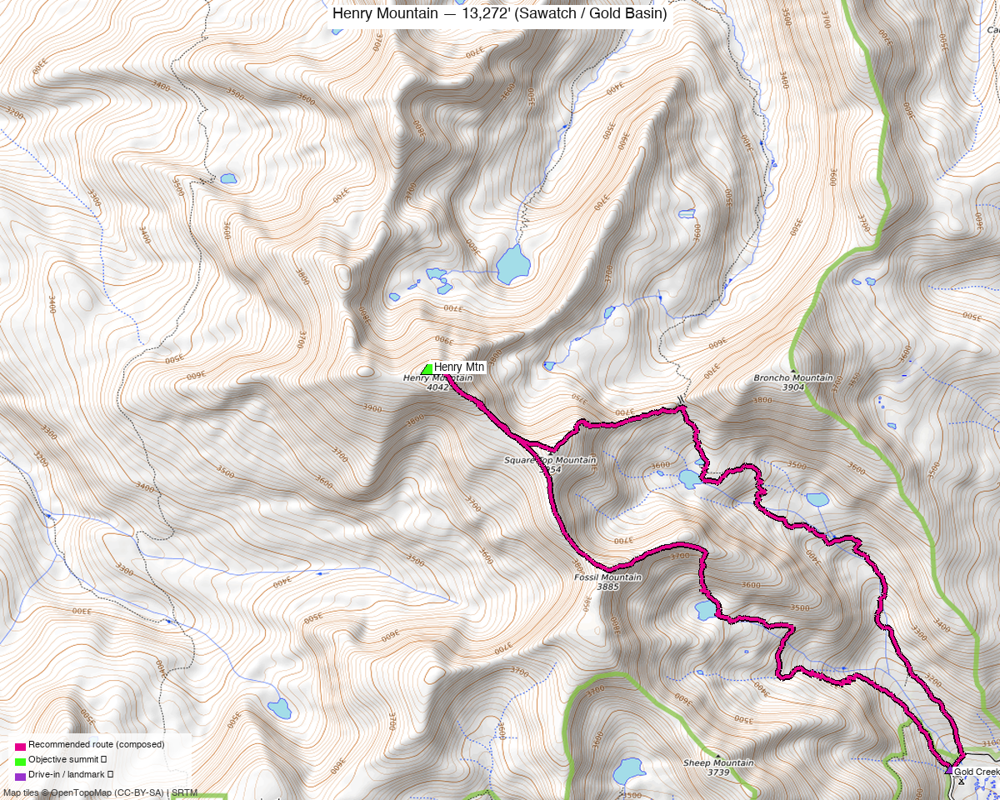

<!-- CLIMBERS_START -->
**Other climbers:** Emily Sharpe — not yet · Shawn D Keil — not yet
<!-- CLIMBERS_END -->

# Henry Mountain — 13,272' (Sawatch / Gold Basin)

<!-- QUICKSTATS_START -->

!!! tip "At a glance — recommended day"
    **9.3 mi** · **3,666 ft** gain · **Class 2** · 1 peak · ~5 h drive

<!-- QUICKSTATS_END -->

**Researched:** 2026-07-22

!!! weather ""
    **NOAA weather link:** [Henry Mountain Weather](https://forecast.weather.gov/MapClick.php?lat=38.69&lon=-106.62)

!!! map ""
    **CalTopo research map:** <https://caltopo.com/m/P01ARC3>

**Status in DB:** unclimbed. A ranked (CO #424), **Class 2** summit at the head of the
Gold Creek drainage NE of Gunnison. A moderate day via Gunsight Pass — no technical
terrain, just distance. Natural pair with nearby [Fairview Peak](fairview_peak.md).

<!-- PROVENANCE_START -->
*Note: the recommended route was distilled from **6 recorded GPS tracks** of real trips (ListsofJohn · peakbagger) — all layered on the [interactive CalTopo research map](https://caltopo.com/m/P01ARC3).*
<!-- PROVENANCE_END -->

---

## The peak

A **Class 2 tundra-and-talus day** from the Gold Creek trailhead, climbing over
**Gunsight Pass** into the upper basin below Henry — **~9.3 mi / ~3,670 ft** round trip.
The distance and altitude are the work; there's no scrambling.

| | [Henry Mtn](https://www.14ers.com/peaks/10784) |
|---|---|
| Elevation | 13,272' |
| Lat / Lon | 38.6856, −106.6211 |
| Route | Gold Creek → Gunsight Pass → E slopes |
| Class | 2 |
| CO rank | #424 |
| listsofjohn.com | [541](https://listsofjohn.com/peak/541) |
| peakbagger.com | [5758](https://peakbagger.com/peak.aspx?pid=5758) |

---

## Recommended route — Gold Creek + Gunsight Pass ⭐

The composed line follows a recorded track from the Gold Creek trailhead over Gunsight
Pass to the summit — **~9.3 mi · ~3,670 ft, Class 2**.

### Route sequence
1. From the **Gold Creek / Gold Basin SE TH (~10,060')**, follow the trail up the Gold
   Creek drainage toward **Gunsight Pass (~12,100')**.
2. From the pass, contour/climb west into Henry's upper basin and up **grass and talus
   slopes** to the **summit (13,272')** — Class 2, straightforward.
3. Reverse the route.

---

## Getting there — Gold Creek / Gold Basin TH

| | |
|---|---|
| **Drive from Boulder** | **[~5h via Google Maps](https://www.google.com/maps/dir/?api=1&origin=1162+Peakview+Circle,+Boulder,+CO+80302&destination=38.6559,-106.5756)** — via US-285 / US-50 to Gunnison, then up the **Gold Creek Rd (FR 771)** system to the SE trailhead. |
| Trailhead | **Gold Creek / Gold Basin SE TH, ~10,060'.** The access road is unpaved; high-clearance helps but the trailhead is more accessible than Fairview's upper-basin start. |
| Land | **GMUG NF** — no permits/fees; not designated wilderness. |

---

## Gear & season

- **Best window:** **July–September** — Gunsight Pass and the upper basin hold snow into
  early summer.
- **Terrain:** Class 2 trail, tundra, and talus — no scrambling; the day is about
  distance and altitude.
- **Storms:** a long day with sustained time above treeline over Gunsight Pass — start
  early, turn around for weather.
- **Cell:** unreliable in the Gold Creek drainage; carry an **InReach**.

---

## Other considerations

- **Longer northern approaches exist** (~17 mi from the Henry Lake / north side) — the
  Gold Creek / Gunsight Pass line is much shorter and the standard way.
- **Pair with Fairview Peak:** [Fairview](fairview_peak.md) is ~4.6 mi east in the same
  Gold Basin / Gold Creek system — an easy two-summit weekend, though each has its own
  trailhead and this report keeps them separate.

---

## Trip reports & GPX (all three sources swept)

**Sources confirmed logged in:** 14ers.com ("Basin"), listsofjohn.com ("letsgocu"),
peakbagger.com ("Kyle Knutson"). **6 tracks** — 5 from listsofjohn TRs, 1 from a
peakbagger ascent (14ers-library tracks deduped against these). All layered on the
[research map](https://caltopo.com/m/P01ARC3); recommended route magenta.

**listsofjohn.com** — Henry (peak 541) trip reports: the Gold Creek / Gunsight Pass line
(~9–10 mi) plus longer ~17-mi northern approaches.

**peakbagger.com** — 1 ascent track via Gold Creek (the recommended line).

**14ers.com** — library tracks (deduped against the LoJ/peakbagger set).

**Sources checked:** 14ers.com · listsofjohn.com · peakbagger.com · climb13ers.com
