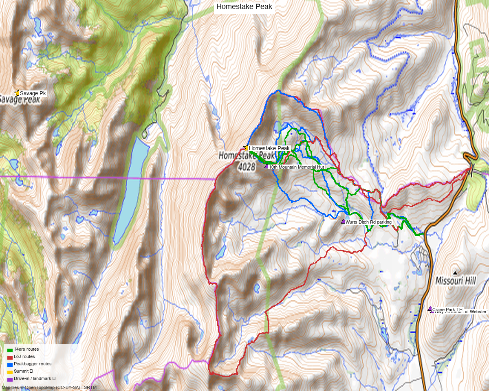

# Homestake Peak (Sawatch Range / Holy Cross Wilderness)

**Researched:** 2026-05-28
**CalTopo research map:** https://caltopo.com/m/V4D61FV
**Status in DB:** 0 ascents (unclimbed). **Cluster status:**
- ✗ **Savage Peak 5.72 mi unclimbed** ← also on Kyle's "do" list. See Multi-peak combo section below.
- ✓ Done nearby (Holy Cross / Sawatch): Whitney Pk (5.37 mi), Fancy Pk (5.99), PT 13,786 (6.85), PT 13,253 (7.16), Holly Cross Ridge (7.38), Mt of the Holy Cross 14er (7.74)
- **No nearby ranked partner climbed via Homestake's standard TH** — Galena Mtn (12,900', sub-13k) is the closest peer reachable on the same day from Wurts Ditch, but doesn't count
- **Effectively a standalone day** in standard execution; see Multi-peak section for the Homestake + Savage hypothetical

---

## Quick stats

| | Homestake Peak |
|---|---|
| Elevation | 13,217' (LiDAR; map 13,209') |
| Lat / Lon | 39.36757, −106.41454 |
| Weather | [NOAA forecast](https://forecast.weather.gov/MapClick.php?lat=39.36757&lon=-106.41454) (same target as 14ers / LoJ / peakbagger weather links) |
| 14ers.com peak page | https://www.14ers.com/peaks/10798/13er-homestake-peak |
| listsofjohn.com | https://listsofjohn.com/peak/596 |
| peakbagger.com | https://peakbagger.com/peak.aspx?pid=16688 |
| Range / Wilderness | Sawatch / Holy Cross Wilderness |
| NF | San Isabel NF + White River NF (boundary peak) |
| Class | 2 |
| Peak DB id | 596 |
| CO Rank | 472 |
| CO Prominence Rank | 170 (Rise 1,485' LiDAR) |
| Counties | Eagle & Lake |
| Quad | Homestake Reservoir |
| Member ascents | 328 (14ers) + 165 (LoJ) |
| 14ers GPX library | [3 entries](https://www.14ers.com/php14ers/gpxlib_locator.php?peakid=10798) |
| 14ers winter ascents | 71 / Ski descents 61 — heavily skied peak |

*[Interactive CalTopo map](https://caltopo.com/m/V4D61FV)*

---

## Recommended route — High TH from Wurts Ditch / 10th Mountain Hut ⭐

Drive as far up Wurts Ditch Road as conditions allow. From the 10th Mountain Memorial Hut area, cross the meadow to Slide Lake, gain the west ridge, summit. The classic short approach.

| Route | Stats |
|---|---|
| Difficulty | Class 2 (some snow/cornice navigation in winter per Burks 5/2025) |
| Distance | **7.8 mi RT** (avalletta 11/16/2012 — drove 0.8 mi up from gate) |
| Gain | **~2,500'** (avalletta) |
| Time | ~5 hours |
| Start elev | ~10,400–10,800' (depends on how far you drive Wurts Ditch Road) |
| Summit | 13,217' |
| Aspect | West to summit via Slide Lake basin |

### Route sequence (per avalletta 11/16/2012 + Burks 5/4/2025)

1. Drive Wurts Ditch Road as far as the gate / your vehicle allows (in winter, gate may be at 10th Mtn Trail/Wurts Ditch Rd jct)
2. Hike road to **10th Mountain Memorial Hut** (when open, the road continues to it as an easy 4WD)
3. From the hut, cross the meadow heading west toward **Slide Lake**
4. Climb directly toward the W saddle of the ridge, through willows + (often) snow
5. Gain the ridge, follow it to summit
6. **Winter caveat (Burks)**: ridge north of Slide Lake had layer of ice under snow near rocks, plus a small cornice to navigate

### Alternate — Low TH from Crane Park / Hwy 24 gate (winter or full hike)

Used by PB ski descender (aid 2444871) — full distance from Hwy 24:

| Stats | Value |
|---|---|
| Distance | **13.6 mi RT** |
| Gain | **3,551'** |
| Start TH | **10,148'** |
| Style | Ski tour to summit, ski descent of ridge ("Great skiing down the ridge today") |

When to use: winter when Wurts Ditch Rd is gated lower, or for the full hike experience.

### Alternate — Tennessee Pass → CD Ridge to Galena Mountain (long ridge day)

jacolc 7/18/2020 covered the section of CD Ridge from Tennessee Pass to Galena Mtn (12,900' — sub-13k, doesn't count as combo). Reference for the connecting terrain but not a recommended Homestake route.

---

## Multi-peak combo: Homestake + Savage Peak (5.72 mi away, also unclimbed)

**Status:** Both peaks on Kyle's "closest 10 under 4,000'" list. Worth evaluating before driving 3h 14m to either.

**Geography:** Savage is on the **west** side of the Continental Divide (Holy Cross / Cross Creek drainage), Homestake on the **east** (Eagle River / Slide Lake). They share the CD ridge but are 5.72 mi apart, separated by intermediate sub-13k bumps and Whitney Peak (13,286' — climbed).

**Same-day combo viability — LOW:**
- **No LoJ or peakbagger TR found combining Homestake + Savage in one outing.**
- Standard TH for each is opposite-side: Wurts Ditch (E) for Homestake, Missouri Lakes / Holy Cross City Rd (W) for Savage
- A ridge traverse would be ~12+ mi between summits across rolling sub-13k terrain — long technical day, not done in any documented TR
- **Conclusion:** treat them as **separate trips with separate trailheads** despite the geographic proximity. The drive time is identical (3h 14m for Homestake, 3h 39m for Savage) but the trailhead approaches face different directions off I-70.

If you want the combo: design a 2-3 day Holy Cross-area backpacking trip (basecamp at Cross Creek / Missouri Lakes) that ridge-walks N over Galena, hits Homestake, descends to Whitney + Savage. Speculative — no TR validates this route.

---

## Trailhead — Wurts Ditch Road (off Hwy 24 north of Leadville)

| | |
|---|---|
| Location | **7 mi north of Leadville off Hwy 24** (heading toward Minturn). Turn west at Webster's Sand and Gravel Pit sign (Carsonite "19"), milepost ~167.5, old yellow road grader at the turn |
| Drive from Boulder | **[3h 14m via Google Maps](https://www.google.com/maps/dir/?api=1&origin=1162+Peakview+Circle,+Boulder,+CO+80302&destination=39.3500,-106.3700)** (origin: 1162 Peakview Circle) |
| Sequence | Hwy 24 → west on FR 19 (1 mi) → right at 19A junction (sign says "Slide Lake" or carsonite "100") → 0.5 mi to small parking spot at 10th Mountain Winter Trail / Wurts Ditch Rd / Mitchell Trail Loop sign → 0.5 mi past old cabin to gate |
| Vehicle | 2WD to the 0.5-mi parking spot in summer; **gate closed in winter** (then ski/snowshoe the road) |
| Beyond gate | Easy 4WD road to 10th Mountain Memorial Hut. In winter "mostly 2-4 inches of snow with a few stretches having more" (avalletta Nov 2012). One chained-up vehicle had packed the snow ahead of him |
| Start elev | ~10,400' (at the parking spot before the gate); ~10,800' (at the hut, if road open) |
| Facilities | None |

### Alt TH — Crane Park (full hike from Hwy 24)
- Used by RyanKowalski 2005 for the winter hut trip approach
- "Winter detour" route to avoid mixing with gravel trucks
- 13.6 mi for the full peak per PB
- Lower start (~10,148')

---

## Conditions / season

- **Best window:** June through October for the dry-road approach. **Ski/winter** (Jan–April) is heavily documented — 71 winter ascents + 61 ski descents on 14ers
- **Snow:** Burks May 2025 had "99% snow coverage on the whole route" with ridge-ice and a small cornice. Late May still very wintery
- **Storms:** Standard Sawatch afternoon storm risk on the ridge — early start needed
- **Wind:** West ridge is exposed; standard layering
- **Winter access:** Wurts Ditch Rd gate likely closed; ski-tour from Hwy 24 (or chain up). 10th Mountain Hut reservations open up the option of basecamping
- **Avalanche:** Slide Lake basin has slide-path terrain in winter (the lake is named that for a reason). Check CAIC before winter trips

---

## Cell coverage

- **14ers.com community DB:** TODO query (Peak Conditions last updated 5/3/2025)
- **Geographic reasoning:**
  - **TH (Wurts Ditch parking, ~10,400'):** likely **weak** — drainage shadowed from Hwy 24 corridor
  - **10th Mtn Hut area:** likely **weak** — meadow basin behind ridge
  - **Slide Lake basin:** likely **dead** — deep cirque
  - **Ridge / summit:** likely **good** — LOS to Leadville (Hwy 24 corridor) and Vail Pass towers
- **Standard recommendation:** carry InReach. Cell drops in the basin, returns on the ridge

---

## Permits / access

- Holy Cross Wilderness — no permits required for day-use
- San Isabel NF / White River NF — no fees
- **10th Mountain Memorial Hut** — reservations via 10th Mountain Hut Association (separate from day-use)
- Standard wilderness rules: leash dogs, no motorized, pack out everything

---

## Trip reports

### 14ers.com (8 reports)

| Date | Title | Notes |
|---|---|---|
| (recent) | "In Winter" | ski/winter ascent |
| | "Leisurely Fall Sawatch Outing" | summer standard |
| | "Home Is Where the Stake Is" | solo (pun-themed title) |
| | "Homestake E Ridge - Leap Day Snowboard Descent" | snowboard descent |
| | "Winter in the Sawatch (Part 1)" | multi-day or winter linkup |
| | "Farewell to Fall" | late-season solo |

(Full list at https://www.14ers.com/php14ers/peak.php?peakid=10798 → Trip Reports)

### listsofjohn.com (7 reports)

| Date | Climber | Stats | GPX | Notes |
|---|---|---|---|---|
| 2025-05-04 | [Nate burks TR 28550](https://listsofjohn.com/tr?Id=28550&pkid=596) | Loop W slope + ridge, 99% snow | — | Late spring, ridge ice + small cornice |
| 2024-06-18 | [guttervan TR 26839](https://listsofjohn.com/tr?Id=26839&pkid=596) | (GPX only) | 16082 | Solo summer |
| 2024-05-11 | [josephnephi TR 26560](https://listsofjohn.com/tr?Id=26560&pkid=596) | (GPX only) | 15822 | Solo |
| 2020-07-18 | [jacolc TR 25176](https://listsofjohn.com/tr?Id=25176&pkid=596) | CD Ridge from Tennessee Pass to Galena | 14874 | Galena (sub-13k) — long ridge day |
| 2013-07-13 | [Alyson Kirk TR 5691](https://listsofjohn.com/tr?Id=5691&pkid=596) | + UN 10910 | 1257 | Solo + bump |
| 2012-11-16 | [avalletta TR 1733](https://listsofjohn.com/tr?Id=1733&pkid=596) | **7.8 mi / 2,500' / 5+ hrs** | — | ⭐ baseline route narrative w/ TH directions |
| 2005-04-16 | [RyanKowalski TR 1511](https://listsofjohn.com/tr?Id=1511&pkid=596) | Hut trip from Crane Park | — | 10th Mtn Hut winter trip |

### peakbagger.com (recent ascents)

| Date | aid | Stats | Notes |
|---|---|---|---|
| (recent) | [2543958](https://peakbagger.com/climber/ascent.aspx?aid=2543958) | (no stats) | — |
| | [2512586](https://peakbagger.com/climber/ascent.aspx?aid=2512586) | (no stats) | — |
| | [**2444871**](https://peakbagger.com/climber/ascent.aspx?aid=2444871) | **3,551' / 13.6 mi from 10,148' TH** | ⭐ Full-hike from Crane Park / Hwy 24. Ski descent. "Great skiing down the ridge today" |
| | [1955519](https://peakbagger.com/climber/ascent.aspx?aid=1955519) | (no stats) | — |

---

## .gpx files (to be downloaded to `gpx/homestake_peak/`)

**LoJ GPX library (all available):**
- `homestake_16082.gpx` — guttervan 6/18/2024 (most recent summer)
- `homestake_15822.gpx` — josephnephi 5/11/2024 spring
- `homestake_14874.gpx` — jacolc 7/18/2020 CD Ridge from Tennessee Pass to Galena
- `homestake_1257.gpx` — Alyson Kirk 7/13/2013

**14ers.com GPX library:** 3 entries at https://www.14ers.com/php14ers/gpxlib_locator.php?peakid=10798

**Generated (to build):**
- `homestake_summit_TH.gpx` — summit + Wurts Ditch parking + 10th Mtn Hut waypoints
- `homestake_route_recommended.gpx` — from guttervan 16082 or josephnephi 15822 (most recent summer baselines)

---

## TL;DR

- **Recommended trip:** **Wurts Ditch Rd → 10th Mtn Hut → Slide Lake → W ridge → summit**. **~8 mi RT, ~2,500' gain, Class 2** when you can drive the 4WD road through. Extends to **13.6 mi / 3,551'** if gate is closed (winter / pre-season)
- **TRULY standalone day** under Kyle's "ranked 13er+ only" combo rule — Galena Mtn (12,900') is the natural ridge neighbor but sub-13k, so it doesn't count
- **Homestake + Savage combo (both unclimbed, 5.72 mi apart):** geographically tempting but **no TR validates it as a same-day combo**. Different drainages. Treat as separate drives unless you want to design a 2-3 day Holy Cross basecamp trip
- **Best season:** June–October for the easy 4WD-in version; **heavy ski touring use** Jan–April with 10th Mtn Hut reservations. Slide Lake basin = avalanche-named terrain
- **TH directions:** Hwy 24 → Webster's Sand and Gravel Pit (mp 167.5) → FR 19 → FR 19A toward Slide Lake → parking before gate
- **Cell:** weak in the basin, good on the ridge. Carry InReach
- **Drive:** **3h 14m from Boulder**

---

**Sources checked:** 14ers.com · listsofjohn.com · peakbagger.com
