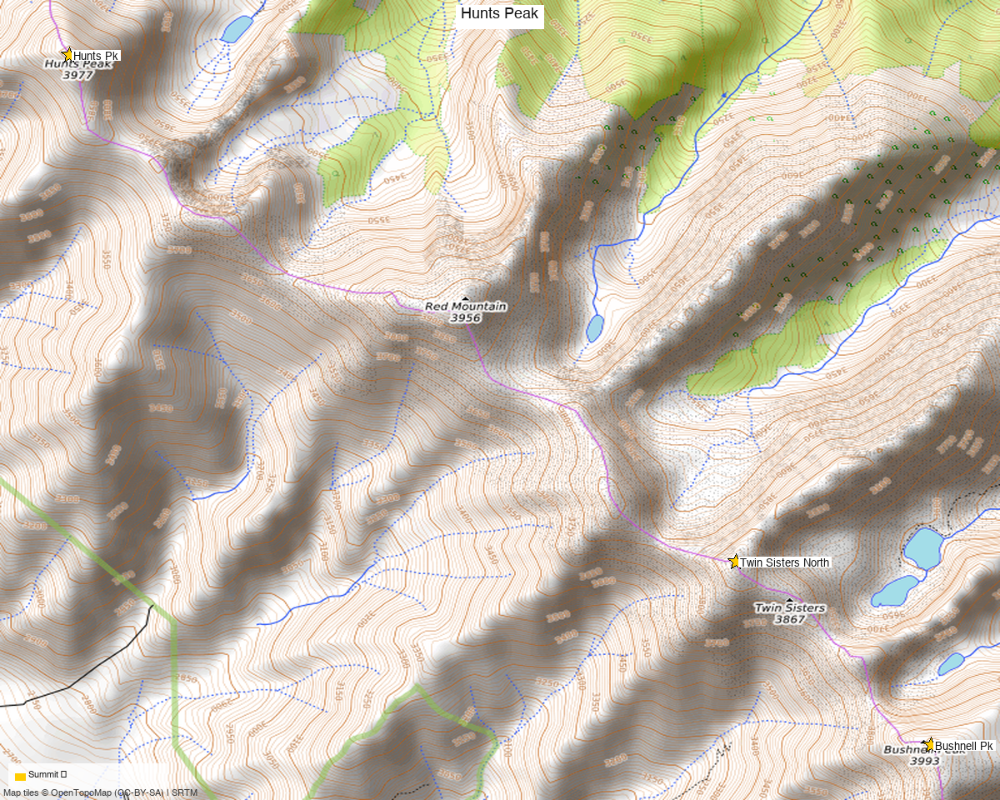

# Hunts Peak (Northern Sangre de Cristo)

**Researched:** 2026-05-21
**CalTopo research map:** TODO (build on map C105AEV — existing Hunts data already layered there)
**Status in DB:** 0 ascents (unclimbed). **Cluster status:**
- ✓ Done nearby (Sangre N tip): Bushnell Pk (4.22 mi), Twin Sisters North (3.19 mi)
- ✗ **No unclimbed ranked 13ers within 8 mi** — Hunts is a true standalone day, no link-up payoff

---

## Quick stats

| | Hunts Pk |
|---|---|
| Elevation | 13,061' (14ers consensus 13,071' on TRs) |
| Lat / Lon | 38.3831, −105.94582 |
| 14ers.com peak page | https://www.14ers.com/peaks/10684/13er-hunts-peak |
| Range / Wilderness | Sangre de Cristo / Sangre de Cristo Wilderness |
| Class (standard) | 2 |
| Peak DB id | 748 |

*[Interactive CalTopo map — TODO]*

---

## Recommended route — West Slopes from Rock Creek TH ⭐

The standard out-and-back. Class 2, half-day, no link-up obligations, no permits.

| Route | Stats (14ers + WildWanderer TR) |
|---|---|
| Difficulty | Class 2 |
| Distance | 6.0 mi RT (TR measured 6.79 mi) |
| Gain | 3,450' (TR measured 3,528') |
| Time | ~4–5 hr solo |
| Aspect | West |

**Burn-zone caveat:** The 2013 Ox-Cart Fire torched the lower route. Bushwhacking is minimal *because* of the burn — visibility is wide open through the standing dead — but expect deadfall on the old road and aggressive wildflower/willow overgrowth in the meadow sections after wet years (WildWanderer was "dripping" to the shins).

### Route sequence (per WildWanderer 5/16/2021)

1. From the TH, cross South Rock Creek (easy log/rock crossing)
2. Walk around the closed gate; follow the old 4WD road NE — many downed trees, but the line is obvious
3. Where the road fizzles out, continue contouring along South Rock Creek, then up the mountainside heading east
4. Steep climb east to gain the ridge (bushwhack is minimal due to burn)
5. SE on the ridge over a hump → continue E along the ridge to summit
6. **Watch your descent ridge in low light** — WildWanderer flags that the ridges look alike returning before sunrise

### Alternate — point-to-point traverse via Hunts Lake (brianr56, 7/12/2022)

12 mi, ~3,890' gain, ~5,000' descent, Class 2 with sketchy "scralus" gully descent. Needs a shuttle (Rock Creek TH → Rainbow Trail / Rainbow Branch / Fremont CR 4). Cool linkup of two valleys but **not recommended** for an efficient half-day — go out-and-back unless you want the experience.

---

## Trailhead — Rock Creek TH

| | |
|---|---|
| Location | Off US 285 in N San Luis Valley, ~12 mi S of Poncha Pass |
| Access road | FR 980 (gravel, 3.65 mi east of US 285) → jct with FR 982 (camping area) → 0.6 mi SE to TH |
| Vehicle | 2WD OK to the camping area at FR 980/982 junction; **last 0.6 mi narrow, two creek crossings, room for ~2 vehicles** — better to park at the camping area on weekends/wet days |
| Start elev | ~9,500' |
| **Seasonal closure** | **Gate on FR 980 closed for Sage Grouse mating season — reopens May 15.** Verify each year before driving in. |
| Facilities | None |
| Trail | Old road behind the closed gate at TH (no vehicle access past gate) |

---

## Conditions / season

- **Best window:** mid-May through October (gate-dependent on the low end)
- **Snow:** WildWanderer reports consolidated patches mid-May, manageable without traction. By mid-June expect mostly dry
- **Storms:** Standard Sangre afternoon storm risk on the long west ridge — get an early start
- **Burn zone:** wet/dripping vegetation after rain; no shade on the ascent
- **Wind:** WildWanderer noted "very cold and very windy" on the summit even in mid-May → bring layers

---

## Cell coverage

- **14ers.com community DB:** 0 reports for both Hunts Pk and Rock Creek TH (no data)
- **Geographic reasoning:**
  - **TH:** likely dead — Rock Creek drainage is tucked behind the W flank of the range
  - **Approach (lower ridge / burn zone):** likely **some signal** as you gain ~11,000'+ and the W aspect opens to the San Luis Valley (Salida ~17 mi N has line-of-sight to the upper ridge)
  - **Summit:** likely **good signal** — Hunts is the obvious high point at the N tip of the range with clean LOS to Salida and US 285 corridor towers
- **Standard recommendation:** carry an InReach. Community data is non-existent for this peak.

---

## Permits / access

- Sangre de Cristo Wilderness — no permits required
- San Isabel National Forest — no fee
- **Sage Grouse seasonal gate closure** — see Trailhead section above
- Day-use only is fine; standard wilderness rules (no motorized, leash dogs, etc.)

---

## Trip reports (14ers.com)

| Date | Source | Stats | Notes |
|---|---|---|---|
| 5/16/2021 | [WildWanderer TR 21037](https://www.14ers.com/php14ers/tripreport.php?trip=21037) | 6.79 mi / 3,528' / 4h20 | **Recommended baseline.** Standard W Slopes from Rock Creek TH, solo. Detailed road + gate notes. **GPX in 14ers library.** |
| 7/12/2022 | [brianr56 TR 21757](https://www.14ers.com/php14ers/tripreport.php?trip=21757) | 12 mi / 3,890' gain | Traverse over Hunts to Rainbow Trail (Hunts Lake gully descent). Class 2 but "scralus" gully. Needs shuttle. |
| 8/11/2021 | Mtnman200 (multi-peak) | 9 pages of photos | Hunts + Red Mtn (12,994) + UN 12,924 + Twin Sisters N + Bushnell — big northern Sangres day |
| 7/26/2020 | astranko "Sangre Traverse" | reference | Multi-day epic, includes Hunts |
| Route info | [14ers W Slopes route](https://www.14ers.com/php14ers/peak.php?peakid=10684&t=routes) | 6 mi / 3,450' / Class 2 | Official route page; 281 member ascents, 11 winter, 2 ski |

**GPX library:** 6 entries for Hunts (1 route + 4 TR tracks + 1 library upload) — all available on the [GPX library locator](https://www.14ers.com/php14ers/gpxlib_locator.php?peakid=10684).

---

## Existing CalTopo data (map C105AEV)

Already layered from prior planning of Bushnell/Twin Sisters:
- **Markers:** Hunts Peak, HuntsPeak1, Bushnell Peak, Twin Sisters North (x3), Trailhead (x2), "drove this far" (x2), "Tree in road1", switchback (x2)
- **Tracks:** Hunts 001, Hunts 002, plus several Kyle Knutson tracks and 62s GPS dumps in the area

→ When building a dedicated Hunts research map, layer in the WildWanderer GPX from the 14ers library on top of this existing data.

---

## TL;DR

- **Recommended trip:** West Slopes out-and-back from Rock Creek TH. **6–7 mi RT, ~3,500' gain, Class 2.** Half-day solo.
- **No link-up payoff** — Bushnell and Twin Sisters N (the only ranked neighbors within 8 mi) are already done. This is a standalone drive-and-bag day.
- **Critical access flag:** FR 980 gate closed for Sage Grouse season → reopens May 15. Confirm gate status before driving the 3+ hours from anywhere.
- **Best season:** mid-May (gate open) through October.
- **Cell:** likely dead at TH, signal returning on the upper ridge with LOS to Salida. No community reports — carry InReach.
- **Existing CalTopo data:** map C105AEV already has Hunts markers + tracks from previous Bushnell/Twin Sisters planning.
