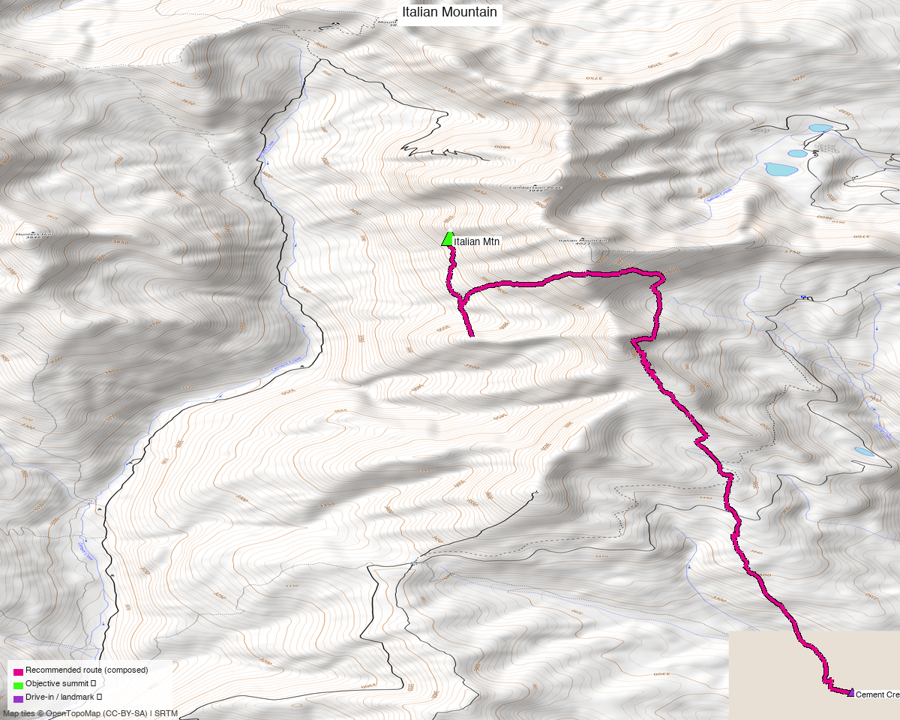

<!-- CLIMBERS_START -->
**Other climbers:** Emily Sharpe — not yet · Shawn D Keil — ✓ climbed
<!-- CLIMBERS_END -->

<!-- QUICKSTATS_START -->

!!! tip "At a glance — recommended day"
    **12.87 mi** · **3,902 ft** gain · **Class 2** · 1 peak · ~5 h drive

<!-- QUICKSTATS_END -->

**Researched:** 2026-07-23

!!! weather ""
    **NOAA weather link:** [Italian Mountain weather](https://forecast.weather.gov/MapClick.php?lat=38.945&lon=-106.752)

!!! map ""
    **CalTopo research map:** <https://caltopo.com/m/31MDF11>

**Status in DB:** unclimbed. A ranked Elk Range 13er (13,385', ~1,357' prominence)
northeast of Taylor Park / south of Pearl Pass — the high point above the head of
Cement Creek. Originally drafted alongside Star + Taylor, but it's a **separate
trailhead and drainage** (Cement Creek, Gunnison side) so it stands as its own climb.

<!-- PROVENANCE_START -->
*Note: the recommended route was distilled from **35 recorded GPS tracks** of real trips (14ers.com · peakbagger · Kyle's recordings) — all layered on the [interactive CalTopo research map](https://caltopo.com/m/31MDF11).*
<!-- PROVENANCE_END -->

---

## Peaks covered

A single **Class 2** Elk Range 13er — tundra and talus, no scrambling above walk-up.
The whole difficulty is **distance, altitude, and the access road**, not the terrain.

| Peak | Elev | Class | Prom | CO rank |
|---|---|---|---|---|
| [Italian Mtn](https://www.14ers.com/peaks/10110) | 13,385' | 2 | ~1,357' | ~#331 |

Italian sits in the **Elk Mountains** (Pearl Pass quad), Gunnison County — GMUG NF, no
wilderness designation at the summit, no permits/fees. Beautiful high wildflower country
at the head of Cement Creek, with a stellar view across to Star Peak.

---

## Getting there — Cement Creek (CR 740)

| | |
|---|---|
| **Drive from Boulder** | **[~5h via Google Maps](https://www.google.com/maps/dir/?api=1&origin=1162+Peakview+Circle,+Boulder,+CO+80302&destination=38.8923,-106.7184)** (origin: 1162 Peakview Circle) — via US-285 / US-50 to Gunnison, north on CO-135, then **CR 740 (Cement Creek Rd)**. |
| **2WD start (this route)** | ~38.8923,-106.7184, **~10,460'** — where the recorded track starts; the sane stopping point for a passenger car / where the road gets rough. |
| **4WD trailhead** | climb13ers' **Cement Creek – Italian Mtn TH** at **10,780'** (N38°56'24.63" W106°46'18.12"), **4×4 / high-clearance recommended** — driving to here cuts the day to ~4 mi / ~2,595 ft RT. |
| Alternate | Without 4WD you can also approach via **FR 759** north of Taylor Park Reservoir. |

---

## Route — Cement Creek to the summit (Class 2)

**~12.9 mi · ~3,900 ft round trip** as recorded from the 2WD start (this is the long
no-4WD haul; **4WD to the higher TH roughly thirds it** — climb13ers has it at ~4 mi /
~2,595 ft). The line follows Cement Creek Rd / the drainage NW up toward the head of the
valley, then climbs Italian's broad **south/southeast slopes** to the summit — Class 2
tundra and talus throughout, no exposure. Return the same way.

climb13ers rates it a Class 2 "medium day, take a lunch." Pair it with the easy sub-13k
**American Flag Mtn** or soft-ranked **Lambertson Peak** just south if you want more —
several recorded parties do the group in one push.

---

## Gear & season

- **Best window:** **July–September** — Cement Creek Rd and the upper basin melt out late;
  wildflowers peak mid-summer.
- **Vehicle:** **high-clearance / 4WD strongly helps** — it's the difference between a
  ~4 mi morning and a ~13 mi day. Passenger cars park low and hike the road.
- **Terrain:** Class 2 the whole way — no rope/axe/crampons in season. Above treeline for
  the upper half; early start, off the summit by early-afternoon monsoon.
- **Cell:** unreliable in the Cement Creek drainage — carry an **InReach**.

---

## Other considerations

**Why the long recorded line instead of the short 4WD figure?** climb13ers' 4 mi / 2,595 ft
is the 4WD version from the 10,780' TH. There's **no recorded GPS track and no public trail
on the South Ridge from that 4WD TH** (the mapped NE "Italian Mountain Trail" off Italian
Creek Rd appears to cross private land), so the honest data-backed recommended line is the
**recorded Cement Creek ascent from the 2WD start** — longer, but real. If you have 4WD,
drive to the 10,780' TH and expect the much shorter climb13ers day.

**Not grouped with Star + Taylor.** An earlier draft bundled Italian with Star + Taylor
Peaks; those are climbed from the **Mt Tilton Trail (end of CO 742)** on the Taylor Park
side — a different road system. Italian is its own trip from Cement Creek.

---

## Trip reports & GPX (all three sources)

**Sources confirmed logged in:** 14ers.com ("Basin"), listsofjohn.com ("letsgocu"),
peakbagger.com ("Kyle Knutson"). Italian's library was swept across all three sources; the
peakbagger ascent track (Cement Creek approach) is the basis for the recommended route,
layered on the [research map](https://caltopo.com/m/31MDF11) with the 14ers-library track.

- **14ers.com:** peak page [10110](https://www.14ers.com/peaks/10110) — GPX-library track present (Mt Tilton / Star-side loop); no formal route description.
- **listsofjohn.com:** peak [420](https://listsofjohn.com/peak/420) — 5 trip reports, text only (no downloadable GPX).
- **peakbagger.com:** peak [16662](https://peakbagger.com/peak.aspx?pid=16662) — ascent GPX (Cement Creek) used for the route.
- **climb13ers.com:** [Italian Mountain South Ridge](https://www.climb13ers.com/colorado-13ers/italian-mountain) — Class 2 route + trailhead beta.

**Sources checked:** 14ers.com ✓ (logged in, "Basin") · listsofjohn.com ✓ (logged in, "letsgocu") · peakbagger.com ✓ (logged in, "Kyle Knutson")
