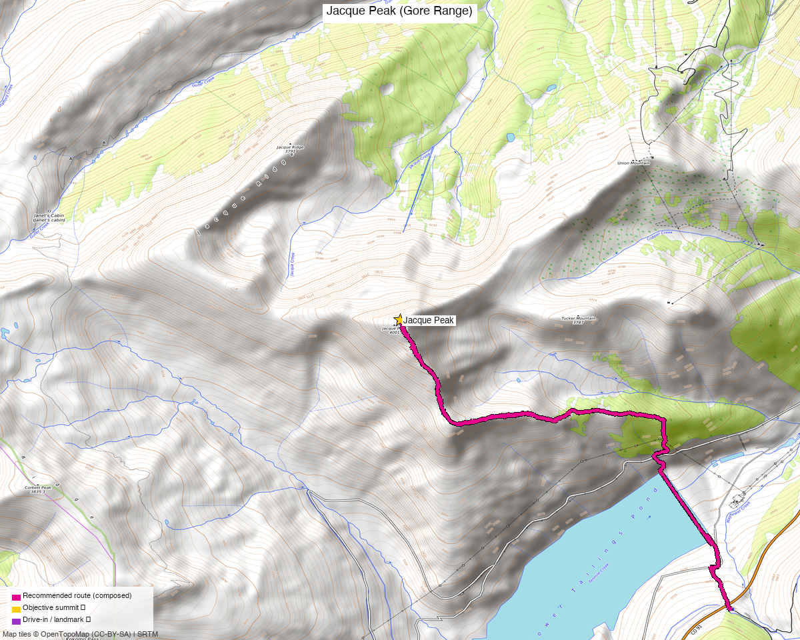

# Jacque Peak (Gore Range)

<!-- QUICKSTATS_START -->

!!! tip "At a glance — recommended day"
    **7.5 mi**

<!-- QUICKSTATS_END -->

*Written for **Shawn** — peak unclimbed on his 13er checklist.*

**Researched:** 2026-05-28 (base) / 2026-06-05 (Shawn)
**CalTopo research map:** https://caltopo.com/m/R2NF0S2
**Status for Shawn:** **Unclimbed.** CO Rank 482, ranked and prominent (Rise 2,296').

<!-- PROVENANCE_START -->
*The recommended route was distilled from **12 recorded GPS tracks** of real trips (recorded trips) — all layered on the [interactive CalTopo research map](https://caltopo.com/m/R2NF0S2).*
<!-- PROVENANCE_END -->
*[Interactive CalTopo map](https://caltopo.com/m/R2NF0S2)*

---

<!-- CLIMBERS_START -->
**Other climbers:** Emily Sharpe — not yet · Kyle Knutson — ✓ climbed
<!-- CLIMBERS_END -->

## Quick stats

| | Jacque Peak |
|---|---|
| Elevation | 13,212' (LiDAR; map 13,205') |
| Lat / Lon | 39.45485, −106.19713 |
| Weather | [NOAA forecast](https://forecast.weather.gov/MapClick.php?lat=39.45485&lon=-106.19713) |
| 14ers.com peak page | https://www.14ers.com/peaks/10229/13er-jacque-peak |
| listsofjohn.com | https://listsofjohn.com/peak/603 |
| peakbagger.com | https://peakbagger.com/peak.aspx?pid=5781 |
| Range / NF | Gore Range / White River NF (NOT in Eagles Nest Wilderness) |
| Class (standard) | 2 |
| CO Rank | 482 |
| CO Prominence Rank | 58 (Rise 2,296' — high prominence!) |

---

## Drive + trailhead (from Edgewater)

| | |
|---|---|
| **Drive from Edgewater** | **[~1h 50m via Google Maps](https://www.google.com/maps/dir/?api=1&origin=Edgewater,+CO+80214&destination=39.4914,-106.1568)** (~76 mi, I-70 W → Exit 195) |
| Primary trailhead | Copper Mountain Resort base village, I-70 Exit 195 |
| Vehicle | Anything — paved to base village |
| Start elev | ~9,712' (base village) |
| Parking | Free in summer. In ski season: interior lots free before 8:30am and after 2pm; pick up a hangtag at the Mammut Store when you get your uphill armband |
| Facilities | Full village amenities (food, restrooms, water) in season |

### Alt TH — CO 91 / Graveline Gulch

| | |
|---|---|
| Location | East side of CO 91, ~1.5 mi south of Copper exit, across from closed mine |
| Drive from Edgewater | **[~1h 50m via Google Maps](https://www.google.com/maps/dir/?api=1&origin=Edgewater,+CO+80214&destination=39.3938,-106.1469)** (similar to Copper) |
| Start elev | ~10,500' |
| Parking | Side of CO 91 — park *before* the concrete barriers (mine has aggressive No Parking enforcement) |

---

## Recommended route — Copper Mountain base ⭐

Up through Copper ski terrain, over Union Mountain (12,313'), then long ridge walk + boulder hop to Jacque's summit. The most common modern approach.

> ⚠️ **During active ski season (roughly mid-November through early May):** hiking through Copper ski terrain requires **mandatory annual uphill registration** + visible armband. Free for Copper Season Pass or Ikon Pass holders — but you must still register online and pick up the armband at the Mammut Store in Center Village before going. Route 1 (Aerie/PHQ, the relevant approach) is **mornings only, 5am–8:30am**, and you must descend the same route. Details: [Copper uphill access page](https://www.coppercolorado.com/events-activities/winter-activities/uphill-access/).
>
> Once the ski lifts close for the season (typically early May), the terrain reverts to standard USFS access — **no registration, no restrictions, hike freely**.

| Route stat | Value |
|---|---|
| Difficulty | Class 2 (talus/boulder fields; one short section of "actual climbing" per Gaab) |
| Distance | ~10.2 mi RT |
| Gain | ~3,500' |
| Time | ~3h (fast) to ~5.5h (typical) |
| Start elev | ~9,712' |

**Route sequence:**
1. Park at Copper Mountain base (I-70 Exit 195) — free summer lots
2. Hike up under Woodward Express lift (easy ski-run grading)
3. Over Union Mountain (12,313') — gentle ridge
4. Continue west along broad ridge above Copper Bowl
5. Long talus/boulder hop to summit (false summit first — Stratmoen flags it)
6. Descend the same way, or drop down Copper ski runs for a shortcut

---

## Alternates

**Graveline Gulch from CO 91** — ~7.5 mi RT, 3,700–4,000', ~5.5h
- Shorter mileage than Copper side; no ski-area crossing
- Game trail on climbers' right most of the way (Lochary 4/10/2026)
- ⚠️ Park *before* the concrete mine barriers on CO 91

**Winter via Copper ski terrain:** requires **mandatory annual registration** + visible armband. Free for Copper Season Pass or Ikon Pass holders — register online, pick up armband ($5 new) at the Mammut Store in Center Village. Non-pass holders can purchase an Uphill Access Pass. Must use designated routes only; **Route 1 (Aerie/PHQ, 2,210 ft) is mornings only, 5am–8:30am**, and you must descend the same route. Details: [coppercolorado.com/events-activities/winter-activities/uphill-access/](https://www.coppercolorado.com/events-activities/winter-activities/uphill-access/)

**Winter (skip the ski area):** Graveline Gulch from CO 91 is the cleanest option — no registration needed. Mayflower Gulch crosses the tailings pond, confirmed trespassing (Westra 3/16/2025), don't do it.

**Don't bother:** Searle Gulch is no longer viable due to active mining (per Stratmoen).

---

## Conditions / season

- **Best window:** late June through October
- **Afternoon storms:** exposed west ridge — start early
- **Winter:** Copper route requires uphill registration (free for Copper/Ikon pass holders, mandatory armband, mornings only 5am–8:30am on Route 1). Graveline Gulch (CO 91) avoids the ski area entirely — multiple winter PB ascents on record via both options

---

## Cluster / combo note

No same-drainage ranked 13er link-up: Bartlett Mtn (5.74 mi, the only nearby ranked peak) is across Climax Mine / Fremont Pass — a completely different drive. Tucker, Union, and Copper Mountain are all sub-13k. **Effectively a standalone day** for a ranked-peak tick.

---

## Cell coverage

- **Copper base village:** strong signal (full resort coverage)
- **Copper Bowl approach:** strong (east-facing ski terrain)
- **West ridge / summit:** good — line-of-sight to I-70 corridor towers (Vail, Frisco, Copper)
- Carry InReach as standard; coverage should be solid the Copper side

---

## Permits / access

- White River NF — no permits, no fees
- NOT in Eagles Nest Wilderness
- ⚠️ CO 91 / Graveline: park before the mine barriers; don't cross the mine boundary

---

## Trip reports

*Data from Kyle's research (2026-05-28) — within 2 weeks, reused as-is.*

### 14ers.com (15 reports)

| Date | Source | Notes |
|---|---|---|
| 7/10/2025 | [mountain_guy TR 23116](https://www.14ers.com/php14ers/tripreport.php?trip=23116) | "Jacque Peak and Friends — A Day in the Southern Gore Range" — multi-peak |
| 7/10/2024 | [Peaks4Days TR 22610](https://www.14ers.com/php14ers/tripreport.php?trip=22610) | "Jacque Peak Loop" — solo loop |
| 7/10/2024 | [WildWanderer TR 22609](https://www.14ers.com/php14ers/tripreport.php?trip=22609) | "From Copper Mountain Ski Area" — Jacque + Union (standard modern route) |
| 9/4/2022 | [d_baker TR 21988](https://www.14ers.com/php14ers/tripreport.php?trip=21988) | "My Summer Vacation" — big multi-peak day |
| 7/21/2019 | [supranihilest TR 19639](https://www.14ers.com/php14ers/tripreport.php?trip=19639) | "Jacquerebleu" — Jacque + Copper trifecta |
| 7/1/2017 | [rajz06 TR 17861](https://www.14ers.com/php14ers/tripreport.php?trip=17861) | "Just Between Jacque et Moi" — Jacque + Copper trifecta |
| 9/18/2016 | [WillRobnett TR 17481](https://www.14ers.com/php14ers/tripreport.php?trip=17481) | "Gore Range 13ers" — 10-peak mega-traverse including ranked peaks |
| 6/29/2016 | [dillonsarnelli TR 17183](https://www.14ers.com/php14ers/tripreport.php?trip=17183) | "Jacque to Music, and Some Extra Credit" — Jacque + Music + Savage |
| 11/3/2012 | [piper14er TR 13115](https://www.14ers.com/php14ers/tripreport.php?trip=13115) | "Jacque-ularity" — Copper trifecta |
| 5/26/2012 | [milan TR 11905](https://www.14ers.com/php14ers/tripreport.php?trip=11905) | "Mosquito Memorial" — Jacque + Tweto + Mosquito + Pennsylvania + W Buffalo |
| 4/22/2012 | [skiingrock TR 11674](https://www.14ers.com/php14ers/tripreport.php?trip=11674) | "Duffy's Rage" — solo ski |
| 7/30/2011 | [BobbyFinn TR 10818](https://www.14ers.com/php14ers/tripreport.php?trip=10818) | "Jacque the Long Way" — solo |
| 7/22/2010 | [kaiman TR 8587](https://www.14ers.com/php14ers/tripreport.php?trip=8587) | "Jacque Peak via Copper Creek" — solo |
| 11/11/2007 | [stevevets689 TR 3984](https://www.14ers.com/php14ers/tripreport.php?trip=3984) | "Tour de Tucker Gulch" — solo |
| pre-2007 | [TR 2986](https://www.14ers.com/php14ers/tripreport.php?trip=2986) | "Jacque Peak Take 2: A Postcard Day" |

### listsofjohn.com (6 reports)

| Date | Climber | Stats | Style |
|---|---|---|---|
| 2025-10-09 | [Andrew Wahr TR 29420](https://listsofjohn.com/tr?Id=29420&pkid=603) | 11-peak Vail Pass ridge traverse | Mega ridge day, sub-13k partners only |
| 2024-07-30 | [josephnephi TR 27037](https://listsofjohn.com/tr?Id=27037&pkid=603) | Jacque + Copper + Tucker + Union | Copper trifecta, sub-13k partners |
| 2021-08-30 | [PaulStratmoen TR 20181](https://listsofjohn.com/tr?Id=20181&pkid=603) | Jacque + Union, via Woodward Express | Ski-area route |
| 2017-12-28 | [jacolc TR 27210](https://listsofjohn.com/tr?Id=27210&pkid=603) | **8.2 mi / 4k' / 9h46** winter | Copper trifecta winter |
| 2012-11-03 | [avalletta TR 1721](https://listsofjohn.com/tr?Id=1721&pkid=603) | **7.5 mi / 3,700' / 5.5h** Graveline Gulch | CO 91 start, sub-13k partners |
| 2008-11-01 | [RyanKowalski TR 1548](https://listsofjohn.com/tr?Id=1548&pkid=603) | **7.5 mi / 4,000'** Jacque + Copper | CO 91 start |

### peakbagger.com (193 members ascended; 5 recent ascents detailed)

| Date | Climber | Stats | Notes |
|---|---|---|---|
| 2026-04-10 | [Michael Lochary](https://peakbagger.com/climber/ascent.aspx?aid=3161419) | — | Graveline Gulch. **"nice game trail on the climbers right most of the way"** |
| 2025-08-23 | [Lee Newton](https://peakbagger.com/climber/ascent.aspx?aid=2956076) | **3,422' / 9.8 mi / 5h29** | Single Jacque, from ~Copper base |
| 2025-08-08 | [Alex Gaab](https://peakbagger.com/climber/ascent.aspx?aid=2934720) | **3,500' / 10.2 mi / 3h** | Copper Mountain. "Long scrambles, a few actual climbing spots, but never anything truly dangerous, rock was stable" |
| 2025-03-16 | [Xander Westra](https://peakbagger.com/climber/ascent.aspx?aid=2784737) | **2,249' / 9.1 mi / 7h14** from 10,963' TH | Mayflower Gulch. ⚠️ crossed tailings pond — "do not recommend, learned it is trespassing." |
| 2025-06-22 | [Jack Murdoch](https://peakbagger.com/climber/ascent.aspx?aid=2879347) | — | — |

---

## TL;DR

~10 mi RT, ~3,500', Class 2 from Copper Mountain base (I-70 Exit 195). ~5h typical pace. About 1h 50m from Edgewater. Standalone ranked day — no nearby ranked partners worth the detour. Go early for the exposed west ridge. Graveline Gulch (CO 91) saves mileage if you'd rather skip the ski area.

---

**Sources checked:** 14ers.com · listsofjohn.com · peakbagger.com
