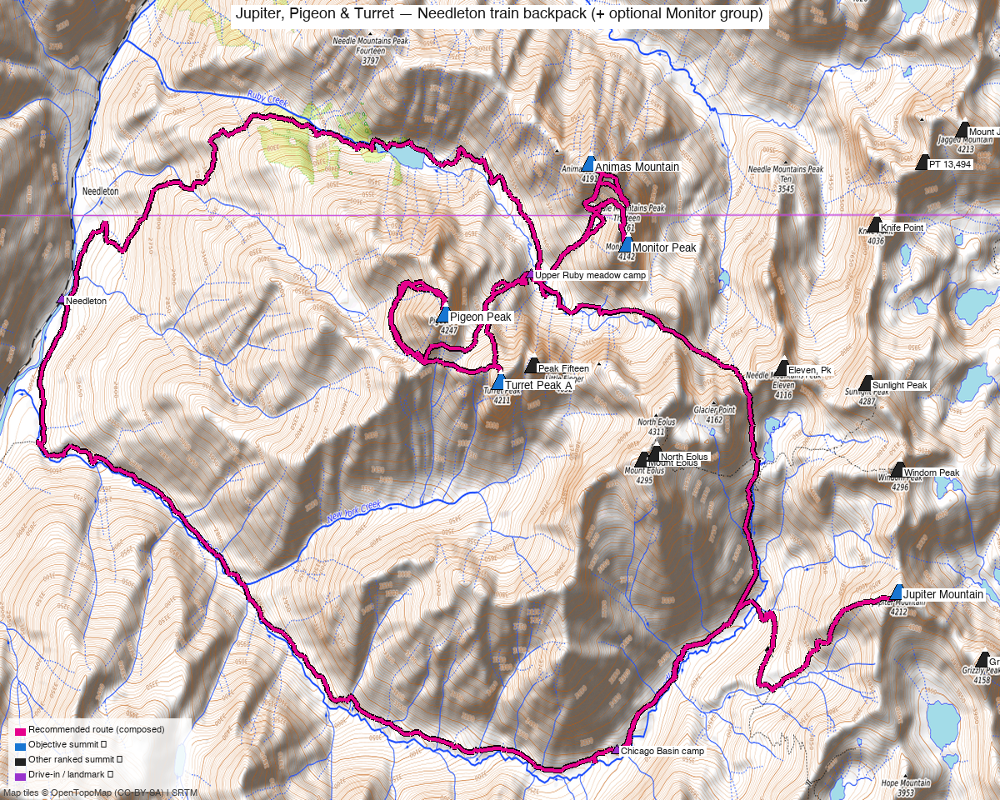

<!-- CLIMBERS_START -->
**Other climbers:** Kyle Knutson — ✓ all · Shawn D Keil — 3 of 5 (Jupiter Mountain, Pigeon Peak, Turret Peak A)
<!-- CLIMBERS_END -->

# Jupiter, Pigeon & Turret — Needleton train backpack (+ optional Monitor group)

<!-- QUICKSTATS_START -->

!!! tip "At a glance — 3-day trip"
    **5 peaks** · **trip total ~30.4 mi · ~15,809 ft** · **~7.4 h drive**

    - **Pack-in (Needleton → Chicago Basin camp):** **5.9 mi** · **2,643 ft** gain
    - **Day 1 (Jupiter):** **6.4 mi** · **3,051 ft** gain · **Class 2+** · 1 peak
    - **Camp move — Twin Thumbs Pass + Ruby Pass:** **4.2 mi** · **2,378 ft** gain · 1,700 ft descent
    - **Day 2 (Pigeon + Turret):** **4.8 mi** · **4,594 ft** gain · **Class 4** · 2 peaks
    - **Day 3 (Monitor group — optional):** **3.9 mi** · **3,143 ft** gain · **Class 4** · 2 peaks
    - **Pack-out (Ruby camp → Needleton):** **5.2 mi** · 3,640 ft descent

<!-- QUICKSTATS_END -->

*Written for **Emily** — all five unclimbed on her 14ers checklist. Pigeon (CO rank #58), Jupiter (#91) and Turret (#92) are **centennial 13ers**; Animas (#113) and Monitor (#143) are bicentennials. (Ranks = elevation rank among Colorado's ranked 13ers + 14ers.)*

**Researched:** 2026-07-10

!!! tip "Map & weather"
    **CalTopo research map:** https://caltopo.com/m/MU0K4JT

    **Trip NOAA weather:** [Jupiter, Pigeon & Turret Weather](https://forecast.weather.gov/MapClick.php?lat=37.66&lon=-107.63)

**Shareable link (sanitized — safe to forward to anyone):** <https://mtn-share.pages.dev/s/e6d42c6c59b6cda8/> — no names, climbed status, or research maps; expires ~2026-11-08 (regenerate anytime: `share_report.py jupiter_pigeon_turret`)

**Status for Emily:** All **five unclimbed**. Pigeon's mile-high "Matterhorn" face over the Animas is the most dramatic summit profile in the Needles.

<!-- PROVENANCE_START -->
*Note: the recommended route was distilled from **31 recorded GPS tracks** of real trips (14ers.com · ListsofJohn · peakbagger · Kyle's recordings) — all layered on the [interactive CalTopo research map](https://caltopo.com/m/MU0K4JT).*
<!-- PROVENANCE_END -->

---

!!! danger "Class 4 terrain, remote basins, no bail-outs"
    **Pigeon's upper mountain** is sustained Class 3 blocky scrambling with **Roach's
    15-ft Class 4 chimney-slot crux** near the top — solid rock, but exposed and
    route-finding-dependent (off-line it gets harder fast).
    **Monitor (optional day)** crosses steep sandy couloirs off the Peak Thirteen saddle
    with several short (~10 ft) **near-vertical Class 4 rib moves** — cairned but loose
    country; helmets always, and this is deep wilderness two days from help.
    **The camp move crosses two ~13,000' passes with full packs** — a committing,
    weather-exposed middle day.

## The trip at a glance

| | |
|---|---|
| Days | **6 days / 5 nights** with the optional day (5/4 without) — or the **compressed 4-day Thu→Sun** shape (see Itinerary options) |
| Peaks | 5 ranked 13ers: Pigeon 13,977' · Jupiter 13,838' · Turret 13,837' · Animas 13,789' · Monitor 13,707' (+ unranked **Peak Thirteen 13,705'** free en route) |
| Trip total | **~30.5 mi · ~15,800 ft** with the optional day (~26.5 mi / ~12,650 ft without) — every line composed camp-to-camp from recorded tracks, gain from smoothed DEM, cross-checked against terrain arithmetic (matches the 26–32 mi lean parties log) |
| Style | Train-served backpack: **Chicago Basin camp → over Twin Thumbs + Ruby passes → Ruby Basin camp** |
| Hardest move | **Class 4** — Pigeon's summit slot & Monitor's saddle ribs |
| Access | **D&SNG railroad** Durango → Needleton flag stop ([schedule/backpacker tickets](https://www.durangotrain.com)) — no road anywhere near |
| Drive from Highland | **[~7h 22m / 336 mi via Google Maps](https://www.google.com/maps/dir/?api=1&origin=Highland,+Denver,+CO&destination=37.2694,-107.8817)** to the Durango depot |

---

## Peaks covered

| Peak | Day | Elev | Route | Class | CO rank |
|---|---|---|---|---|---|
| Jupiter Mountain | 1 | 13,838' | SW slopes from Chicago Basin | 2+ | #91 |
| Pigeon Peak | 2 | 13,977' | via Pigeon–Turret saddle → SW basin → upper NW couloir | **3, Cl 4 crux slot** | #58 |
| Turret Peak A | 2 | 13,837' | NW slope from the saddle | 2 | #92 |
| Monitor Peak | 3 (opt) | 13,707' | W basin → Pk 13 ledge-ramp → saddle → N ridge | **4** | #143 |
| Animas Mountain | 3 (opt) | 13,789' | E ridge from Peak Thirteen | 3 (some call the couloir exit 4) | #113 |

**Peak Thirteen (13,705', unranked)** sits directly between Monitor and Animas on the
optional day's traverse — you summit it on the way whether you mean to or not. It's not
on the ranked checklist, but it's a fine bonus.

---

## Direction: your plan is the right way around ✔

Both directions get done (["Ruby via Chicago"](https://www.14ers.com/php14ers/tripreport.php?trip=22337) vs
["Ruby to Chicago"](https://www.14ers.com/php14ers/tripreport.php?trip=12910)), but
**Chicago Basin first — exactly as planned — is the better order**, and it's the way
Kyle did this identical trip in 2013 (his recorded tracks are on the research map):

1. **Easy miles first:** Needle Creek is a maintained trail — 2,800' with full packs on
   good tread beats 3,400' up the unmaintained Ruby climber's trail cold off the train.
2. **Acclimatize before the cruxes:** Jupiter (Class 2+) is the perfect first summit;
   Pigeon/Monitor's Class 4 comes after two nights at 11,000'+.
3. **Descend, don't ascend, the Ruby trail:** the pack-out drops the rugged, steep Ruby
   Creek trail — a knee day, but far better down than up with camp on your back.
4. **Train-schedule insurance:** camping at Needleton the last night (as planned) means
   you flag the train rested with zero time pressure — the only fixed appointment of
   the trip.

The reverse order's sole advantage — a maintained-trail exit — is neutralized by that
Needleton camp.

---

## Itinerary options

**Option A — relaxed (6 days / 5 nights):** the day-by-day shape this report is built
around — pack in, Jupiter, move camp, Pigeon + Turret, Monitor group, pack out to a
Needleton night. Each climbing day stands alone; the crux days come on fresh legs.

**Option B — compressed long weekend (4 days, Thu→Sun):** stack the pack-in with
Jupiter and the camp move with Pigeon/Turret. Same 30.4 mi / ~15,800 ft, two fewer
nights out:

| Day | Legs | Distance | Gain | Descent |
|---|---|---|---|---|
| **Thu** | Pack in (5.9 mi / +2,643') **+ Jupiter** (6.4 mi / +3,051') | **12.3 mi** | **~5,700'** | ~3,050' |
| **Fri** | Camp move over both passes (4.2 mi / +2,378') **+ Pigeon & Turret** (4.8 mi / +4,594') | **9.0 mi** | **~6,970'** | ~6,300' |
| **Sat** | Monitor · Peak Thirteen · Animas from camp | **3.9 mi** | **~3,140'** | ~3,140' |
| **Sun** | Pack out to Needleton, flag the train | **5.2 mi** | ~0' | **~3,640'** |

Option B's two trade-offs, eyes open:

1. **Thursday is train-constrained.** The morning train drops at Needleton ~11:00–11:30,
   so Jupiter tops out mid-to-late afternoon — squarely in monsoon hours. This day only
   works in a genuinely stable weather window.
2. **Friday stacks the crux on the biggest day:** ~7,000' of gain — two 13,000' passes
   under a full pack, then the trip's hardest climbing (Pigeon's Class 4 slot) on tired
   legs. Strong-party terrain; the 6-day shape exists precisely to separate these.

Saturday and Sunday are comfortable either way — the Monitor day is compact (slow
Class 4, but short), and the Sunday walk-out is all downhill with no train-time stress.

---

## Logistics

### The train (the crux of the paperwork)

- **Durango & Silverton Narrow Gauge** from the Durango depot; reserve **backpacker
  drop-off at Needleton** in advance ([durangotrain.com](https://www.durangotrain.com) —
  summer service, roughly May–October). ~2.5 h ride to the flag stop.
- At Needleton the **footbridge over the Animas** (37.6335, -107.6928, ~8,270') is the
  trailhead — verified by four of the swept GPX tracks starting exactly there.
- **Flag the return train** from the same stop; build the Needleton camp night into the
  itinerary (as planned) so a slow pack-out can't miss it.
- Alternative if the train doesn't fit: hike in from **Purgatory Flats TH** (adds ~9 mi
  each way along the Animas — several swept tracks do it; it's a slog).

### Pack-in (Day 0) — Needleton → Chicago Basin

**5.9 mi · ~2,640 ft measured** (composed from recorded tracks) on the maintained

**Needle Creek Trail**: cross the footbridge, turn south, and climb steadily through
aspen then spruce to the **camp cluster at ~11,000'** — the realistic summer camping
in Chicago Basin (the tundra above ~11,200' is not campable terrain). Every other
line of the trip starts or ends at this camp or the Ruby one. Afternoon arrival off
the morning train is normal.

### Camp move (mid-trip) — Chicago Basin → Ruby Basin

**4.2 mi · ~2,380 ft up · ~1,700 ft down (composed camp-to-camp)**, all above
treeline after the first mile:

1. Ascend the Twin Lakes trail from the basin floor (~11,000') to **Twin Lakes (12,500')**
   — the same trail the 14er crowds use.
2. Climb NW over **Twin Thumbs Pass (~13,060')** — talus, steep at the top, and drop into
   the head of **No Name Creek** basin (~12,200').
3. Contour/climb NW over **"Ruby Pass"** — the Ruby–No Name saddle (~12,940') SW of
   Monitor — and descend tundra benches to the **upper Ruby Creek meadow (~11,640')**.
4. This is a full day with packs: two 13,000' passes, all exposed to weather. Start
   early, and treat it as weather-critical as any summit day.

### Pack-out (final day) — Ruby Basin → Needleton

**5.2 mi · ~3,640 ft down (measured)** the unmaintained **Ruby Creek climber's trail** —
steep, loose, and slow (this is why you descend it). The drawn line is composed from
recorded descents, camp to footbridge. Camp at Needleton by the river and flag the
train the next morning.

### Basecamp — options & considerations

**Recommended pair (matches the plan):** Chicago Basin ~11,000' → upper Ruby meadow ~11,640'.
The meadow is the obvious convergence point of the recorded tracks on the
[research map](https://caltopo.com/m/MU0K4JT) — sitting squarely between the
Monitor/Animas cirque and the Pigeon–Turret saddle slope; the Day-2 and Day-3 route
lines both radiate from it.

| Camp | Elev | Pros | Cons |
|---|---|---|---|
| **Chicago Basin (lower)** ⭐ nights 1–2 | ~11,000' | Established sites near the Jupiter/Columbine turnoff; water everywhere; positions the Twin Lakes trail for the move day | Busy (14er traffic); **aggressive goats + marmots**; regs below |
| **Upper Ruby meadow** ⭐ nights 3–4(+5) | ~11,640' | The Monitor-group cirque is right overhead; short line to the Pigeon–Turret saddle; quiet | Exposed sites; farther from Pigeon than the NW Pigeon Basin alternative |
| **NW Pigeon Basin** (alternative) | ~11,740' | Best Pigeon/Turret positioning (climb13ers' camp — 2 mi RT to Pigeon) | Wrong side of a rib for the Monitor group; harder to reach on the move day |

Considerations:

- **Chicago Basin regulations:** no fires; camp in established sites 100'+ from water and
  trails; **mountain goats here are habituated and salt-crazed** — urinate on rocks far
  from camp, never on vegetation near tents, and hang everything (goats AND marmots chew).
- **Water:** constant in Chicago Basin; Ruby Creek runs through the upper meadow; the
  Monitor cirque and Pigeon's SW basin are dry — carry from camp on climbing days.
- **Weather exposure:** both camps sit near/above treeline — pitch for wind.
- **Weminuche Wilderness:** no permits; groups ≤15; LNT throughout.

---

## Day 1 — Jupiter Mountain, SW slopes (Class 2+ · 6.4 mi · ~3,050 ft from camp, measured)

The warm-up and acclimatizer, away from the 14er conga lines:

1. From ~11,000' take the **Columbine Pass trail** fork (SE, across Needle Creek) up
   switchbacks to ~11,680', where the two trail options rejoin.
2. Leave the trail near **Columbine Pass** side at ~12,700' and climb Jupiter's **SW
   slopes** — grass then blocky talus, Class 2+ with easy route-finding.
3. Summit views straight down the Animas gorge and across to tomorrow-plus-one's
   objectives. Retrace to camp.

---

## Day 2 (after the move) — Pigeon + Turret (Class 4 crux · 8.1 mi · ~5,000 ft from camp)

The trip's centerpiece, from the upper Ruby meadow. **The magenta route line is Kyle's
camp-anchored composed loop — **4.8 mi / ~4,590 ft smoothed DEM** (the saddle re-climb
on the return is why it out-gains the naive estimate):

1. Ascend the broad **N/NE slope to the Pigeon–Turret saddle (~13,100')** — ~1,500' of
   grass and talus, the day's grunt.
2. **Turret first** (Class 2, ~1 h round trip from the saddle) — quick, easy, and it
   guarantees a summit if weather later shortens the day.
3. Back at the saddle, **contour around Pigeon's south flanks** into the **SW basin**
   (~13,000') — ledgy Class 2+ traverse, cairned.
4. Climb Pigeon's upper west/NW line: sustained **Class 3 blocky granite** (Sunlight-like
   cracked blocks and gravel ledges) with **Roach's 15-ft Class 4 chimney-slot** near the
   top. The **north summit is the true one**. ~1.5 h from the basin for a steady party.
5. Reverse everything — careful down the slot and back over the saddle.

---

## Day 3 (optional) — Monitor group: Monitor · Peak Thirteen · Animas (Class 4 · ~7 mi · ~5,500 ft as recorded)

A tight, aesthetic cirque day — strongly recommended while you're there (Animas and
Monitor are two more bicentennials Emily won't get a cheaper shot at). Honest numbers:
**3.9 mi / ~3,140 ft, composed from camp** — a compact day, but the saddle
drops/regains, the Class 4 ribs, and the couloir descents make it slow going for
its size; treat it as a full climbing day, not a rest-day add-on:

1. From the meadow, climb NE into the **Monitor/Pk 13/Animas cirque**, up tundra to
   ~12,800' under Peak Thirteen.
2. Take the **upper ledge-ramp** (an unmistakable gash, Class 2+) rising left-to-right
   across Pk 13's SW face to the **Pk 13–Monitor saddle**.
3. **Monitor:** drop slightly west and cross **three steep sandy couloirs** separated by
   rock ribs — each rib a short (~10 ft) **near-vertical Class 4** step on solid rock
   (cairned) — then Class 3 up the ridge to the summit.
4. Return to the saddle and take **Peak Thirteen** (Class 3 from this side — the freebie).
5. **Animas:** descend Pk 13's north ridge (east-side ledges) to two tundra saddles,
   contour west of Pt 13,620 to the 13,500' saddle, then the **summit couloir** — Class 3
   with a blocky exit some call Class 4.
6. Descend the wide sand/talus gully south from the 13,500' saddle and pick down granite
   benches back to the basin and camp.

---

## Water

- **Chicago Basin / Needle Creek:** everywhere along the approach and around camp (treat —
  heavy goat and human traffic).
- **Move day:** fill at Twin Lakes (12,500') — the last reliable water until Ruby Creek.
- **Ruby side:** Ruby Creek at the meadow camp; the climbing cirques above are dry.

## Gear

- **Helmets mandatory** — loose couloirs, party-caused rockfall on Pigeon and the Monitor
  ribs.
- **No rope needed** for competent Class 4 scramblers (the historic parties soloed all of
  it); a light 30 m confidence line is defensible for Pigeon's slot if the party wants it.
- **Ice axe + microspikes early season** (climb13ers flags every route) — the Pigeon
  couloir and Monitor's sandy couloirs hold snow into July.
- **Goat/marmot discipline:** hang or tent-stash everything scented or salty at both camps.
- **InReach/PLB** — no cell service from the depot to the summits; this is as remote as
  Colorado gets.

## Conditions / season

- **Window: July–September**, governed by the train (summer service) and snow in the
  couloirs. Mid-July onward is safest for dry Class 4.
- **Monsoon strategy:** the camp-move day and Pigeon day both spend hours above 12,500' —
  pre-dawn starts, and use Turret-first sequencing on Day 2 to bank a summit.
- **Bail-outs are poor:** once in Ruby Basin the only exits are back over the passes or
  down the Ruby trail — weather-day patience beats forcing a crux in the wet.

---

## Trip reports & GPX (all three sources swept)

**GPX collected: 26 track files** — 13 from 14ers.com libraries, 9 from listsofjohn TRs,
4 from peakbagger ascents (all five peaks' libraries swept and deduped) — plus **Kyle's
own 2013 recordings of this exact itinerary** (Needleton approach → Sunlight/Jupiter →
Chicago–Ruby move → Pigeon–Turret → Ruby hike-out), all layered on the
[research map](https://caltopo.com/m/MU0K4JT).

**14ers.com** — the deep beta:

- **"Ruby via Chicago as told by the okayest hiker in the world"** ([22337](https://www.14ers.com/php14ers/tripreport.php?trip=22337)) — Emily's direction, blow by blow
- **"The Lonely Goat Tour - Chicago and Ruby Basins"** ([19278](https://www.14ers.com/php14ers/tripreport.php?trip=19278)) · **"Chicago, Ruby, North Pigeon Creek Loop"** ([14193](https://www.14ers.com/php14ers/tripreport.php?trip=14193)) — the two-basin link-up
- **"Rowdy Ruby"** ([23258](https://www.14ers.com/php14ers/tripreport.php?trip=23258)) · **"Ruby Basin roundup"** ([17425](https://www.14ers.com/php14ers/tripreport.php?trip=17425)) · **"Ruby Basin Bicentennials"** ([21327](https://www.14ers.com/php14ers/tripreport.php?trip=21327)) — Pigeon/Turret/Monitor group beta
- **"Purgatory to Ruby: Pigeon, Turret and the Animas Group"** ([15444](https://www.14ers.com/php14ers/tripreport.php?trip=15444)) — the whole Ruby objective set in one trip
- **"Monitor Peak, Peak Thirteen, Animas Mountain…"** ([3764](https://www.14ers.com/php14ers/tripreport.php?trip=3764)) — the optional day, exactly
- **"Centerpiece of Chicago Basin"** ([21708](https://www.14ers.com/php14ers/tripreport.php?trip=21708)) · **"Jupiter Mtn Via SW ridge and Columbine Trail"** ([16414](https://www.14ers.com/php14ers/tripreport.php?trip=16414)) — Jupiter day
- **"Laboring in the Weminuche: Ruby to Chicago 13ers"** ([12910](https://www.14ers.com/php14ers/tripreport.php?trip=12910)) — the reverse direction, for contrast

**listsofjohn.com** — 31 TRs seen; 9 tracks incl. a Needleton→Jupiter round trip
([17869](https://listsofjohn.com/gpx/17869.gpx)) and a 4-peak Ruby day ([13249](https://listsofjohn.com/gpx/13249.gpx)).

**peakbagger.com** — 4 ascent tracks (logged in), covering Jupiter and the Monitor cirque.

**climb13ers.com** — per-route class/terrain detail for all five (and the camp/approach
system this report's numbers cross-check against).

**Sources checked:** 14ers.com · listsofjohn.com · peakbagger.com · climb13ers.com
