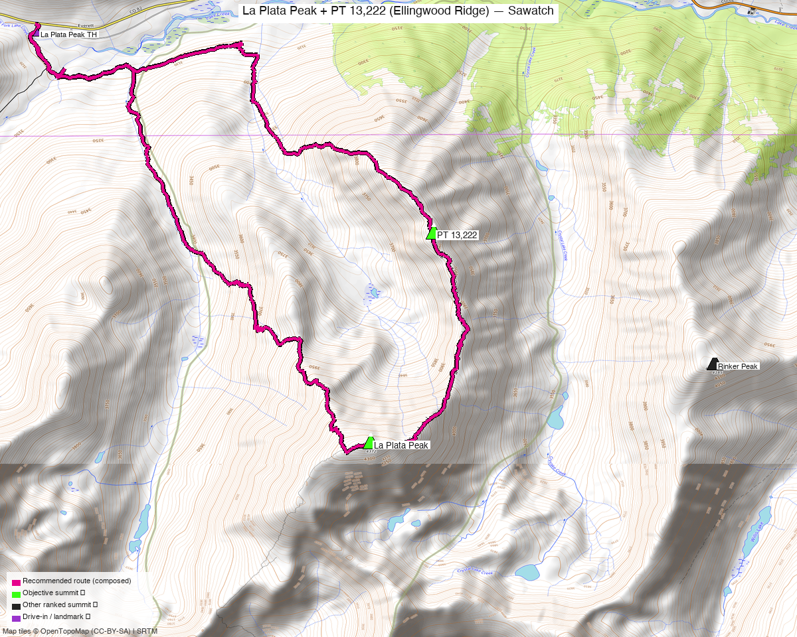

<!-- CLIMBERS_START -->
**Other climbers:** Emily Sharpe — not yet · Shawn D Keil — not yet
<!-- CLIMBERS_END -->

# La Plata Peak + PT 13,222 (Ellingwood Ridge) — Sawatch

<!-- QUICKSTATS_START -->

!!! tip "At a glance — recommended day"
    **11.1 mi** · **4,888 ft** gain · **Class 3** · 2 peaks · ~3.25 h drive

<!-- QUICKSTATS_END -->

**Researched:** 2026-07-22

!!! weather ""
    **NOAA weather link:** [La Plata + PT 13,222 Weather](https://forecast.weather.gov/MapClick.php?lat=39.03&lon=-106.47)

!!! map ""
    **CalTopo research map:** https://caltopo.com/m/5LGGVCQ

**Status in DB:** **La Plata Peak (14,344') is climbed;** the target here is **PT 13,222**
— which *is* the summit of **Ellingwood Ridge**, La Plata's notorious NE ridge. Pairing
them turns a familiar 14er into an exposed Class 3 ridge day.

<!-- PROVENANCE_START -->
*Note: the recommended route was distilled from **43 recorded GPS tracks** of real trips (14ers.com · ListsofJohn · peakbagger · Kyle's recordings) — all layered on the [interactive CalTopo research map](https://caltopo.com/m/5LGGVCQ).*
<!-- PROVENANCE_END -->

---

!!! danger "Ellingwood Ridge — serious, exposed Class 3 (some Class 4 if off-route)"
    **PT 13,222 sits on Ellingwood Ridge**, one of Colorado's classic hard-Class-3
    scrambles: **~1.5 mi of sustained, exposed ridge** with many false summits, towers,
    and notches. It stays Class 3 *only* with careful route-finding — drifting off the
    crest quickly finds **Class 4** and worse. It's **committing** (hard to bail mid-ridge)
    and slow. **Helmet; go in stable weather with time to spare.** Not a day to be caught
    by afternoon storms high on the ridge.

## Peaks covered

A **Class 3 ridge loop** from the standard La Plata trailhead: the peak most people know
as an easy Class 2 walk-up, linked with the exposed Ellingwood Ridge scramble to its NE
highpoint. **La Plata is already climbed** — PT 13,222 / Ellingwood Ridge is the
unclimbed prize.

| | [La Plata Peak](https://www.14ers.com/peaks/10005) | [PT 13,222 (Ellingwood Ridge)](https://www.14ers.com/peaks/10794) |
|---|---|---|
| Elevation | 14,344' | 13,222' |
| Lat / Lon | 39.0295, −106.4730 | 39.0486, −106.4670 |
| Class | 2 (standard NW route) | **3** (Ellingwood Ridge; exposed) |
| CO rank | #5 | #468 |
| Status (Kyle) | ✓ climbed | ✗ **unclimbed — the target** |
| 14ers.com | [10005](https://www.14ers.com/php14ers/peak.php?peakid=10005) | [10794](https://www.14ers.com/php14ers/peak.php?peakid=10794) |
| LoJ | [6](https://listsofjohn.com/peak/6) | [581](https://listsofjohn.com/peak/581) |
| peakbagger | [5744](https://peakbagger.com/peak.aspx?pid=5744) | [84738](https://peakbagger.com/peak.aspx?pid=84738) |

---

## Recommended route — La Plata + Ellingwood Ridge loop ⭐

The composed line is a **~11.1-mi / ~4,890-ft loop** from the CO-82 trailhead that takes
in both summits. **Class 3** — the crux is the Ellingwood Ridge scramble.

### Route sequence
1. From the **La Plata Peak TH (~10,150', CO-82)**, follow the **standard NW route** —
   the Lake Creek / La Plata Gulch trail and NW slopes — to the **La Plata summit
   (14,344', Class 2)**.
2. **Descend the NE ridge onto Ellingwood Ridge**, scrambling NE over the towers and
   notches to **PT 13,222 (Ellingwood Ridge highpoint)** — sustained, exposed **Class 3**
   (see the danger box). Careful route-finding keeps it at 3.
3. Drop off the ridge's north/northwest side back to the La Plata Gulch trail and out to
   the TH to close the loop.

*Direction note in* **Other considerations** — most parties go **up Ellingwood Ridge
first** (fresh, and you can bail before committing), then descend La Plata's easy trail.

---

## Getting there — La Plata Peak TH (CO-82)

| | |
|---|---|
| **Drive from Boulder** | **[~3h 15m via Google Maps](https://www.google.com/maps/dir/?api=1&origin=1162+Peakview+Circle,+Boulder,+CO+80302&destination=39.0670,-106.5050)** — via Leadville and **CO-82** toward Independence Pass; the signed **La Plata Peak trailhead** is on the south side of the highway. |
| Trailhead | **La Plata Peak TH**, ~39.0670, −106.5050, **~10,150'** — **paved access, any car**; large lot. |
| Land | **San Isabel NF** — no permits/fees; not designated wilderness. |

---

## Gear & season

- **Best window:** **July–September** — the ridge needs dry rock; snow lingers in the
  ridge's notches and on north aspects into early summer.
- **Helmet mandatory** — loose blocks and party-caused rockfall are the norm on the
  ridge. A short confidence rope is defensible for a party not comfortable soloing
  exposed Class 3.
- **Storms:** Ellingwood Ridge is a long, committing, exposed crest — **be over PT 13,222
  and off the ridge before midday.** Pre-dawn start.
- **Cell:** intermittent on the summits, dead in La Plata Gulch — carry an **InReach**.

---

## Other considerations

- **Direction — up the ridge or down it?** Most parties climb **Ellingwood Ridge on the
  way up** (PT 13,222 first, then La Plata), because you're fresh for the route-finding
  and can **bail before the committing middle** if weather or the party's comfort turns;
  then descend La Plata's easy NW trail. The recommended loop can be run either way — the
  reverse (La Plata first, ridge down) is fine for a strong, fast party in good weather.
- **PT 13,222 on its own?** Ellingwood Ridge is essentially always done *with* La Plata —
  there's no easy independent line to PT 13,222, so this pairing is the natural (and
  standard) way to get it.

---

## Trip reports & GPX (all three sources swept)

**Sources confirmed logged in:** 14ers.com ("Basin"), listsofjohn.com ("letsgocu"),
peakbagger.com ("Kyle Knutson"). **40+ tracks swept** across both peaks — 17 from the
14ers.com libraries, 5 from listsofjohn TRs, 20 from peakbagger ascents (deduped); many
do the standard La Plata route, and the combo/Ellingwood-Ridge tracks are the beta for
the recommended loop. All layered on the [research map](https://caltopo.com/m/5LGGVCQ);
recommended route magenta.

**14ers.com** — the Ellingwood Ridge route page + numerous combo trip-report tracks
(the recommended loop follows one that tops both summits from the CO-82 TH).

**listsofjohn.com** — La Plata (peak 6) + PT 13,222 (peak 581) trip reports, including
Ellingwood Ridge combo tracks.

**peakbagger.com** — 20 ascent tracks across the two peaks (logged in), the mega-traverse
tracks excluded from the route.

**Sources checked:** 14ers.com · listsofjohn.com · peakbagger.com · climb13ers.com
