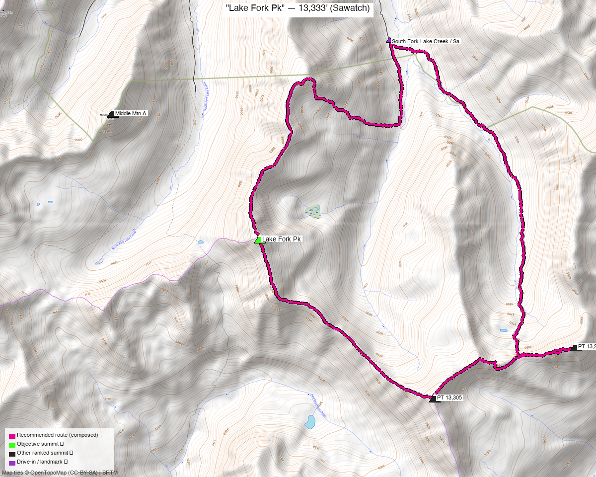

<!-- CLIMBERS_START -->
**Other climbers:** Emily Sharpe — not yet · Shawn D Keil — not yet
<!-- CLIMBERS_END -->

# "Lake Fork Pk" — 13,333' (Sawatch)

<!-- QUICKSTATS_START -->

!!! tip "At a glance — recommended day"
    **11.1 mi** · **4,313 ft** gain · **Class 2** · 1 peak · ~3.75 h drive

<!-- QUICKSTATS_END -->

**Researched:** 2026-07-22

!!! weather ""
    **NOAA weather link:** [Lake Fork Pk Weather](https://forecast.weather.gov/MapClick.php?lat=38.999&lon=-106.554)

!!! map ""
    **CalTopo research map:** <https://caltopo.com/m/EFA1LAT>

**Status in DB:** unclimbed. A ranked (CO #367), **Class 2** Sawatch 13er above the South
Fork of Lake Creek, southeast of Twin Lakes. Split out of the
[Grizzly E / Jenkins group](grizzly_jenkins_group.md) — it sits 5.6 mi north of that
trio with no trail between them, so it's its own outing from the Sayres Gulch side.

<!-- PROVENANCE_START -->
*Note: the recommended route was distilled from **8 recorded GPS tracks** of real trips (14ers.com · ListsofJohn · Kyle's recordings) — all layered on the [interactive CalTopo research map](https://caltopo.com/m/EFA1LAT).*
<!-- PROVENANCE_END -->

---

## The peak

A **Class 2 walk-up** on the Continental Divide crest above Sayres Gulch. The recommended
line is the **South Fork Lake Creek / Sayres Gulch loop** — the standard approach — which
also crosses **two more ranked 13ers** on the ridge circuit (a bonus, both already on
Kyle's climbed list). No move harder than Class 2 tundra and talus.

| | ["Lake Fork Pk"](https://www.14ers.com/peaks/10764) |
|---|---|
| Elevation | 13,333' |
| Lat / Lon | 38.9986, −106.5539 |
| Route | Sayres Gulch → E/NE ridge (loop) |
| Class | 2 |
| CO rank | #367 |
| listsofjohn.com | [466](https://listsofjohn.com/peak/466) |
| peakbagger.com | [15841](https://peakbagger.com/peak.aspx?pid=15841) |

---

## Recommended route — Sayres Gulch loop from South Fork Lake Creek ⭐

The composed line follows a recorded loop that summits and starts at the trailhead —
**~11.1 mi · ~4,310 ft, Class 2**.

### Route sequence
1. From the **South Fork Lake Creek / Sayres Gulch TH (~10,970', FR 391)**, hike up
   into **Sayres Gulch**, climbing tundra benches toward the Divide crest.
2. Gain the ridge and follow it over the circuit — the loop tops **PT 13,232 B** and
   **PT 13,305** (two bonus ranked 13ers) on the way to and from **Lake Fork Pk**.
3. Class 2 grass and talus throughout; return to close the loop. Reverse for an
   out-and-back if you'd rather skip the bonus summits.

---

## Getting there — South Fork Lake Creek / Sayres Gulch TH

| | |
|---|---|
| **Drive from Boulder** | **[~3h 45m via Google Maps](https://www.google.com/maps/dir/?api=1&origin=1162+Peakview+Circle,+Boulder,+CO+80302&destination=39.0210,-106.5349)** — via Leadville and **CO-82** toward Twin Lakes, then **South Fork Lake Creek Rd (FR 391)** south. |
| Trailhead | **South Fork Lake Creek / Sayres Gulch TH**, ~39.0210, −106.5349, **~10,970'.** FR 391 is a **rough, high-clearance / 4WD** shelf road; park where your vehicle tops out. |
| Land | **San Isabel NF** — no permits/fees; not designated wilderness. |

---

## Gear & season

- **Best window:** **July–September** — high Sawatch crest; FR 391 and the north-facing
  gullies hold snow into early summer.
- **Terrain:** Class 2 tundra/talus, no technical sections.
- **Storms:** an exposed ridge circuit — start early and be off the crest by early
  afternoon.
- **Cell:** unreliable in the South Fork drainage; carry an **InReach / satellite
  messenger**.

---

## Other considerations

- **Shorter high-4WD start:** a recorded ~7.3-mi line begins ~900' higher up FR 391
  (~11,290'). If the road is dry and your vehicle can make it, that trims the day
  considerably — but the standard, vehicle-agnostic start is the ~10,970' parking the
  recommended loop uses.
- **Out-and-back vs loop:** the recommended loop bags PT 13,232 B and PT 13,305 as
  bonuses; a direct out-and-back to Lake Fork alone is shorter if you've already done
  those (Kyle has).
- **Formerly grouped with the [Grizzly E trio](grizzly_jenkins_group.md):** it was once
  listed as an optional 4th there, but the 5.6-mi gap with no connecting trail made it a
  separate outing — hence this standalone report.

---

## Trip reports & GPX (all three sources swept)

**Sources confirmed logged in:** 14ers.com ("Basin"), listsofjohn.com ("letsgocu"),
peakbagger.com ("Kyle Knutson"). **5 useful tracks** — 1 from the 14ers.com library,
4 from listsofjohn trip reports; peakbagger's ascent track was a duplicate of a LoJ
trip. All layered on the [research map](https://caltopo.com/m/EFA1LAT); recommended
route magenta.

**listsofjohn.com** — the recommended line is an **~11-mi Sayres Gulch loop**
([8199](https://listsofjohn.com/gpx/8199.gpx)); other tracks range 8.5–15 mi depending
on how many neighbors are linked.

**14ers.com** — a ~7.3-mi line from a higher FR 391 start (the shorter 4WD option).

**peakbagger.com** — one ascent track, a duplicate of the LoJ loops.

**Sources checked:** 14ers.com · listsofjohn.com · peakbagger.com · climb13ers.com
