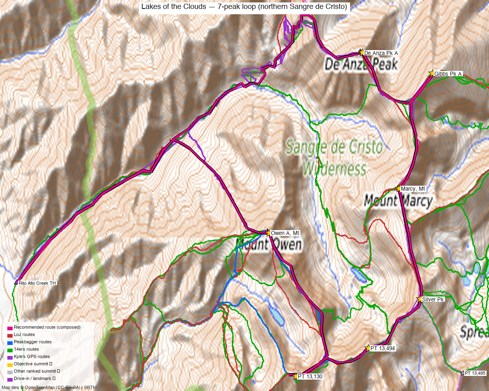

<!-- CLIMBERS_START -->
**Other climbers:** Kyle Knutson — ✓ all · Shawn D Keil — not yet
<!-- CLIMBERS_END -->

# Lakes of the Clouds — 7-peak loop (northern Sangre de Cristo)

<!-- QUICKSTATS_START -->

!!! tip "At a glance — recommended day"
    **20.8 mi**

<!-- QUICKSTATS_END -->

*Written for **Emily** — all seven unclimbed on her 14ers checklist.*

**CalTopo research map:** https://caltopo.com/m/J9G39T0

**Status for Emily:** All **seven unclimbed**. A horseshoe of ranked 13ers ringing the Lakes of the Clouds, northern Sangres.

<!-- PROVENANCE_START -->
*Note: the recommended route was distilled from **68 recorded GPS tracks** of real trips (Kyle's recordings) — all layered on the [interactive CalTopo research map](https://caltopo.com/m/J9G39T0).*
<!-- PROVENANCE_END -->

---

## The seven peaks

In rough ridge order around the cirque (N → S → back):

| # | Peak | Elevation | Class | peak_db |
|---|---|---|---|---|
| 1 | De Anza Peak A | 13,391' | 2 | 431 |
| 2 | Gibbs Peak A ⭐ high point | 13,577' | 2 | 272 |
| 3 | Mt Marcy | 13,504' | 2 | 327 |
| 4 | "Silver Peak" | 13,517' | 2 | 307 |
| 5 | PT 13,494 ("Cotton King") | 13,494' | 2 | 326 |
| 6 | PT 13,130 | 13,130' | 2 | 694 |
| 7 | Owen A, Mt | 13,361' | 2 | 446 |

All **Class 2** on the standard lines — the difficulty here is **distance, gain, and ridge route-finding**, not technical climbing.

**Weather:** [NOAA forecast for the cirque](https://forecast.weather.gov/MapClick.php?lat=38.146&lon=-105.676) (Mt Marcy / Lakes of the Clouds — covers the whole loop at this resolution; same target as the 14ers / LoJ / peakbagger weather links).

---

## Drive + approach (from Highland, Denver)

| | |
|---|---|
| **Drive from Highland** | **[3h 24m via Google Maps](https://www.google.com/maps/dir/?api=1&origin=Highland,+Denver,+CO&destination=38.1006,-105.7707)** (183 mi) to the **Wild Cherry Creek TH** (San Luis Valley, near Moffat) |
| East approach (most documented) | **Gibson Creek TH** (Gibson Trailhead), Wet Mountain Valley near Westcliffe — the trailhead most 14ers TRs use for these peaks (De Anza/Gibbs/Marcy via Gibson Creek + the Rainbow Trail) |
| West approach | **Cotton Creek / Wild Cherry Creek / Rito Alto Creek** from the San Luis Valley side (Moffat) — the line the logged loop GPX on the research map follow |
| Vehicle | Dirt forest roads to the THs; 2WD-passable in dry conditions, rough/​muddy when wet |

> The seven can be linked from **either side** of the range. The logged loop tracks on the [research map](https://caltopo.com/m/J9G39T0) are the **west (SLV)** approach (drive time above); many 14ers parties use **Gibson Creek (east)** — check both before committing, depending on which THs you want to start/finish at.

---

## Recommended plan — Lakes of the Clouds horseshoe ⭐

The seven ring the **Lakes of the Clouds** cirque. The natural line climbs to the lakes, gains the ridge, and traverses the horseshoe, tagging summits along the crest.

**Loop stats (from TR GPX):** the full seven is a **very big outing — on the order of ~15–24 mi and ~8,000–12,000 ft** depending on the exact line and which THs you link. Individual arcs (per the logged tracks) run ~6–14 mi.

**Two ways to do it:**

1. **Two days (recommended)** — backpack to a **camp near the Lakes of the Clouds**, then split the ridge into a **north arc** (De Anza · Gibbs · Marcy · Silver) and a **south arc** (Cotton King/PT 13,494 · PT 13,130 · Owen) on either side of the camp. This is how josephnephi did it (2024: north arc one day, south arc the next).
2. **One long push** — a huge single-day horseshoe for the very fit and acclimatized (expect 24 mi / 12,000 ft class numbers on the bigger logged tracks). Alpine start, all-day commitment.

> **Study the GPX on the [research map](https://caltopo.com/m/J9G39T0)** for the exact ridge sequence — the connecting ridges are Class 2 but have route-finding, false summits, and a few drops/​regains between peaks. There's no single "standard route" sign here; the logged tracks are the beta.

---

## Conditions / season

- **Best window:** July–September for dry Class 2 tundra/​talus and the dirt approach roads. Snow lingers in the cirque into early summer (several logged tracks are late-May with snow).
- **Terrain:** high tundra, talus, and grassy/​rocky ridges — solid Sangre Class 2, but long exposed ridgelines.
- **Water:** the Lakes of the Clouds + creek drainages make a 2-day camp easy to supply (treat).
- **Storms:** you're on exposed ridge for hours — early start, and have a bail plan off the ridge into the basin if weather builds.
- **Length is the hazard:** big mileage + gain at 13k. Pace, fuel, and turnaround discipline matter more than any move on the route.

---

## Permits / access

- **Sangre de Cristo Wilderness** (Rio Grande / San Isabel NF) — no permits required; standard wilderness rules (no motorized, groups ≤ 15, leash/​control dogs).
- Dispersed camping near the lakes is allowed under Leave No Trace; camp on durable surfaces away from water.

---

## Cell coverage

- **14ers.com community DB:** no reports for these summits.
- **Geographic reasoning:** the cirque and west-side approaches are **deep behind the range crest** — expect **dead** at the THs and lakes. **Summits/​high ridge** may catch intermittent signal toward the San Luis Valley (west) but don't rely on it.
- **Standard recommendation:** **carry an InReach** — this is a long, committing, remote multi-peak day/​overnight.

---

## Trip reports & GPX (all three sources)

The loop is well documented as N + S arcs:

**14ers.com** has extensive TRs for these peaks (69 across the seven) — the multi-peak ones are the loop beta:

- **"Traverse from Cottonwood Pk to Mt Owen in the Sangres"** ([18396](https://www.14ers.com/php14ers/tripreport.php?trip=18396)) — the big ridge traverse covering this whole zone
- **"Sangre 13ers: De Anza, Gibbs, and Marcy"** ([18633](https://www.14ers.com/php14ers/tripreport.php?trip=18633)) — the north-arc trio
- **"Cotton Creek 13ers (Sangre de Cristos)"** ([17527](https://www.14ers.com/php14ers/tripreport.php?trip=17527)) — west-side Cotton Creek approach
- **"Central Sangre 5 pack"** ([10455](https://www.14ers.com/php14ers/tripreport.php?trip=10455)) · **"This Trip Report goes to Eleven!"** ([14262](https://www.14ers.com/php14ers/tripreport.php?trip=14262)) — multi-peak days
- **"De Anza Peak A - Gibson Trailhead"** ([11708](https://www.14ers.com/php14ers/tripreport.php?trip=11708)) / **"From Gibson Trailhead"** ([21454](https://www.14ers.com/php14ers/tripreport.php?trip=21454)) — the east (Gibson Creek) approach

**listsofjohn.com** loop tracks (37 TRs across the seven): whileyh 2020 N arc ([8083](https://listsofjohn.com/gpx/8083.gpx) ⭐), josephnephi 2024 N ([15989](https://listsofjohn.com/gpx/15989.gpx)) + S ([15992](https://listsofjohn.com/gpx/15992.gpx) ⭐), Alyson Kirk 2014 S ([978](https://listsofjohn.com/gpx/978.gpx)).

**peakbagger.com** (logged in, Kyle Knutson): 8 ascent GPX tracks across the seven, layered on the map.

**Kyle's own CalTopo tracks** (his recorded GPS + collected archive) add the on-the-ground beta the web sources miss — incl. **Cotton Creek 13ers**, **Gibbs Peak loop**, **Rito Alto–Hermit–Eureka**, **Lakes/Electric**, and several recorded GPX dumps. Layered in purple on the research map.

**GPX collected: 60 track files** across all sources — LoJ + 14ers (swept via `scripts/sweep_gpx.py`; 69 named 14ers TRs + 37 LoJ TRs in the manifest) **+ 16 of Kyle's own CalTopo tracks** (`scripts/caltopo_mytracks.py`) — all layered on the [CalTopo research map](https://caltopo.com/m/J9G39T0).

**Sources checked:** 14ers.com · listsofjohn.com · peakbagger.com

