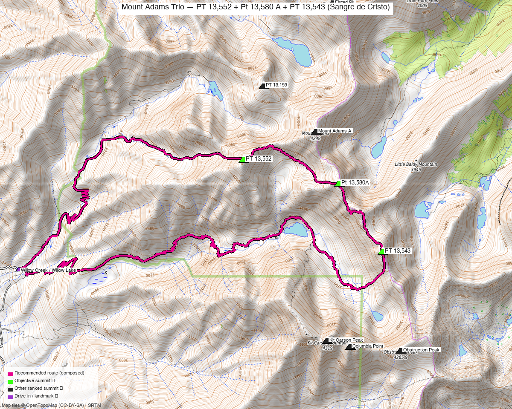

# Mount Adams Trio — PT 13,552 + Pt 13,580 A + PT 13,543 (Sangre de Cristo)

<!-- QUICKSTATS_START -->

!!! tip "At a glance — recommended day"
    **13.5 mi** · **6,897 ft** gain · **Class 2–3** · 3 peaks · ~4 h drive

<!-- QUICKSTATS_END -->

**Researched:** 2026-06-15

!!! weather ""
    **NOAA weather link:** [Mount Adams Trio Weather](https://forecast.weather.gov/MapClick.php?lat=38.0007&lon=-105.6004)

!!! map ""
    **CalTopo research map:** <https://caltopo.com/m/VES1N54>

**Status in DB:** all three unclimbed. **Mount Adams A (13,937') itself is already done** — these are the high points on its **W, S, and SE ridges**, and every other ranked neighbor (Kit Carson, Challenger, Crestones, Humboldt, Fluted, Horn, Little Horn) is climbed too. This cleans up the Adams massif.

> Three ridge-point 13ers around **Mount Adams**, above **Willow Lake** near Crestone. The peaks are Class 2, but **linking them on the ridges is Class 2+ with stretches of easy Class 3** (loose Crestone conglomerate; Class 3–4 if you stay on the crest) — on top of **6,400′ of gain** out of the deep Crestone trailhead.

<!-- PROVENANCE_START -->
*Note: the recommended route was distilled from **16 recorded GPS tracks** of real trips (14ers.com · ListsofJohn · peakbagger) — all layered on the [interactive CalTopo research map](https://caltopo.com/m/VES1N54).*
<!-- PROVENANCE_END -->

---

<!-- CLIMBERS_START -->
**Other climbers:** Emily Sharpe — 1 of 3 (PT 13,552) · Shawn D Keil — 2 of 3 (PT 13,552, Pt 13,580A)
<!-- CLIMBERS_END -->

## Peaks covered

| | [PT 13,552](https://www.14ers.com/peaks/10634) | [Pt 13,580 A](https://www.14ers.com/peaks/10627) | [PT 13,543](https://www.14ers.com/peaks/10635) |
|---|---|---|---|
| Elevation | 13,552' | 13,543' (LiDAR; map 13,580') | 13,543' |
| Lat / Lon | 38.0036, −105.6189 | 38.0007, −105.6004 | 37.9914, −105.5918 |
| Class | 2 | 2 | 2 |
| CO Rank | 221 | 228 | 229 |
| Position | **W ridge** of Adams (0.8 mi) | **S** of Adams (0.5 mi) | **SE ridge** of Adams (1.3 mi) |
| 14ers.com | [10634](https://www.14ers.com/php14ers/peak.php?peakid=10634) | [10627](https://www.14ers.com/php14ers/peak.php?peakid=10627) | [10635](https://www.14ers.com/php14ers/peak.php?peakid=10635) |
| LoJ | [277](https://listsofjohn.com/peak/277) | [248](https://listsofjohn.com/peak/248) | [280](https://listsofjohn.com/peak/280) |
| peakbagger | [14645](https://peakbagger.com/peak.aspx?pid=14645) | [14624](https://peakbagger.com/peak.aspx?pid=14624) | [14648](https://peakbagger.com/peak.aspx?pid=14648) |
| Peak DB id | 277 | 248 | 280 |

All three are **ranked Sangre de Cristo 13ers** in the **Sangre de Cristo Wilderness**. They form the W / S / SE high points on Mount Adams' ridge system — supranihilest's "[All Four of Adams' Ridges in One Day](https://www.14ers.com/php14ers/tripreport.php?trip=20241)" links them with Adams itself.

> **Class note:** each *summit* is Class 2, but the **ridges/saddles connecting them are the crux** — Roach (*Colorado Thirteeners*) keeps the link-up at **Class 2+** via bypasses on rotten rock, while the ridge crests offer **Class 3–4**, and the saddle downclimbs (e.g. toward Pt 13,580 A) go at **easy Class 3** on ledges and short slabs. Helmet for the loose Crestone conglomerate.

---

## The single push — Willow Creek / Willow Lake TH loop ⭐

A loop over all three from the **Willow Creek / Willow Lake TH** in Crestone — **Class 2 summits linked by Class 2+/easy Class 3 ridges**. Modest mileage but **big gain** — you climb ~4,600′ just to reach the Adams ridgeline, then traverse the three ridge points.

| | |
|---|---|
| Peaks | PT 13,552 + Pt 13,580 A + PT 13,543 |
| Class | **Summits Class 2; connecting ridges Class 2+ with easy Class 3** — saddle downclimbs on ledges/short slabs of loose Crestone conglomerate (Class 3–4 if you stay on the crest). Helmet. |
| Trailhead | **Willow Creek / Willow Lake TH (Crestone), ~8,900'** — 2WD (passenger car) |

### Route sequence (loop)
1. From the **Willow Creek / Willow Lake TH** in Crestone, climb the **Willow Lake trail** toward Willow Lake and the Mount Adams basin (the standard Adams approach).
2. Gain the ridgeline and traverse the three high points — the route order off the trail is flexible: **PT 13,543 (SE) → Pt 13,580 A (S) → PT 13,552 (W)** works as a horseshoe around the Adams basin (reverse also fine).
3. The summits are Class 2, but **the connecting ridges and saddle downclimbs run Class 2+ to easy Class 3** (ledges, short slabs, the odd chimney on Crestone conglomerate) — keep it to Class 2+ with careful bypasses, or take the crest at Class 3–4. Mount Adams (13,937', center) is the higher point between them and is **already done**, so it's optional to re-tag.
4. Descend back to the Willow Lake trail and out.

> **Mostly gain + altitude — but not trivial scrambling.** Big sustained gain from a deep Crestone trailhead, plus **easy Class 3 moves on the connecting ridges**. Wear a helmet for the loose rock and start early for the Sangre afternoon storms on exposed ridges.

---

## Getting there — drive & trailhead

| | |
|---|---|
| **Drive from Boulder** | **[~4h via Google Maps](https://www.google.com/maps/dir/?api=1&origin=1162+Peakview+Circle,+Boulder,+CO+80302&destination=37.9889,-105.6626)** — via US-285 to the San Luis Valley, then Crestone; the Willow Creek / Willow Lake TH is above town. |
| Trailhead | **Willow Creek / Willow Lake TH**, ~37.989, −105.663, **~8,900'** — 2WD (passenger car). |
| Land | **Sangre de Cristo Wilderness** (Rio Grande NF) — no permits/fees, foot travel beyond the TH; dispersed/backpack camping allowed (Willow Lake is a popular backpack). |

---

## Gear & season

- **Best window:** **June–September.** The Willow Lake trail melts out by early summer; the upper ridges hold snow into June.
- **Terrain:** Class 2 to the summits, but the **connecting ridges are Class 2+/easy Class 3** on loose Crestone conglomerate (ledge/slab downclimbs at the saddles) — careful scrambling, helmet, on top of a lot of sustained uphill.
- **Storms:** long exposed ridge time at 13,500'+ — start very early, off the high points by early afternoon.
- **Cell:** unreliable to dead in the basin — carry an InReach.

---

## Other considerations

**Backpack option:** Willow Lake is a classic camp ~4–5 mi in; camping there shortens the summit day on the ridges considerably and is the relaxed way to do the trio (plus the lake is excellent).

---

## Trip reports & GPX (all sources)

**Sources confirmed logged in:** 14ers.com ("Basin"), listsofjohn.com, peakbagger.com (Kyle Knutson). **7 14ers-library tracks** layered (one — gpxlib 105345 — tours all three; others do the W/S pair or add Mount Adams); recommended loop drawn magenta.

- **14ers.com:** GPX library + TRs cover the Adams ridges. Key: supranihilest "[All Four of Adams' Ridges in One Day](https://www.14ers.com/php14ers/tripreport.php?trip=20241)" (Adams + 13,543 + 13,552 + 13,159) and pgres "[Grab Life by the (Little) Horn](https://www.14ers.com/php14ers/tripreport.php?trip=22147)" (Adams area incl. 13,543).
- **listsofjohn.com:** per-peak pages — all three ranked Class 2 Sangre 13ers ([277](https://listsofjohn.com/peak/277) · [248](https://listsofjohn.com/peak/248) · [280](https://listsofjohn.com/peak/280)).
- **peakbagger.com:** pages verified for all three ([14645](https://peakbagger.com/peak.aspx?pid=14645) · [14624](https://peakbagger.com/peak.aspx?pid=14624) · [14648](https://peakbagger.com/peak.aspx?pid=14648)); ownership = Sangre de Cristo Wilderness (Rio Grande NF).
- **climb13ers.com:** no dedicated route pages for these unnamed ridge points; class/approach corroborated by the 14ers tracks + TRs and LoJ.

**Sources checked:** 14ers.com ✓ (logged in, "Basin") · listsofjohn.com ✓ · peakbagger.com ✓ (logged in, "Kyle Knutson") · climb13ers.com ✓ (no dedicated pages) · Kyle's CalTopo ✓

