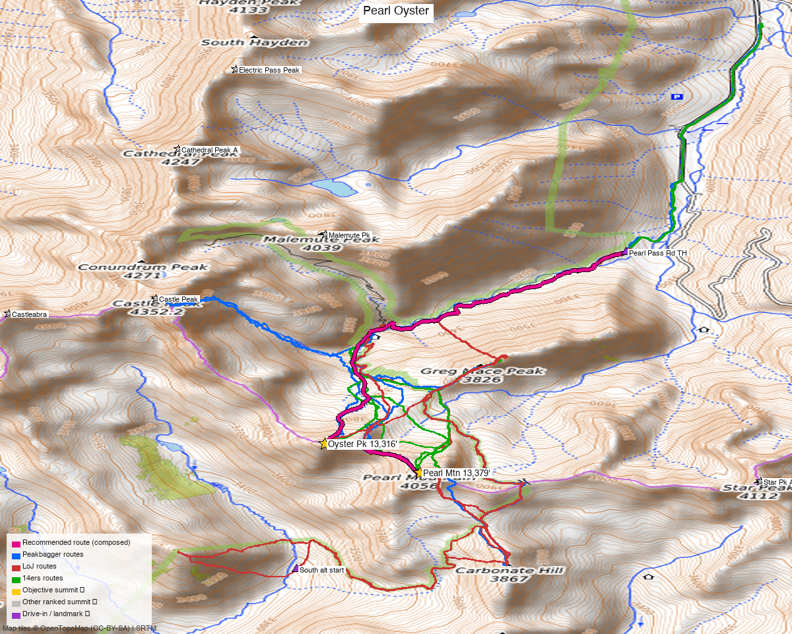

# Pearl Mountain + Oyster Peak — combination day (Elk Mountains)

<!-- QUICKSTATS_START -->

!!! tip "At a glance — recommended day"
    **8.8 mi** · **4,073 ft** gain · **Class 2+** · 2 peaks · ~4.4 h drive

<!-- QUICKSTATS_END -->

**Researched:** 2026-06-07
**Report type:** Day trip (2 ranked 13ers, one outing)
**CalTopo research map:** https://caltopo.com/m/852FBC0
**Status in DB:** Both 0 ascents (unclimbed). These two are a **locked pair** in the Pearl Pass area of the Maroon Bells–Snowmass Wilderness — the remaining unclimbed ranked 13ers on the Aspen/Castle Creek side near the divide.

*[Interactive CalTopo map](https://caltopo.com/m/852FBC0)*

---

<!-- CLIMBERS_START -->
**Other climbers:** Emily Sharpe — not yet · Shawn D Keil — not yet
<!-- CLIMBERS_END -->

## Quick stats

| | Pearl Mtn | "Oyster Pk" |
|---|---|---|
| Elevation (LiDAR) | 13,379' (map 13,362') | 13,316' |
| Lat / Lon | 38.98095, −106.83403 | 38.98579, −106.84413 |
| Weather | [NOAA forecast](https://forecast.weather.gov/MapClick.php?lat=38.98095&lon=-106.83403) (same target as 14ers / LoJ / peakbagger weather links) | [NOAA forecast](https://forecast.weather.gov/MapClick.php?lat=38.98579&lon=-106.84413) |
| Class (standard) | 2 | 2 (2+ via the connecting ridge) |
| CO Rank | 339 | 384 |
| Prominence (LiDAR) | 604' | 419' |
| Range / Wilderness | Elk Mtns / Maroon Bells–Snowmass | Elk Mtns / Maroon Bells–Snowmass |
| County | Gunnison & Pitkin | Gunnison & Pitkin |
| 14ers.com | [10112](https://www.14ers.com/peaks/10112/13er-pearl-mountain) | [10116](https://www.14ers.com/peaks/10116/13er-oyster-peak) |
| LoJ | [432](https://listsofjohn.com/peak/432) | [477](https://listsofjohn.com/peak/477) |
| peakbagger | [pid 39830](https://peakbagger.com/peak.aspx?pid=39830) | [pid 29599](https://peakbagger.com/peak.aspx?pid=29599) |
| Peak DB id | 432 | 477 |

**The two summits are 0.64 mi apart** on a connecting ridge — the tightest pair of the five Eastern-Elk peaks researched.

---

## Why these two together

A **locked pair, not a forced pairing** — every trip report that hits either peak does **both** in one outing:

- **whileyh** (2020-05-17) — Pearl + Oyster, the cleanest example of the exact pair (snow/booted, Pearl Pass Road)
- **josephnephi** (2024-07-02) — Oyster + Pearl (+ sub-13k Carbonate Hill, Greg Mace Peak)
- **John Kirk** (2014-09-27) — Pearl + Oyster (+ Greg Mace, Carbonate, PT 12,560) from the south
- **Bob Burd** (2020-07-21) — Oyster + Pearl + Cooper + Iron + Carbonate + Greg Mace (big day)
- **Furthermore** (2008-08-27) — both as part of a Cathedral-basin mega-traverse from the Aspen side

**Combos (ranked-13er+ rule):** each is a true ranked-13er partner for the other (13,379' and 13,316', both ranked). The frequent companions — Greg Mace Peak and Carbonate Hill — are **sub-13k bumps** and don't count toward the ranked tally; the ranked objective here is exactly these two.

---

## Drive + approach

| | |
|---|---|
| **Drive from Boulder** | **[4h 22m via Google Maps](https://www.google.com/maps/dir/?api=1&origin=1162+Peakview+Circle,+Boulder,+CO+80302&destination=39.017,-106.813)** (~225 mi, origin: 1162 Peakview Circle; via I-70 W + CO-82 over Independence Pass) |
| Primary trailhead | **Pearl Pass Road (4WD)**, Aspen / Castle Creek (Ashcroft) side — park ~39.017, −106.813 near the upper creek crossing (whileyh, josephnephi). Rough 4WD; how far you drive sets the day length. |
| Southern alternate | From the **Brush Creek / Crested Butte side** (~38.965, −106.847) — John Kirk's approach, climbing the pair from the south. |
| Big-traverse alt | From **Cathedral Lake TH** (Aspen) as part of a Cathedral-basin link-up (Furthermore) — much longer; only if chaining the already-done Cathedral/Electric Pass peaks. |

---

## Recommended plan — Pearl Pass Road, Oyster → Pearl traverse ⭐

The standard and most efficient line for the pair, from whileyh's trip report.

**Combo stats (measured from TR GPX):**

| Source track | Peaks | Distance | Gain |
|---|---|---|---|
| whileyh 2020 (LoJ 8023) | Pearl + Oyster | 10.0 mi | ~4,291' |
| josephnephi 2024 (LoJ 16132) | Oyster + Pearl (+2 sub) | 11.5 mi | ~6,273' |
| John Kirk 2014 (LoJ 948) | Pearl + Oyster (+3 sub) | 12.3 mi | ~6,152' |

Expect roughly **~10 mi and ~4,300 ft** for the clean two-peak day from a reasonable 4WD start; add ~2 mi / ~2,000 ft if you tack on Greg Mace + Carbonate Hill like most parties do.

### Route sequence (Oyster first, then the ridge to Pearl)
1. From the Pearl Pass Road parking, head up toward the basin below Oyster/Pearl (snow lingers here into early summer — whileyh booted a May ascent).
2. Climb **Oyster Peak (13,316')** directly via **snowless talus** on its accessible side — the faster line per whileyh (he beat partners who took a snowier route).
3. Take the **connecting ridge Oyster → Pearl (0.64 mi)** — kept at **Class 2+**, "mostly on hard-packed, narrow snow ledges with some exposure" in spring; a Class 2-ish rock ridge once melted out.
4. Tag **Pearl Mountain (13,379')**.
5. Descend Pearl's low-angle slopes back toward the road. (Greg Mace Peak makes an easy sub-13k add-on toward the saddle — conditions permitting.)

---

## Per-peak route notes

- **Oyster Peak** — no formal 14ers route description. Climbed first in the standard pairing; talus on the standard side, Class 2.
- **Pearl Mountain** — no formal 14ers route description. Reached via the short Oyster→Pearl ridge (Class 2+ with some exposure) or directly from the basin; low-angle descent slopes.
- **Connector** — the 0.64 mi Oyster–Pearl ridge is the technical crux of the day at **Class 2+** (narrow, some exposure, holds snow late).

---

## Conditions / season

- **Best window:** **mid-July through September** once Pearl Pass Road and the upper basin melt out. The road is a high, rough 4WD that opens late.
- **Snow season:** a legitimate spring objective (whileyh mid-May, booting) — the connecting ridge and basin hold snow; bring axe/crampons and expect postholing below treeline.
- **Crux:** the Oyster→Pearl ridge at Class 2+ with exposure — more serious when snow-covered.
- **Storms:** standard high-Elk afternoon storm risk on the exposed ridge — early start.

---

## Permits / access

- **Maroon Bells–Snowmass Wilderness** — no climbing permit required, but wilderness regulations apply (the overnight-camping permit/reservation system covers the Conundrum/Maroon core, not the Pearl Pass approach).
- White River / Gunnison National Forest — no fee at the trailhead.
- Pearl Pass Road is a serious 4WD route; high-clearance 4WD strongly recommended.

---

## Cell coverage

- **14ers.com community DB:** no submitted reception reports for these summits or the Pearl Pass approach.
- **Geographic reasoning:** the **Pearl Pass Road approach and basin are likely dead** — deep in the Maroon Bells–Snowmass backcountry. **Summits may catch line-of-sight signal** toward the Aspen/Castle Creek corridor, but treat it as unreliable.
- **Standard recommendation:** carry an **InReach / satellite messenger**.

---

## Trip reports & GPX (all three sources)

### listsofjohn.com
| Date | Author | Peaks | GPX |
|---|---|---|---|
| 2020-05-17 | whileyh | **Pearl + Oyster** | [8023](https://listsofjohn.com/gpx/8023.gpx) ⭐ clean pair + route beta |
| 2024-07-02 | josephnephi | Oyster + Pearl (+Carbonate, Greg Mace) | [16132](https://listsofjohn.com/gpx/16132.gpx) |
| 2014-09-27 | John Kirk | Pearl + Oyster (+Greg Mace, Carbonate, 12560) | [948](https://listsofjohn.com/gpx/948.gpx) — southern approach |
| 2020-07-21 | Bob Burd | Oyster + Pearl + Cooper + Iron + Carbonate + Greg Mace | [TR 16773](https://listsofjohn.com/tr?Id=16773) |
| 2008-08-27 | Furthermore | Cathedral + Pearl + Oyster + Greg Mace + Electric Pass Pk + Malemute | [TR 1420](https://listsofjohn.com/tr?Id=1420) — Aspen mega-traverse |

### 14ers.com (logged in, "Basin")
Peak pages exist for both but carry **no formal route descriptions** — route beta comes from the trip reports. 14ers GPX-library tracks layered on the research map.

### peakbagger.com (logged in, "Kyle Knutson")
Ascent GPX tracks pulled — Pearl (aid 1432986, 1380690) and Oyster (aid 1432985, 1380688, 1374733) — all layered on the CalTopo map.

**GPX collected: 8 track files across all three sources** (LoJ pairs + peakbagger ascents) — all layered on the research map, colored by source.

**Sources checked:** 14ers.com ✓ (logged in, "Basin") · listsofjohn.com ✓ (logged in, "letsgocu") · peakbagger.com ✓ (logged in, "Kyle Knutson")

---

## TL;DR

- **A locked pair** — Pearl (13,379') + Oyster (13,316'), 0.64 mi apart, done together in *every* trip report. Both unclimbed, both ranked Class 2.
- **The plan:** Pearl Pass Road 4WD → **Oyster via talus → Class 2+ ridge (0.64 mi, some exposure) → Pearl** → descend. **~10 mi, ~4,300 ft** for the clean pair (whileyh); +~2 mi/2,000' if you add Greg Mace + Carbonate Hill.
- **Crux:** the short Oyster→Pearl connecting ridge (Class 2+, holds snow late).
- **Season:** mid-July–September once Pearl Pass Rd melts out; legit spring snow climb (whileyh, mid-May, axe/crampons).
- **Drive:** [4h 22m](https://www.google.com/maps/dir/?api=1&origin=1162+Peakview+Circle,+Boulder,+CO+80302&destination=39.017,-106.813) from home via Independence Pass (CO-82) to the Pearl Pass Rd trailhead; rough 4WD beyond.
- **Separate trip from Star + Taylor + Italian** — only ~3.5 mi away on foot but **~4 hours by car** (opposite, Taylor Park side). See the [Star Peak Group report](star_peak_group.md).
- **Wilderness:** Maroon Bells–Snowmass — no permit, wilderness rules apply. Cell likely dead; carry an InReach.
- **Research map:** https://caltopo.com/m/852FBC0
