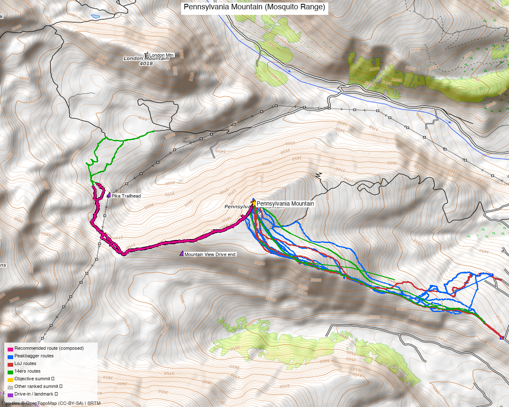

# Pennsylvania Mountain (Mosquito Range)

<!-- QUICKSTATS_START -->

!!! tip "At a glance — recommended day"
    **3.9 mi** · **1,039 ft** gain · **Class 1** · 1 peak · ~2.1 h drive

<!-- QUICKSTATS_END -->

**Researched:** 2026-05-28
**CalTopo research map:** https://caltopo.com/m/P2V1QG5
**Status in DB:** 0 ascents (unclimbed). **Cluster status:**
- ✗ **No unclimbed ranked 13ers within 8 mi** — Bartlett Mtn at 7.82 mi is the only one and it's on the opposite side of Climax Mine (different approach entirely)
- ✓ Every other Mosquito Range 13er and 14er within 8 mi is done: London Mtn (1.62), Mt Evans B (2.19), Dyer Mtn (2.79), Mt Sherman (3.12), Mosquito Peak (3.28), Mt Buckskin (3.91), Mt Tweto (4.23), Mt Sheridan (4.46), Arkansas Mtn (5.07), Mt Democrat (5.18), Mt Bross (5.23), Horseshoe Mtn A (5.94), Mt Lincoln (6.22), Clinton Pk (7.16), N Star Mtn (7.82)
- **Pure standalone half-day** — the Mosquito Range is essentially done for ranked combos. Pennsylvania is the loose end.

---

<!-- CLIMBERS_START -->
**Other climbers:** Emily Sharpe — ✓ climbed · Shawn D Keil — not yet
<!-- CLIMBERS_END -->

## Quick stats

| | Pennsylvania Mountain |
|---|---|
| Elevation | 13,013' (LiDAR; map 13,006') |
| Lat / Lon | 39.26461, −106.14243 |
| Weather | [NOAA forecast](https://forecast.weather.gov/MapClick.php?lat=39.26461&lon=-106.14243) (same target as 14ers / LoJ / peakbagger weather links) |
| 14ers.com peak page | https://www.14ers.com/peaks/10275/13er-pennsylvania-mountain |
| 14ers.com SE Ridge route | https://www.14ers.com/route.php?route=2021042410280187761 |
| listsofjohn.com | https://listsofjohn.com/peak/812 |
| peakbagger.com | https://peakbagger.com/peak.aspx?pid=5800 |
| Range / NF | Mosquito / Pike-San Isabel NF |
| Class | **Class 1 (14ers)** / Class 2 (LoJ) — call it 1.5 in practice |
| Peak DB id | 812 |
| CO Rank | 627 |
| CO Prominence Rank | 891 (low rise: only 709') |
| Quad | Climax |
| County | Park |
| Member ascents | 724 (14ers) + 270 (LoJ) — heavily climbed |

*[Interactive CalTopo map](https://caltopo.com/m/P2V1QG5)*

---

## Recommended route — Southeast Ridge from Pika Trailhead ⭐

The 14ers.com route. The quickest, easiest, most documented option of any peak on Kyle's "under 4,000'" candidate list. **The closest thing to a drive-up 13er in the Mosquitos.**

| Route | Stats (14ers official + PB confirmation) |
|---|---|
| Difficulty | Class 1 (14ers official); Class 2 (LoJ) — easy tundra walk with a 200' dip in the middle |
| Distance | **4.75 mi RT** (14ers); **5.6 mi** (PB aid 2590914) |
| Gain | **1,500'** (14ers); **1,501'** (PB confirmed) |
| Time | **~1h 39m fast** (PB Eli Boardman 2024-07-29); ~3–4 hr typical |
| Start elev | 11,716' (14ers); 11,512' (PB) — TH coordinates likely vary slightly |
| Summit | 13,013' |
| Aspect | Northwest off the SE ridge |

### Route sequence (per kalestew 14ers route description, Sep 2021)

1. From the Pika TH, hike northwest about 100 yards. **Keep LEFT at a cairned trail split** — the right-hand trail drops into willows
2. Continue straight through sparse trees to the first tundra slope
3. At ~11,900', the trail ascends to a bench area along the SE ridge and **starts to fade out** (you're on open tundra now)
4. Continue NW following the obvious ridge as it steepens at ~12,200' (winter: snowshoes go on here)
5. Cross the **12,871' marker** — Sherman/Sheridan views open up
6. **Drop ~200' across a broad basin** to the final slope (the dip is the only thing that makes this not Class 1 pure)
7. Cross mining ruins on the final climb to summit
8. Ski grade ≤ 25% — pleasant uphill stroll/ski

---

## Trailhead — Pika Trailhead (off CO Hwy 9 via Sacramento Creek)

**This is the standard "official" TH today.** Newer than the Mountain View Drive end. Per Stratmoen: "Drive to the trailhead from Highway 9."

| | |
|---|---|
| Location | Off Hwy 9 between Fairplay and Hoosier Pass, accessed via Sacramento Creek Road area |
| Drive from Boulder | **[2h 5m via Google Maps](https://www.google.com/maps/dir/?api=1&origin=1162+Peakview+Circle,+Boulder,+CO+80302&destination=39.2658,-106.1638)** (origin: 1162 Peakview Circle) |
| Vehicle | 2WD per kalestew ("Parking lot is accessible season-round") |
| Start elev | ~11,512–11,716' (varies by GPS reading) |
| Parking | Lot at the TH. Stratmoen 1/20/2020: "trailhead parking area had not been plowed, so we parked at a wide spot a bit down the road. A local walking by said we'd be OK parking there." — Winter access requires flexibility |
| Sign | Sign at the start of the trail (Stratmoen) |
| Facilities | None |
| Year-round access | YES — per the 14ers route description |

### Wahr 7/23/2023 update on the TH
> "I started with the traditional trailhead for Pennsylvania, which is now about a quarter mile down from the old trailhead. Not sure why, but they've partially ablated that last quarter mile of road. The trail they put in is nice, and leads up to 'Pennsylvania Mountain Southeast', a low prominence point on Peakbagger but not LoJ. It's got pretty nice views, so I wouldn't say the extra 100' or so of climbing is wasted."

→ **Be prepared for the parking spot to be a quarter mile farther down than older GPX tracks show.**

### Alternate THs (older — only if Pika TH is closed/inaccessible)

**B. Mountain View Drive end** — avalletta 5/1/2021 used this
- Route: CR 1 → first right past the pond → Valley of the Sun Road → Mountain View Road → drive to end
- Slightly lower start elevation, longer hike

**⚠️ AVOID — South Mosquito Creek / CR 696** (RyanSchilling 8/11/2018):
> "I turned off the Mosquito Pass road onto the road that goes up South Mosquito Creek (Park County Road 696). I drove through an open gate not long after that turnoff... a man ran us down in his Mercedes SUV. He accused me of trespassing... Apparently this has been a source of contention with at least one claim-holder."
- The **newest operators of London Mine constructed a gate across Park County Road 696** and have aggressively claimed the road as private despite it being a longstanding public right-of-way
- Even if technically public, expect hostile confrontation. Use Pika TH instead

**⚠️ AVOID — Sacramento Creek loop** (Wahr 7/23/2023):
> "There was a narrow strip of private land signed No Trespassing. I'm not sure it was accurate but I didn't just want to leave my car there."
- Wahr's original Pennsylvania-to-Sherman loop got blocked; he switched to the standard Pika TH instead

---

## Conditions / season

- **Best window:** YEAR-ROUND — the route's signature feature is its all-season accessibility per the 14ers route description and PaulStratmoen's 1/20/2020 ascent
- **Winter:** Pika TH lot may not be plowed (Stratmoen parked at a wide spot down the road). Snowshoes likely needed from ~12,200' up. Multiple Jan/Feb ascents in the LoJ TR record
- **Summer storms:** Standard Mosquito Range afternoon storm risk — but the route is short enough that early morning starts give plenty of buffer
- **Ski:** 130 member winter ascents + 52 ski descents on 14ers. Grade tops out ~25% — mellow ski tour
- **Wind:** SE ridge is exposed; standard layering

---

## Cell coverage

- **14ers.com community DB:** TODO query (community DB at 14ers has the "peak conditions" page; not yet pulled for this peak)
- **Geographic reasoning:**
  - **TH (~11,500'):** likely good — line-of-sight toward Fairplay (Hwy 9 corridor towers, ~8 mi)
  - **SE ridge / tundra slope:** likely strong — wide-open tundra with LOS to Fairplay and the South Park valley
  - **Summit:** likely strong — high point above the SE ridge with clean LOS to multiple corridors
- **Standard recommendation:** likely no InReach needed for this peak, but carry one for habit

---

## Permits / access

- Pike-San Isabel National Forest — no permits, no fees
- Pennsylvania Mountain has a **Pennsylvania Mountain Land Trust / Open Space** designation on the lower SE slopes — the Pika TH and the official trail respect this. Stay on trail in that section.
- ⚠️ **CR 696 access from Mosquito Pass Rd is contested** — see RyanSchilling 2018 above. Use Pika TH.
- Day-use only, leash dogs, standard public-land rules

---

## Trip reports

### 14ers.com (14 reports)

| Date | Source | Title |
|---|---|---|
| (recent) | [Memorial Day Getaway](https://www.14ers.com/php14ers/tripreport.php) | solo half-day |
| | "PENnsylvania 13-000" | solo |
| | "From Pennsylvania Trailhead" | standard route |
| | "Finding Pennsylvania Mountain" | solo |
| | "Quick Hike" | solo (theme: this peak is FAST) |
| | "Pennsylvania Mountain - Mountain View Drive Trailhead" | alt TH option |

(Full TR list at https://www.14ers.com/php14ers/peak.php?peakid=10275 → Trip Reports tab)

### listsofjohn.com (8 reports)

| Date | Climber | Stats | GPX | Notes |
|---|---|---|---|---|
| 2025-09-20 | [secondwind TR 29303](https://listsofjohn.com/tr?Id=29303&pkid=812) | (GPX only) | 18178 | Solo |
| 2024-01-06 | [josephnephi TR 26092](https://listsofjohn.com/tr?Id=26092&pkid=812) | Winter | 15434 | Solo winter |
| 2023-07-23 | [Andrew Wahr TR 24788](https://listsofjohn.com/tr?Id=24788&pkid=812) | + Little Baldy (12,157 — sub-13k), + Jefferson Hill (10,528 — sub-13k) | 14622 | TH "now about a quarter mile down" |
| 2021-05-01 | [avalletta TR 19070](https://listsofjohn.com/tr?Id=19070&pkid=812) | Mountain View Drive end | 10229 | Alt TH note |
| 2020-01-20 | [PaulStratmoen TR 15277](https://listsofjohn.com/tr?Id=15277&pkid=812) | Winter via Pika TH | 7388 | "Drive to the trailhead from Highway 9" |
| 2018-08-11 | [RyanSchilling TR 12390](https://listsofjohn.com/tr?Id=12390&pkid=812) | ⚠️ CR 696 confrontation | 5574 | DO NOT use this approach |
| 2014-07-05 | Alyson Kirk TR | — | — | |
| 2006-09-26 | RyanKowalski TR | — | — | |

### peakbagger.com (recent stats)

| Date | Climber | Stats |
|---|---|---|
| 2026-03-22 | [aid 3151606](https://peakbagger.com/climber/ascent.aspx?aid=3151606) | (no stats) |
| 2025-05-03 | [aid 2831249](https://peakbagger.com/climber/ascent.aspx?aid=2831249) | (no stats) |
| **2024-07-29** | [**aid 2590914**](https://peakbagger.com/climber/ascent.aspx?aid=2590914) | **1,501' / 5.6 mi / 1h39 from 11,512' TH** ⭐ baseline |
| 2024-01-28 | [aid 2431400](https://peakbagger.com/climber/ascent.aspx?aid=2431400) | (no stats — winter) |

**Notable ranked-13er combos found in TRs (rare):**
- milan 5/26/2012 (14ers TR 11905): **Pennsylvania + Mt Tweto + Mosquito Pk + W Buffalo Pk** + Jacque + many sub-13ks — true ranked combo day. The exception, not the rule.

---

## .gpx files (to be downloaded to `gpx/pennsylvania_mountain/`)

**LoJ GPX library (all available):**
- `pennsylvania_18178.gpx` — secondwind 9/20/2025 (most recent)
- `pennsylvania_15434.gpx` — josephnephi winter 1/6/2024
- `pennsylvania_14622.gpx` — Wahr 7/23/2023 (current TH, +Little Baldy + Jefferson Hill outbacks)
- `pennsylvania_10229.gpx` — avalletta 5/1/2021 from Mountain View Drive
- `pennsylvania_7388.gpx` — Stratmoen 1/20/2020 winter via Pika TH ⭐ recommended baseline
- `pennsylvania_5574.gpx` — RyanSchilling 8/11/2018 — track exists but route had access issue

**14ers.com GPX library:** route GPX file linked from the official route description at https://www.14ers.com/route.php?route=2021042410280187761 (downloadable as "GPX File"). Also 3 entries in https://www.14ers.com/php14ers/gpxlib_locator.php?peakid=10275

**Generated (to build):**
- `pennsylvania_summit_TH.gpx` — summit + Pika TH waypoints
- `pennsylvania_route_recommended.gpx` — from Stratmoen 7388 (winter validation of the standard line)

---

## TL;DR

- **Recommended trip:** **Pika TH → Southeast Ridge → summit**. **4.75 mi RT, 1,500' gain, Class 1.** Sub-2-hour ascent for fit hikers (Eli Boardman 2024: 1h 39m). The closest thing to a drive-up 13er on the closest-5 list.
- **THE quickest option** of any unclimbed CO 13er under 4,000' gain on Kyle's list. By a lot. **Drive 2h, hike 4 hours total, drive 2h** = single day, easily.
- **Year-round access** — Pika TH lot is accessible all seasons. Winter: snowshoes from ~12,200'. Mellow ski tour option.
- **Use the Pika TH** off Hwy 9 via Sacramento Creek. Be aware: parking is now ~¼ mi down from old GPX tracks (Wahr 7/23/2023).
- **DO NOT** approach via South Mosquito Creek / CR 696 from Mosquito Pass Rd — hostile London Mine claim-holder enforcement (RyanSchilling 2018)
- **DO NOT** try the Sacramento Creek-to-Sherman loop — narrow strip of private "No Trespassing" land in the middle blocks it (Wahr 2023)
- **Truly standalone day** — the Mosquito Range is essentially done for Kyle's ranked-13er+ list. Bartlett Mtn 7.82 mi away on the opposite side of Climax Mine is the closest unclimbed ranked peer, different drive entirely.
- **Cell:** strong — exposed SE ridge with LOS to Hwy 9 / Fairplay corridor
- **Drive:** **2h 5m from Boulder** — easy day trip

---

**Sources checked:** 14ers.com · listsofjohn.com · peakbagger.com
