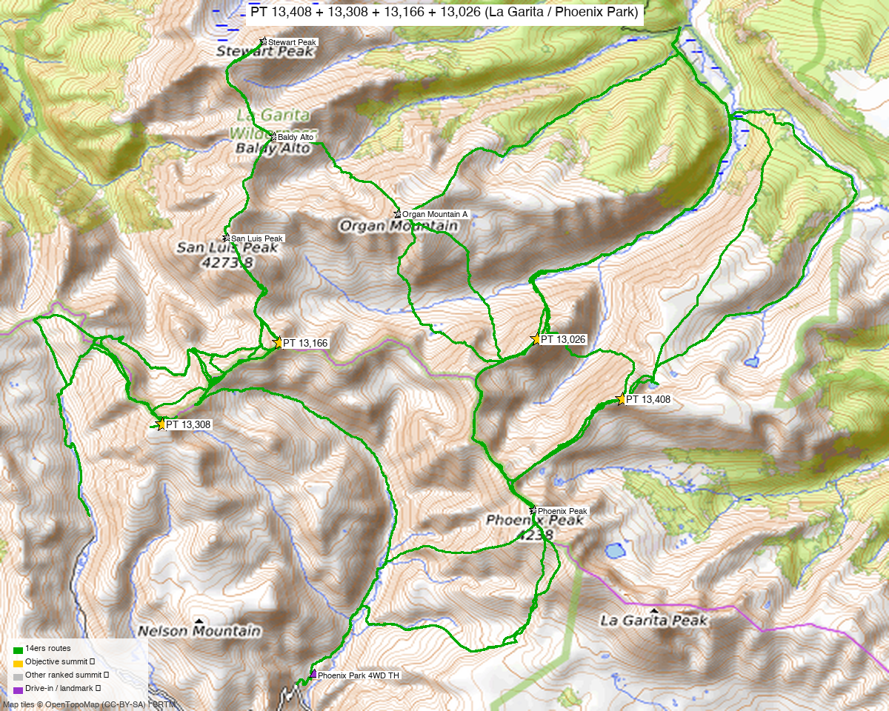

# PT 13,408 + PT 13,308 + PT 13,166 + PT 13,026 — La Garita Wilderness (Phoenix Park / Creede)

**Researched:** 2026-06-09
**Report type:** Big day / flexible — four ranked La Garita 13ers, **no single clean trailhead** (see access below)
**CalTopo research map:** https://caltopo.com/m/1J0KHCJ
**Status in DB:** all four unclimbed.

> Eastern half of the seven-peak La Garita narrow-down. The **western trio (Baldy Lejos / 13,115 / 13,030)** is the cleaner companion day — see the [Baldy Lejos trio report](baldy_lejos_trio.md).

> ⚠️ **Honest framing:** unlike the tidy western trio, **these four do not share one standard trailhead.** They can be **linked in one long day from Phoenix Park (Creede)**, but the *standard* routes approach from different sides (Cochetopa Creek to the north for 13,026/13,408; West Willow for the 13,308/13,166 bridge). Pick your poison below.

*[Interactive CalTopo map](https://caltopo.com/m/1J0KHCJ)* — 10 source GPX tracks (14ers library) from all three approaches, layered by source; 4 summit markers + Phoenix Park TH.

---

<!-- CLIMBERS_START -->
**Other climbers:** Emily Sharpe — not yet · Shawn D Keil — not yet
<!-- CLIMBERS_END -->

## Quick stats

| | PT 13,408 | PT 13,308 | PT 13,166 | PT 13,026 |
|---|---|---|---|---|
| Elevation | 13,408' | 13,308' | 13,166' | 13,026' |
| Lat / Lon | 37.9569, −106.8479 | 37.9523, −106.9449 | 37.9674, −106.9203 | 37.9680, −106.8659 |
| Class | 2 | 2 | 2 | 2 |
| CO Rank | 317 | 394 | 511 | 622 |
| Also known as | formerly UN 13,402 | (pre-LiDAR 13,308) | formerly UN 13,155 | formerly UN 13,015 |
| Weather | [NOAA](https://forecast.weather.gov/MapClick.php?lat=37.9569&lon=-106.8479) | [NOAA](https://forecast.weather.gov/MapClick.php?lat=37.9523&lon=-106.9449) | [NOAA](https://forecast.weather.gov/MapClick.php?lat=37.9674&lon=-106.9203) | [NOAA](https://forecast.weather.gov/MapClick.php?lat=37.9680&lon=-106.8659) |
| 14ers.com | [10421](https://www.14ers.com/php14ers/peak.php?peakid=10421) | [10461](https://www.14ers.com/php14ers/peak.php?peakid=10461) | [10534](https://www.14ers.com/php14ers/peak.php?peakid=10534) | [10602](https://www.14ers.com/php14ers/peak.php?peakid=10602) |
| LoJ | [397](https://listsofjohn.com/peak/397) | [510](https://listsofjohn.com/peak/510) | [648](https://listsofjohn.com/peak/648) | [806](https://listsofjohn.com/peak/806) |
| peakbagger | [84961](https://peakbagger.com/peak.aspx?pid=84961) | [39888](https://peakbagger.com/peak.aspx?pid=39888) | [39886](https://peakbagger.com/peak.aspx?pid=39886) | [84919](https://peakbagger.com/peak.aspx?pid=84919) |
| Peak DB id | 397 | 510 | 648 | 806 |

The four spread **~5.2 mi E–W** along the divide: 13,308 (W) → 13,166 → 13,026 → 13,408 (E). All Class 2 tundra/chiprock.

---

## Access — three ways in (this is the crux)

**Option A — Phoenix Park 4WD TH (Creede), all four in one big day ⭐ for a single trip**
The only way to bag all four from one trailhead. LoJ TR [1427](https://listsofjohn.com/tr?Id=1427) did **13,408 + 13,308 + 13,166 + 13,026 *plus* Phoenix Peak (13,904) + PT 13,179** in **19.2 mi / 8,800'** from Phoenix Park. **The four target peaks alone ≈ ~15–18 mi / ~6,500–8,000'** — a long, committing tundra traverse. Access: Creede → Willow Creek Rd → **East Willow → Phoenix Park 4WD road (FR 502 → 501a)**; the upper 4WD (501a) is notoriously rough.

**Option B — Cochetopa Creek / Eddiesville (north), for 13,026 + 13,408**
The *standard* climb13ers route for the eastern pair: **13.5 mi / 2,655', Class 2**, up Cochetopa Creek (CDT/Colorado Trail) then Canon Diablo. But it's **~30 mi of dirt** to the Eddiesville/Cochetopa TH (from the Gunnison/north side, not Creede), and there's significant beetle-kill deadfall/bushwhacking.

**Option C — West Willow (Creede), for the 13,308 + 13,166 bridge**
13,308 and 13,166 sit close to the western group and have been tagged from the **West Willow upper TH** (the same one as the [Baldy Lejos trio](baldy_lejos_trio.md)) on longer western days (LoJ TRs 24545 / 5946 reached 13,308 this way).

> **Recommendation:** if you want all four in **one trip**, do the **Phoenix Park traverse** (Option A) and accept the big day — optionally grabbing **Phoenix Peak (13,904, ranked)** and **PT 13,179 (ranked)** since you're there (that's the full 19.2 mi/8,800'). If you'd rather break it up, **13,026 + 13,408 from Cochetopa/Eddiesville** is the easier standalone pair, and **13,308 + 13,166** can ride along with the western trio.

---

## Per-peak notes

- **PT 13,408** (high point, 13,408') — Class 2; sequenced with 13,026 from Cochetopa Creek (climb13ers), or the east end of the Phoenix Park traverse.
- **PT 13,308** — Class 2; the western bridge peak, reachable from West Willow or Phoenix Park.
- **PT 13,166** ("North Ridge", climb13ers) — Class 2; central.
- **PT 13,026** — Class 2; "East Flank–NE Ridge" from Cochetopa Creek (13.5 mi / 2,655' with 13,408). Heavy beetle-kill in the approach forest.

---

## Drive + approach

| | |
|---|---|
| **Drive from Boulder** | **[~5 h to Creede via Google Maps](https://www.google.com/maps/dir/?api=1&origin=1162+Peakview+Circle,+Boulder,+CO+80302&destination=37.84913,-106.92766)** (for the Phoenix Park option), then the rough 4WD road above town. The Cochetopa/Eddiesville TH is a longer, separate drive from the Gunnison side. |
| Trailhead (Option A) | **Phoenix Park 4WD TH**, ~37.906, −106.913, **~10,000'**; upper 4WD (FR 501a) very rough. |
| Land | **La Garita Wilderness** (GMUG / Rio Grande NF) — **no permits/fees, foot travel only** beyond the TH; dispersed/backpack camping allowed (a good way to shorten the long traverse). |

> **Pairs with the western trio via Creede.** The Phoenix Park road and the West Willow road fork ~¾ mi above Creede — base in Creede, but the two upper trailheads are **~2–3 h of rough driving apart**.

---

## Conditions / season

- **Best window:** **July through September** — remote, high, snow lingers; the 4WD roads open late.
- **Terrain:** Class 2 tundra/chiprock on the peaks; the *difficulty is the length, the rough roads, and beetle-kill deadfall* on the approaches — not technical climbing.
- **Storms:** a long exposed divide (especially the Phoenix Park traverse) — very early start, watch the weather.
- **Consider backpacking** into the basin to break up the traverse — it's wilderness, so dispersed camping is allowed.

---

## Cell coverage

- **14ers.com community DB:** no reception reports.
- **Geographic reasoning:** deep La Garita — **dead** at all trailheads and likely on-peak.
- **Recommendation:** **InReach / satellite messenger** essential given the length and remoteness.

---

## Trip reports & GPX (all sources)

**Sources confirmed logged in:** 14ers.com ("letsgocu"), listsofjohn.com (logged in), peakbagger.com (logged in). **10 GPX tracks** swept from the 14ers library (covering all three approaches) — all on the CalTopo map. One showed sensor noise (an impossible 33 mi / 16k′ — ignored).

### listsofjohn.com (logged in)
| GPX | Peaks / approach |
|---|---|
| [TR 1427](https://listsofjohn.com/tr?Id=1427) | **all four + Phoenix Peak + 13,179** from Phoenix Park — 19.2 mi / 8,800' ⭐ |
| [TR 5364](https://listsofjohn.com/tr?Id=5364) | 13,408 + 13,166 + 13,026 (+ San Luis Peak / Baldy Alto on a backpack) |
| [TR 24545](https://listsofjohn.com/tr?Id=24545) | 13,308 with the western trio (from West Willow) |

### 14ers.com GPX library (logged in, "letsgocu")
Tracks from Phoenix Park (south), Cochetopa/Eddiesville (north), and West Willow (west) — all layered.

### peakbagger.com (logged in)
Pages verified for all four; **ownership = La Garita Wilderness** (GMUG / Rio Grande NF).

### climb13ers.com
[UN 13,026 East Flank–NE Ridge](https://www.climb13ers.com/colorado-13ers/un13015) (with 13,408, **13.5 mi / 2,655'** from Cochetopa Creek) · [UN 13,166 North Ridge](https://www.climb13ers.com/colorado-13ers/un13155).

**Sources checked:** 14ers.com ✓ (logged in, "letsgocu") · listsofjohn.com ✓ (logged in) · peakbagger.com ✓ (logged in) · climb13ers.com ✓

---

## TL;DR

- **Four ranked La Garita 13ers** spread ~5.2 mi along the divide E of the Baldy Lejos trio — **all Class 2**, but **no single clean trailhead.**
- **One-trip option:** the **Phoenix Park traverse** from Creede — **~15–18 mi / ~6,500–8,000'** for the four (or the full 19.2 mi / 8,800' adding Phoenix Peak + 13,179). A big, committing day; backpacking shortens it.
- **Break-it-up option:** **13,026 + 13,408 from Cochetopa/Eddiesville** (13.5 mi / 2,655', but ~30 mi dirt + deadfall); **13,308 + 13,166** ride along with the western trio from West Willow.
- **La Garita Wilderness** — no permits, foot-only, camping OK. Cell dead — InReach.
- **Pairs with the [Baldy Lejos trio](baldy_lejos_trio.md)** on a Creede trip (roads fork above town; ~2–3 h of rough driving between the two upper THs).
- **Research map:** https://caltopo.com/m/1J0KHCJ
