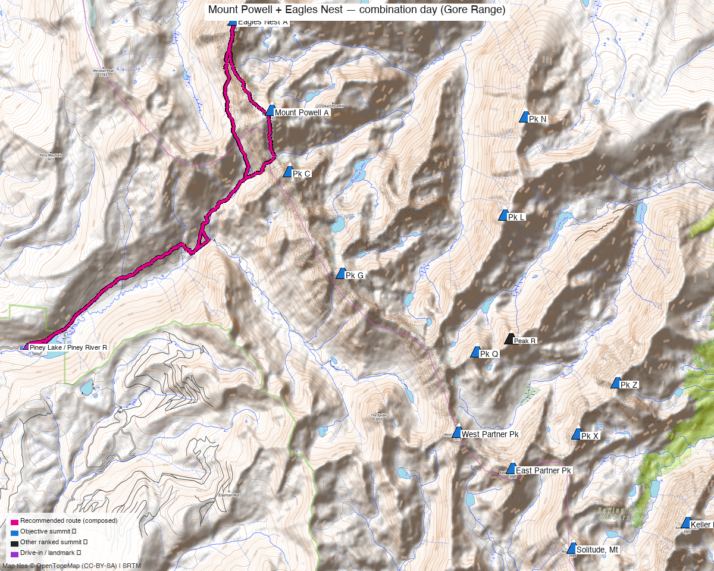

# Mount Powell + Eagles Nest — combination day (Gore Range)

<!-- QUICKSTATS_START -->

!!! tip "At a glance — recommended day"
    **13.8 mi** · **6,024 ft** gain · **Class 3** · 2 peaks · ~3.1 h drive

<!-- QUICKSTATS_END -->

**Researched:** 2026-06-02

!!! tip "Map & weather"
    **CalTopo research map:** https://caltopo.com/m/GG1BKFL

    **Trip NOAA weather:** [Mount Powell + Eagles Nest Weather](https://forecast.weather.gov/MapClick.php?lat=39.76009&lon=-106.34074)

**Status in DB:** Both 0 ascents (unclimbed). **Mount Powell is the highest peak in the Gore Range.**

<!-- PROVENANCE_START -->
*Note: the recommended route was distilled from **21 recorded GPS tracks** of real trips (recorded trips) — all layered on the [interactive CalTopo research map](https://caltopo.com/m/GG1BKFL).*
<!-- PROVENANCE_END -->

---

<!-- CLIMBERS_START -->
**Other climbers:** Emily Sharpe — 1 of 2 (Mount Powell A) · Shawn D Keil — 1 of 2 (Mount Powell A)
<!-- CLIMBERS_END -->

## Quick stats

| | Mount Powell A | Eagles Nest A |
|---|---|---|
| Elevation (LiDAR) | 13,556' | 13,419' |
| Lat / Lon | 39.76009, −106.34074 | 39.77559, −106.3504 |
| Class (standard) | 2 | 3 |
| 14ers.com peak page | [10218](https://www.14ers.com/peaks/10218/13er-mount-powell-a) | [10219](https://www.14ers.com/peaks/10219/13er-eagles-nest) |
| listsofjohn.com | [245](https://listsofjohn.com/peak/245) | [380](https://listsofjohn.com/peak/380) |
| peakbagger.com | [pid 5774](https://peakbagger.com/peak.aspx?pid=5774) | [pid 38390](https://peakbagger.com/peak.aspx?pid=38390) |
| Peak DB id | 245 | 380 |
| Range / Wilderness | Gore / Eagles Nest Wilderness | same |

**The two summits are 1.19 mi apart** — a natural, well-established pairing.

---

## Why these two together

A **standard combination**. The recent trip reports that hit either peak do both in one outing:

- **elijahdgendron** (2025-08-17) — Powell + Eagles Nest
- **josephnephi** (2025-07-07) — Powell + Eagles Nest
- **whileyh** (2025-07-01) — Powell + Eagles Nest (+ "Dwarf Pyramid" 12,669')
- **datum** (2020-11-07) — Powell + Eagles Nest (+ "East Corner")

**Combos (ranked 13er+ rule):** each is a true ranked partner for the other (13,556' + 13,419'). Both unclimbed — this is the efficient way to bag the Gore high point and its neighbor in one (big) day.

---

## Drive + approach

| | |
|---|---|
| **Drive from Boulder** | **[3h 5m via Google Maps](https://www.google.com/maps/dir/?api=1&origin=1162+Peakview+Circle,+Boulder,+CO+80302&destination=39.7203,-106.4051)** (129 mi, origin: 1162 Peakview Circle) — the closest of the deep-Gore 13ers |
| Trailhead | **Piney Lake / Piney River Ranch** (~9,350'), ~11 mi up Red Sandstone Rd / Piney Lake Rd, N of Vail |
| Vehicle | Piney Lake Rd is dirt — washboarded but 2WD-passable in dry conditions; rough/​muddy when wet. Piney River Ranch charges day-use parking. |
| Approach | From Piney Lake, the **Upper Piney River trail** east, then up toward Kneeknocker Pass / Powell's west approach |

---

## Recommended plan — Piney Lake ⭐

**Combo stats (from TR GPX):** roughly **~12–14 mi and ~5,500–7,000 ft** for the pair from Piney Lake — a long, committing alpine day. (Some logged tracks run longer/​bigger with extra sub-peaks.)

1. From **Piney Lake**, follow the **Upper Piney River trail** east up the valley.
2. Climb out of the basin toward the Powell massif (the standard line gains the **west/​southwest side** of Powell).
3. **Mount Powell (13,556', Class 2):** the Gore Range high point — talus/​boulder to the summit.
4. **Traverse N ~1.2 mi to Eagles Nest (13,419', Class 3):** the connecting ridge/​final summit involves Class 3 scrambling on Gore-quality rock. This is the technical crux of the day.
5. Return to Piney Lake the way you came.

> **Order/​direction varies by TR** — some climb Eagles Nest first, some Powell first. Study the GPX on the research map for the exact connecting line; the ridge has route-finding and Class 3 sections.

---

## Conditions / season

- **Best window:** July through September. The Gore holds snow late and the approach is long — mid-summer for the dry standard lines.
- **Rock:** classic Gore Range — solid where steep, but loose blocks; Eagles Nest's Class 3 demands attention.
- **Length:** this is a **big day** (12–14+ mi, 5,500'+). Alpine start; watch the long exit.
- **Storms:** standard high-Gore afternoon storm exposure on a long ridge — be moving early.
- **Access:** Piney Lake Rd can be rough/​muddy after rain; Piney River Ranch is private (day-use fee, seasonal).

---

## Permits / access

- **Eagles Nest Wilderness** (White River NF) — no permits required; standard wilderness rules (no motorized, leash dogs, groups ≤ 15).
- Piney River Ranch is private land at the trailhead — pay the day-use parking fee; be respectful of the ranch operation.

---

## Cell coverage

- **14ers.com community DB:** no reports for either summit.
- **Geographic reasoning:**
  - **Piney Lake TH / Upper Piney basin:** likely **dead** — deep valley behind the Gore crest, shadowed from the I-70/​Vail corridor.
  - **Powell / Eagles Nest summits:** **possible signal on top** — high Gore points with some LOS toward the Vail / I-70 corridor to the south, but not reliable.
- **Standard recommendation:** carry an **InReach** — long, committing day with a Class 3 crux and a deep-valley approach.

---

## Trip reports & GPX (all three sources)

| Source | Notable TRs | GPX |
|---|---|---|
| **listsofjohn.com** | elijahdgendron 2025, josephnephi 2025, whileyh 2025, datum 2020 (all Powell **+** Eagles Nest); cougar 2023, John Kirk 2012 | [18036](https://listsofjohn.com/gpx/18036.gpx) ⭐ combo, [17847](https://listsofjohn.com/gpx/17847.gpx), [17866](https://listsofjohn.com/gpx/17866.gpx), [9122](https://listsofjohn.com/gpx/9122.gpx) |
| **14ers.com** | 23 Powell TRs incl. "From Piney Ranch"; per-peak GPX library | 9 files |
| **peakbagger.com** (logged in, Kyle Knutson) | ascent tracks for both pids | 6 files |

**GPX collected: 21 track files across all three sources** — layered on the [CalTopo research map](https://caltopo.com/m/GG1BKFL).

**Sources checked:** 14ers.com · listsofjohn.com · peakbagger.com

