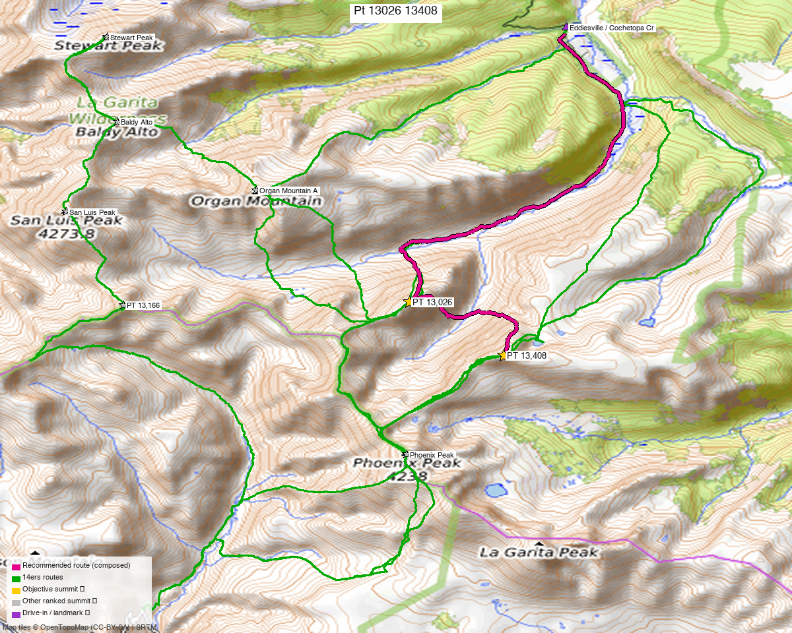

# PT 13,408 + PT 13,026 — La Garita Wilderness (Cochetopa Creek / Eddiesville)

**Researched:** 2026-06-09
**Report type:** Day trip (long approach) — the eastern pair of the La Garita 13er cluster
**CalTopo research map:** https://caltopo.com/m/562G87A
**Status in DB:** both unclimbed.

> Split out of the former "Phoenix Park Four." This eastern pair has its **own standard trailhead (Cochetopa Creek / Eddiesville, north)** — different drainage and a different drive from the [western "bridge" pair (13,308 + 13,166)](pt_13308_13166.md) and the [Baldy Lejos trio](baldy_lejos_trio.md).

*[Interactive CalTopo map](https://caltopo.com/m/562G87A)* — source GPX tracks (14ers library) in green, with the **recommended composed route in bold magenta** (the shortest loop through both ranked peaks from the Eddiesville TH); 2 summit markers.*

---

<!-- CLIMBERS_START -->
**Other climbers:** Emily Sharpe — not yet · Shawn D Keil — not yet
<!-- CLIMBERS_END -->

## Quick stats

| | PT 13,408 | PT 13,026 |
|---|---|---|
| Elevation | 13,408' | 13,026' |
| Lat / Lon | 37.9569, −106.8479 | 37.9680, −106.8659 |
| Class | 2 | 2 ("East Flank–NE Ridge", climb13ers) |
| CO Rank | 317 | 622 |
| Also known as | formerly UN 13,402 | formerly UN 13,015 |
| Weather | [NOAA](https://forecast.weather.gov/MapClick.php?lat=37.9569&lon=-106.8479) | [NOAA](https://forecast.weather.gov/MapClick.php?lat=37.9680&lon=-106.8659) |
| 14ers.com | [10421](https://www.14ers.com/php14ers/peak.php?peakid=10421) | [10602](https://www.14ers.com/php14ers/peak.php?peakid=10602) |
| LoJ | [397](https://listsofjohn.com/peak/397) | [806](https://listsofjohn.com/peak/806) |
| peakbagger | [84961](https://peakbagger.com/peak.aspx?pid=84961) | [84919](https://peakbagger.com/peak.aspx?pid=84919) |
| Peak DB id | 397 | 806 |

The two are **~1.4 mi apart**, both Class 2 — climb13ers sequences them as one outing.

---

## Recommended day — Cochetopa Creek / Eddiesville TH (north) ⭐

A long, gentle valley approach up **Cochetopa Creek (Continental Divide / Colorado Trail)**, then into **Canon Diablo** to gain the peaks — the mileage is mostly the approach; the climbing is easy Class 2.

| | |
|---|---|
| Peaks | PT 13,408 + PT 13,026 |
| **Recommended loop (composed)** | **~16 mi / ~6,700'** — shortest route through both ranked peaks from the Eddiesville TH, pieced from real recorded tracks (`build_recommended_route.py`); gain DEM-measured (the long rolling Cochetopa/Canon Diablo approach adds up) |
| climb13ers' estimate | **~13.5 mi / ~2,655'** — an approximation; **both numbers run well low** — ~2.5 mi shorter than the real loop, and the 2,655' gain is implausible (net to PT 13,408 alone is ~3,100' from this TH) |
| Trailhead | **Eddiesville / Cochetopa Creek TH (~10,300')** — graded but **~30 mi of dirt** from the Gunnison/north side |
| Heads-up | significant **beetle-kill deadfall / bushwhacking** in the approach forest |

*The **recommended route (bold magenta)** — the shortest loop through PT 13,026 + PT 13,408 from the Eddiesville TH, ~16 mi, stitched from real recorded GPS. Drawn over all the source tracks (green), which sprawl off to San Luis Peak, Stewart, Organ, and Phoenix; the magenta line trims to just the two ranked objectives.*

### Notes
- **PT 13,026** is climb13ers' "East Flank–NE Ridge," **sequenced with PT 13,408** across the valley (LoJ TR [26630](https://listsofjohn.com/tr?Id=26630) did both + extras; [5364](https://listsofjohn.com/tr?Id=5364) did 13,408 + 13,166 + 13,026 on a San Luis Peak backpack).
- **Alternate access — Phoenix Park (Creede, south):** both are also reachable from the Phoenix Park 4WD road, but that's a longer, rougher day (the old "Phoenix Park traverse"). The Cochetopa side is the shorter standard.
- This pair is also natural to fold into a **San Luis Peak / Stewart Creek backpack** (TR 5364), since you're already deep in the La Garita.

---

## Drive + approach

| | |
|---|---|
| **Drive from Boulder** | **~5–6 h** via Gunnison → Cochetopa / NN14 (Eddiesville) — a long gravel approach, *not* the Creede side. ([Maps to the TH area](https://www.google.com/maps/dir/?api=1&origin=1162+Peakview+Circle,+Boulder,+CO+80302&destination=38.025,-106.836)) |
| Trailhead | **Eddiesville / Cochetopa Creek TH**, ~38.025, −106.836, **~10,300'** (passenger-car-able with care, ~30 mi dirt). |
| Land | **La Garita Wilderness** (GMUG NF) — no permits/fees, foot-only beyond the TH; dispersed/backpack camping allowed (handy given the long approach). |

---

## Conditions / season

- **Best window:** July–September; remote, high, snow lingers.
- **Terrain:** Class 2 tundra/chiprock on the peaks; the work is the **long valley approach + beetle-kill deadfall**, not technical.
- **Storms:** exposed once on the divide — early start.
- **Cell:** dead — carry an InReach.

---

## Trip reports & GPX (all sources)

**Sources confirmed logged in:** 14ers.com ("letsgocu"), listsofjohn.com, peakbagger.com. 14ers-library tracks (Cochetopa/Eddiesville and Phoenix Park approaches) are layered on the CalTopo map.

- **listsofjohn.com:** [TR 26630](https://listsofjohn.com/tr?Id=26630) (13,408 + 13,026 + Ribbed Pk ridge), [TR 5364](https://listsofjohn.com/tr?Id=5364) (with San Luis Peak / Baldy Alto backpack).
- **peakbagger.com:** both verified — **La Garita Wilderness** (GMUG NF).
- **climb13ers.com:** [UN 13,026 "East Flank–NE Ridge"](https://www.climb13ers.com/colorado-13ers/un13015) — **13.5 mi / 2,655'** (an estimate; the recorded-GPX shortest loop is ~16 mi / ~6,700' DEM — both climb13ers figures run low; see the recommended-day note).

**Sources checked:** 14ers.com ✓ (logged in, "letsgocu") · listsofjohn.com ✓ · peakbagger.com ✓ · climb13ers.com ✓

---

## TL;DR

- **Two ranked La Garita 13ers (Class 2)** ~1.4 mi apart — sequenced as one day from the **Cochetopa Creek / Eddiesville TH (north)**: **~16 mi / ~6,700'** (recorded-GPX shortest loop, DEM gain; climb13ers estimates 13.5 mi / 2,655', which runs low), a long valley approach (CDT/Colorado Trail) + easy Class 2, with beetle-kill deadfall.
- **Different drive + trailhead** from the western La Garita peaks — this is the **Gunnison/Cochetopa side**, not Creede. Also reachable (longer) from Phoenix Park.
- Natural to combine with a **San Luis Peak / Stewart Creek backpack** if you want more.
- **La Garita Wilderness**; cell dead — InReach.
- **Split from the old "Phoenix Park Four"**; the [western pair (13,308 + 13,166)](pt_13308_13166.md) is its own report.
- **Research map:** https://caltopo.com/m/562G87A
