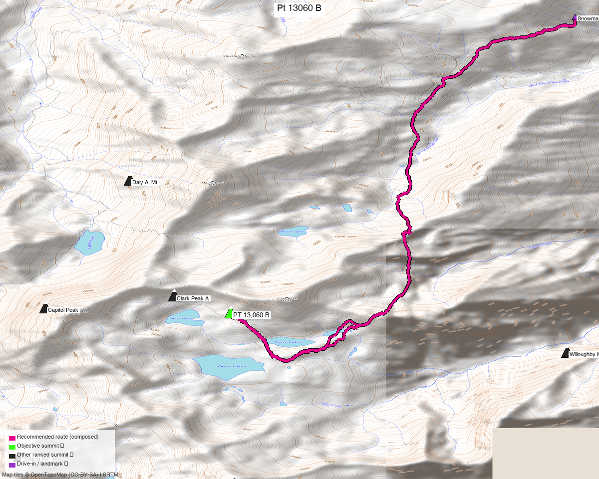

# PT 13,060 B ("13067") — Snowmass Creek / Pierre Lakes (Class 3)

<!-- CLIMBERS_START -->
**Other climbers:** Emily Sharpe — not yet · Shawn D Keil — not yet
<!-- CLIMBERS_END -->

<!-- QUICKSTATS_START -->

!!! tip "At a glance — recommended day"
    **14.48 mi** · **4,745 ft** gain · **Class 3** · 1 peak · ~4 h drive

<!-- QUICKSTATS_END -->

**Researched:** 2026-07-23

!!! weather ""
    **NOAA weather link:** [PT 13,060 B weather](https://forecast.weather.gov/MapClick.php?lat=39.149&lon=-107.052)

!!! map ""
    **CalTopo research map:** <https://caltopo.com/m/0AND4LU>

**Status in DB:** unclimbed. A ranked Elk Range 13er (13,067' LiDAR, prev. 13,060'; **Class
3**) above **Pierre Lakes** in the **Snowmass Wilderness** — 0.52 mi north of Clark Peak A
(which you've climbed, along with Capitol, Snowmass, and Hagerman nearby). LoJ and 14ers both
list it by elevation ("13067" / "Unnamed 13067"); the peak_db / 14ers name is **PT 13,060 B**.
This is the leftover ranked summit on the Snowmass-Lake massif.

<!-- PROVENANCE_START -->
*Note: the recommended route was distilled from **70 recorded GPS tracks** of real trips (14ers.com · peakbagger) — all layered on the [interactive CalTopo research map](https://caltopo.com/m/0AND4LU).*
<!-- PROVENANCE_END -->

---

## Peaks covered

A single **Class 3** Elk Range 13er — but a **serious, remote one**: the difficulty is the
long approach and the loose, trail-less **Pierre Lakes** talus, not sustained technical
climbing.

| Peak | Elev | Class | Prom | CO rank | peak_db |
|---|---|---|---|---|---|
| [PT 13,060 B ("13067")](https://listsofjohn.com/peak/760) | 13,067' | 3 | ~347' | ~#593 | 760 |

Pitkin County, **Snowmass Wilderness** (Maroon Bells–Snowmass), White River NF — no
permits/fees, but full wilderness rules and a self-issued permit at the trailhead register.

---

## Getting there — Snowmass Creek (Old Snowmass)

**Drive from Boulder:** **[~4h via Google Maps](https://www.google.com/maps/dir/?api=1&origin=1162+Peakview+Circle,+Boulder,+CO+80302&destination=39.20014,-106.99401)** (origin: 1162 Peakview Circle) — I-70 W to **Glenwood Springs**, **CO-82** SE to **Old Snowmass**, then **Snowmass Creek Rd** to the Snowmass Creek / Snowmass Falls trailhead.

| | |
|---|---|
| **Trailhead — Snowmass Creek / Snowmass Falls** | ~39.20014,-106.99401, **~8,400'** (recorded GPS-track start). Passenger-car accessible; the road is 2WD to the TH lot. |
| Access note | The first mile+ crosses/adjoins private land (Snowmass Falls Ranch) — stay on the signed trail/easement. |

---

## Route — Snowmass Creek → West Snowmass Creek → Pierre Lakes (Class 3)

**~14.5 mi · ~4,750 ft round trip** — the recommended line follows a **recorded peakbagger
ascent verbatim** (best fidelity for an off-trail route): up the **Snowmass Creek Trail**,
branching up **West Snowmass Creek** into the rugged **Pierre Lakes** basin, then the
**Class 3** talus/blocks to the summit. Return the same way (a true out-and-back).

**This is Elk Range rock and a trail-less basin — treat it seriously:**

- **Pierre Lakes is notoriously rugged**, trail-less granite talus and slabs; slow, tedious
  boulder-hopping and routefinding both ways. Budget more time than the mileage suggests.
- **Loose rock** is the Elks' signature hazard — test holds, watch for parties/rockfall on
  the Class 3 sections, and **carry a helmet**.
- It's long and committing for a single day (~14.5 mi with a big off-trail component); many
  parties **backpack** partway (Snowmass Creek / lower Pierre Lakes) and climb from camp.

---

## Gear & season

- **Best window:** **mid-July through September** — Pierre Lakes holds snow late and the
  granite is best dry; early season adds snow/ice to the basin.
- **Gear:** Class 3 — no rope in season for the standard line, but **helmet** for the loose
  Elk rock; poles help on the endless talus. Solid routefinding (map/GPS) — there's **no
  trail** above West Snowmass Creek.
- **Terrain:** above treeline for the upper half; early start, off the summit by the
  early-afternoon monsoon.
- **Cell:** unreliable in the Snowmass Creek / Pierre Lakes drainage — **carry an InReach**.

---

## Other considerations

**Why this is its own trip, not a combo.** PT 13,060 B sits 0.5–1.8 mi from other unclimbed
Elk 13ers (Mt Daly, "Siberia Peak"), but those are reached from **different trailheads**
(Capitol Creek, Lead King Basin) — Daly is ~1.5–2 h of driving away, and no recorded track
links them across the Pierre Lakes divide. So this stands alone from the Snowmass Creek side.
Its natural partner, **Clark Peak A** (0.52 mi, on the same ridge), you've **already
climbed** — if you hadn't, the two would pair on one Pierre Lakes push.

**Long drive + long approach.** ~4 h each way and a big off-trail day — a strong candidate
for a car-camp-the-night-before or a backpack-in, rather than a car-to-car dawn patrol.

---

## Trip reports & GPX (all three sources)

**Sources confirmed logged in:** 14ers.com ("Basin"), listsofjohn.com ("letsgocu"),
peakbagger.com ("Kyle Knutson"). The peak's library was swept across all three sources and
deduped, plus the full OSM trail network — layered on the CalTopo map.

- **14ers.com:** peak [Unnamed 13067 (10131)](https://www.14ers.com/peaks/10131) — 2 GPX-library tracks; no formal route description (unnamed peak).
- **listsofjohn.com:** peak [760 ("13067")](https://listsofjohn.com/peak/760) — trip reports (text; no downloadable GPX).
- **peakbagger.com:** peak [Peak 13063 (84897)](https://peakbagger.com/peak.aspx?pid=84897) — ascent GPX pulled; the Snowmass Creek → Pierre Lakes ascent is the basis for the recommended route.

**Sources checked:** 14ers.com ✓ (logged in, "Basin") · listsofjohn.com ✓ (logged in, "letsgocu") · peakbagger.com ✓ (logged in, "Kyle Knutson")
