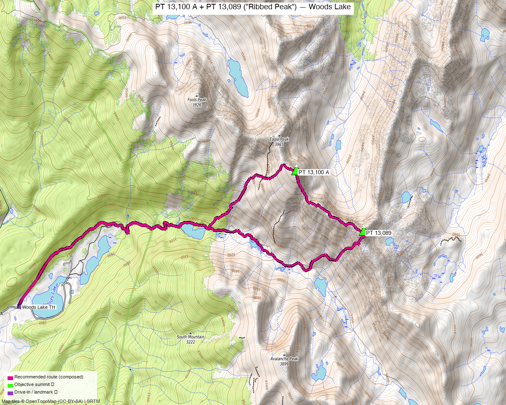

# PT 13,100 A + PT 13,089 ("Ribbed Peak") — Woods Lake

<!-- CLIMBERS_START -->
**Other climbers:** Emily Sharpe — not yet · Shawn D Keil — 1 of 2 (PT 13,100 A)
<!-- CLIMBERS_END -->

<!-- QUICKSTATS_START -->

!!! tip "At a glance — recommended day"
    **11.36 mi** · **4,726 ft** gain · **Class 3** · 2 peaks · ~3.5 h drive

<!-- QUICKSTATS_END -->

**Researched:** 2026-07-23

!!! weather ""
    **NOAA weather link:** [Woods Lake area weather](https://forecast.weather.gov/MapClick.php?lat=39.437&lon=-106.570)

!!! map ""
    **CalTopo research map:** <https://caltopo.com/m/A4NV4U1>

**Status in DB:** both unclimbed. Two ranked 13ers ~1 mi apart at the head of the **Woods
Lake** drainage in the **Holy Cross Wilderness** — the southern pair of the Gold Dust
cluster, on their own trailhead (~1.5–2 h drive from the Fulford peaks). Climbed **together**
in the recorded peakbagger ascent as a single Class 3 loop.

<!-- PROVENANCE_START -->
*Note: the recommended route was distilled from **31 recorded GPS tracks** of real trips (peakbagger · Kyle's recordings) — all layered on the [interactive CalTopo research map](https://caltopo.com/m/A4NV4U1).*
<!-- PROVENANCE_END -->

---

## Peaks covered

Two unranked-name ranked 13ers on the ridge SE of the Gold Dust group. **PT 13,089** — LoJ
calls it **"Ribbed Peak"** — is the Class 3 crux; **PT 13,100 A** just north is a Class 2
walk-up. They're 0.98 mi apart and climbed together.

| Peak | Elev | Class | Prom | CO rank | peak_db |
|---|---|---|---|---|---|
| [PT 13,100 A](https://listsofjohn.com/peak/711) | 13,071' | 2 | ~380' | ~#591 | 711 |
| [PT 13,089 ("Ribbed Peak")](https://listsofjohn.com/peak/732) | 13,089' | 3 | ~640' | ~#575 | 732 |

Both sit in the **Holy Cross Wilderness**, White River NF — no permits/fees; standard
wilderness rules on the hike. Neither has a formal route description (soft-ranked, TR-only
beta).

---

## Getting there — Woods Lake (Eagle County)

**Drive from Boulder:** **[~3.5h via Google Maps](https://www.google.com/maps/dir/?api=1&origin=1162+Peakview+Circle,+Boulder,+CO+80302&destination=39.42269,-106.63916)** (origin: 1162 Peakview Circle) — I-70 W to **Eagle (exit 147)**, then Brush Creek Rd → **Sylvan Lake State Park** → **Woods Lake Rd** to the Woods Lake TH.

| | |
|---|---|
| **Trailhead — Woods Lake** | ~39.42269,-106.63916, **~9,390'** — head of the Woods Lake Rd (recorded pb start; OSM/CalTopo "Woods Lake TH"). |
| Vehicle | Dirt-road approach through Sylvan Lake; **high-clearance helps** on the upper Woods Lake Rd. |

---

## Route — Woods Lake to both summits (Class 3)

**~11.4 mi · ~4,730 ft round trip** — the recommended line is **graph-optimized** from the
Woods Lake TH through the pooled recorded track + OSM trails: a **loop** up the drainage
toward the lakes, then **PT 13,100 A** (Class 2), a ridge/basin traverse SE to **PT 13,089 /
"Ribbed Peak"** (the **Class 3** crux — blocky scrambling near the summit; take the harder
read and carry a helmet), and back to the trailhead. No add-on peaks or out-and-back spurs —
just the two objectives.

The Class 3 is short and confined to the Ribbed Peak summit block; the rest is Class 2
tundra and talus with no sustained exposure.

---

## Gear & season

- **Best window:** **mid-July through September** — the Woods Lake basin holds snow late;
  the access road opens late.
- **Gear:** Class 2/3 — no rope in season, but **helmet for the Ribbed Peak (PT 13,089)
  Class 3 crux**. High-clearance helps on the Woods Lake Rd.
- **Terrain:** above treeline for the upper half — early start, off the summits by the
  early-afternoon monsoon.
- **Cell:** unreliable in the Woods Lake drainage — **carry an InReach**.

---

## Other considerations

**Why not combine with the Gold Dust group?** These two share the Holy Cross Wilderness with
Gold Dust / Pika / Finnegan, but sit on a **separate trailhead** (Woods Lake) ~1.5–2 h of
driving from the Fulford peaks, with no recorded track linking the two zones — so they stand
as their own day. They pair naturally into a **car-camp weekend** with the [Gold Dust Group
2-day trip](../trips/gold_dust_group.md) if you want all five in one outing.

---

## Trip reports & GPX (all three sources)

**Sources confirmed logged in:** 14ers.com ("Basin"), listsofjohn.com ("letsgocu"),
peakbagger.com ("Kyle Knutson"). Both peaks' libraries were swept across the three sources
and deduped, plus the full OSM trail network — layered on the CalTopo map.

- **14ers.com:** peak pages [Unnamed 13071 (10816)](https://www.14ers.com/peaks/10816), [Unnamed 13089 (10821)](https://www.14ers.com/peaks/10821) — no GPX-library tracks, no route descriptions (verified empty).
- **listsofjohn.com:** [PT 13,100 A (711)](https://listsofjohn.com/peak/711), [PT 13,089 "Ribbed Peak" (732)](https://listsofjohn.com/peak/732) — trip reports (text; no downloadable GPX).
- **peakbagger.com:** PT 13,100 A pid 84729, PT 13,089 pid 84730 — ascent GPX pulled (the Woods Lake loop covering both is the basis for the recommended route).

**Sources checked:** 14ers.com ✓ (logged in, "Basin") · listsofjohn.com ✓ (logged in, "letsgocu") · peakbagger.com ✓ (logged in, "Kyle Knutson")
