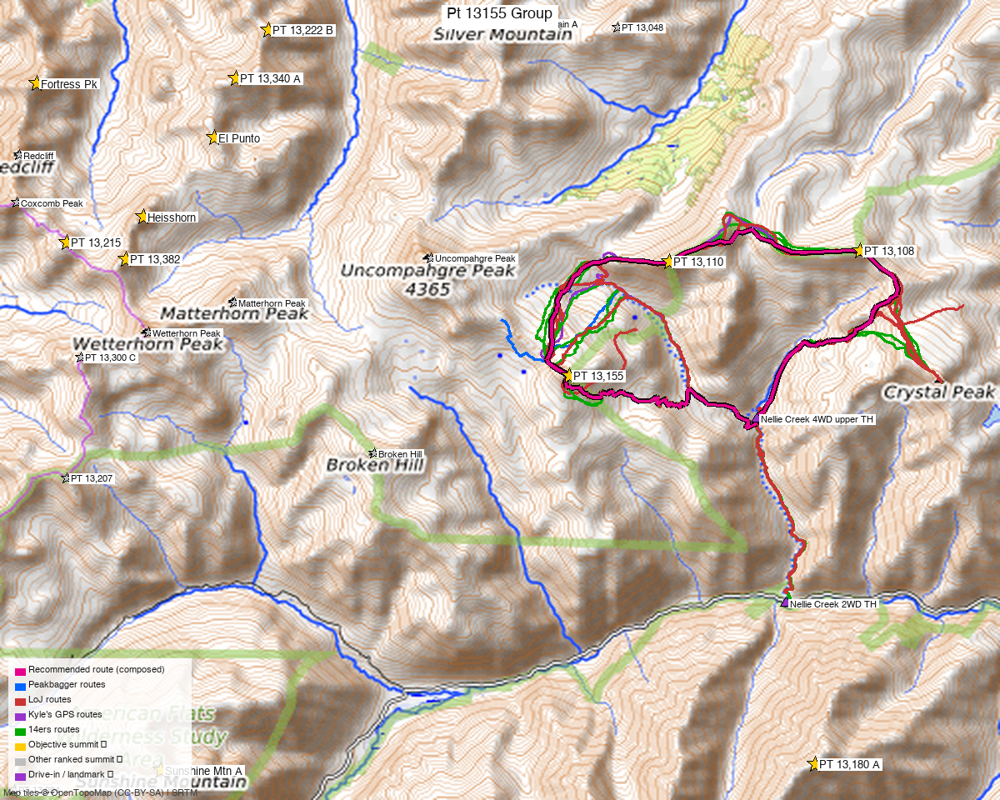

# PT 13,155 Group — Uncompahgre's Three Children (San Juan)

<!-- QUICKSTATS_START -->

!!! tip "At a glance — recommended day"
    **4,463 ft** gain · **Class 2** · 3 peaks · ~5.6 h drive

<!-- QUICKSTATS_END -->

**Researched:** 2026-06-03
**Report type:** Day trip (3 ranked 13ers, one outing)
**CalTopo research map:** https://caltopo.com/m/07PMBS1
**Status in DB:** All three 0 ascents (unclimbed). The quiet 13er neighbors of **Uncompahgre Peak**, off **Nellie Creek**.

*[Interactive CalTopo map](https://caltopo.com/m/07PMBS1)*

---

<!-- CLIMBERS_START -->
**Other climbers:** Emily Sharpe — not yet · Shawn D Keil — ✓ all
<!-- CLIMBERS_END -->

## Quick stats

| | PT 13,155 | PT 13,110 | PT 13,108 |
|---|---|---|---|
| Elevation (LiDAR) | 13,155' | 13,110' | 13,108' |
| Lat / Lon | 38.0542, −107.4381 | 38.0712, −107.4209 | 38.0728, −107.3879 |
| Weather | [NOAA](https://forecast.weather.gov/MapClick.php?lat=38.0542&lon=-107.4381) | [NOAA](https://forecast.weather.gov/MapClick.php?lat=38.0712&lon=-107.4209) | [NOAA](https://forecast.weather.gov/MapClick.php?lat=38.0728&lon=-107.3879) |
| Class (standard) | 2 | 2 | 2 |
| listsofjohn.com | [645](https://listsofjohn.com/peak/645) | [707](https://listsofjohn.com/peak/707) | [726](https://listsofjohn.com/peak/726) |
| Peak DB id | 645 | 707 | 726 |
| Range / Wilderness | San Juan / Uncompahgre Wilderness | same | same |

Weather is the **same NOAA target on all three** (and on 14ers/LoJ/peakbagger). The three points sit in a ~2.5-mi arc on the high tundra SE/E of Uncompahgre Peak.

---

## Why these three together

A **standard cluster day** — they're literally catalogued as **"Uncompahgre's Three Children."** TRs that hit one almost always do all three from Nellie Creek:

- **"Uncompahgres 3 Children"** ([14ers 22909](https://www.14ers.com/php14ers/tripreport.php?trip=22909)) — exactly this combo
- **"Uncompahgre's Less Climbed Friends"** ([9334](https://www.14ers.com/php14ers/tripreport.php?trip=9334)) · **"Wetterhorn and Uncompahgre's quiet 13er neighbors"** ([17490](https://www.14ers.com/php14ers/tripreport.php?trip=17490))
- **"From Nellie Creek Trailhead"** ([22365](https://www.14ers.com/php14ers/tripreport.php?trip=22365)) · **"Nellie and East Nellie from Nellie Creek"** ([20364](https://www.14ers.com/php14ers/tripreport.php?trip=20364))

All three are ranked 13ers, so each is a true combo partner — 3-for-1 on the long Lake City drive.

---

## Drive + approach

| | |
|---|---|
| **Drive from Boulder** | **[5h 34m via Google Maps](https://www.google.com/maps/dir/?api=1&origin=1162+Peakview+Circle,+Boulder,+CO+80302&destination=38.0204,-107.4007)** (280 mi, origin: 1162 Peakview Circle) — the long pole here is the drive; plan to camp |
| 2WD trailhead | Nellie Creek **2WD lot** (~9,320'), 5 mi up the Uncompahgre/CR-20 road from Lake City |
| 4WD trailhead | Nellie Creek **upper TH** (~11,430') — ~4 mi of **rough, high-clearance 4WD** (the standard Uncompahgre road; creek crossing) |
| Vehicle | Stock cars stop at the 2WD lot (adds ~8 mi RT + ~2,000'); the upper TH needs real 4WD/clearance |

---

## Recommended plan — Nellie Creek ⭐

The same approach as the Uncompahgre 14er: up Nellie Creek into the high basin, then tag the three points on the tundra ridges SE/E of Uncompahgre. Class 2 throughout — no scrambling on the standard lines, just high-altitude tundra and talus with route-finding between summits.

**Combo stats (from TR GPX):** roughly **~6–8 mi RT and ~3,000–3,500 ft from the 4WD upper TH**; **~14–16 mi / ~5,000+ ft if you start from the 2WD lot.** (The wide spread in the logged tracks reflects 2WD-vs-4WD starts and parties that also tag Uncompahgre.)

1. Drive/​hike Nellie Creek to the upper TH (~11,430').
2. Continue up the Uncompahgre trail into the basin.
3. Tag the three points on their connecting tundra ridges — order varies by TR; study the GPX on the research map for the most efficient link.
4. Return via Nellie Creek.

> **Add-on:** **Uncompahgre Peak** (14,309', the standard reason people are on this road) is right here — if it's unclimbed or a repeat you want, it folds in naturally. Several nearby ranked 13ers (Matterhorn, the Nellie/Wetterhorn-side points) are within ~6 mi and show on the research map's cluster markers.

---

## Conditions / season

- **Best window:** July through September — high San Juan tundra, late snowmelt; Nellie Creek road opens once dry.
- **Storms:** wide-open high tundra with zero shelter — classic San Juan afternoon-storm exposure. Alpine start, off the ridges by early afternoon.
- **Road:** Nellie Creek 4WD is rough with a creek crossing; impassable when wet/snowy. Lake City is the last services.
- **Altitude:** everything here is 13k+ on the approach to a 14er trailhead — acclimatize.

---

## Permits / access

- **Uncompahgre Wilderness** (Gunnison NF / BLM) — no permits; standard wilderness rules.
- Nellie Creek Rd (FR 877) off the Henson Creek / CR-20 road from Lake City; 4WD beyond the 2WD lot.

---

## Cell coverage

- **14ers.com community DB:** no reports for these points.
- **Geographic reasoning:** likely **dead** at the Nellie Creek TH/basin (deep drainage behind Uncompahgre); **possible signal on the high points** with line-of-sight toward Lake City, but unreliable. **Carry an InReach** — remote, far from services.

---

## Trip reports & GPX (all three sources)

**14ers.com** (23 TRs across the three) — the combo/approach beta: "Uncompahgres 3 Children" ([22909](https://www.14ers.com/php14ers/tripreport.php?trip=22909)), "Uncompahgre's Less Climbed Friends" ([9334](https://www.14ers.com/php14ers/tripreport.php?trip=9334)), "From Nellie Creek Trailhead" ([22365](https://www.14ers.com/php14ers/tripreport.php?trip=22365)), "Nellie and East Nellie from Nellie Creek" ([20364](https://www.14ers.com/php14ers/tripreport.php?trip=20364)).

**listsofjohn.com** (19 TRs) — multiple combo tracks layered on the map.

**peakbagger.com** (logged in, Kyle Knutson) — ascents recorded but **no GPS tracks** attached for these remote points.

**Kyle's own CalTopo tracks** — your Nellie Creek / Matterhorn / Uncompahgre-area recordings (Nellie Ck–Big Blue–Matterhorn, the 4WD road, return route, 62s dumps) are layered in purple — you've worked this zone before.

**GPX collected: 46 track files** across LoJ + 14ers (swept via `sweep_gpx.py`) **+ your own CalTopo tracks** (`caltopo_mytracks.py`) — all on the [research map](https://caltopo.com/m/07PMBS1).

**Sources checked:** 14ers.com · listsofjohn.com · peakbagger.com

---

## TL;DR

- **Three-for-one** unclimbed San Juan 13ers — "Uncompahgre's Three Children" — from **Nellie Creek**. **Class 2** tundra; **~6–8 mi / ~3,000–3,500 ft from the 4WD TH** (much more from the 2WD lot).
- **Drive:** [5h 34m / 280 mi](https://www.google.com/maps/dir/?api=1&origin=1162+Peakview+Circle,+Boulder,+CO+80302&destination=38.0204,-107.4007) to Lake City — a **camp-and-climb**, not a day-from-Boulder.
- **Folds in Uncompahgre Peak** (14er) if wanted — same road/approach.
- **4WD road** (Nellie Creek) gets you to 11,430'; stock cars add ~8 mi + ~2,000'.
- High exposed tundra — alpine start, InReach, storms.
- **Research map:** https://caltopo.com/m/07PMBS1 — 46 tracks layered, colored by source (your own tracks in purple).
