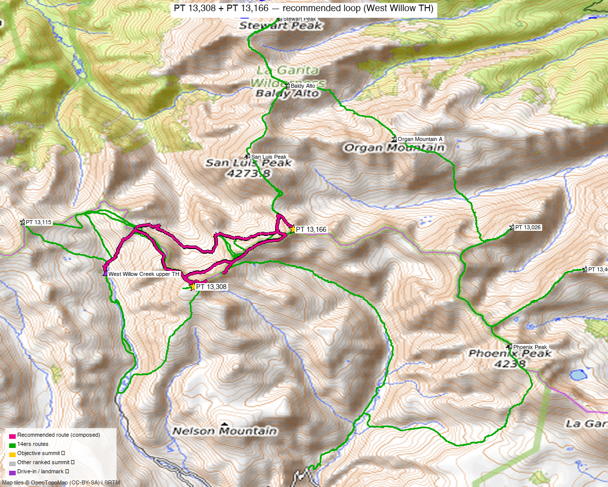

# PT 13,308 + PT 13,166 — La Garita Wilderness (West Willow / Creede)

<!-- QUICKSTATS_START -->

!!! tip "At a glance — recommended day"
    **10.2 mi** · **3,594 ft** gain · **Class 3** · 2 peaks · ~5 h drive

<!-- QUICKSTATS_END -->

!!! success "✅ Climbed 2026-06-14 — actual: 10.2 mi / 3,594 ft (loop)"
    Kyle's recorded outing: **10.2 mi · 3,594 ft** as a **loop** from the West Willow upper TH — vs the ~8.2 mi / ~3,050 ft estimate below (~24% longer, and more gain — the Class 3 bit added some up/down). GPS track on file.

**Researched:** 2026-06-09

!!! weather ""
    **NOAA weather link:** [PT 13,308 + PT 13,166 Weather](https://forecast.weather.gov/MapClick.php?lat=37.9523&lon=-106.9449)

!!! map ""
    **CalTopo research map:** <https://caltopo.com/m/9VGDUR3>

**Status in DB:** both **climbed** (2026-06-14).

> Split out of the former "Phoenix Park Four" — those four don't share a trailhead or a sane day. **This pair goes with the [Baldy Lejos trio](baldy_lejos_trio.md)** (same West Willow TH) as the **[West Willow La Garita 2-day trip](../trips/west_willow_la_garita.md)**; the eastern pair is a [separate report](pt_13026_13408.md).

<!-- PROVENANCE_START -->
*Note: the recommended route was distilled from **11 recorded GPS tracks** of real trips (14ers.com · ListsofJohn · Kyle's recordings) — all layered on the [interactive CalTopo research map](https://caltopo.com/m/9VGDUR3).*
<!-- PROVENANCE_END -->

> Part of the **[West Willow La Garita 2-day trip](../trips/west_willow_la_garita.md)** — same trailhead as the [Baldy Lejos trio](baldy_lejos_trio.md).*

---

<!-- CLIMBERS_START -->
**Other climbers:** Emily Sharpe — not yet · Shawn D Keil — not yet
<!-- CLIMBERS_END -->

## Peaks covered

| | [PT 13,308](https://www.14ers.com/peaks/10461) | [PT 13,166](https://www.14ers.com/peaks/10534) |
|---|---|---|
| Elevation | 13,308' | 13,166' |
| Lat / Lon | 37.9523, −106.9449 | 37.9674, −106.9203 |
| Class | 2 | 2 ("North Ridge", climb13ers) |
| CO Rank | 394 | 511 |
| Also known as | (pre-LiDAR 13,308) | formerly UN 13,155 |
| 14ers.com | [10461](https://www.14ers.com/php14ers/peak.php?peakid=10461) | [10534](https://www.14ers.com/php14ers/peak.php?peakid=10534) |
| LoJ | [510](https://listsofjohn.com/peak/510) | [648](https://listsofjohn.com/peak/648) |
| peakbagger | [39888](https://peakbagger.com/peak.aspx?pid=39888) | [39886](https://peakbagger.com/peak.aspx?pid=39886) |
| Peak DB id | 510 | 648 |

The two are **~1.7 mi apart** along the divide, both Class 2 tundra/chiprock.

---

## Recommended day — West Willow Creek upper TH ⭐

These are the **eastern, "bridge" peaks** of the La Garita cluster — reachable from the **same West Willow Creek upper TH** (near San Luis Pass, ~11,500' with full 4WD) as the Baldy Lejos trio.

| | |
|---|---|
| Peaks | PT 13,308 + PT 13,166 |
| **Recommended loop (composed)** | **~8.2 mi / ~3,050'** — loop from the West Willow TH out to the pair and back |
| Class | **2**, with a **Class 3** move on PT 13,166 |
| Trailhead | **West Willow Creek upper TH (~11,500')** — the Baldy Lejos trio's trailhead |

*The **recommended route (bold magenta)** — a loop from the West Willow upper TH out to PT 13,166 and PT 13,308 and back. Pair it with the trio over two days: the **[West Willow La Garita 2-day trip](../trips/west_willow_la_garita.md)**.*

### How they're climbed
- **PT 13,308** has been tagged on longer West Willow days with the [Baldy Lejos trio](baldy_lejos_trio.md) (LoJ TRs [24545](https://listsofjohn.com/tr?Id=24545) / [5946](https://listsofjohn.com/tr?Id=5946)).
- **PT 13,166** is climb13ers' "North Ridge," reachable from the same side.
- They can also be reached from **Phoenix Park** (Creede, East Willow) on a bigger day, but West Willow is the shorter, higher start.

> **Best combined as a 5-peak West Willow push or a relaxed add-on:** with full 4WD to the upper TH, a strong party can link **Baldy Lejos + 13,115 + 13,030 + 13,308 + 13,166** in one big day; otherwise do this pair on its own or tack it onto the trio.

---

## Getting there — West Willow Creek upper TH

| | |
|---|---|
| **Drive from Boulder** | **[~5 h to Creede via Google Maps](https://www.google.com/maps/dir/?api=1&origin=1162+Peakview+Circle,+Boulder,+CO+80302&destination=37.84913,-106.92766)**, then the rough West Willow Creek 4WD road above town. |
| Access | From Creede, up **Willow Creek Rd (FR 503)** ~¾ mi to the East/West Willow junction, bear onto **West Willow Creek Rd** toward San Luis Pass. Last ~1.5 mi moderate 4WD. |
| Trailhead | **West Willow Creek upper TH**, ~37.9556, −106.9665, **~11,500'** (high-clearance 4WD; lower parking adds mileage). |
| Land | **La Garita Wilderness** (GMUG / Rio Grande NF) — no permits/fees, foot-only beyond the TH; dispersed camping OK. |

---

## Gear & season

- **Best window:** July–September; high, remote, snow lingers; the West Willow road opens late.
- **Terrain:** Class 2 tundra/chiprock — length + altitude + the 4WD approach are the challenge, not difficulty.
- **Storms:** exposed divide — early start.
- **Cell:** dead — carry an InReach.

---

## Trip reports & GPX (all sources)

**Sources confirmed logged in:** 14ers.com ("letsgocu"), listsofjohn.com, peakbagger.com. 14ers-library tracks (from West Willow and Phoenix Park) are layered on the CalTopo map.

- **listsofjohn.com:** [TR 24545](https://listsofjohn.com/tr?Id=24545) / [5946](https://listsofjohn.com/tr?Id=5946) reach 13,308 with the western trio from West Willow.
- **peakbagger.com:** both verified — **La Garita Wilderness** (GMUG / Rio Grande NF).
- **climb13ers.com:** [UN 13,166 "North Ridge"](https://www.climb13ers.com/colorado-13ers/un13155).

**Sources checked:** 14ers.com ✓ (logged in, "letsgocu") · listsofjohn.com ✓ · peakbagger.com ✓ · climb13ers.com ✓

