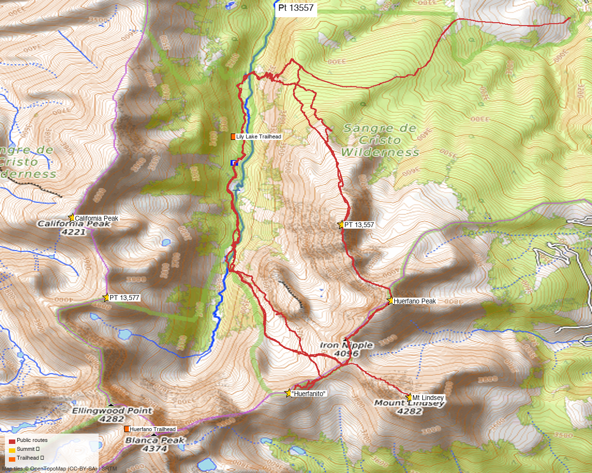

# PT 13,557 (Huerfano cluster, Sangre de Cristo)

**Researched:** 2026-05-21
**CalTopo research map:** TODO (build on map C105AEV — Huerfano TH and approach data already layered)
**Status in DB:** 0 ascents (unclimbed). **Cluster status: this is the LAST UNCLIMBED ranked 13er in the Huerfano cluster.**

> ⚠️ **Naming confusion:** 14ers.com labels this peak "Unnamed 13557" (peakid 10631) and several TRs call it "PT 13577" in the title (typo / misread on the older USGS quad). It is **NOT** the same as PT 13,577 (a separate ranked summit, ~2.2 mi away, already climbed). Confirm via lat/lon: this peak = **37.61311, −105.45581**.

---

<!-- CLIMBERS_START -->
**Other climbers:** Emily Sharpe — not yet · Shawn D Keil — not yet
<!-- CLIMBERS_END -->

## Quick stats

| | PT 13,557 |
|---|---|
| Elevation | 13,557' |
| Lat / Lon | 37.61311, −105.45581 |
| Weather | [NOAA forecast](https://forecast.weather.gov/MapClick.php?lat=37.61311&lon=-105.45581) (same target as 14ers / LoJ / peakbagger weather links) |
| 14ers.com peak page | https://www.14ers.com/peaks/10631/13er-unnamed-13557 |
| Range / Wilderness | Sangre de Cristo / Sangre de Cristo Wilderness |
| Class (standard) | 2 (tundra walk per TRs) |
| Peak DB id | 268 |
| Notes | No formal route description on 14ers — "Sorry, no route descriptions have been added… Try the Trip Reports." |

*[Interactive CalTopo map — TODO]*

---

## Cluster context — last one standing

All ranked 13ers within 8 mi of PT 13,557 are already done:

| Peak | Dist | Status |
|---|---|---|
| Huerfano Peak | 0.99 mi | ✓ |
| "Huerfanito" | 2.02 mi | ✓ |
| Mt Lindsey | 2.11 mi | ✓ |
| PT 13,577 | 2.22 mi | ✓ |
| California Peak | 2.35 mi | ✓ |
| PT 13,656 ("NW Lindsey") | 2.67 mi | ✓ |
| Ellingwood Point | 2.91 mi | ✓ |
| Blanca Peak | 2.95 mi | ✓ |
| Twin Peaks A | 3.81 mi | ✓ |
| Little Bear Peak | 3.93 mi | ✓ |

**Implication:** there's no link-up to chase — drive in, bag PT 13,557, drive out. Could be tacked onto a re-visit of Lindsey or California if you're already in the Huerfano basin for company, but as a solo objective it's a half-day.

---

## Recommended route — from Lily Lake TH via Raspberry Trail ⭐

The only documented modern route. Sourced from WildWanderer's 6/10/2022 TR (the only standalone PT 13,557 trip in the 14ers DB).

| Route | Stats |
|---|---|
| Difficulty | Class 2 (tundra + minor deadfall) |
| Distance | 8.88 mi RT |
| Gain | 3,538' |
| Time | ~5 hr solo |
| Aspect | South/SE off the summit ridge |

### Route sequence

1. From Lily Lake TH (or a dispersed campsite ~10,350' just before the downed-tree section), walk the 4WD road north
2. At the **Raspberry Trail (#1307) junction**, leave the road and head west on the Raspberry Trail
3. Sign in at the register; navigate around large blowdown (a downed tree blocks the path); cross the **Huerfano River on downed logs**
4. Follow the Class 1 trail as it switchbacks up the W side of the drainage — multiple downed trees obscure the trail but it's always findable
5. Where the trail levels off near fire rings, **leave the trail and head south** into open forest to treeline (no trail, downed-tree dodging but easy nav)
6. Once on tundra, continue south. PT 13,557 comes into view quickly
7. **1.5 mi tundra walk** along the ridge to the summit — simple but long, mostly grass with rock patches

**Descent:** retrace. Navigation in the lower trees is the only tricky bit — head north until you intercept the Raspberry Trail. Expect deadfall obstacles.

---

## Trailhead — Lily Lake TH (= Huerfano TH area)

| | |
|---|---|
| Location | Huerfano River valley, accessed via Gardner / Redwing → CR 580 / FR 580 |
| Drive from Boulder | **[4h 41m via Google Maps](https://www.google.com/maps/dir/?api=1&origin=1162+Peakview+Circle,+Boulder,+CO+80302&destination=37.621,-105.500)** (244 mi, origin: 1162 Peakview Circle) |
| Vehicle | High-clearance helpful; **4WD recommended** for the final section before the TH (downed trees beyond ~10,350' campsite) |
| Start elev | ~10,200' (Lily Lake TH) / ~10,350' (last good dispersed campsite) |
| Camping | Plentiful dispersed sites along the road below the TH — fills up by Thursday night in summer |
| Facilities | None |

Already a known trailhead for previous Huerfano-cluster trips (Lindsey, California, Huerfanito, PT 13,577, etc.).

---

## Conditions / season

- **Best window:** mid-June through early October (Huerfano basin holds snow late)
- **Trail hazards:** significant **deadfall** on the Raspberry Trail and in the lower forest leaving the trail — not blocking, but slows nav
- **Storms:** standard exposure on the 1.5-mi tundra ridge — early start mandatory
- **Stream crossing:** Huerfano River crossed on downed logs (WildWanderer mid-June) — should be straightforward in standard summer flow
- **No technical difficulty** above treeline — Class 2 tundra walking

---

## Cell coverage

- **14ers.com community DB:** 0 reports for PT 13,557 (Unnamed 13557) and 0 for the Huerfano/Lily Lake TH (typical for non-14er Sangre access points)
- **Geographic reasoning:**
  - **TH and lower drainage:** dead — deep in a N-S valley between the main spine and California Peak
  - **Above treeline / summit:** likely **some signal** at 13,557' with LOS east toward I-25 / Walsenburg, but nothing west
- **Standard recommendation:** carry an InReach. The Huerfano basin is a known dead zone.

---

## Permits / access

- Sangre de Cristo Wilderness — no permits required
- San Isabel National Forest — no fee
- Public access throughout (unlike the Cuatro / Trinchera / Cielo Vista cluster further south)

---

## Trip reports

| Date | Source | Stats | Notes |
|---|---|---|---|
| 6/10/2022 | [WildWanderer TR 21666](https://www.14ers.com/php14ers/tripreport.php?trip=21666) | 8.88 mi / 3,538' / 5 hr | **Recommended baseline.** Only standalone PT 13,557 TR. Solo, mid-June, Raspberry Trail approach. **GPX in 14ers library.** |
| 8/14/2022 | Mtnman200 "Another Mountain, Another Planet" | 4-peak day | PT 13,557 + 13,577 + 13,654 + 13,656 — useful if you ever want to revisit and ridge-link the area |
| 7/6/2020 | supranihilest "Choss? In the Sangre?" | 6-peak combo | Huerfano + Iron Nipple + Lindsey + NW Lindsey + Huerfanito + 13,557. **GPX in 14ers library.** |
| 5/9/2020 | kwhit24 "Frustrating Loop" | 4-peak | Huerfanito + Huerfano + Iron Nipple + 13,557 |
| 12/21/2016 | Dad Mike | Winter cents | 5 winter peaks including PT 13,557 — winter route reference |

**GPX library:** 4 entries (2 TRs + 2 library uploads "Lindsey and Friends" / "Huerfana, Huerfano, Iron Nip"). [GPX library locator](https://www.14ers.com/php14ers/gpxlib_locator.php?peakid=10631).

---

## Existing CalTopo data (map C105AEV)

Already layered from prior Huerfano cluster planning:
- **Markers:** "Unnamed 13577" (mislabeled, but in the right vicinity), Huerfano TH, Blanca Peak, California Peak, Ellingwood Point, Little Bear Peak, "Huerfanito", Twin Peaks A, Unnamed 13660 A, Jaws 1, Jaws 11
- **Tracks:** como Approach (x2), To Jaws 1 (x2), Twin Peaks Partial_actual, LB-B-E, 62s Dump tracks, multiple Kyle Knutson tracks

→ When building a dedicated PT 13,557 research map, layer the WildWanderer Raspberry Trail GPX on top of the existing Huerfano basin data, and **verify which marker is the actual PT 13,557 vs PT 13,577** (the naming confusion runs through this area).

---

## TL;DR

- **Recommended trip:** WildWanderer's Lily Lake TH → Raspberry Trail → south tundra ridge. **~9 mi RT, ~3,540' gain, Class 2.** Half-day solo.
- **Last unclimbed ranked 13er in the Huerfano cluster** — every neighbor within 4 mi is already done. No link-up payoff; this is a closer trip.
- **Naming hazard:** "PT 13577" in older 14ers TR titles ≠ the climbed PT 13,577 ranked summit. Verify by lat/lon (37.61311, −105.45581) before driving.
- **Best season:** mid-June through early October (basin holds late snow).
- **Cell:** dead at TH and in the basin. Carry InReach.
- **Existing CalTopo data:** map C105AEV has Huerfano TH + neighboring summits + approach tracks. Verify the "13577" marker label before relying on it.

---

**Sources checked:** 14ers.com · listsofjohn.com · peakbagger.com
