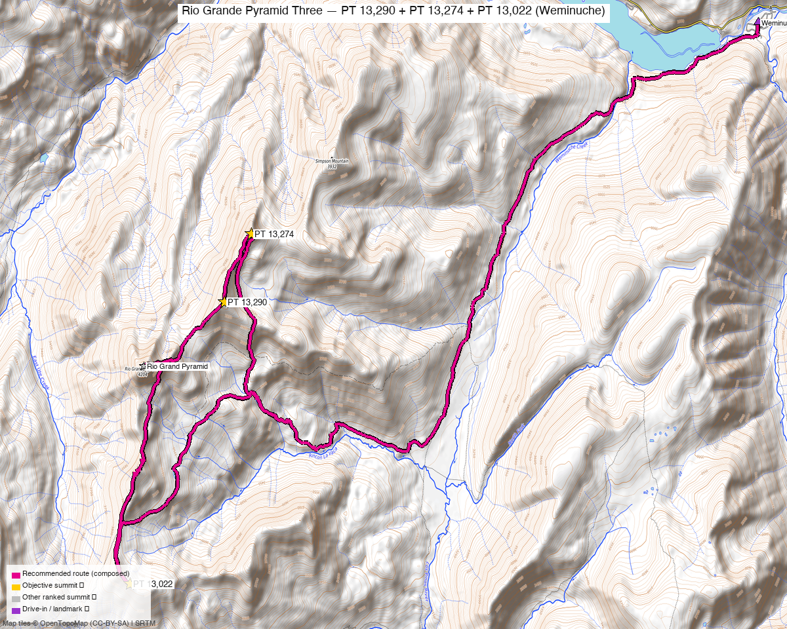

# Rio Grande Pyramid Three — PT 13,290 + PT 13,274 + PT 13,022 (Weminuche)

<!-- QUICKSTATS_START -->

!!! tip "At a glance — recommended day"
    **19.5 mi** · **5,207 ft** gain · **Class 2–4** · 3 peaks · ~5.75 h drive

<!-- QUICKSTATS_END -->

**Researched:** 2026-06-15

!!! map ""
    **CalTopo research map:** https://caltopo.com/m/TMVGNRR

**Status in DB:** all three unclimbed. (Rio Grande Pyramid, Window Pk + Ute Ridge already done.)

> The three red peaks around **Rio Grande Pyramid** in the **Weminuche Wilderness** — deep, remote, and a long way in. Two are easy Class 2; **PT 13,022 has a Class 3–4 exposed crux.**

<!-- PROVENANCE_START -->
*Note: the recommended route was distilled from **10 recorded GPS tracks** of real trips (14ers.com · ListsofJohn) — all layered on the [interactive CalTopo research map](https://caltopo.com/m/TMVGNRR).*
<!-- PROVENANCE_END -->

---

<!-- CLIMBERS_START -->
**Other climbers:** Emily Sharpe — not yet · Shawn D Keil — ✓ all
<!-- CLIMBERS_END -->

## Quick stats

| | PT 13,290 ("Fools Pyramid") | PT 13,274 | PT 13,022 |
|---|---|---|---|
| Elevation | 13,290' | 13,274' | 13,022' |
| Lat / Lon | 37.6876, −107.3750 | 37.6966, −107.3690 | 37.6517, −107.3953 |
| Class | 2 | 2 | **3–4** (exposed summit block) |
| CO Rank | 409 | 421 | 624 |
| Also known as | formerly UN 13,278 | formerly UN 13,261 | formerly UN 13,017 |
| Position | 1.1 mi NE of RGP | 1.7 mi NE of RGP | 1.9 mi SW of RGP |
| 14ers.com | [10473](https://www.14ers.com/php14ers/peak.php?peakid=10473) | [10479](https://www.14ers.com/php14ers/peak.php?peakid=10479) | [10600](https://www.14ers.com/php14ers/peak.php?peakid=10600) |
| LoJ | [517](https://listsofjohn.com/peak/517) | [532](https://listsofjohn.com/peak/532) | [804](https://listsofjohn.com/peak/804) |
| peakbagger | [14836](https://peakbagger.com/peak.aspx?pid=14836) | [16165](https://peakbagger.com/peak.aspx?pid=16165) | [39890](https://peakbagger.com/peak.aspx?pid=39890) |
| Peak DB id | 517 | 532 | 804 |

**PT 13,290 + PT 13,274** are a ridge-connected Class 2 pair NE of Rio Grande Pyramid; **PT 13,022** sits SW across the basin and is the hard one.

---

## The single push — Weminuche Trail TH loop ⭐

A **real recorded loop** through all three (DEM-measured): **~19.5 mi / ~5,200′**. This is a **big day** — the Weminuche approach is long and deep — but not the monster the composed estimate first suggested. A party did the *whole* RGP group (these three + Rio Grande Pyramid) in one ~30 mi / ~9,800′ day (LoJ [TR 1934](https://listsofjohn.com/tr?Id=1934)), noting "some might say stupid" to do it as a day trip. **Most people backpack** (see below).

| | |
|---|---|
| Peaks | PT 13,290 + PT 13,274 + PT 13,022 |
| **Recommended loop** | **~19.5 mi / ~5,200′ (DEM)** |
| Class | **2**, but **PT 13,022 is the crux: "a fairly complicated and exposed 3rd–4th class scramble on teetering blocks" on the final ~200′.** Helmet; the other two are straightforward Class 2. |
| Trailhead | **Weminuche Trail TH (Thirtymile, Rio Grande Reservoir), ~9,300'** — 2WD |

### Route sequence
1. From the **Weminuche Trail TH** at Rio Grande Reservoir, hike the long Weminuche Creek trail in toward Weminuche Pass / the Rio Grande Pyramid basin.
2. **PT 13,022** first (SW side) — easy until the **exposed Class 3–4 summit block** (teetering blocks, ~200′).
3. Cross to the NE pair: **PT 13,290 ("Fools Pyramid") → PT 13,274** — ridge-connected Class 2.
4. Long hike back out to the TH.

---

## Strongly consider a backpack ⛺

This is **classic backpack country.** A short, easy pack-in — **~5 mi / ~1,325′** to a base camp near Weminuche Pass / the meadows — sets you up for **all the Rio Grande Pyramid 13ers** (these three + RGP + Window) on short summit days, instead of a ~20-mile push. Given the distance, a **2-night backpack is still a great way to clean up these three.**

---

## Drive + approach

| | |
|---|---|
| **Drive from Boulder** | **[~5h 45m via Google Maps](https://www.google.com/maps/dir/?api=1&origin=1162+Peakview+Circle,+Boulder,+CO+80302&destination=37.7233,-107.259)** — via Creede / South Fork to the **Rio Grande Reservoir** (FR 520), then the Weminuche Trail TH. ("~5 hrs from Denver" per TR.) |
| Trailhead | **Weminuche Trail TH (Thirtymile)**, ~37.7233, −107.259, **~9,300'** — **2WD** (passenger car). |
| Land | **Weminuche Wilderness** (Rio Grande NF) — no permits/fees, **foot/stock only**; dispersed/backpack camping allowed. |

---

## Conditions / season

- **Best window:** **July–September** — deep, high Weminuche; long approach holds snow.
- **Terrain:** mostly Class 2 tundra/talus; **the PT 13,022 summit block is exposed Class 3–4 on loose, teetering rock** — the one place to be careful.
- **Storms:** you're a long way from the car — start very early or (better) camp high.
- **Cell:** dead, deep wilderness — **InReach essential.**

---

## Trip reports & GPX (all sources)

**Sources confirmed logged in:** 14ers.com ("letsgocu"), listsofjohn.com, peakbagger.com (Kyle Knutson). **8 14ers-library tracks** (3 covering all three peaks) + Kyle's CalTopo are layered; recommended loop magenta. peakbagger has no downloadable ascent GPX for these.

### listsofjohn.com (logged in)
Four TRs cover all three: [24937](https://listsofjohn.com/tr?Id=24937), [7484](https://listsofjohn.com/tr?Id=7484), [1934](https://listsofjohn.com/tr?Id=1934) (the ~30 mi RGP-group day), [1560](https://listsofjohn.com/tr?Id=1560).

### 14ers.com GPX library (logged in, "letsgocu")
Multiple recorded tracks doing the NE pair and all three — layered.

### peakbagger.com (logged in, "Kyle Knutson")
Pages verified for all three; **ownership = Weminuche Wilderness** (Rio Grande NF).

### climb13ers.com
[Fools Pyramid / PT 13,290 (SW Ridge)](https://www.climb13ers.com/colorado-13ers/un13278) · [PT 13,274 (SSW Ridge)](https://www.climb13ers.com/colorado-13ers/un13261) · [PT 13,022 (SE Ridge)](https://www.climb13ers.com/colorado-13ers/un13017) — the last flags the exposed Class 3–4 summit block. Also [Wild Wanderer — RGP 13ers basecamp](https://wildwanderertripreports.com/2024/06/30/basecamp-for-rio-grande-pyramid-13ers/) (backpack beta).

**Sources checked:** 14ers.com ✓ (logged in, "letsgocu") · listsofjohn.com ✓ · peakbagger.com ✓ (logged in, "Kyle Knutson") · climb13ers.com ✓ · Kyle's CalTopo ✓

