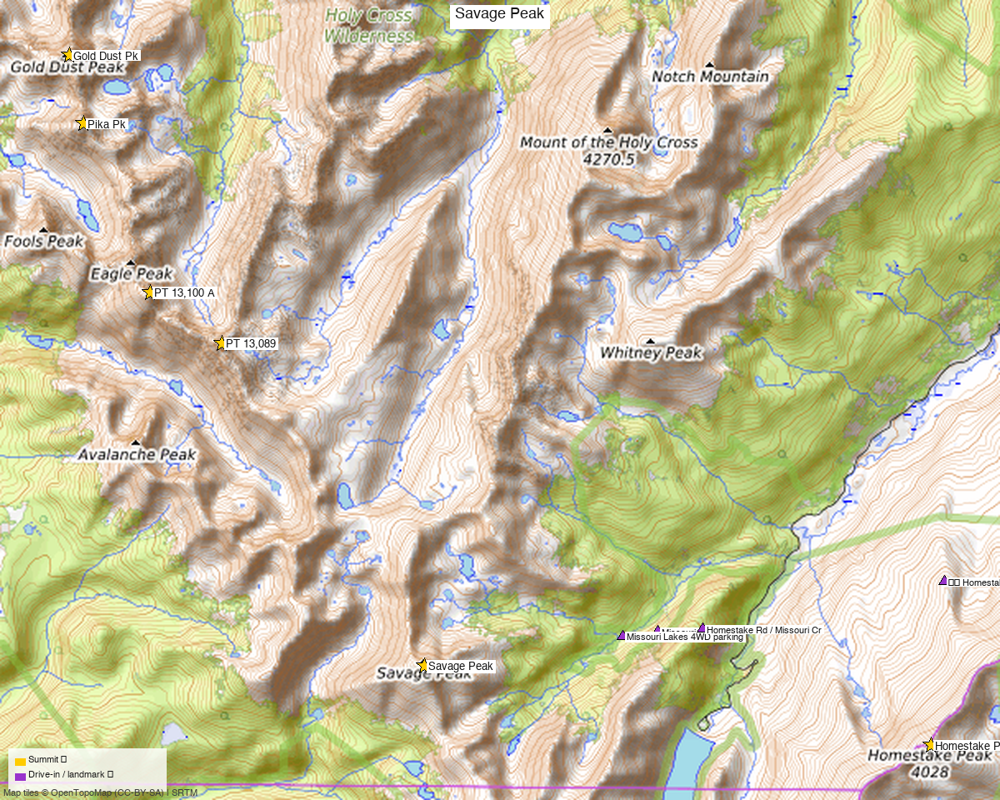

# Savage Peak (Sawatch Range / Holy Cross Wilderness)

**Researched:** 2026-05-28
**CalTopo research map:** https://caltopo.com/m/QL51DBE
**Status in DB:** 0 ascents (unclimbed). **Cluster status:**
- ✗ **PT 13,089 (4.25 mi) — unclimbed ranked** ← potential same-TH combo
- ✗ **PT 13,100 A (5.17 mi) — unclimbed ranked** ← potential same-TH combo
- ✗ **Homestake Peak (5.72 mi) — unclimbed ranked, also on Kyle's list** — different drainage, see Homestake report's combo analysis
- ✗ Pika Pk (7.15 mi) — unclimbed ranked, different drainage
- ✗ Gold Dust Pk (7.88 mi) — unclimbed ranked, different drainage
- ✓ Done nearby: Fancy Pk (2.76 mi), Whitney Pk (4.56), PT 13,786 (4.97), Holly Cross Ridge (5.73), Mt of the Holy Cross 14er (6.32), PT 13,253 (6.57), PT 13,443 (6.71), Mt Jackson (7.31)

**The Fancy + Savage combo (the standard "Holy Cross 13er day" in TRs) doesn't apply for Kyle** since Fancy is already done. But **PT 13,089 and PT 13,100 A may add value** if they share the Missouri Lakes approach — see Multi-peak section.

---

## Quick stats

| | Savage Peak |
|---|---|
| Elevation | 13,135' (LiDAR; map 13,139') |
| Lat / Lon | 39.38053, −106.52061 |
| 14ers.com peak page | https://www.14ers.com/peaks/10810/13er-savage-peak |
| 14ers.com NE Ridge route | https://www.14ers.com/route.php?route=201207031210033 |
| listsofjohn.com | https://listsofjohn.com/peak/674 |
| peakbagger.com | https://peakbagger.com/peak.aspx?pid=15199 |
| Range / Wilderness | Sawatch / Holy Cross Wilderness |
| NF | White River NF |
| Class | 2 |
| Peak DB id | 674 |
| CO Rank | 539 |
| CO Prominence Rank | 302 (Rise 1,136' LiDAR) |
| County | Eagle |
| Quad | Mount Jackson |
| Member ascents | 284 (14ers) + 132 (LoJ) |
| 14ers GPX library | [6 entries](https://www.14ers.com/php14ers/gpxlib_locator.php?peakid=10810) |
| 14ers winter ascents | 1 / Ski descents 29 — popular ski peak (Savage Couloir) |

*[Interactive CalTopo map](https://caltopo.com/m/QL51DBE)*

---

## Recommended route — Northeast Ridge from Missouri Lakes TH ⭐

The 14ers.com official route (BillMiddlebrook, May 2023). Solid Class 2 ridge climb with a documented line. **8 mi RT / 3,200' gain** from the 2WD TH at 10,000'.

| Route | Stats (14ers official) |
|---|---|
| Difficulty | Class 2 (stay left of rocks on the grassy point near 11,700') |
| Distance | **8 mi RT** (14ers) / 7.6 mi (avalletta 2013) / 8.7 mi (PB aid 1487386) |
| Gain | **3,200'** (14ers) / 3,100' (avalletta) / 3,485' (PB) |
| Time | **~4.5 hr** (avalletta solo) / ~5–6 hr typical |
| Start elev | **10,000'** (2WD Missouri Lakes TH); 10,060' (4WD park 0.6 mi up Missouri Creek) |
| Summit | 13,135' |
| Aspect | NE up to the ridge, then SW ridgeline to summit |

### Route sequence (per 14ers route description + avalletta 2013)

1. From the 2WD Missouri Lakes TH, hike 0.5 mi up the Missouri Lakes trail to a small clearing (4WD TH visible down to your left)
2. From the 4WD TH (if you parked higher), cross the creek and walk a short distance to intersect the trail
3. Follow the **excellent, rocky Missouri Lakes trail** — wooden bridges over wet sections, crosses Missouri Creek a couple of times
4. After **2.5 mi (2 mi from 4WD TH)**, cross a stream
5. Continue 0.25 mi to a small clearing where you can see **Point 12,898'** ahead
6. **Leave the trail here** (no need to continue to the lakes). Goal: gain the NE ridge.
7. Turn LEFT (south), hike through clearings and past small ponds
8. Reach open terrain near the talus slopes below the ridge
9. Continue SE along the base of the slope to reach the **NE ridge crest near 11,700'**
10. Turn RIGHT, gain the ridge to the steep grassy point — **stay left of rocks to keep at Class 2**
11. Walk the ridge → steeper terrain at 12,400' → even steeper above 12,600'
12. At 13,000' the angle eases near the top of the **Savage Couloir**
13. Continue to summit

### Alternates / variations

**B. From Fancy Pass / Missouri Lakes loop TH (slightly different start)**
- whileyh 9/12/2020 used "Fancy Pass/Missouri Lakes TH" — same lot
- Described as a "popular hikers bucket list loop" — heavy summer foot traffic on the trail
- whileyh hit Savage, descended, then went back up Fancy Pass to do Fancy Peak as a separate up-and-down — inefficient but the standard "do both" pattern

**C. Long approach from Holy Cross City Rd** (Class 2+ — 16 mi)
- PB aid 2025016: **3,104' / 16 mi / 9h14 from 10,030' TH** — different starting point, longer approach. Reference only.

---

## Multi-peak combos for Kyle

**Fancy Peak (climbed, 2.76 mi)** — the natural same-day combo per the John Kirk 2016 + josephnephi 2024 + whileyh 2020 TRs (all combine Savage + Fancy). Not relevant for Kyle since Fancy is done.

### Same-TH unclimbed-ranked options to evaluate:

**PT 13,089 (4.25 mi from Savage, unclimbed ranked)**
- Same range (Sawatch/Holy Cross). Need to verify if it's reachable from Missouri Lakes TH on the same outing
- **TODO research:** check PT 13,089's LoJ + 14ers pages for standard approach. If same drainage → strong combo candidate

**PT 13,100 A (5.17 mi from Savage, unclimbed ranked)**
- **TODO research:** same as above. Worth checking LoJ peak ID for standard approach

**These would lift Savage from a true standalone day into a multi-peak ranked combo.** Worth a dedicated research pass before committing to the trip.

### Sawatch main ridge mega-day (reference only)

jacolc 8/16/2024 (LoJ TR 27181): **15.5 mi / 6,300' / 11h35** — Sawatch main ridge N→S from PT 12,914 to PT 12,470. Includes Savage + 4 sub-13k peaks. Strong all-day ridge traverse but all the additional peaks are sub-13k → doesn't add ranked combos for Kyle.

---

## Trailhead — Missouri Lakes TH (off Homestake Rd / FS 703)

| | |
|---|---|
| Location | West side of Holy Cross Wilderness, accessed via Homestake Rd from Hwy 24 between Leadville and Minturn |
| Drive from Boulder | **3h 39m via Google Maps** |
| From Hwy 24 | From Minturn: ~11 mi south on Hwy 24. From Leadville: ~19 mi north on Hwy 24. **Turn west onto Homestake Road (dirt, FS 703)**. |
| Continue | Drive ~8 mi on Homestake Rd → right onto **Missouri Creek Road** → continue **2.25 mi** to Fancy Lake TH on your right, then **turn LEFT** to reach Missouri Lakes TH |
| 2WD parking | Yes — Missouri Lakes TH lot at 10,000' |
| 4WD upgrade | Pass through TH parking and continue 0.6 mi (easy 4WD) to an unmarked 4WD parking area along Missouri Creek at ~10,060'. Cross creek + walk 50 yards up hill to intersect trail |
| Start elev | 10,000' (2WD) or 10,060' (4WD parking) |
| Facilities | None |

### ⚠️ CRITICAL ACCESS WARNING (per Brian Kalet 5/4/2018 TR 18100):

> "Homestake Rd (FS703) is now gated and closed at US24 from **Nov 22 to May 21 each year**. Anyone planning to climb or ski the Savage Couloir will need to wait until then or make other plans. This seems to be a fairly recent policy; it isn't mentioned in any of the guidebooks."

**Plan accordingly.** Late-May through November is your window for vehicle access. Earlier-season skiing requires a long road approach from Hwy 24 (multiple miles before the trailhead).

---

## Conditions / season

- **Best window:** **late May through mid-November** (gate dictates). Brian Kalet's gate-closure note is the binding constraint
- **Snow:** whileyh 9/12/2020 described "mid-calf deep" snow above the trail by Labor Day weekend (i.e. early-fall snow can be substantial). Bring postholing tolerance for shoulder seasons
- **Storms:** Standard Holy Cross afternoon storm risk on the exposed NE ridge
- **Ski:** 29 ski descents recorded. **Savage Couloir** is the named line — accessible once gate opens (post-May 21)
- **Trail crowds:** Missouri Lakes / Fancy Pass loop is on the local "must-do hikes" lists — expect summer trail traffic on the first 2.5 mi
- **Wind:** NE ridge is exposed; standard layering

---

## Cell coverage

- **14ers.com community DB:** TODO query (Peak Conditions last updated 7/5/2025)
- **Geographic reasoning:**
  - **TH (10,000', drainage):** likely **weak** — Missouri Creek drainage shadowed from Hwy 24
  - **Lower trail:** weak
  - **NE ridge (~12,000'+):** likely **better** — line-of-sight to Hwy 24 corridor and Vail corridor opens up
  - **Summit:** likely **good** — high above the surrounding ridges with multi-direction LOS
- **Standard recommendation:** carry InReach. Drainage will be dead until you're on the ridge.

---

## Permits / access

- Holy Cross Wilderness — no day-use permits required
- White River NF — no fees
- **Homestake Rd seasonal gate** (Nov 22 – May 21) is the access binding constraint
- Standard wilderness rules: leash dogs, no motorized, pack out everything

---

## Trip reports

### 14ers.com (14 reports)

| Title | Note |
|---|---|
| "Shorty and the Savage" | (may include Shorty/short partner peak) |
| "From MIssouri Lakes TH" | standard route solo |
| "SO SAVAGE *headbangs furiously*" | solo |
| "Savage - Spectacular Holy Cross Wilderness Vistas" | solo, view-focused |
| "Jacque to Music, and Some Extra Credit" | Jacque + Music + Savage (Music sub-13k, Jacque ranked combo) |
| "Three Savages Go Hiking" | 3-climber group |

(Full list at https://www.14ers.com/php14ers/peak.php?peakid=10810 → Trip Reports)

### listsofjohn.com (8 reports)

| Date | Climber | Stats | GPX | Notes |
|---|---|---|---|---|
| 2024-08-16 | [jacolc TR 27181](https://listsofjohn.com/tr?Id=27181&pkid=674) | 15.5 mi / 6.3k' / 11h35 — Sawatch ridge traverse | 16374 | 4 sub-13k bumps added |
| 2024-07-29 | [josephnephi TR 27032](https://listsofjohn.com/tr?Id=27032&pkid=674) | + Fancy Pk + 2 sub-13k | 16249 | Standard Savage+Fancy combo |
| 2020-09-12 | [whileyh TR 17224](https://listsofjohn.com/tr?Id=17224&pkid=674) | Snow slog Labor Day, did Fancy after | 8787 | TH usage note |
| **2018-05-04** | [**Brian Kalet TR 18100**](https://listsofjohn.com/tr?Id=18100&pkid=674) | (gate notice — no climb) | — | ⚠️ **Homestake Rd Nov 22-May 21 closure** |
| 2016-10-16 | [John Kirk TR 7500](https://listsofjohn.com/tr?Id=7500&pkid=674) | + Fancy + 2 sub-13k | 2804 | Standard combo |
| 2013-07-26 | [avalletta TR 2258](https://listsofjohn.com/tr?Id=2258&pkid=674) | **7.6 mi / 3,100' / 4.5h** | 171 | ⭐ baseline solo, matches 14ers route |
| 2009-05-20 | Furthermore TR | — | — | Ski/spring |
| 2007-05-03 | DSunwall TR | — | — | Early season |

### peakbagger.com (recent ascents)

| aid | Stats |
|---|---|
| [2025016](https://peakbagger.com/climber/ascent.aspx?aid=2025016) | **3,104' / 16 mi / 9h14 from 10,030' TH** — long approach |
| [1737728](https://peakbagger.com/climber/ascent.aspx?aid=1737728) | (no stats) |
| [1691129](https://peakbagger.com/climber/ascent.aspx?aid=1691129) | (no stats) |
| [**1487386**](https://peakbagger.com/climber/ascent.aspx?aid=1487386) | **3,485' / 8.7 mi from 10,049' TH** — ⭐ baseline confirming Missouri Lakes standard route |

---

## .gpx files (to be downloaded to `gpx/savage_peak/`)

**LoJ GPX library:**
- `savage_16374.gpx` — jacolc 8/16/2024 Sawatch ridge traverse (reference)
- `savage_16249.gpx` — josephnephi 7/29/2024 Savage + Fancy + 2 sub-13k
- `savage_8787.gpx` — whileyh 9/12/2020 (snow slog)
- `savage_2804.gpx` — John Kirk 10/16/2016 standard combo
- `savage_171.gpx` — avalletta 7/26/2013 solo Savage ⭐ baseline track for standard NE Ridge

**14ers.com GPX library:** 6 entries at https://www.14ers.com/php14ers/gpxlib_locator.php?peakid=10810 — plus the official route GPX from https://www.14ers.com/route.php?route=201207031210033

**Generated (to build):**
- `savage_summit_TH.gpx` — summit + Missouri Lakes 2WD + 4WD parking + Homestake Rd gate waypoints
- `savage_route_recommended.gpx` — from avalletta 171 (solo standard route validation)

---

## TL;DR

- **Recommended trip:** **Missouri Lakes TH → NE Ridge → summit**. **8 mi RT / 3,200' gain / Class 2 / ~5 hr.** 14ers.com has a clean route description (BillMiddlebrook). The route leaves the Missouri Lakes trail near a small clearing at PT 12,898', turns south through ponds + talus to gain the NE ridge near 11,700', then climbs the obvious ridge to summit (stay LEFT of rocks on the steep grassy point).
- ⚠️ **CRITICAL: Homestake Rd (FS 703) is gated and closed at US24 from Nov 22 to May 21.** Late-May through November is the vehicle access window. Earlier-season skiing requires a long road approach. (Per Brian Kalet 5/4/2018)
- **Mostly SOLO under Kyle's combo rule** — the standard Savage + Fancy combo doesn't apply (Fancy is climbed). One TR (dillonsarnelli 6/29/2016) does Jacque + Music + Savage but that's a logistics-heavy combo.
- **Worth researching: PT 13,089 (4.25 mi) and PT 13,100 A (5.17 mi)** — both unclimbed ranked 13ers nearby. May share the Missouri Lakes approach. Could lift Savage day into a multi-peak combo.
- **Homestake + Savage combo:** geographically tempting (5.72 mi apart, both on Kyle's list) but different drainages, no TR validates it — see Homestake report
- **Trail traffic:** popular Missouri Lakes / Fancy Pass loop crowds the first 2.5 mi in summer. Plan for early start
- **Cell:** dead in the drainage, returns on the upper NE ridge. Carry InReach
- **Drive:** **3h 39m from Boulder**
