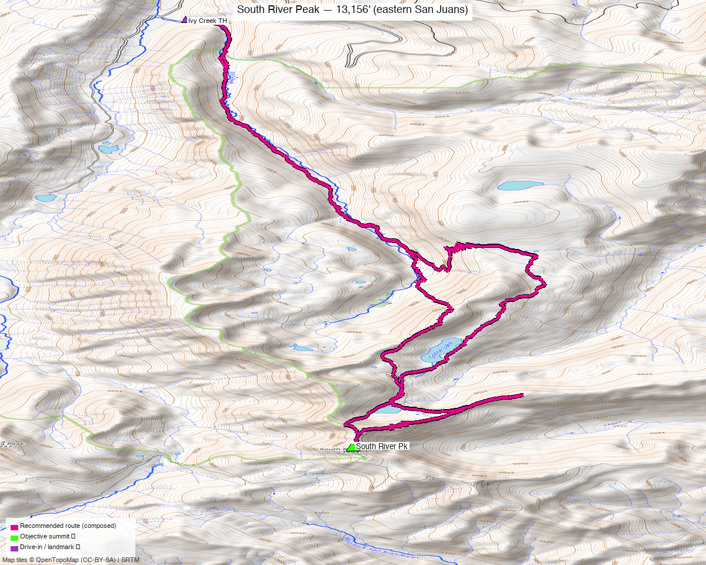

<!-- CLIMBERS_START -->
**Other climbers:** Emily Sharpe — not yet · Shawn D Keil — ✓ climbed
<!-- CLIMBERS_END -->

# South River Peak — 13,156' (eastern San Juans)

<!-- QUICKSTATS_START -->

!!! tip "At a glance — recommended day"
    **22.1 mi** · **5,038 ft** gain · **Class 2** · 1 peak · ~5.5 h drive

<!-- QUICKSTATS_END -->

**Researched:** 2026-07-21

!!! weather ""
    **NOAA weather link:** [South River Peak Weather](https://forecast.weather.gov/MapClick.php?lat=37.574&lon=-106.982)

!!! map ""
    **CalTopo research map:** <https://caltopo.com/m/J2M0586>

**Status in DB:** unclimbed. A ranked (CO #522), gentle **Class 2** 13er at the head
of the **South Fork of the Rio Grande**, near the eastern edge of the Weminuche. A
standalone tick — no ranked neighbors nearby — whose whole difficulty is the long
Ivy Creek approach, not the climbing.

<!-- PROVENANCE_START -->
*Note: the recommended route was distilled from **6 recorded GPS tracks** of real trips (14ers.com · ListsofJohn · peakbagger) — all layered on the [interactive CalTopo research map](https://caltopo.com/m/J2M0586).*
<!-- PROVENANCE_END -->

---

## The peak

A **long, gentle day** up the **Ivy Creek Trail (FDT 805)** — easy Class 2 tundra and
talus once you're high, but the trail approach is the real work: **~11 mi each way**
from the Ivy Creek Campground trailhead. Realistically a big single push for the very
fit, or a comfortable overnight with a camp high in the Ivy Creek basin.

| | [South River Peak](https://www.14ers.com/peaks/10537) |
|---|---|
| Elevation | 13,156' |
| Lat / Lon | 37.5739, −106.9816 |
| Route | Ivy Creek Trail → NW slopes |
| Class | 2 |
| CO rank | #522 |
| listsofjohn.com | [657](https://listsofjohn.com/peak/657) |
| peakbagger.com | [16516](https://peakbagger.com/peak.aspx?pid=16516) |

---

## Recommended route — Ivy Creek Trail from Ivy Creek Campground ⭐

The composed line follows a recorded Ivy Creek track that summits and starts at the
trailhead — **~22.1 mi · ~5,040 ft, Class 2**.

### Route sequence
1. From the **Ivy Creek Campground TH (~9,290')**, take the **Ivy Creek Trail
   (FDT 805)** south, climbing steadily up the Ivy Creek drainage through timber into
   the open upper basin below the Continental Divide.
2. Leave the trail below South River Peak's NW side and climb **grass and talus
   slopes** to the broad summit — Class 2 throughout, easy route-finding.
3. Reverse the approach. A tundra-and-talus walk-up start to finish; no scrambling.

---

## Getting there — Ivy Creek Campground TH

| | |
|---|---|
| **Drive from Boulder** | **[~5h 30m via Google Maps](https://www.google.com/maps/dir/?api=1&origin=1162+Peakview+Circle,+Boulder,+CO+80302&destination=37.6821,-106.9994)** — via US-160 to South Fork, CO-149 toward Creede, then the Rio Grande / FR 520 → FR 523/526 to the Ivy Creek Campground. |
| Trailhead | **Ivy Creek Campground / TH**, ~37.6821, −106.9994, **~9,290'** — the Ivy Creek Campground Road (FR 526.1A) is unpaved but good; passenger-car accessible. |
| Access corridor | Ivy Creek Trail (FDT 805) south up the drainage. |
| Land | **Rio Grande NF / Weminuche Wilderness** — no permits/fees, foot/stock only above the trailhead. |

---

## Gear & season

- **Best window:** **July–September** — high, deep-backcountry San Juan; the long
  approach and upper basin hold snow into early summer.
- **Terrain:** Class 2 tundra/talus, no technical sections — the challenge is mileage
  and altitude, not difficulty.
- **Storms:** you're a long way from the car — start very early, or camp high in the
  Ivy Creek basin and summit on a short morning.
- **Cell:** dead, deep wilderness — **InReach essential.**

---

## Other considerations

**Consider a backpack ⛺** — at ~22 miles round trip, this is a natural overnight: an
easy pack-in up Ivy Creek to a **basin camp** turns a big push into a short summit
morning, and leaves time to wander the Continental Divide crest nearby.

---

## Trip reports & GPX (all three sources swept)

**Sources confirmed logged in:** 14ers.com ("Basin"), listsofjohn.com ("letsgocu"),
peakbagger.com ("Kyle Knutson"). **5 useful tracks** — 2 from listsofjohn trip
reports, 3 from peakbagger ascents; all confirm the Ivy Creek approach. All layered on
the [research map](https://caltopo.com/m/J2M0586); recommended route magenta.

**listsofjohn.com** — the recommended line is a **22.1-mi Ivy Creek round trip**
([14413](https://listsofjohn.com/gpx/14413.gpx)); a 23.1-mi variant ([140](https://listsofjohn.com/gpx/140.gpx)) covers the same approach.

**peakbagger.com** — 3 ascent tracks (22–27 mi), all up Ivy Creek from the campground.

**14ers.com** — one library track through the zone is a ~95-mi CDT-style thru-hike
that only passes near the peak; used for corridor context, not the route.

**Sources checked:** 14ers.com · listsofjohn.com · peakbagger.com · climb13ers.com
