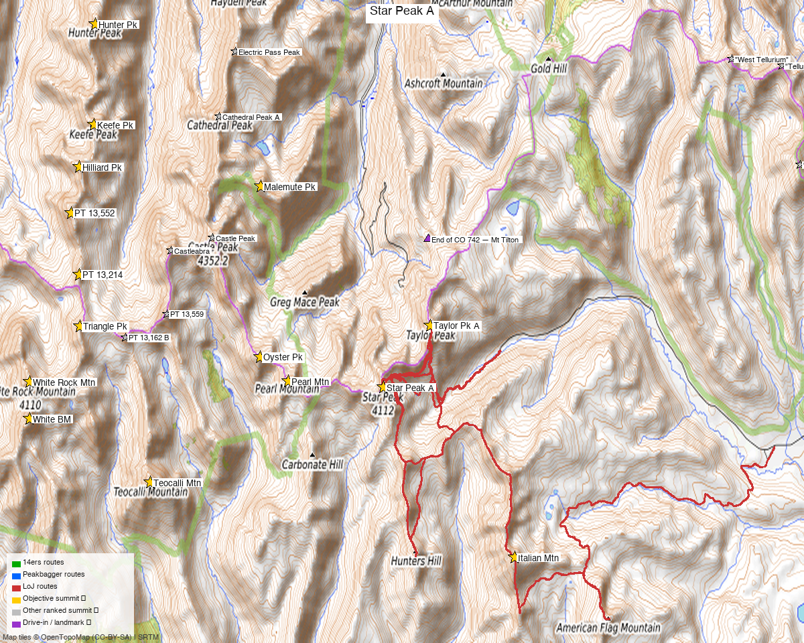

# Star Peak A (Elk Mountains / Taylor Park cluster)

**Researched:** 2026-05-28
**CalTopo research map:** https://caltopo.com/m/607Q6C8
**Status in DB:** 0 ascents (unclimbed).

## ⚠️ CRITICAL CLUSTER ALERT

**Star Peak sits in the densest unclimbed ranked-13er cluster on Kyle's near-term list — 14 unclimbed ranked 13ers within 8 miles.** Driving 3h 39m for ONLY Star would be a massive missed opportunity. See Multi-peak link-ups section below.

### Cluster status

**✗ UNCLIMBED ranked 13ers within 8 mi (14 total):**

| Peak | Distance | Elev | Same-TH potential |
|---|---|---|---|
| **Taylor Peak A** | 1.25 mi | 13,438' | ⭐ YES — done same-day in every TR |
| **Pearl Mtn** | 1.85 mi | 13,379' | ⭐ Likely — adjacent on Taylor/Pearl ridge |
| **"Oyster Pk"** | 2.43 mi | 13,316' | Possibly — Pearl-area ridge |
| **Italian Mtn** | 3.48 mi | 13,385' | ⭐ YES — josephnephi 2024 did Star+Taylor+Italian+Lambertson |
| **Malemute Pk** | 3.68 mi | 13,318' | Possibly — Italian ridge complex |
| **Teocalli Mtn** | 4.71 mi | 13,213' | Different drainage; separate trip likely |
| "Triangle Pk" | 5.95 mi | 13,405' | Different drainage |
| PT 13,214 | 6.12 mi | 13,214' | Different drainage |
| PT 13,552 | 6.54 mi | 13,552' | Different drainage |
| Hilliard Pk | 6.65 mi | 13,422' | Different drainage |
| Keefe Pk | 6.70 mi | 13,532' | Different drainage |
| White Rock Mtn | 6.87 mi | 13,523' | Different drainage |
| White BM | 6.88 mi | 13,411' | Different drainage |
| Hunter Pk | 7.54 mi | 13,506' | Different drainage |

**✓ DONE nearby:** Castle Pk 14er (3.91 mi), PT 13,559 (4.33 mi), Castleabra (4.54 mi), Cathedral Pk (4.94 mi), PT 13,162 B (5.06 mi), Electric Pass Pk (5.49 mi)

---

<!-- CLIMBERS_START -->
**Other climbers:** Emily Sharpe — not yet · Shawn D Keil — not yet
<!-- CLIMBERS_END -->

## Quick stats

| | Star Peak A (Elk Mtns) |
|---|---|
| Elevation | 13,527' (LiDAR; map 13,521') |
| Lat / Lon | 38.97964, −106.79953 |
| Weather | [NOAA forecast](https://forecast.weather.gov/MapClick.php?lat=38.97964&lon=-106.79953) (same target as 14ers / LoJ / peakbagger weather links) |
| 14ers.com peak page | https://www.14ers.com/peaks/10099/13er-star-peak-a |
| listsofjohn.com | https://listsofjohn.com/peak/301 |
| peakbagger.com | https://peakbagger.com/peak.aspx?pid=14666 |
| Range / NF | Elk Mountains / Gunnison NF + White River NF (boundary peak) |
| Class | **2+** (per LoJ) |
| Peak DB id | 301 |
| CO Rank | 240 (high — relatively prominent peak) |
| CO Prominence Rank | 655 (Rise 817' LiDAR — moderate) |
| Counties | Gunnison & Pitkin |
| Quad | Pearl Pass |
| Member ascents | 107 (14ers) + 82 (LoJ) |
| 14ers GPX library | [1 entry](https://www.14ers.com/php14ers/gpxlib_locator.php?peakid=10099) |
| 14ers winter ascents | 3 / Ski descents 23 |

*[Interactive CalTopo map](https://caltopo.com/m/607Q6C8)*

---

## Multi-peak link-ups (THE point of this peak)

**The 14ers/LoJ TR pattern is dominantly Star + Taylor + Italian (+ sub-13k bumps).** A solo-Star day is achievable (PB aid 992811 did it in 2,766' / 6.6 mi) but skipping the adjacent ranked-13er payoff would be borderline wasteful for the 3h 39m drive.

### Option A — Star + Taylor + Italian + Lambertson (RECOMMENDED) ⭐⭐⭐

The josephnephi 6/28/2024 outing (TR 26881, GPX 16120). Hits 3 ranked 13ers Kyle still needs (Star + Taylor + Italian; Lambertson is a 4th — verify rank status).

**Estimated stats:** ~12-14 mi RT, ~5,500-6,500' gain, Class 2+. Long day, but bag 3-4 ranked peaks for one drive.

→ This single outing eliminates **Star + Taylor A + Italian Mtn** (and possibly Lambertson Pk) from Kyle's remaining list. Three ranked 13ers in one trip — strongest cluster value on the closest-10 list by far.

### Option B — Star + Taylor (the classic minimum)

The 3 TR baseline: Furthermore 9/15/2012, John Kirk 9/5/2016, whileyh 11/6/2020 all did Star + Taylor only.

**Stats:**
- Furthermore: ~9.5 mi / ~5,100' (Taylor + Star + Crystal sub-13k + UN 12419)
- PB aid 1533069: **4,289' / 8.9 mi from 10,748' TH** — Star + Taylor

→ Bag 2 ranked 13ers Kyle needs in one trip. **Stats put it ~4,289' total — exceeds your 4,000' filter by ~300'.** Worth the extra effort if you accept the slight over-budget for 2 peaks.

### Option C — Star + Pearl Mtn

Star and Pearl Mtn (1.85 mi away, ranked 13,379') sit on the same ridge complex. Need TR validation that they link up cleanly. **TODO research:** check LoJ peak 432 (Pearl Mtn) for combo TRs with Star.

### Option D — Star alone

The 2,766' / 6.6 mi from 10,760' TH option (PB aid 992811). Lowest gain, fastest day. But you've driven 3h 39m to bag ONE peak when 4 others are within ridge-walking distance. **Don't do this unless conditions force it.**

### Option E — Long backpack: hit the entire East Taylor Park cluster

7-10 ranked unclimbed 13ers from a single multi-day basecamp near the Mt Tilton trail. Reference for a future planning effort, not a day trip.

---

## Recommended route — Mt Tilton Trail from end of CO 742 ⭐

**No 14ers.com route description exists.** Best baseline is Furthermore's 9/15/2012 TR.

| Route | Stats |
|---|---|
| Difficulty | Class 2+ (LoJ; some rock band navigation on Taylor's SW ridge) |
| Distance solo Star | **6.6 mi RT** (PB aid 992811) |
| Distance Star+Taylor | **8.9 mi** (PB aid 1533069) / 9.5 mi (Furthermore) |
| Gain solo Star | **2,766'** (PB) |
| Gain Star+Taylor | **4,289'** (PB) / ~5,100' (Furthermore w/ Crystal extra) |
| Time | ~4-5 hr solo Star; ~8 hr Star+Taylor combo |
| Start elev | ~10,748-10,760' (end of CO 742 / Mt Tilton TH) |
| Summit | 13,527' |

### Route sequence (per Furthermore 9/15/2012)

1. From the **end of CO 742 / Mt Tilton Trail TH**, hike up the Mt Tilton Trail
2. Trail follows north side of stream (different from topo)
3. After **~1.5 mi, trail junction for Taylor Pass** — LEAVE the trail here
4. Climb directly **north** toward the base of Taylor's west ridge
5. Steep grass climb, pass mines (shown on topo)
6. Above mines: mix of talus and grass to Taylor's SW ridge
7. Due to cliffs on the ridge, head for a more mellow area instead of the low point
8. Gain ridge, follow to Taylor summit
9. Continue ridge SW to Star summit
10. (If continuing to Italian Mtn): drop NW from Star, traverse to Italian's SE slopes

---

## Trailhead — End of CO 742 / Mt Tilton Trail

| | |
|---|---|
| Location | End of CO 742 (Cottonwood Pass Rd, east of Taylor Park Reservoir, accessed from Buena Vista via Cottonwood Pass) |
| Drive from Boulder | **[3h 39m via Google Maps](https://www.google.com/maps/dir/?api=1&origin=1162+Peakview+Circle,+Boulder,+CO+80302&destination=39.0095,-106.7833)** (origin: 1162 Peakview Circle) |
| 2WD/4WD | High-clearance recommended for the final road section; 2WD passable in dry conditions to the standard TH |
| Start elev | ~10,748-10,760' |
| Trail | Mt Tilton Trail (national forest trail) |
| Facilities | Possibly basic camping at the end of road (Furthermore "set up camp at the end of the road") |

⚠️ **Note about trail routing:** Furthermore observed the trail goes on the north side of the stream, different from what the topo indicates. Don't second-guess — follow the on-the-ground trail.

### Alt approach — Lincoln Creek Rd (Aspen side)

Different access from SH 82 between Aspen and Independence Pass. **Not used in any of the LoJ TRs** — all 4 LoJ TRs use the CO 742 / Mt Tilton Trail approach. The Lincoln Creek side accesses different peaks (Castle, Cathedral cluster Kyle has done). Skip for Star.

---

## Conditions / season

- **Best window:** late June through October. Cottonwood Pass (CO 306 west side becomes paved at Cottonwood Pass; CO 742 is the dirt continuation) is **only open seasonally** — typically **late May to late October**, weather-dependent. Verify CDOT before driving from Boulder
- **Early season:** Furthermore 9/15/2012 noted low-30s overnight temps in mid-September — get cold gear
- **Storms:** Standard Elk Mtns afternoon storm risk on exposed ridges. Start ENDPOINT-EARLY for multi-peak combos
- **Snow:** ridges hold snow late; Class 2+ rock band on Taylor's SW ridge will require careful navigation under snow
- **Wind:** exposed Elk Mtns ridge — standard layering, expect cold even in summer

---

## Cell coverage

- **14ers.com community DB:** TODO query
- **Geographic reasoning:**
  - **TH (10,750', end of CO 742):** likely **dead** — deep in East Taylor Park backcountry, far from any tower
  - **Lower trail:** dead
  - **Taylor SW ridge / ridge to Star:** likely **weak to none** — Elk Mtns are notoriously bad cell country
  - **Summit:** **likely weak** — Star's prominence is moderate; surrounded by higher Elk Mtns peaks. Possible weak signal toward Aspen but not reliable
- **Standard recommendation:** **carry InReach. Treat as no-cell territory.** Elk Mtns interior is reliably dead.

---

## Permits / access

- Gunnison NF + White River NF — no permits, no fees
- ⚠️ **Cottonwood Pass / CO 742 seasonal closure** — late May to late October typically
- Standard public-land rules; pack out everything

---

## Trip reports

### 14ers.com (6 reports)

| Title | Notes |
|---|---|
| "Spring Elk Hunting II" | spring (likely ski/snow) |
| "From the end of 742 / Mt Tilton Trail" | confirms TH name |
| "13er skiing in June: From corn to suncups (Part 2)" | ski descent in June |
| "Taylor Park & Gothic Tricentennial Blitz" | multi-peak Taylor Park area |
| "Eastern Elk Duo" | Star + Taylor classic |
| "Star Peak>Friends Hut>Greg Mace Peak" | links to Friends Hut + Greg Mace (sub-13k) — backpacking style |

(Full list at https://www.14ers.com/php14ers/peak.php?peakid=10099 → Trip Reports)

### listsofjohn.com (4 reports — all multi-peak)

| Date | Climber | Stats | GPX | Combo (RANKED additions only) |
|---|---|---|---|---|
| 2024-06-28 | [josephnephi TR 26881](https://listsofjohn.com/tr?Id=26881&pkid=301) | (no stats listed) | 16120 | **Star + Taylor + Italian + Lambertson** ⭐⭐ (+ Crystal, American Flag, Hunters Hill, Tilton, UN 12419 — sub-13k) |
| 2020-11-06 | [whileyh TR 17731](https://listsofjohn.com/tr?Id=17731&pkid=301) | (GPX only) | 9153 | Star + Taylor |
| 2016-09-05 | [John Kirk TR 7235](https://listsofjohn.com/tr?Id=7235&pkid=301) | (no stats) | 2581 | Star + Taylor (+ Crystal sub-13k + UN 12419) |
| 2012-09-15 | [Furthermore TR 1689](https://listsofjohn.com/tr?Id=1689&pkid=301) | **~9.5 mi / ~5,100' / cold start** | — | ⭐ baseline narrative. Star + Taylor (+ Crystal sub-13k + UN 12419). Detailed route sequence. |

### peakbagger.com (recent ascents)

| aid | Stats | Type |
|---|---|---|
| [**1533069**](https://peakbagger.com/climber/ascent.aspx?aid=1533069) | **4,289' / 8.9 mi from 10,748' TH** | ⭐ Star + Taylor combo confirmed |
| [**992811**](https://peakbagger.com/climber/ascent.aspx?aid=992811) | **2,766' / 6.6 mi from 10,760' TH** | ⭐ Solo Star baseline |

---

## .gpx files (to be downloaded to `gpx/star_peak_a/`)

**LoJ GPX library:**
- `star_16120.gpx` — josephnephi 6/28/2024 Star + Taylor + Italian + Lambertson + sub-13ks ⭐⭐ THE multi-peak baseline
- `star_9153.gpx` — whileyh 11/6/2020 Star + Taylor (fall)
- `star_2581.gpx` — John Kirk 9/5/2016 Star + Taylor + Crystal + UN

**14ers.com GPX library:** 1 entry at https://www.14ers.com/php14ers/gpxlib_locator.php?peakid=10099

**Generated (to build):**
- `star_summit_TH.gpx` — Star + Taylor + Italian + Pearl summits + Mt Tilton TH + key trail junction at 1.5 mi
- `star_route_recommended.gpx` — from josephnephi 16120 (the 4-ranked-peak combo)

---

## TL;DR

- **The best ranked-13er-per-drive-hour outing on Kyle's closest-10 list.** Drive 3h 39m, bag 2-4 ranked peaks (Star + Taylor + Italian + maybe Pearl) from a single TH.
- **Recommended trip:** **Star + Taylor + Italian** at minimum. Use **josephnephi 6/28/2024 GPX 16120** as planning baseline (he hit all 3 + Lambertson + sub-13ks in one outing). Stats roughly: 12-14 mi RT, 5,500-6,500' gain, Class 2+, ~9-12 hr day.
- **Star alone:** 2,766' / 6.6 mi / Class 2+, ~4-5 hrs (PB aid 992811). Under 4,000' but a waste of the drive given the cluster.
- **Star + Taylor minimum:** 4,289' / 8.9 mi (PB aid 1533069). Slightly over Kyle's 4,000' filter; worth the extra for 2 ranked peaks.
- **TH:** **End of CO 742 (east of Taylor Park Reservoir), Mt Tilton Trail.** CO 742 is **seasonally closed** — verify open before driving.
- **Route:** Mt Tilton Trail 1.5 mi → leave trail at Taylor Pass junction → climb N to Taylor's SW ridge through old mines → ridge to Taylor → ridge SW to Star → (optional drop to Italian)
- **Class 2+** with rock band navigation on Taylor's SW ridge — Furthermore took a mellower line to avoid cliffs
- **Cell: DEAD** — Elk Mtns interior. Carry InReach
- **Best season:** late June through October. Cold mornings even in summer (Furthermore: low-30s F mid-Sept)
- **Drive:** **3h 39m from Boulder**

---

**Sources checked:** 14ers.com · listsofjohn.com · peakbagger.com
