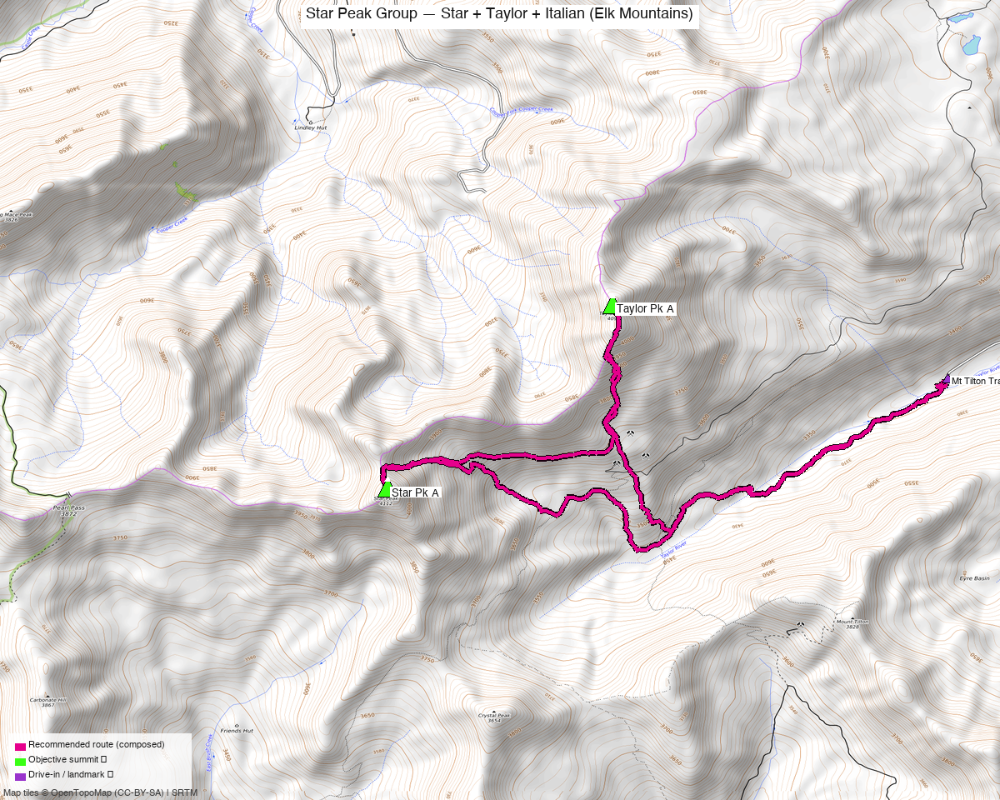

# Star Peak Group — Star + Taylor + Italian (Elk Mountains)

<!-- QUICKSTATS_START -->

!!! tip "At a glance — recommended day"
    **4,300 ft** gain · **Class 2** · 3 peaks · ~3.7 h drive

<!-- QUICKSTATS_END -->

**Researched:** 2026-06-07
**Report type:** Day trip (3 ranked 13ers) — one long day *or* a weekend from one basecamp
**CalTopo research map:** https://caltopo.com/m/J6HBR6S
**Status in DB:** All three 0 ascents (unclimbed). These are the core unclimbed ranked 13ers of the **East Taylor Park / Star Pass cluster** — the densest pocket of unclimbed ranked 13ers on Kyle's near-term list.

*[Interactive CalTopo map](https://caltopo.com/m/J6HBR6S)*

---

<!-- CLIMBERS_START -->
**Other climbers:** Emily Sharpe — not yet · Shawn D Keil — not yet
<!-- CLIMBERS_END -->

## Quick stats

| | Star Peak A | Taylor Pk A | Italian Mtn |
|---|---|---|---|
| Elevation (LiDAR) | 13,527' (map 13,521') | 13,438' | 13,385' |
| Lat / Lon | 38.97963, −106.79967 | 38.99204, −106.78261 | 38.94532, −106.75214 |
| Weather | [NOAA forecast](https://forecast.weather.gov/MapClick.php?lat=38.97963&lon=-106.79967) (same target as 14ers / LoJ / peakbagger weather links) | [NOAA forecast](https://forecast.weather.gov/MapClick.php?lat=38.99204&lon=-106.78261) | [NOAA forecast](https://forecast.weather.gov/MapClick.php?lat=38.94532&lon=-106.75214) |
| Class (standard) | 2 | 2 | 2 |
| CO Rank | 241 | 299 | 331 |
| Prominence | — | 817' | 1,357' |
| Range | Elk Mtns (Taylor Park) | Elk Mtns (Taylor Park) | Elk Mtns (Taylor Park) |
| County | Gunnison/Pitkin | Gunnison | Gunnison |
| 14ers.com | [10099](https://www.14ers.com/peaks/10099/13er-star-peak-a) | [10104](https://www.14ers.com/php14ers/peak.php?peakid=10104) | [10110](https://www.14ers.com/php14ers/peak.php?peakid=10110) |
| LoJ | [301](https://listsofjohn.com/peak/301) | [365](https://listsofjohn.com/peak/365) | [420](https://listsofjohn.com/peak/420) |
| peakbagger | [pid 14666](https://peakbagger.com/peak.aspx?pid=14666) | [pid 15740](https://peakbagger.com/peak.aspx?pid=15740) | [pid 16662](https://peakbagger.com/peak.aspx?pid=16662) |
| Peak DB id | 301 | 365 | 420 |

All three are **Class 2** and all approached from the **Taylor Park (east) side** of the Elk crest. None carry a wilderness designation at the summit.

---

## Why these three together

This is an **approach grouping**, not a summit-proximity guess. All three are reached from the **same Taylor Park road network** (CO 742, east of Taylor Park Reservoir):

- **Star + Taylor are the standard pair** — done together in *every* trip report that hits either (whileyh, John Kirk, Furthermore). They sit 1.25 mi apart on a connecting Class 2 ridge above the Mt Tilton Trail.
- **Italian** is the geographic outlier (3.5 mi SW across Star Pass) but groups here **by approach** — it comes off the same Taylor Park roads, not the Crested Butte/Aspen side. It's normally climbed on its own (with sub-13k American Flag Mtn and soft-ranked Lambertson Peak).
- **All three in one push is proven:** josephnephi (LoJ [TR 26881](https://listsofjohn.com/tr?Id=26881) / GPX 16120, 6/28/2024) linked Star + Taylor + Italian + Lambertson **plus** five sub-13k summits on foot from the Mt Tilton TH — a 24.8 mi / 12,585 ft monster. A focused three-peak version is far shorter, but it confirms the on-foot link exists.

**Combos (ranked-13er+ rule):** all three are ranked 13ers, so any pairing counts as a true ranked combo. The neighboring ranked summits (Castle, Cathedral, Castleabra, Electric Pass Pk) are already done — this trip cleans up what's left on the Taylor Park side.

---

## Drive + approach

| | |
|---|---|
| **Drive from Boulder** | **[3h 40m via Google Maps](https://www.google.com/maps/dir/?api=1&origin=1162+Peakview+Circle,+Boulder,+CO+80302&destination=38.987,-106.757)** (origin: 1162 Peakview Circle) |
| Primary trailhead | **Mt Tilton Trail, end of CO 742** (~38.987, −106.757, ~10,750') — east of Taylor Park Reservoir, reached via Cottonwood Pass from Buena Vista |
| Italian alt start | **CR 742 → 748 → 744** (rough 2WD, last ~1.5 mi needs clearance — whileyh 2021), or the **Star Mine end of CO 759 / Cement Creek jct** (4WD — Furthermore 2012). Both are short drives within the Taylor Park network from the Mt Tilton TH. |
| Seasonal access | **Cottonwood Pass / CO 742 is seasonally closed** — typically late May to late October. Verify CDOT before driving. |

---

## Recommended plan ⭐

The cluster works two ways. Pick based on how big a day you want.

### Option A — Weekend from one Taylor Park basecamp (recommended)
Camp near the end of CO 742 and split the cluster into two manageable Class 2 days:

- **Day 1 — Star + Taylor** (the clean pair): **~8.6 mi, ~4,300 ft, Class 2** (measured from whileyh's GPX, LoJ 17731).
- **Day 2 — Italian Mtn** (with American Flag Mtn if wanted): a shorter half-day from the CR 744 / Cement Creek spur, or repeat from the Mt Tilton side.

### Option B — All three in one long day
Link Star + Taylor + Italian on foot from the Mt Tilton TH (the josephnephi line, trimmed of the sub-peak detours). Budget roughly **~14–17 mi and ~6,500–8,000 ft, Class 2**, a committing full alpine day — Italian adds a ~3.5 mi each-way tundra traverse across Star Pass with a big drop (~12,400') and regain.

**Combo stats (measured from TR GPX):**

| Source track | Peaks | Distance | Gain |
|---|---|---|---|
| whileyh 2020 (LoJ 17731) | Star + Taylor | 8.6 mi | ~4,311' |
| John Kirk 2016 (LoJ 7235) | Star + Taylor (+Crystal) | 10.7 mi | ~5,883' |
| josephnephi 2024 (LoJ 26881) | Star + Taylor + Italian + Lambertson + 5 sub-peaks | 24.8 mi | ~12,585' |

### Route sequence (Star + Taylor, Mt Tilton Trail)
1. From the **end of CO 742 / Mt Tilton Trail TH**, hike the Mt Tilton Trail ~1.5 mi (trail runs on the **north** side of the stream, contrary to the topo).
2. At the **Taylor Pass junction**, leave the trail and climb directly **north** to the base of Taylor's west ridge (old mine workings).
3. Gain the ridge to **Taylor Peak (13,438', Class 2)**.
4. Follow the connecting ridge **SW ~1.25 mi (Class 2)** to **Star Peak A (13,527')**.
5. Descend back toward the Taylor Pass junction and out — *or*, for Option B, drop SW and traverse to Italian.

### Italian extension / standalone
From the Star–Taylor side, descend SW across the basin/Star Pass area (Class 2 tundra, significant elevation loss) and climb **Italian Mtn (13,385')** from the north/east. As a standalone, Italian is most efficiently done from the **CR 744 or Cement Creek** spur, commonly paired with **American Flag Mountain** (12,723', sub-13k).

---

## Per-peak route notes

- **Star Peak A** — no formal 14ers route description ("no route descriptions… try the Trip Reports"). Standard line is the Taylor→Star ridge from the Mt Tilton Trail; Class 2 throughout.
- **Taylor Peak A** — the natural first summit of the pair; west ridge off the Mt Tilton Trail / Taylor Pass junction, Class 2.
- **Italian Mtn** — Class 2 tundra/talus; standalone TRs use the Taylor Park spurs (CR 744 / CO 759–Cement Creek) and add American Flag Mtn + Lambertson Peak. The highest-prominence peak of the three (1,357').

---

## Conditions / season

- **Best window:** late June through early October. Snow lingers in the basins into early summer.
- **Access window:** **Cottonwood Pass / CO 742 seasonal closure** (≈ late May–late October) gates the whole trip — verify CDOT first.
- **Terrain:** Class 2 tundra, grass, and talus; no technical difficulty on the standard lines. Old mining roads/workings aid the lower Taylor approach.
- **Storms:** long exposed ridges and tundra — early start, off the high ground by early afternoon (especially for the big one-day link).

---

## Permits / access

- No wilderness permits — the summits are on Gunnison NF land outside designated wilderness.
- No fees. Dispersed camping plentiful near the end of CO 742 (fills on summer weekends).

---

## Cell coverage

- **14ers.com community DB:** no submitted reception reports for these summits/TH (typical for the East Taylor Park backcountry).
- **Geographic reasoning:** the **Mt Tilton TH and lower basins are likely dead** — deep in East Taylor Park, shadowed from towers. **Summits may catch intermittent signal** with line-of-sight east, but don't count on it.
- **Standard recommendation:** carry an **InReach / satellite messenger**, especially for the big one-day link.

---

## Trip reports & GPX (all three sources)

### listsofjohn.com
| Date | Author | Peaks | GPX |
|---|---|---|---|
| 2024-06-28 | josephnephi | **Star + Taylor + Italian** + Lambertson + 5 sub-peaks | [16120](https://listsofjohn.com/gpx/16120.gpx) ⭐⭐ all three |
| 2020-11-06 | whileyh | Taylor + Star | [GPX in repo](https://listsofjohn.com/tr?Id=17731) — clean pair baseline |
| 2016-09-05 | John Kirk | Star + Taylor + Crystal | [TR 7235](https://listsofjohn.com/tr?Id=7235) |
| 2012-09-15 | Furthermore | Star + Taylor + Crystal | [TR 1689](https://listsofjohn.com/tr?Id=1689) — confirms "TH: end of CO 742, Mt Tilton Trail" |
| 2021-06-13 | whileyh | Italian + Lambertson + American Flag | [TR 19478](https://listsofjohn.com/tr?Id=19478) — Italian via CR 742→748→744 |
| 2012-09-14 | Furthermore | Italian + Lambertson + American Flag | [TR 1688](https://listsofjohn.com/tr?Id=1688) — Italian via Star Mine / CO 759 / Cement Creek |

### 14ers.com (logged in, "Basin")
Peak pages exist for all three but carry **no formal route descriptions** — route beta comes from the trip reports. 14ers GPX-library track layered on the research map.

### peakbagger.com (logged in, "Kyle Knutson")
Ascent GPX tracks pulled for all three (Star aid 1533069, Taylor aid 1533019, Italian aid 1678921) and layered on the CalTopo map.

**GPX collected: 8 track files across all three sources** (LoJ combos + 14ers library + peakbagger ascents) — all layered on the research map, colored by source.

**Sources checked:** 14ers.com ✓ (logged in, "Basin") · listsofjohn.com ✓ (logged in, "letsgocu") · peakbagger.com ✓ (logged in, "Kyle Knutson")

---

## TL;DR

- **Three unclimbed ranked Class 2 13ers** — Star (13,527'), Taylor (13,438'), Italian (13,385') — all off the **Taylor Park / Mt Tilton Trail** side (end of CO 742).
- **Best plan:** weekend basecamp — **Day 1 Star + Taylor** (~8.6 mi, ~4,300', the clean pair) + **Day 2 Italian** (short half-day with American Flag). Or link **all three in one ~14–17 mi / ~6,500–8,000 ft day** (josephnephi proved the on-foot link).
- **All Class 2** — tundra/talus, no technical difficulty; long exposure on the big day.
- **Access gate:** Cottonwood Pass / CO 742 is **seasonally closed** (≈ late May–late October) — verify before driving.
- **Drive:** [3h 40m](https://www.google.com/maps/dir/?api=1&origin=1162+Peakview+Circle,+Boulder,+CO+80302&destination=38.987,-106.757) from home to the Mt Tilton TH.
- **Separate trip from Pearl + Oyster** — those neighbors are only ~3.5 mi away on foot but **~4 hours by car** (opposite, Aspen side of the crest). See the [Pearl + Oyster report](pearl_oyster.md).
- **Cell:** likely dead at TH; carry an InReach.
- **Research map:** https://caltopo.com/m/J6HBR6S
