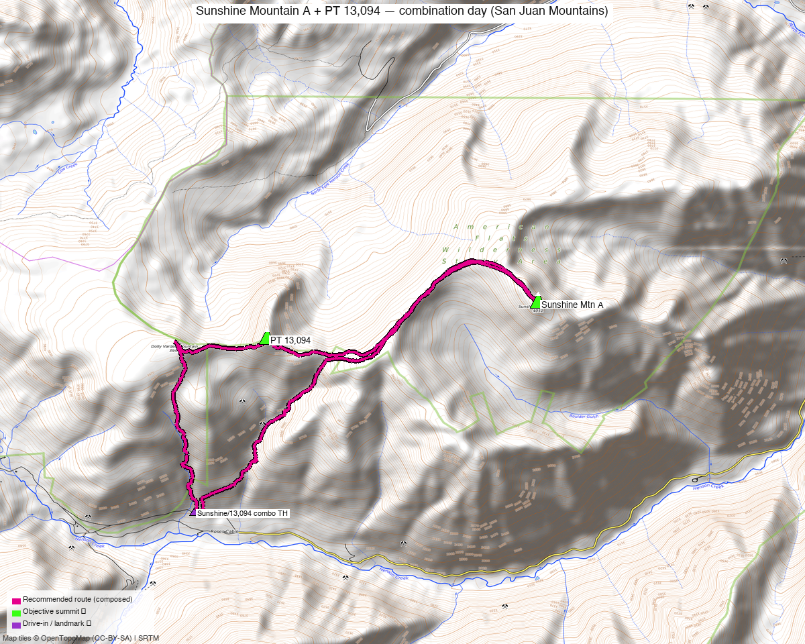

# Sunshine Mountain A + PT 13,094 — combination day (San Juan Mountains)

**Researched:** 2026-06-08
**Report type:** Day trip (2 ranked 13ers, one outing)
**CalTopo research map:** https://caltopo.com/m/11EMC0L
**Status in DB:** Both 0 ascents (unclimbed). A natural pair on the **American Flats / Engineer Pass** side of the Uncompahgre high country (Lake City / Henson Creek access).

*[Interactive CalTopo map](https://caltopo.com/m/11EMC0L)*

---

<!-- CLIMBERS_START -->
**Other climbers:** Emily Sharpe — not yet · Shawn D Keil — not yet
<!-- CLIMBERS_END -->

## Quick stats

| | Sunshine Mtn A | PT 13,094 |
|---|---|---|
| Elevation (LiDAR) | 13,329' (pre-LiDAR 13,321') | 13,094' (pre-LiDAR 13,093'; 14ers ~13,099') |
| Lat / Lon | 37.99556, −107.50870 | 37.99263, −107.53414 |
| Weather | [NOAA forecast](https://forecast.weather.gov/MapClick.php?lat=37.99556&lon=-107.50870) (same target as 14ers / LoJ / peakbagger weather links) | [NOAA forecast](https://forecast.weather.gov/MapClick.php?lat=37.99263&lon=-107.53414) |
| Class (standard) | 2 | 2 |
| CO Rank | 371 | 571 |
| Prominence | 1,088' | 348' |
| Range | San Juan (Uncompahgre / American Flats) | San Juan (Uncompahgre / American Flats) |
| 14ers.com | [10446](https://www.14ers.com/php14ers/peak.php?peakid=10446) | [10566](https://www.14ers.com/php14ers/peak.php?peakid=10566) |
| LoJ | [468](https://listsofjohn.com/peak/468) | [725](https://listsofjohn.com/peak/725) |
| peakbagger | [pid 15112](https://peakbagger.com/peak.aspx?pid=15112) | [pid 19480](https://peakbagger.com/peak.aspx?pid=19480) |
| Peak DB id | 468 | 725 |

**The two summits are ~1.4 mi apart** on a connecting ridge above the American Flats benches — a natural, well-established pairing.

---

## Why these two together

A **standard pairing** — every trip report that hits either peak does **both** in one outing, almost always with sub-13k **Dolly Varden Mountain** (12,935') in between:

- **whileyh** (2020-07-06) — Sunshine + PT 13,094 + Dolly Varden (the clean combo)
- **josephnephi** (2023-05-29) — Dolly Varden + Sunshine + PT 13,094
- **Alyson Kirk** (2016-07-03) — "Dragon's Back" + Sunshine + PT 13,094 + Blackwall + Dolly Varden + PT 12,916 (a big American Flats traverse; Dragon's Back needs a 30 m rope)

**Combos (ranked-13er+ rule):** Sunshine (13,329') and PT 13,094 are both ranked, so they count as a true ranked pair for each other. Dolly Varden is a sub-13k bump on the connecting ridge (nice to grab, doesn't count). The neighboring ranked peaks (Blackwall, Wildhorse, Coxcomb, Redcliff, Wood Mtn, Gudy) are already done — this pairing cleans up the two unclimbed ranked points in the American Flats pocket.

---

## Drive + approach

| | |
|---|---|
| **Drive from Boulder** | **[7h 31m via Google Maps](https://www.google.com/maps/dir/?api=1&origin=1162+Peakview+Circle,+Boulder,+CO+80302&destination=37.978,-107.541)** (~367 mi, origin: 1162 Peakview Circle; via US-285 + US-50 to Lake City) |
| Access corridor | **Henson Creek Rd (Hinsdale CR 20) from Lake City** — the Engineer Pass road toward Capitol City / American Flats |
| Combo trailhead | ~37.978, −107.541, **~11,000'** (spur off the Henson Creek / Engineer Pass corridor). High-clearance/4WD for the upper road. |
| Note | This is a **long haul** (~7.5 hr each way, far SW Colorado) — best as an overnight/car-camp out of Lake City, not a Boulder day trip. |

---

## Recommended plan — Henson Creek / American Flats, the Sunshine ↔ 13,094 ridge ⭐

The standard and most efficient line for the pair (whileyh 2020, josephnephi 2023).

**Combo stats (measured from TR GPX):**

| Source track | Peaks | Distance | Gain |
|---|---|---|---|
| whileyh 2020 (LoJ 8394) | Sunshine + PT 13,094 (+Dolly Varden) | 6.8 mi | ~3,343' |
| josephnephi 2023 (LoJ 14319) | Dolly Varden + Sunshine + PT 13,094 | 6.4 mi | ~5,430' |
| Alyson Kirk 2016 (LoJ 2267) | Dragon's Back + Sunshine + 13,094 + Blackwall + Dolly Varden + 12,916 | 16.2 mi | ~6,537' |

Expect roughly **~6.5 mi and ~3,300–5,400 ft** for the clean two-peak day (gain depends on how high the road is driven). A **moderate Class 2 day** — well under a big-mountain effort.

### Route sequence
1. From the combo TH (~11,000') on the Henson Creek / American Flats spur, climb toward the **PT 13,094 ↔ Sunshine ridge**.
2. Tag **PT 13,094 (13,094', Class 2)** and **Sunshine Mtn A (13,329', Class 2)** along the ~1.4 mi connecting ridge — grab **Dolly Varden Mtn (12,935')** in between if you want the easy bonus.
3. Descend back to the TH. The ridge is tundra/talus Class 2 throughout — no technical sections on the standard line.

> **Optional bigger day:** the Alyson Kirk traverse adds **"Dragon's Back"** (12,973', a **roped** scramble — 30 m rope for the first pitch and summit pitch) + Blackwall + PT 12,916 for a 16-mi American Flats tour. Only if you want the scramble; not needed for the two ranked objectives.

---

## Per-peak route notes

- **Sunshine Mtn A** — Class 2; the higher, more prominent of the pair (1,088' prominence). Standard tundra/talus ridge from the PT 13,094 side.
- **PT 13,094** — Class 2; the lower ranked point 1.4 mi W. No formal 14ers route description (route beta is TR-only). 14ers/USGS may label it 13,099'.

---

## Conditions / season

- **Best window:** **July through September.** High San Juan tundra; the Henson Creek / Engineer Pass road network opens late and is a rough 4WD up high.
- **Snow:** josephnephi's late-May outing caught snow (higher gain) — expect lingering snow into early summer on N aspects and the upper road.
- **Storms:** standard San Juan afternoon monsoon exposure on the open ridge — early start, off the high ground by early afternoon.
- **Terrain:** Class 2 tundra/talus on the standard line; no technical difficulty (Dragon's Back, a roped option, is separate).

---

## Permits / access

- **American Flats Wilderness Study Area / Uncompahgre NF–BLM** — no permits; the summits are not in designated wilderness (per peak_db), though the area abuts the Uncompahgre Wilderness. Standard Leave No Trace.
- Henson Creek Rd / Engineer Pass: a serious high-clearance 4WD route up high — check conditions before committing the upper road.

---

## Cell coverage

- **14ers.com community DB:** no submitted reception reports for these summits.
- **Geographic reasoning:** the **Henson Creek approach and basin are almost certainly dead** — deep in the Lake City / Engineer Pass backcountry. **Summits may catch intermittent signal** but treat it as unreliable.
- **Standard recommendation:** carry an **InReach / satellite messenger** — remote, long way from help.

---

## Trip reports & GPX (all three sources)

**Sources confirmed logged in:** 14ers.com ("Basin"), listsofjohn.com ("letsgocu"), peakbagger.com ("Kyle Knutson"). **7 GPX tracks** swept (LoJ combos + peakbagger ascents) and layered on the CalTopo map, colored by source.

### listsofjohn.com
| Date | Author | Peaks | GPX |
|---|---|---|---|
| 2020-07-06 | whileyh | **Sunshine + PT 13,094** + Dolly Varden | [8394](https://listsofjohn.com/gpx/8394.gpx) ⭐ clean combo |
| 2023-05-29 | josephnephi | Dolly Varden + Sunshine + PT 13,094 | [14319](https://listsofjohn.com/gpx/14319.gpx) (late-May snow) |
| 2016-07-03 | Alyson Kirk | Dragon's Back + Sunshine + 13,094 + Blackwall + Dolly Varden + 12,916 | [2267](https://listsofjohn.com/gpx/2267.gpx) — big traverse |

### 14ers.com (logged in, "Basin")
Peak pages exist for both; **no formal route descriptions** (route beta is TR-only).

### peakbagger.com (logged in, "Kyle Knutson")
Ascent GPX pulled for both — Sunshine (pid 15112) and PT 13,094 (pid 19480), 2 ascent tracks each — layered on the CalTopo map.

**Sources checked:** 14ers.com ✓ (logged in, "Basin") · listsofjohn.com ✓ (logged in, "letsgocu") · peakbagger.com ✓ (logged in, "Kyle Knutson")

---

## TL;DR

- **Sunshine Mtn A (13,329') + PT 13,094**, ~1.4 mi apart on a Class 2 ridge — a clean pair, done together in every TR (usually + sub-13k Dolly Varden).
- **The plan:** Henson Creek / American Flats spur (~11,000') → PT 13,094 ↔ Sunshine ridge → out. **~6.5 mi, ~3,300–5,400 ft, Class 2.** A moderate day.
- **"13,099" = PT 13,094** (LiDAR 13,094'; 14ers may show 13,099') — the only unclimbed ranked 13er adjacent to Sunshine.
- **Long drive:** [7h 31m](https://www.google.com/maps/dir/?api=1&origin=1162+Peakview+Circle,+Boulder,+CO+80302&destination=37.978,-107.541) to the Henson Creek (Lake City) side — plan it as an overnight, not a day trip from Boulder.
- **Optional scramble:** add "Dragon's Back" (roped, 30 m) + Blackwall for a 16-mi American Flats traverse.
- **Season:** July–September; rough 4WD up high. Cell dead — carry an InReach.
- **Research map:** https://caltopo.com/m/11EMC0L (7 GPX tracks, source-colored).
