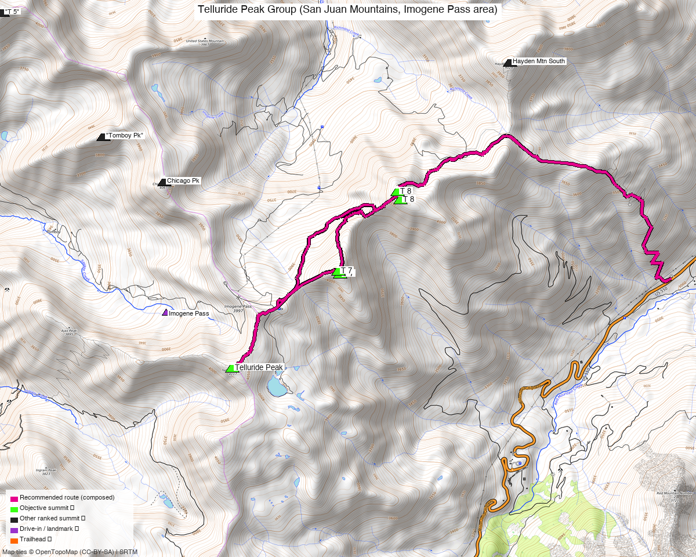

# Telluride Peak Group (San Juan Mountains, Imogene Pass area)

<!-- QUICKSTATS_START -->

!!! tip "At a glance — recommended day"
    **10.1 mi** · **6,057 ft** gain · **Class 2-3** · 3 peaks · ~6.3 h drive

<!-- QUICKSTATS_END -->

**Researched:** 2026-05-14

!!! map ""
    **CalTopo research map:** https://caltopo.com/m/6FM1FEK

**Status in your sheet:** All 3 unclimbed (T 7 and T 8 explicitly at 0 ascents; Telluride Pk LiDAR-confirmed ranked, no entry in your climb log).

<!-- PROVENANCE_START -->
*Note: the recommended route was distilled from **19 recorded GPS tracks** of real trips (14ers.com · ListsofJohn · peakbagger) — all layered on the [interactive CalTopo research map](https://caltopo.com/m/6FM1FEK).*
<!-- PROVENANCE_END -->

---

<!-- CLIMBERS_START -->
**Other climbers:** Emily Sharpe — not yet · Shawn D Keil — 2 of 3 (Telluride Pk, T 7)
<!-- CLIMBERS_END -->

## Peaks covered

| | [Telluride Peak](https://www.14ers.com/peaks/10375) | [T 7](https://www.14ers.com/peaks/10434) | [T 8](https://www.14ers.com/peaks/10449) |
|---|---|---|---|
| Elevation (LiDAR) | 13,514' | 13,360' | 13,315' |
| Lat / Lon | 37.92479, −107.73596 | 37.93418, −107.72316 | 37.94190, −107.71606 |
| Weather (Telluride Pk) | [NOAA forecast](https://forecast.weather.gov/MapClick.php?lat=37.92479&lon=-107.73596) — same target on all 3 sites; one link covers the whole cluster |
| Class (standard) | 2 | 2 (ridge approach) | 2–3 (ridge bypass) / 3–4 (crest) |
| Range | San Juan | San Juan | San Juan |
| County | Ouray / San Miguel | Ouray | Ouray |
| Notes | LiDAR re-ranked; soft-rank historically | Sequenced with Telluride Pk | Connected to T 7 via tricky saddle |

Coordinates from your "All" map markers (LiDAR-grade). Wikipedia / older sources occasionally list Telluride Peak at 13,509' — LiDAR puts it at 13,514'.

---

## Recommended route — Idarado Mine circuit (Option A) ⭐

This is itself a 3-ranked-13er link-up. Every reasonable approach naturally chains all three (or all three + Fort Peabody / UN 13510 as soft adds). **The Idarado Mine circuit (Option A) is the recommended line — it fits your filters; the alternatives and rejected approaches are in *Other considerations*.**

**8.5 mi RT, ~4,000' gain, Class 2 (with optional 2–3 traverse).** Source: climb13ers.com route description.
- Start: Idarado Mine pullout, US 550, ~12 mi south of Ouray (~MP 90)
- Up Commodore Gulch → Telluride Peak south slopes → ridge north to Telluride Pk summit
- Drop to 12,860' saddle, climb 500' to T 7
- Traverse T 7 → T 8 (Class 2–3 via north-side bypass; Class 3–4 if you stay on crest through rock towers)
- Descend off T 8 back toward Imogene Pass road or Commodore Gulch to TH

**Sequence (clockwise loop, T-Pk → T 7 → T 8):**
1. From the parking circle, walk downhill NW toward old mine support buildings, then west and up to intercept the old mine road.
2. Hike NW along the road to the creek in Commodore Gulch.
3. Up Commodore Gulch, then ascend a tributary stream course toward Telluride Peak's south slopes.
4. Telluride Peak summit (Class 2, tundra + minor scree/chiprock).
5. North along ridge to Pt 13,365 just south of Imogene Pass summit.
6. Down to the 12,860' saddle, then up 500 vertical feet to **T 7** (broad/flat summit, easy tundra).
7. Traverse east/NE toward **T 8**. **Decision point at T 7/T 8 saddle**:
   - **Class 2–3:** Drop on the **north side** of the ridge, bypass the rock towers on scree/grass/snowfield, regain the ridge before T 8.
   - **Class 3–4:** Stay on crest through the rock towers (more sustained scrambling).
8. Descend T 8 west/SW to regain the Imogene Pass area, then back down via Commodore Gulch tributaries to the TH.

**Counter-clockwise variation:** start with T 8 first (per TR 20401's approach). Then the difficult T 8 → T 7 traverse is done with fresh legs but you're committed to it before the easier walk to Telluride Pk.

---

## Getting there — Idarado Mine pullout

- **Approx location:** 37.9038, −107.7032 (verify mile post 90 on US 550)
- **Drive from Boulder:** **[6h 19m via Google Maps](https://www.google.com/maps/dir/?api=1&origin=1162+Peakview+Circle,+Boulder,+CO+80302&destination=37.9038,-107.7032)** (326 mi, origin: 1162 Peakview Circle)
- **~12 mi south of Ouray** on US 550 (paved highway — no special vehicle needed for the drive)
- From the Ridgway → Telluride corridor: head south on US 550 from Ouray (15 min from Ridgway); continue ~12 mi past Ouray to the Idarado Mine pullout (large parking circle at ~MP 90, on the right going south). Total drive from Ridgway ~30–35 min.
- Large parking circle overlooks the historic Idarado Mine
- Summer toilets at the pullout
- Free parking, no fees, no permits required

**Permits / access:**

- US 550 is a state highway, no permits
- Uncompahgre / San Juan National Forest, Mt. Sneffels Wilderness boundary nearby — no permits needed for day hikes here (the route stays mostly outside the wilderness boundary on old mining terrain)
- No quotas, no fees

---

## Gear & season

- **Best window:** July through early October. Tundra / scree / minor scrambling — dry conditions ideal
- **US 550 (Million Dollar Hwy):** open year-round but expect winter closures during avalanche control. Spring + fall: check CDOT
- **Snow:** N-side bypass on T 7→T 8 traverse may hold a snowfield into July (per TR 20401 — used as part of the descent)
- **Water:** Commodore Gulch creek + tributaries on lower approach; treat. Above ~12,000' = none reliable
- **Hazards:** Class 3–4 rock towers if you don't bypass; loose scree/chiprock on Telluride Pk approach; storm exposure on the high ridge (3 hr+ of unprotected ridge walking)
- **Lightning:** standard San Juans summer rule — be off the ridge by noon/1 PM

---

## Other considerations

### Option B — Imogene Pass base (longer, easier driving)
**14 mi RT, ~5,100' gain, Class 2.** Source: 14ers.com TR 20401 (July 2020).
- Starts from base of Imogene Pass (2WD accessible — no Black Bear Rd needed)
- Follow Imogene Pass road up, deviate into Richmond Basin road to ~12,800', traverse to T 8 first
- Bypass the T 8/T 7 ridge difficulties via west scree/grass/snowfield
- Continue to Telluride Pk via Imogene Pass spur road
- Descend Imogene Pass road to start
- **Exceeds your 4,500' filter** but worth knowing as a no-4WD alternative.

### Option C — Black Bear / Red Mtn Pass dispersed pullout (short, only 2 peaks)
**~7.5–8.4 mi RT, ~2,750' gain, Class 2.** Sources: Wild Wanderer 9/5/2023 and Kiefer Thomas blog.
- From Black Bear Rd pullout south of Red Mtn Pass dispersed camping
- Bags Telluride Peak + UN 13509 (PT 13510 — soft-rank/unranked) only — **does NOT include T 7 or T 8**
- Useful if you've already done T 7/T 8 separately or want a half-day, but doesn't meet your "multi-peak ranked" objective on its own

### What does NOT make sense
- Driving up Imogene Pass road from Telluride side: requires 4WD/high-clearance and adds zero advantage over starting at the Idarado pullout
- Black Bear Pass road: similar — high-clearance / 4WD only and longer

---

## Recent trip reports

| Date | Source | Stats | Notes |
|---|---|---|---|
| 7/18/2020 | [14ers.com TR 20401](https://www.14ers.com/php14ers/tripreport.php?trip=20401) | 14 mi, 5,100' | All 3 peaks from Imogene Pass base. Recommended N-side bypass on T 8→T 7. |
| 9/15/2018 | [14ers.com TR 19079](https://www.14ers.com/php14ers/tripreport.php?trip=19079) | not stated | Telluride Pk + T 7 + Fort Peabody from Imogene Pass overlook. T 8 not summited. |
| 9/5/2023 | [Wild Wanderer](https://wildwanderertripreports.com/2023/09/05/pt-13509-and-telluride-peak-13514/) | 8.39 mi, 2,744' | PT 13509 + Telluride Pk only — short half-day from Red Mtn Pass camping. |
| 9/14–15/2018 | [Adventr.co](https://adventr.co/2018/09/imogene-pass-peaks/) | not stated | Telluride Pk + PT 13510 + T 7 + T 8 ridge link, scenic photo focus. |
| undated | [Kiefer Thomas blog](https://kiefer-thomas.squarespace.com/tr-telluride-peak) | 7.52 mi, 2,766' | UN 13509 + Telluride Pk via Black Bear Rd south pullout. Class 2. |
| route info | [climb13ers.com Telluride Pk](https://www.climb13ers.com/colorado-13ers/telluride-peak), [T 7](https://www.climb13ers.com/colorado-13ers/t-7), [T 8](https://www.climb13ers.com/colorado-13ers/t-8) | 8.5 mi, 4,000' (Idarado circuit) | Authoritative route description for the recommended option. |

---

## .gpx files (in `gpx/telluride_t7_t8/`)

**Public GPX:** None directly downloadable for this trio. Sources I checked:
- 14ers.com TRs 20401 and 19079 — no GPX provided
- Wild Wanderer trip — author offers GPX by email request only
- Kiefer Thomas, Adventr, climb13ers — no direct GPX downloads
- Wikiloc, Peakbagger — block automated fetch (403)

**Workaround:** the climb13ers route pages embed an interactive CalTopo map ("Open in CalTopo" button); manually browse and grab the map ID if you want to import it. I couldn't fetch the page to read the embedded ID directly.

**Generated:**
- `telluride_t7_t8_waypoints.gpx` — 3 peak summits (LiDAR coords) + Idarado Mine TH + Imogene Pass + Black Bear Rd pullout reference

**Your existing planning data (in `_kyle_existing/`):**
- `kyle_13_510b_actual_all.gpx` (1,724 pts) — imported track from your "All" map labeled "13,510B_actual". 5.26 mi loop coming within 808 m of Telluride Pk. Likely an imported track from someone's UN 13510B trip — useful as terrain reference for the area.

---

<!-- pre-3-source-rule -->
**Sources checked:** 14ers.com · peakbagger.com · _LoJ not pulled — pre-3-source-rule report, pending a freshness pass_
