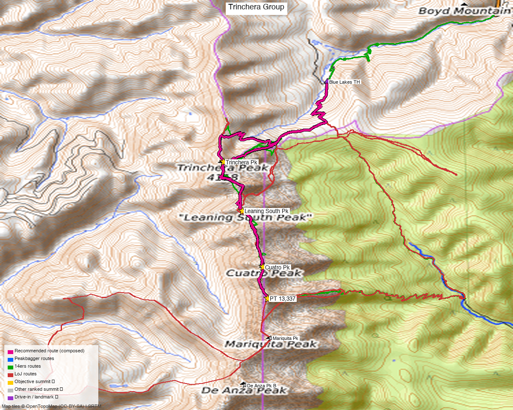

# Trinchera Group — Trinchera + Leaning South + Cuatro + Maxwell (Culebra Range)

<!-- QUICKSTATS_START -->

!!! tip "At a glance — recommended day"
    **15.7 mi** · **6,756 ft** gain · **Class 2** · 4 peaks · ~4.2 h drive

<!-- QUICKSTATS_END -->

**Researched:** 2026-06-09

**CalTopo research map:** https://caltopo.com/m/K7F110T

**Trip NOAA weather:** [NOAA point forecast](https://forecast.weather.gov/MapClick.php?lat=37.28911&lon=-105.16478) | [NOAA](https://forecast.weather.gov/MapClick.php?lat=37.27470&lon=-105.15982) | [NOAA](https://forecast.weather.gov/MapClick.php?lat=37.25837&lon=-105.15456) | [NOAA](https://forecast.weather.gov/MapClick.php?lat=37.24923&lon=-105.15352) (same target on all sites)
**Status in DB:** All four 0 ascents (unclimbed). The northern **Culebra Range** crest, done as one N→S ridge traverse.

> **Access — public east side, NOT the Cielo Vista Ranch fee:** these summits sit on the **Culebra crest**, the east edge of Cielo Vista Ranch. The standard way to climb all four is from the **public Blue Lakes Trailhead (Cuchara / east side, San Isabel NF)** — NE slopes up Trinchera, then the ridge south. No ranch reservation/fee is needed for this east-side traverse (the ranch is *west* of the crest). (whileyh 2019; [stavislost route writeup](https://www.stavislost.com/hikes/trail/trinchera-peak-and-cuatro-peak-traverse).)

<!-- PROVENANCE_START -->
*Note: the recommended route was distilled from **12 recorded GPS tracks** of real trips (14ers.com · ListsofJohn · peakbagger) — all layered on the [interactive CalTopo research map](https://caltopo.com/m/K7F110T).*
<!-- PROVENANCE_END -->

---

<!-- CLIMBERS_START -->
**Other climbers:** Emily Sharpe — not yet · Shawn D Keil — ✓ all
<!-- CLIMBERS_END -->

## Quick stats

| | Trinchera Pk | "Leaning South Pk" | Cuatro Pk | Mt Maxwell |
|---|---|---|---|---|
| Elevation | 13,522' | 13,218' | 13,492' | 13,337' |
| Lat / Lon | 37.28911, −105.16478 | 37.27470, −105.15982 | 37.25837, −105.15456 | 37.24923, −105.15352 |
| Class | 2 | 2 | 2 | 2 |
| CO Rank | 243 | 472 | 266 | 365 |
| Prominence | 957' | 317' | 708' | 305' |
| 14ers.com | [10639](https://www.14ers.com/php14ers/peak.php?peakid=10639) | [10671](https://www.14ers.com/php14ers/peak.php?peakid=10671) | [10646](https://www.14ers.com/php14ers/peak.php?peakid=10646) | [10661](https://www.14ers.com/php14ers/peak.php?peakid=10661) |
| LoJ | [302](https://listsofjohn.com/peak/302) | [610](https://listsofjohn.com/peak/610) | [329](https://listsofjohn.com/peak/329) | [454](https://listsofjohn.com/peak/454) |
| peakbagger | [5923](https://peakbagger.com/peak.aspx?pid=5923) | [96812](https://peakbagger.com/peak.aspx?pid=96812) | [15162](https://peakbagger.com/peak.aspx?pid=15162) | [15529](https://peakbagger.com/peak.aspx?pid=15529) |
| Peak DB id | 302 | 610 | 329 | 454 |

The four form a **N→S crest chain over ~2.8 mi**: Trinchera → Leaning South (1.0 mi) → Cuatro (1.2 mi) → Maxwell (0.6 mi). All Class 2.

---

## Why these four together

A **standard Culebra crest traverse** — done as one outing in the trip reports (whileyh 2019 linked all four + Leaning North + English Saddle in a single day from Blue Lakes). The connecting ridge is Class 2 throughout, so once you're on the crest it's a walk from summit to summit.

**Combos (ranked rule):** all four are ranked 13ers — a true 4-ranked-peak day. **Bonus on the same ridge:** "Leaning North Peak" (13,112', ranked) sits between Leaning South and Trinchera and is trivially added; the Mariquita/De Anza peaks to the south are already done.

---

## Drive + approach

| | |
|---|---|
| **Drive from Boulder** | **[4h 14m via Google Maps](https://www.google.com/maps/dir/?api=1&origin=1162+Peakview+Circle,+Boulder,+CO+80302&destination=37.31247,-105.13871)** (~232 mi, origin: 1162 Peakview Circle; via I-25 S + CO-12 E through La Veta / Cuchara) |
| Trailhead | **Blue Lakes TH**, ~37.31247, −105.13871, **~10,500'** (Blue Lakes Campground, off CO-12 / Cuchara Pass — Blue Lakes Rd / FR 422). Public, San Isabel NF. |
| Access note | **No Cielo Vista Ranch fee** for this east-side approach — the ranch is west of the crest. Stay east of the ridgeline; the summits are on the boundary. |

---

## Recommended plan — Blue Lakes → Trinchera NE slopes → crest traverse S ⭐

The standard line (whileyh 2019 / stavislost).

**Combo stats (measured from TR GPX):**

| Source | Peaks | Distance | Gain |
|---|---|---|---|
| whileyh 2019 (LoJ 7823) | all 4 + Leaning North + English Saddle | **18.4 mi** | **~7,116'** |
| John Kirk 2014 (LoJ 957) | Cuatro + Leaning S + Leaning N (partial) | 14.2 mi | ~4,912' |

Expect roughly **~14–18 mi and ~4,900–7,100 ft** for the four-peak day — **a big Class 2 traverse** (gain/length depend on how high the Blue Lakes road is driven and whether you out-and-back vs. loop). Plan a full alpine day with an early start.

### Route sequence
1. From **Blue Lakes TH (~10,500')**, climb the **NE slopes of Trinchera Peak (13,522')** — Class 2.
2. Traverse the crest **south**: Trinchera → **Leaning South Pk (13,218')** *(grab Leaning North 13,112' en route if wanted)* → **Cuatro Pk (13,492')** → **Mt Maxwell (13,337')** — Class 2 ridge throughout.
3. Descend east off the crest back toward Blue Lakes (or reverse the ridge). The east-side descent lines avoid ranch land.

---

## Per-peak route notes

- **Trinchera Peak** — the high point (13,522', 957' prom); standard Class 2 NE slopes from Blue Lakes, the traverse's anchor.
- **"Leaning South Peak"** — Class 2 ridge bump between Trinchera and Cuatro.
- **Cuatro Peak** — 13,492' (708' prom); Class 2, the second-highest of the four.
- **Mt Maxwell** (PT 13,337) — Class 2, the south end of the chain, 0.6 mi from Cuatro.

---

## Conditions / season

- **Best window:** **July through September.** High Sangre crest; the Blue Lakes road and upper basin open late.
- **Storms:** a long, fully-exposed crest traverse — **afternoon monsoon storms are the main hazard.** Start very early; you're on the ridge for hours.
- **Terrain:** Class 2 tundra/talus throughout — no technical sections, but it's a long day at altitude.

---

## Permits / access

- **San Isabel National Forest** (Blue Lakes / Cuchara, east side) — no permits, no fee.
- **Cielo Vista Ranch** is private and west of the crest; the east-side traverse does **not** require its paid-access program. Keep descents east of the ridgeline to stay on public land.

---

## Cell coverage

- **14ers.com community DB:** no submitted reception reports for these summits.
- **Geographic reasoning:** the **Blue Lakes approach and basins are likely dead** — deep in the Sangre. Summits may catch some signal east toward the Cuchara/Walsenburg side but treat it as unreliable.
- **Standard recommendation:** carry an **InReach / satellite messenger** — long, committing traverse.

---

## Trip reports & GPX (all three sources)

**Sources confirmed logged in:** 14ers.com ("Basin"), listsofjohn.com ("letsgocu"), peakbagger.com ("Kyle Knutson"). **7 GPX tracks** swept (LoJ traverse + peakbagger ascents) — all layered on the CalTopo map, colored by source.

### listsofjohn.com
| GPX | Peaks |
|---|---|
| [7823](https://listsofjohn.com/gpx/7823.gpx) | **all 4** + Leaning North + English Saddle (whileyh, the full traverse) ⭐ |
| [957](https://listsofjohn.com/gpx/957.gpx) | Cuatro + Leaning South + Leaning North (John Kirk) |
| [4060](https://listsofjohn.com/gpx/4060.gpx) | Maxwell + Mariquita area |

### 14ers.com (logged in, "Basin")
Peak pages exist for all four; **no formal route descriptions** — route beta is TR-only (+ the [stavislost traverse writeup](https://www.stavislost.com/hikes/trail/trinchera-peak-and-cuatro-peak-traverse)).

### peakbagger.com (logged in, "Kyle Knutson")
Ascent GPX pulled for all four — Trinchera (5923), Leaning South (96812), Cuatro (15162), Maxwell (15529) — layered on the CalTopo map.

**Sources checked:** 14ers.com ✓ (logged in, "Basin") · listsofjohn.com ✓ (logged in, "letsgocu") · peakbagger.com ✓ (logged in, "Kyle Knutson")

