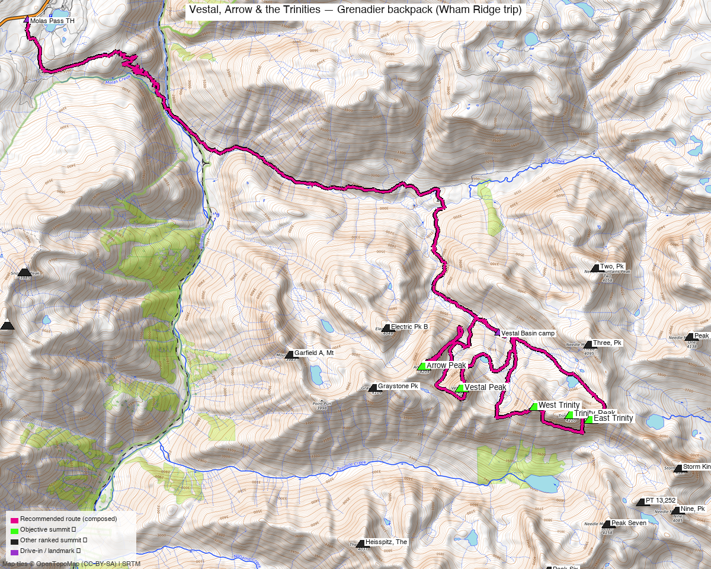

<!-- CLIMBERS_START -->
**Other climbers:** Kyle Knutson — ✓ all · Shawn D Keil — not yet
<!-- CLIMBERS_END -->

# Vestal, Arrow & the Trinities — Grenadier backpack (Wham Ridge trip)

<!-- QUICKSTATS_START -->

!!! tip "At a glance — 2-day trip"
    **5 peaks** · **~7.6 h drive**

    - **Day 1 (Vestal (Wham Ridge) + Arrow):** **7 mi** · **4,400 ft** gain · **Class 5.4** · 2 peaks
    - **Day 2 (Trinity traverse (W→E)):** **5 mi** · **4,650 ft** gain · **Class 4** · 3 peaks

<!-- QUICKSTATS_END -->

*Written for **Emily** — all five unclimbed on her 14ers checklist. Vestal, Arrow, and Trinity are **centennial (top-100) 13ers**; West and East Trinity are bicentennials.*

**Researched:** 2026-07-10
**Report type:** Multi-day backpack trip — 5 ranked 13ers from a Vestal Basin camp over 2 climbing days
**CalTopo research map:** https://caltopo.com/m/4MR73J3
**Status for Emily:** All **five unclimbed**. This is the heart of the Grenadiers — quartzite peaks that most consider the most beautiful climbing terrain in the San Juans.

*[Interactive CalTopo map](https://caltopo.com/m/4MR73J3) — 30 swept GPX tracks layered by source, plus the two composed day routes (magenta).*

---

!!! danger "Technical trip — Class 4 and low 5th class terrain"
    **Wham Ridge (Vestal) is an alpine rock route (III 5.4)** — careful route-finding keeps
    it at 5.4 (crux hand crack), but off-route quickly becomes 5.6+. Most experienced
    scrambler parties solo it in dry conditions; carrying a light rope + small rack for the
    upper headwall is common and smart for a first time on it.
    **Vestal's descent is a known trap:** from the summit, do **not** drop into the first
    gullies off the top (they cliff out into loose Class 4). Traverse the ridge south, then
    southeast to the further **SE-facing gully** before descending the choss to the
    Vestal–Arrow saddle side.
    **Trinity Peak's crux** on the traverse is a short (~20 ft) **exposed Class 4 chimney**
    regaining the ridge from the south-side ledges — cairned, solid rock, but no-fall terrain.

## The trip at a glance

| | |
|---|---|
| Days | **4 days / 3 nights** — pack in, 2 climbing days, pack out (strong parties compress to 3 days) |
| Peaks | 5 ranked 13ers: Vestal 13,867' · Arrow 13,817' · Trinity 13,816' · W Trinity 13,765' · E Trinity 13,752' |
| Trip total | **~30 mi · ~11,400 ft** (recorded full-trip tracks run 26–32 mi) |
| Style | Backpack via Elk Creek (Colorado Trail) to a **Vestal Basin camp (11,300–11,760')** |
| Hardest move | **5.4** (Wham Ridge crux) · Day 2 is Class 4 (Trinity chimney) |
| Drive from Highland | **[~7h 35m / 361 mi via Google Maps](https://www.google.com/maps/dir/?api=1&origin=Highland,+Denver,+CO&destination=37.7476,-107.6885)** to Molas Pass |
| Weather | [NOAA point forecast — Vestal Basin](https://forecast.weather.gov/MapClick.php?lat=37.689&lon=-107.603) (peaks are ≤1.5 mi apart — one forecast covers all five) |

---

## Peaks covered

| Peak | Day | Elev | Route | Class | peak_db |
|---|---|---|---|---|---|
| Vestal Peak | 1 | 13,867' | **Wham Ridge** (N face) up · S face down | **5.4** (III) | 96 |
| Arrow Peak | 1 | 13,817' | NE/East ramp | 3 | 127 |
| West Trinity | 2 | 13,765' | SW ridge (start of traverse) | 2+/3 | 144 |
| Trinity Peak | 2 | 13,816' | W ridge from W Trinity saddle | **4** (chimney crux) | 126 |
| East Trinity | 2 | 13,752' | W ridge · descend NE ridge | 3 | 153 |

All five ring **Vestal Basin** — summits are ≤1.5 mi apart. The classic combination is
exactly Emily's plan: Wham + Arrow one day, the three-Trinity traverse the next.

---

## Logistics

### Getting there — Molas Pass trailhead

Park at the **Colorado Trail / Molas Trail lot just north of Molas Pass** on US 550
(37.7476, -107.6885, ~10,610' — gravel lot, any car). This is where 12 of the 30 swept
GPX tracks start. US 550 is paved all the way; no 4WD needed.

> Alternative approach: the **Durango & Silverton train to Elk Park** cuts ~5 mi and the
> 1,700' Animas climb out, but chains you to the train schedule — several swept tracks
> use it (their starts show at the Animas River, ~8,900').

### Pack-in (Day 0) — Molas Pass → Vestal Basin

**~9 mi · ~2,600 ft up (plus a 1,700 ft descent you repay on the way out)**

1. Colorado Trail from Molas Pass — ~4 mi of switchbacks **down** to the Animas River
   bridge (8,900').
2. Cross the bridge, then **Elk Creek Trail (CT east)** up the spectacular Elk Creek
   canyon to the **beaver ponds** meadow (~11,200') — the Grenadiers' north walls appear
   across the valley.
3. Just past the beaver ponds, drop right onto the **unmaintained Vestal Creek trail**
   (cairned climber's path): steep, braided in places, with deadfall. It climbs ~700' into
   **Vestal Basin**.
4. Camp in the **lower meadow (~11,300')** below Arrow/Vestal, or push to the **upper
   bench (~11,760')** toward the Trinities. The lower meadow is the better Day-1 base;
   the upper camp shortens Day 2.

**Guard your gear — the Vestal Basin marmots are notorious.** They chew packs, straps,
trekking-pole grips, anything salty. Hang or tent-stash everything.

### Pack-out (final day)

Reverse the approach: ~9 mi, mostly down Elk Creek, then the **1,700 ft climb back up**
from the Animas to Molas Pass at the end — budget energy (and snacks) for it.

---

## Day 1 — Vestal via Wham Ridge, then Arrow (Class 5.4 · ~5–7 mi · ~4,400 ft from camp)

The Grenadiers' marquee day, and one of Colorado's classic alpine rock routes.

1. **Camp → Vestal–Arrow basin.** From the lower meadow, ascend SSW ~600 ft (climber's
   trail) into the hanging valley between Arrow and Vestal (rock-glacier boulder hopping).
2. **Wham Ridge (III 5.4).** Start up the grassy N-face ledges to the ridge proper. The
   quartzite is superb — slabby Class 3–4 lower, steepening to the **5.4 crux hand crack**
   high on the face. Careful route-finding keeps it at 5.4; drifting off-line finds 5.6+.
   Rope/small rack optional for solid scramblers in the dry; bring them if in doubt.
3. **Descend the S face (Class 2+/3 — see danger box).** Ridge S then SE to the correct
   SE gully; loose choss all the way down to the Vestal–Arrow saddle area.
4. **Arrow's East ramp (Class 3).** From the basin at ~12,200', gain the huge slanting
   ramp on Arrow's east face — 1,000+ ft of solid slab friction (Class 2+), polished and
   slick if wet. At ~13,600' exit the ramp's end and scramble the ridge to the airy summit
   (Class 3).
5. Retrace the ramp and drop back to camp.

**Measured stats:** the Day-1 line on the maps is one party's complete recorded
Molas→Vestal+Arrow→Molas trip, followed verbatim (**27.9 mi / ~12,700 ft DEM** including
their pack-in/out); from a basin camp the climbing day itself is **~5–7 mi / ~4,400 ft**
(recorded camp-based day tracks). Parties commonly log 8–14 hours for the pair.

> **Order matters:** do **Wham first** (N face needs dry rock and you want the crux behind
> you before weather), then Arrow — its ramp descends fast if storms build.

---

## Day 2 — The Trinity traverse, W→E (Class 4 · ~5 mi · ~4,650 ft from camp)

Three summits by the classic west-to-east line — climb high, traverse, descend easy.

1. **West Trinity, SW ridge (Class 2+/3).** From the upper basin, gain the
   Vestal–W Trinity saddle and follow the SW ridge — steep but low-exposure scrambling.
2. **W Trinity → Trinity Peak (Class 4 — the crux).** Descend W Trinity's east ridge to
   the saddle (Class 2+). Contour **on south-side ledges below the ridge cliffs** (cairns),
   to the **leaning-cairn chimney**: ~20 ft of exposed Class 4 on good rock back to the
   crest, then one more short exposed step to easier ground and the summit. ~1.5 hr
   saddle-to-summit is typical.
3. **Trinity → East Trinity (Class 3).** Descend the shallow couloir just S of the ridge
   (loose — watch rockfall on partners), cross to the saddle, then the W ridge of East
   Trinity, S side, steepening to Class 3 near the top (Roach's "steep west-facing gully"
   crux; snow lingers early season).
4. **Descend E Trinity's NE ridge (Class 2+)** to the 13,060' notch (don't drift right),
   then ~300 ft of scree to tundra. Stroll back past the unnamed lake at 12,396' to camp —
   a gorgeous finish.

**Measured stats:** composed route (a recorded full loop track) is **23.9 mi / ~8,800 ft**
TH-to-TH; the from-camp traverse day is **~5 mi / ~4,650 ft** (climb13ers measures 4.85 mi
camp-RT for all three; recorded day tracks agree).

---

## Water

- **Vestal Creek** runs through both camp meadows — reliable all season (treat).
- Day 1: fill at camp; the Arrow/Vestal hanging valley is dry rock glacier.
- Day 2: the 12,396' lake under East Trinity on the return; carry the day's water from camp.
- Elk Creek is beside the approach trail nearly the whole way.

## Gear

- **Rock:** helmet (mandatory — chossy descents + party rockfall), approach shoes or
  sticky trail runners for Wham's slab. **Light 30 m rope + small rack/harness optional**
  for the Wham crux — decide by the party's soloing comfort at exposed 5.4.
- **Snow (early season / June–early July):** ice axe recommended on all these routes
  (climb13ers flags every one); microspikes for the Arrow ramp and Trinity couloirs.
- **Camp:** bear-appropriate food storage; **marmot-proof everything** (in-tent or hung).
- **InReach/PLB** — no cell coverage anywhere in this drainage (deep Weminuche; dead at
  the TH, in the basin, and on most summits).

## Conditions / season / permits

- **Best window: mid-July through September** — you want Wham's quartzite dry. The N face
  holds snow/wet into early July; afternoon monsoon storms peak mid-July–August.
- **Storm strategy:** both days top out early. Wham Ridge is a lightning rod — be moving
  off Vestal by midday. The Trinity traverse has bail options at each saddle back into
  the basin (S side).
- **Weminuche Wilderness** (San Juan NF): no permit needed; groups ≤15; standard LNT.
  Camp on durable surfaces away from the creek.
- The Elk Creek approach shares the Colorado Trail — expect thru-hikers; Vestal Basin
  itself is quieter but popular on summer weekends.

---

## Trip reports & GPX (all three sources swept)

**GPX collected: 30 track files** — 14 from 14ers.com GPX libraries, 6 from listsofjohn
trip reports, 10 from peakbagger ascents (all five peaks' libraries swept and deduped) —
all layered on the [CalTopo research map](https://caltopo.com/m/4MR73J3) with the two
composed day routes in magenta.

**14ers.com** — the deep beta; these match Emily's exact plan:

- **"The Grenadier's Finest — Vestal, Arrow & the Trinities"** ([16464](https://www.14ers.com/php14ers/tripreport.php?trip=16464)) — this trip, verbatim
- **"Labor Day Weekend in the Grenadiers: Vestal and Arrow"** ([10973](https://www.14ers.com/php14ers/tripreport.php?trip=10973)) + **"The Trinity Traverse"** ([11034](https://www.14ers.com/php14ers/tripreport.php?trip=11034)) — the same 2-day split
- **"Arrow today, Trinities tomorrow"** ([20494](https://www.14ers.com/php14ers/tripreport.php?trip=20494)) / **"Trinity Traverse"** ([20495](https://www.14ers.com/php14ers/tripreport.php?trip=20495))
- **"Wham in the Weminuche"** ([21785](https://www.14ers.com/php14ers/tripreport.php?trip=21785)) · **"Solo Surfin the Wham"** ([19830](https://www.14ers.com/php14ers/tripreport.php?trip=19830)) — Wham Ridge detail
- **"Vestal Basin 5 in a Day & Centennial FINISH!"** ([22327](https://www.14ers.com/php14ers/tripreport.php?trip=22327)) — all five in a single push, for scale
- **"Eastern Grenadiers: East Trinity, Trinity, West Trinity and Pack Out"** ([16643](https://www.14ers.com/php14ers/tripreport.php?trip=16643))

**listsofjohn.com** — 30 TRs seen across the five; 6 downloadable tracks incl. a
complete Molas→basin→peaks→Molas trip ([gpx 6244](https://listsofjohn.com/gpx/6244.gpx))
and a 2025 Vestal Basin approach ([gpx 18276](https://listsofjohn.com/gpx/18276.gpx)).

**peakbagger.com** — 10 ascent tracks (logged in), incl. a clean Trinity-traverse loop
(the Day-2 composed route follows one verbatim).

**climb13ers.com** — per-route class/terrain detail used throughout (S Face 2+, E Ramp 3,
Trinity W Ridge 4, E Trinity W Ridge 3, camp-based mileages).

**Sources checked:** 14ers.com · listsofjohn.com · peakbagger.com · climb13ers.com

---

## TL;DR

- **Five ranked 13ers (three centennials) from one gorgeous basin camp** — exactly the
  plan Emily described: pack in from Molas Pass, **Wham Ridge (5.4) + Arrow (Cl 3)** one
  day, the **Trinity traverse W→E (Cl 4 crux chimney)** the next, pack out.
- **This is a climbing trip, not a hike** — hardest move 5.4 on Wham (rope optional but
  reasonable), exposed Class 4 on Trinity, and Vestal's descent has a notorious
  wrong-gully trap. Helmets on everything.
- **~30 mi / ~11,400 ft over 4 days** (~9 mi pack-in each way with a 1,700' Animas climb
  on exit; climbing days ~5–7 mi each from camp).
- **Drive: [~7h 35m from Highland](https://www.google.com/maps/dir/?api=1&origin=Highland,+Denver,+CO&destination=37.7476,-107.6885)** to the Molas Pass CT lot (paved, any car).
- **Mid-July–September, dry rock only** for Wham; storms build fast — summit early.
- **No cell anywhere — carry an InReach.** And hide everything from the marmots.
- **Research map:** https://caltopo.com/m/4MR73J3
