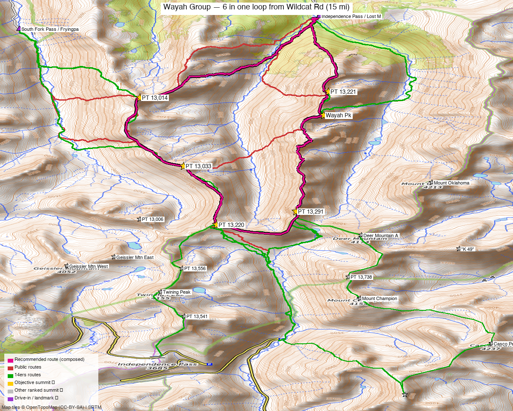

# Wayah Group — 6 unclimbed ranked 13ers (Sawatch ridge loop)

<!-- QUICKSTATS_START -->

!!! tip "At a glance — recommended day"
    **15 mi** · **6,813 ft** gain · **Class 3–4** · 6 peaks · ~3.5 h drive · [weather](https://forecast.weather.gov/MapClick.php?lat=39.190&lon=-106.540)

<!-- QUICKSTATS_END -->

**Researched:** 2026-06-16
**Report type:** Single-push ridge **loop** (big day) **or** 3 short day-loops — Kyle's six unclimbed ranked 13ers on the **Wayah Group** ridge.
**CalTopo research map:** https://caltopo.com/m/6SVRT30
**Status in DB:** all six unclimbed. These are Kyle's share of the **8-peak "Wayah Group"** — the long ridge NW of **Mount Massive / Mount Oklahoma** (both already done), between the **Hunter-Fryingpan Wilderness** and **Hwy 82 (Independence Pass)**.

!!! danger "Class — this is a Class 3–4 ridge, not a walk-up"
    The *summits* are Class 2 except **PT 13,291 (Class 3)** and **PT 13,220** (Class 2 via a game trail, **5th-class if taken direct**). **Linking the peaks along the crest is Class 3–4 scrambling** with real exposure on loose rock, and there are **Class 5 towers on the unranked points that must be bypassed** (per [Chipmunk's "A Tale of Two Ridges" TR](https://www.14ers.com/php14ers/tripreport.php?trip=22858)). Helmet; a rope is reasonable for the harder bits.

> Six ranked 13ers strung along one long, committing ridge. Do them **all in one ~15 mi loop** from the end of Wildcat Road — or break them into **3 clean ~8–11 mi day-loops** off three different trailheads.

*[Interactive CalTopo map](https://caltopo.com/m/6SVRT30)* — the **recommended ~15 mi loop in bold magenta** (all six from the Wildcat Rd / Fryingpan Lakes TH), over recorded 14ers-library tracks (green); 6 summit markers + trailheads.

---

<!-- CLIMBERS_START -->
**Other climbers:** Emily Sharpe — not yet · Shawn D Keil — not yet
<!-- CLIMBERS_END -->

## Quick stats

| | PT 13,220 | PT 13,291 | PT 13,033 | PT 13,014 | Wayah Pk | PT 13,221 |
|---|---|---|---|---|---|---|
| Elevation | 13,220' | 13,291' | 13,033' | 13,014' | 13,277' | 13,221' |
| Lat / Lon | 39.1615, −106.5516 | 39.1669, −106.5350 | 39.1851, −106.5585 | 39.2124, −106.5677 | 39.2053, −106.5292 | 39.2148, −106.5281 |
| Class (summit) | 2 (5th direct) | **3** | 2 | 2 | 2 | 2 |
| Ridge position | far S | S | mid | NW | N | far N |
| CO Rank | 471 | 407 | 617 | 628 | 418 | 469 |
| 14ers.com | [10801](https://www.14ers.com/php14ers/peak.php?peakid=10801) | [10769](https://www.14ers.com/php14ers/peak.php?peakid=10769) | [10833](https://www.14ers.com/php14ers/peak.php?peakid=10833) | [10835](https://www.14ers.com/php14ers/peak.php?peakid=10835) | [10775](https://www.14ers.com/php14ers/peak.php?peakid=10775) | [10797](https://www.14ers.com/php14ers/peak.php?peakid=10797) |
| LoJ | [611](https://listsofjohn.com/peak/611) | [491](https://listsofjohn.com/peak/491) | [792](https://listsofjohn.com/peak/792) | [814](https://listsofjohn.com/peak/814) | [511](https://listsofjohn.com/peak/511) | [595](https://listsofjohn.com/peak/595) |
| peakbagger | [84737](https://peakbagger.com/peak.aspx?pid=84737) | [84749](https://peakbagger.com/peak.aspx?pid=84749) | [84725](https://peakbagger.com/peak.aspx?pid=84725) | [84724](https://peakbagger.com/peak.aspx?pid=84724) | [84746](https://peakbagger.com/peak.aspx?pid=84746) | [84747](https://peakbagger.com/peak.aspx?pid=84747) |

All six are **ranked Sawatch 13ers** in the **Hunter-Fryingpan Wilderness**. The full "Wayah Group" is 8 ranked 13ers (+ a couple of 12ers); the other two are already done. ("Wa'ya" = wolf in Cherokee.)

---

## Option A — all six in one loop ⭐ big day

A **~15 mi / ~6,800′ loop** (DEM-measured, stitched from recorded GPX) over all six from the **end of Wildcat Road** (the north Fryingpan-Lakes-area trailhead, ~11,400') — **no car shuttle needed.** Up onto the ridge, around the horseshoe over all six, and back down to the same TH.

- **Loop order:** PT 13,014 → PT 13,033 → PT 13,220 → PT 13,291 → Wayah Pk → PT 13,221 → back (reverse works too).
- **Difficulty:** stay on the crest for **Class 3–4** scrambling; **the few Class 5 towers (on the unranked bumps) get bypassed** west or east. Loose rock and exposure — helmet, and a rope is reasonable.
- **The day is the scrambling + ~6,800′ of gain at 13k', not the mileage** — you're on an exposed crest for hours, so a stable-weather window is essential. Recorded parties do the *full* 8-peak group as a longer outing; Kyle's six is the loop above.

---

## Option B — split into 3 short day-loops (real recorded routes)

Each pair sits above its own trailhead, so the relaxed way is **three ~8–11 mi loops** (combine any two for a 2-day weekend). All distances/gains are **DEM-measured from recorded GPX**:

| Loop | Peaks | Trailhead | Stats |
|---|---|---|---|
| **South pair** | PT 13,291 (Cl 3) + PT 13,220 | **North Fork Lake Creek TH** (Hwy 82) | **~10.5 mi / ~3,580′** (DEM) |
| **North pair** | Wayah Pk + PT 13,221 | **Independence Pass / Lost Man** (Hwy 82) | **~7.9 mi** (recorded loop) |
| **Middle pair** | PT 13,033 + PT 13,014 | **South Fork Pass / Fryingpan** (Frying Pan Rd) | **~10.8 mi** (recorded loop) |

- The **south pair** is the cleanest single day and gets you the Class 3 peak (PT 13,291) — a good first bite.
- The **north** and **middle** pairs are best off the Fryingpan / upper-Hwy-82 side; combine them if camping near South Fork Pass.

---

## Drive + approach

| | |
|---|---|
| **Drive from Boulder** | **[~3h 30m via Google Maps](https://www.google.com/maps/dir/?api=1&origin=1162+Peakview+Circle,+Boulder,+CO+80302&destination=39.2453,-106.5300)** — to the **end of Wildcat Road** (the north Fryingpan-Lakes-area TH, ~11,400') for the full loop. The split-loop trailheads are off **Hwy 82 (Independence Pass)** and the **Fryingpan / South Fork Pass** side. *(Confirm the Wildcat Rd surface/closure before you go.)* |
| Trailheads | **Wildcat Rd / Fryingpan Lakes TH** (~39.245, −106.530, ~11,400') — the **loop** start · **North Fork Lake Creek TH** (~39.115, −106.539, Hwy 82) — south pair · **South Fork Pass / Fryingpan** (~39.240, −106.593) — middle pair. |
| Land | **Hunter-Fryingpan Wilderness** (White River NF) — no permits/fees, foot travel only; PT 13,220 also borders the Mount Massive Wilderness. |

---

## Conditions / season

- **Best window:** **July–September.** High, remote Sawatch ridge; the traverse needs dry rock and a **stable-weather day** (long, exposed, committing).
- **Terrain:** Class 2 tundra/talus to the summits; **Class 3–4 scrambling on loose rock to link them**, with bypasses around the Class 5 towers. Willows and a faint approach on the North Fork Lake Creek side.
- **Storms:** you're on an exposed crest for hours on the traverse — very early start, or split it into the short loops.
- **Cell:** dead — carry an InReach.

---

## Trip reports & GPX (all sources)

**Sources confirmed logged in:** 14ers.com ("Basin"), listsofjohn.com, peakbagger.com (Kyle Knutson). Tracks layered: the full-group traverse + the south-pair and north-pair loops.

- **14ers.com:** key beta — [Chipmunk, "A Tale of Two Ridges: the Wayah Group" (9/2024)](https://www.14ers.com/php14ers/tripreport.php?trip=22858): full route + the **Class 3–4 / 5.bypass** difficulty detail; also [geojed's 11-peak "Cheaper by the Eleven" (2012)](https://www.14ers.com/php14ers/tripreport.php?trip=12134). GPX library has the south-pair "13220 & 13291 from North Fork Lake Creek" track.
- **listsofjohn.com:** per-peak pages — all six ranked Sawatch 13ers ([611](https://listsofjohn.com/peak/611) · [491](https://listsofjohn.com/peak/491) · [792](https://listsofjohn.com/peak/792) · [814](https://listsofjohn.com/peak/814) · [511](https://listsofjohn.com/peak/511) · [595](https://listsofjohn.com/peak/595)).
- **peakbagger.com:** pages verified for all six; ownership = Hunter-Fryingpan Wilderness (White River NF).
- **climb13ers.com:** consulted (these obscure ridge points have minimal dedicated route pages; class corroborated by the 14ers TR).

**Sources checked:** 14ers.com ✓ (logged in, "Basin") · listsofjohn.com ✓ · peakbagger.com ✓ (logged in, "Kyle Knutson") · climb13ers.com ✓

---

## TL;DR

- **Six unclimbed ranked 13ers on the Wayah Group ridge** (NW of Massive/Oklahoma, Hunter-Fryingpan Wilderness): PT 13,220 + PT 13,291 + PT 13,033 + PT 13,014 + Wayah + PT 13,221.
- **All six in one day = a committing Class 3–4 ridge loop** (~15 mi / ~6,800′ DEM) from the **end of Wildcat Road** — no shuttle. Stable weather only; the full 8-peak group is a separate, longer outing.
- **Or split into 3 short loops** (real GPX): **south pair** ~10.5 mi / 3,580′ (N Fork Lake Creek), **north pair** ~7.9 mi (Independence Pass/Lost Man), **middle pair** ~10.8 mi (Fryingpan).
- **Class 2 summits except PT 13,291 (3); the crest links at Class 3–4** with Class 5 towers bypassed — helmet + rope-reasonable. ~3 h drive (Hwy 82). Cell dead — InReach.
