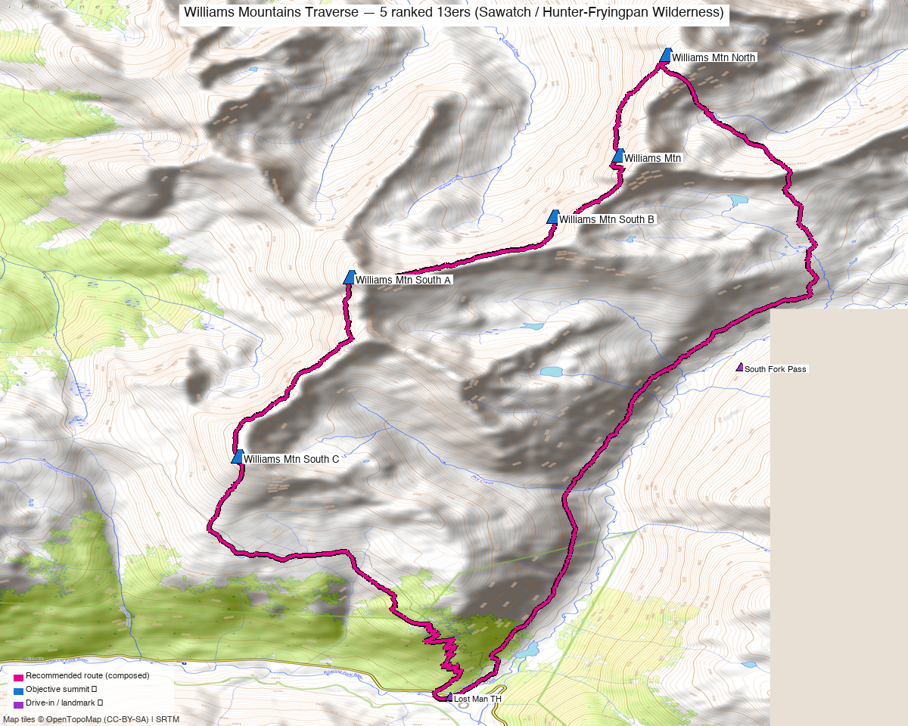

# Williams Mountains Traverse — 5 ranked 13ers (Sawatch / Hunter-Fryingpan Wilderness)

<!-- QUICKSTATS_START -->

!!! tip "At a glance — recommended day"
    **14.7 mi** · **6,084 ft** gain · **Class 3** · 5 peaks · ~3.8 h drive

<!-- QUICKSTATS_END -->

**Researched:** 2026-06-15

!!! tip "Map & weather"
    **CalTopo research map:** https://caltopo.com/m/310E34A

**Status in DB:** all five unclimbed.

> The full **Williams Mountains** sub-range ridge, W of Independence Pass — *not* to be confused with Williams Peak. All five ranked summits in one outing.

<!-- PROVENANCE_START -->
*Note: the recommended route was distilled from **7 recorded GPS tracks** of real trips (14ers.com · ListsofJohn · peakbagger) — all layered on the [interactive CalTopo research map](https://caltopo.com/m/310E34A).*
<!-- PROVENANCE_END -->

---

<!-- CLIMBERS_START -->
**Other climbers:** Emily Sharpe — not yet · Shawn D Keil — not yet
<!-- CLIMBERS_END -->

## Quick stats

| | Williams Mtn (HP) | Williams Mtn North | Williams Mtn South A | Williams Mtn South B | Williams Mtn South C |
|---|---|---|---|---|---|
| Your label | — | **13139** | **Williams Mtn South** | **13204** | **13039** |
| Elevation | 13,390' | 13,139' | 13,321' | 13,204' | 13,039' |
| Lat / Lon | 39.1806, −106.6101 | 39.1915, −106.6060 | 39.1674, −106.6324 | 39.1739, −106.6154 | 39.1480, −106.6417 |
| Class | 3 | 2 | 2 | 2+ | 2 |
| CO Rank | 329 | 538 | 377 | 489 | 614 |
| Also known as | "Williams Mtns HP" | UN 13,139 | "Williams Benchmark" | UN 13,203 | UN 13,039 (was UN 13,033) |
| 14ers.com | [10756](https://www.14ers.com/php14ers/peak.php?peakid=10756) | [10815](https://www.14ers.com/php14ers/peak.php?peakid=10815) | [10766](https://www.14ers.com/php14ers/peak.php?peakid=10766) | [10800](https://www.14ers.com/php14ers/peak.php?peakid=10800) | [10832](https://www.14ers.com/php14ers/peak.php?peakid=10832) |
| LoJ | [411](https://listsofjohn.com/peak/411) | [705](https://listsofjohn.com/peak/705) | [474](https://listsofjohn.com/peak/474) | [609](https://listsofjohn.com/peak/609) | [789](https://listsofjohn.com/peak/789) |
| peakbagger | [16642](https://peakbagger.com/peak.aspx?pid=16642) | [84732](https://peakbagger.com/peak.aspx?pid=84732) | [16235](https://peakbagger.com/peak.aspx?pid=16235) | [15859](https://peakbagger.com/peak.aspx?pid=15859) | [84726](https://peakbagger.com/peak.aspx?pid=84726) |
| Peak DB id | 411 | 705 | 474 | 609 | 789 |

The five form a **~3.5 mi N→S ridge**: North (13,139) → Williams Mtn (13,390, HP) → South B (13,204) → South A (13,321) → South C (13,039), all in the **Hunter-Fryingpan Wilderness** (White River NF).

---

## Recommended day — Lost Man TH loop over all five ⭐

A **full-traverse loop** that follows **Heather Ryan's recorded all-five line verbatim** (her real GPS track from the Lost Man TH over every summit and back; distance from that track, gain DEM-measured): **~14.7 mi / ~6,084′**, **Class 3**. Consistent with the recorded full-traverse TR (LoJ [TR 2019](https://listsofjohn.com/tr?Id=2019): ~13.9 mi / ~5,700′).

| | |
|---|---|
| Peaks | all five Williams summits |
| **Recommended loop** | **~14.7 mi / ~6,084′ (DEM)** |
| Class | **3** — mostly Class 2/2+ tundra & talus, with **brief Class 3 scrambles** and **short knife-edge ridge sections** on the connecting ridges (TR 2019). Ice axe recommended. |
| Trailhead | **Lost Man TH (~10,500')**, Hwy 82 W of Independence Pass — **passenger car** |
| Style | a **long single day** *or* a **2–3 day backpack** (camp at South Fork Pass) — both are standard |

### Route sequence (composed loop)
1. From the **Lost Man TH**, hike N past **Lost Man Reservoir** and up the Lost Man trail toward **South Fork Pass (11,840′)** (~4.5 mi).
2. Gain the crest and go to **Williams Mtn North (13,139')** (north end).
3. Traverse S over **Williams Mtn (13,390', the high point)** — the **Class 3 scrambling is on its connecting north ridge**.
4. Continue S over **South B (13,204')** → **South A (13,321', "Williams Benchmark")** → **South C (13,039')**.
5. Descend SE off South C back to the Lost Man trail and out to the TH, closing the loop.

> **Per-summit difficulty (climb13ers / TR):** South C is an easy Class 2 ridge walk; South B has Class 2+ ridge problems; Williams North is easy Class 2 *except near the low point* of the connecting ridge; **Williams Mtn (HP) is the Class 3 crux** ("Class 2+ with a smattering of brief Class 3 scrambles along its north ridge"). The traverse also has **short knife-edge sections** — it's a scramble, not a tundra walk.

---

## Drive + approach

| | |
|---|---|
| **Drive from Boulder** | **[~3h 45m via Google Maps](https://www.google.com/maps/dir/?api=1&origin=1162+Peakview+Circle,+Boulder,+CO+80302&destination=39.1219,-106.6242)** — via Leadville → Twin Lakes → **CO-82 over Independence Pass** → down ~4 mi to the Lost Man TH. |
| ⚠️ Seasonal | **Independence Pass (CO-82) is closed in winter** (typically early-November to late-May). Plan for **June–October** access. |
| Trailhead | **Lost Man TH**, ~39.1219, −106.6242, **~10,500'** — passenger car; the Lost Man Reservoir / upper Lost Man TH on the Aspen side of the pass. |
| Land | **Hunter-Fryingpan Wilderness** (White River NF) — **no permits/fees, foot travel only**; dispersed/backpack camping allowed (South Fork Pass is the standard camp). |

---

## Conditions / season

- **Best window:** **July–September** (Independence Pass gate dictates the shoulders; high, exposed ridge holds snow late).
- **Terrain:** Class 2/2+ with **Class 3 scrambling and short knife-edge ridge sections** — committing once you're on the traverse. **Ice axe recommended** for early-season snow on the connecting ridges.
- **Storms:** a long, fully-exposed ridge — very early start; the backpack option lets you start high and beat the weather.
- **Escape:** few easy bail points mid-ridge; commit only with a good forecast.

---

## Cell coverage

- **14ers.com community DB:** no reception reports for these summits.
- **Geographic reasoning:** deep in the Hunter-Fryingpan — **treat as dead** at the TH and on the ridge (some signal possible toward the Aspen/Hwy 82 corridor from the high points).
- **Recommendation:** carry an **InReach / satellite messenger** — long, committing, remote.

---

## Trip reports & GPX (all sources)

**Sources confirmed logged in:** 14ers.com ("letsgocu"), listsofjohn.com, peakbagger.com (Kyle Knutson). **2 full-traverse 14ers-library tracks** + **Kyle's CalTopo** track are layered on the CalTopo map; the recommended loop — **Heather Ryan's recorded full traverse** — is drawn over them in magenta.

### listsofjohn.com (logged in)
| GPX | Note |
|---|---|
| [TR 2019](https://listsofjohn.com/tr?Id=2019) | **all five** — **~13.9 mi / ~5,700′**, Class 2 + Class 3 knife-edge sections ⭐ |
| [TR 26943](https://listsofjohn.com/tr?Id=26943) | all five (from a South Fork Pass camp) |

### 14ers.com GPX library (logged in, "letsgocu")
Two recorded full-traverse tracks (one 12,894-pt high-detail) — both layered.

### peakbagger.com (logged in, "Kyle Knutson")
Pages verified for all five; **ownership = Hunter-Fryingpan Wilderness** (White River NF). No downloadable ascent GPX for these.

### climb13ers.com
Per-summit route pages: [Williams Mountain](https://www.climb13ers.com/colorado-13ers/williams-mountain) (North Ridge, Class 3) · [Williams Benchmark / South A](https://www.climb13ers.com/colorado-13ers/william-benchmark--william-mtn-south-a) · [South B](https://www.climb13ers.com/colorado-13ers/un13203--williams-mtn-south--b) · [North](https://www.climb13ers.com/colorado-13ers/un13108--williams-mtn-north). climb13ers: *"possible to clean all summits in a long day, but many prefer a 2–3 day backpack."*

> **Numbers note:** the **~14.7 mi / ~6,084′ headline is Heather Ryan's recorded full-traverse loop** (distance straight from her GPS track, gain DEM-measured), cross-checked against the recorded full-traverse TR (13.9 mi / 5,700′). GPS-`<ele>` gain in these tracks is noise (one logs 37,000′); climb13ers' "17.5 mi / 4,660′" is an out-and-back to just the two north peaks, not the loop.

**Sources checked:** 14ers.com ✓ (logged in, "letsgocu") · listsofjohn.com ✓ (logged in) · peakbagger.com ✓ (logged in, "Kyle Knutson") · climb13ers.com ✓ · Kyle's CalTopo ✓

