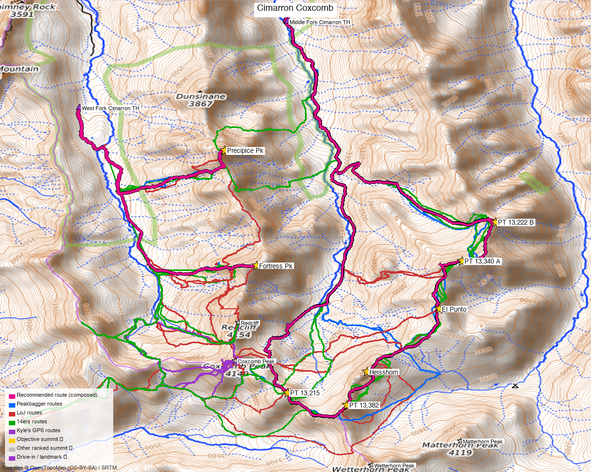

# Cimarron / Coxcomb — 8 Remaining 13ers (Trip)

<!-- QUICKSTATS_START -->

!!! tip "At a glance — 3-day trip"
    **8 peaks** · **~5.5 h drive** · [weather](https://forecast.weather.gov/MapClick.php?lat=38.098&lon=-107.530)

    - **Day 1 (Middle Fork six):** **15.3 mi** · **6,393 ft** gain · **Class 4** · 6 peaks
    - **Day 2 (Fortress):** **7.3 mi** · **2,845 ft** gain · **Class 3** · 1 peak
    - **Day 3 (Precipice):** **6 mi** · **2,788 ft** gain · **Class 3** · 1 peak

<!-- QUICKSTATS_END -->

**Researched:** 2026-06-15
**Report type:** Multi-day trip — Kyle's **8 remaining unclimbed ranked 13ers** around Coxcomb: the **six** as one Middle Fork loop, plus **Fortress** and **Precipice** as two individual West Fork climbs.
**Status in DB:** all eight **unclimbed**. (Coxcomb + Redcliff already done.)

> Consolidates the **Cimarron** group near **Coxcomb**: the **[remaining six](../peaks/cimarron_six.md)** off the **Middle Fork** (Heisshorn + El Punto + four PTs) in one big loop, plus **Fortress and Precipice** (days 2–3 below) climbed **individually** off the **West Fork**. Two forks of the same road — a weekend to finish the area. **Loose, exposed San Juan Class 3**, not a tundra walk.

*All eight ranked 13ers around Coxcomb. **Magenta routes:** the six-peak Middle Fork loop (E/SE) and the two individual West Fork out-and-backs to Fortress and Precipice (NW). Per-area route detail + interactive map: [Middle Fork six (55M4430)](https://caltopo.com/m/55M4430); Fortress + Precipice are the two West Fork day routes above.*

---

<!-- CLIMBERS_START -->
**Other climbers:** Emily Sharpe — not yet · Shawn D Keil — not yet
<!-- CLIMBERS_END -->

## Trip stats

| | |
|---|---|
| Climbs | **3** — one six-peak loop + two individual peaks (relocate camp between the Middle & West Fork roads) |
| Peaks | **8 ranked 13ers** — all unclimbed |
| Class | **Up to 3–4** — on the Middle Fork six, **PT 13,222 B (NW ridge) and El Punto are Class 3–4** (per a recorded full-six TR); otherwise loose, rotten Cimarron Class 3 (incl. Fortress + Precipice). Helmet; a rope is reasonable. |
| **Middle Fork six** | Heisshorn + PT 13,382 + PT 13,215 + El Punto + PT 13,340 A + PT 13,222 B — **~15.3 mi / ~6,393'** (DEM) |
| **Fortress (solo)** | West Fork out-and-back — **~7.3 mi / ~2,845'** (DEM) |
| **Precipice (solo)** | West Fork out-and-back — **~6.0 mi / ~2,788'** (DEM) |
| **Trip total** | **~28.6 mi / ~12,026'** |
| Trailheads | **Middle Fork Cimarron TH (#227, ~10,000')** and **West Fork Cimarron TH (~10,430')** — two separate fork roads |
| Drive from Boulder | **~5h 30m** via US-50 to the Cimarron turnoff (E of Montrose) |
| Land | **GMUG National Forest** (Uncompahgre Wilderness covers the high terrain) — no permits/fees, foot-only |

All distances/gains are **DEM-measured from real recorded GPX**, not estimates.

---

## How the 8 split

These eight finish Kyle's Coxcomb-area ranked 13ers, and they split by **trailhead**:

- **The Middle Fork six** sit on the divide **S and NE of Coxcomb** — one big loop from the **Middle Fork Cimarron TH (#227)** (a known full-six outing, 4 recorded tracks).
- **Fortress + Precipice** sit **N of Coxcomb** above the **West Fork** — climbed as **two individual out-and-backs** from the **West Fork Cimarron TH**. They're ~1.5 mi apart but the connecting ridge is cut by **deep notches** with no recorded track linking them, so each is its own climb (different days, or two separate out-and-backs in one long day).

Both forks branch off the same Cimarron road, so the **camp move between days is short** (drop back to the main road, up the other fork). The six-peak loop is the big day; Fortress and Precipice are shorter, steeper half-days.

---

## Day plan

### Middle Fork six · ~15.3 mi / ~6,393' · Class 3–4
The NE trio first (PT 13,222 B → PT 13,340 A → El Punto), then traverse to **Heisshorn**, and finish the south pair (PT 13,382 → PT 13,215). **PT 13,222 B (NW ridge) and El Punto are Class 3–4** (per the [Boggy B full-six TR](https://www.14ers.com/php14ers/tripreport.php?trip=22747)) — the cruxes; Heisshorn is loose **Class 3**; the other three PTs are Class 2/2+. **Full route, trip reports, and GPX: [Cimarron Remaining Six report](../peaks/cimarron_six.md).**

### Precipice (solo) · ~6.0 mi / ~2,788' · Class 3
A short, steep out-and-back from the **West Fork Cimarron TH** — faint social trail and an ultra-steep footpath up through forest to a loose Class 3 finish.

### Fortress (solo) · ~7.3 mi / ~2,845' · Class 3
A slightly longer out-and-back from the same **West Fork TH**, further S toward Coxcomb — loose Cimarron rock, Class 3.

> Fortress and Precipice both start at the West Fork TH, so a fit party can do **both as separate out-and-backs in one long day** — but they are **not linked** on the ridge. Each is its own day route on the maps above.

---

## Drive + approach (shared)

| | |
|---|---|
| **Drive from Boulder** | **[~5h 30m via Google Maps](https://www.google.com/maps/dir/?api=1&origin=1162+Peakview+Circle,+Boulder,+CO+80302&destination=38.143,-107.525)** — via **US-50** to the **Cimarron** turnoff (E of Montrose), then south up the Cimarron River road, splitting onto the **Middle Fork (#227)** or **West Fork** roads. |
| Trailheads | **Middle Fork Cimarron TH (#227)**, ~38.143, −107.525, ~10,000' · **West Fork Cimarron TH**, ~38.127, −107.560, ~10,430' — both reachable by a passenger car driven with care. |
| Land | **GMUG National Forest / Uncompahgre Wilderness** — no permits/fees, foot-only beyond the THs; dispersed camping allowed. |

---

## Camp

- **Camp low between the forks** (dispersed sites along the Cimarron / fork roads) or at each fork's TH the night before its climb. The relocation between days is a short drive down-and-over, not a long reposition.
- High, exposed basins; water from the fork creeks (treat).

---

## Conditions / season

- **Best window:** **July–September** — high, remote; steep N-facing approaches (especially the Precipice side) hold snow.
- **Terrain:** **loose, rotten Cimarron Class 3** throughout — careful scrambling, helmet advised; Heisshorn, El Punto, and both West Fork peaks are the committing bits.
- **Storms:** long exposed divides with few quick bail points mid-loop — very early starts.

---

## Cell coverage

- **Dead** — no reception at either TH or on the peaks. Carry an **InReach / satellite messenger**.

---

## TL;DR

- **Kyle's 8 remaining Coxcomb-area 13ers as a trip** (~28.6 mi / ~12,026', loose Cimarron rock — **PT 13,222 B rated Class 4**, the rest Class 2–3): a six-peak Middle Fork loop **plus Fortress and Precipice as two individual West Fork climbs**.
- **Two trailheads on two forks of the Cimarron road** — relocate camp between days (a short drive); the six-loop is the big day, Fortress + Precipice are shorter steep half-days (do them separately — deep notches break the connecting ridge).
- **GMUG NF / Uncompahgre Wilderness**; ~5h30 drive (US-50 → Cimarron). Cell dead — InReach.
- Detail + GPX: **[Middle Fork six](../peaks/cimarron_six.md)** · **Fortress + Precipice** (days 2–3 above).

**Sources checked:** 14ers.com ✓ (logged in, "letsgocu") · listsofjohn.com ✓ (logged in) · peakbagger.com ✓ (logged in) · climb13ers.com ✓ — synthesized from the two underlying reports.
