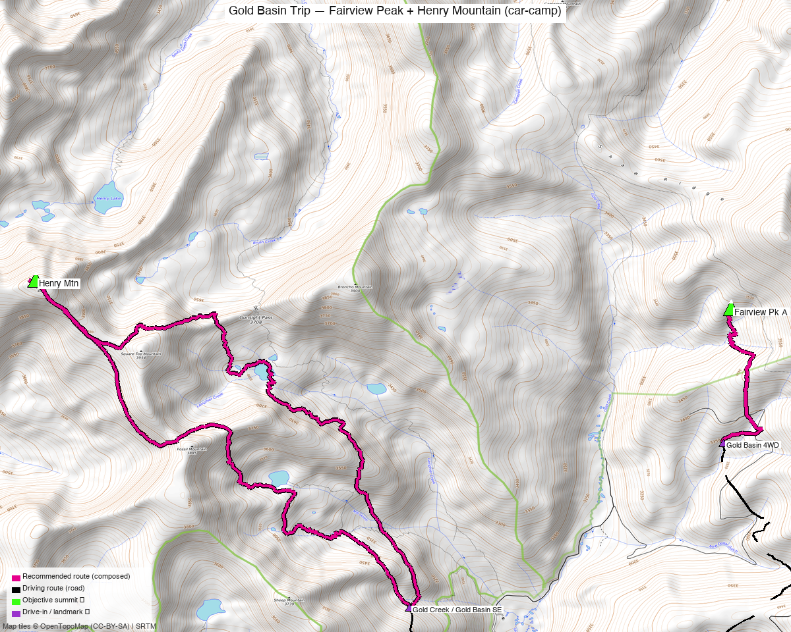

<!-- CLIMBERS_START -->
**Other climbers:** Emily Sharpe — not yet · Shawn D Keil — 1 of 2 (Fairview Pk A)
<!-- CLIMBERS_END -->

# Gold Basin Trip — Fairview Peak + Henry Mountain (car-camp)

<!-- QUICKSTATS_START -->

!!! tip "At a glance — 2-day trip"
    **2 peaks** · **~5.5 h drive**

    - **Day 1 (Fairview Pk A):** **2.8 mi** · **1,137 ft** gain · **Class 1** · 1 peak
    - **Day 2 (Henry Mtn (Gunsight Pass)):** **9.3 mi** · **3,666 ft** gain · **Class 2** · 1 peak

<!-- QUICKSTATS_END -->

**Researched:** 2026-07-22

!!! weather ""
    **NOAA weather link:** [Gold Basin Weather](https://forecast.weather.gov/MapClick.php?lat=38.68&lon=-106.58)

!!! map ""
    **CalTopo research map:** https://caltopo.com/m/0H0CS75

**Status in DB:** both unclimbed. Two ranked Gunnison 13ers in the **Gold Creek / Gold
Basin** system — packaged as **one car-camp trip** because they're ~5.5 h from home and
share the drive; doing them as two separate round-trips would double an 11-hour haul.
Per-peak detail: **[Fairview Peak](../peaks/fairview_peak.md)** · **[Henry Mountain](../peaks/henry_mountain.md)**.

<!-- PROVENANCE_START -->
*Note: the recommended route was distilled from **12 recorded GPS tracks** of real trips (14ers.com · ListsofJohn · peakbagger) — all layered on the [interactive CalTopo research map](https://caltopo.com/m/0H0CS75).*
<!-- PROVENANCE_END -->

---

## Peaks covered

A relaxed **car-camp weekend** based in Gold Basin: an easy Class 1 half-day (Fairview)
and a moderate Class 2 day (Henry via Gunsight Pass), each from its own trailhead a short
drive apart. Hardest move on the trip is **Class 2**.

| Peak | Day | Elev | Route | Class | CO rank |
|---|---|---|---|---|---|
| [Fairview Pk A](https://www.14ers.com/peaks/10796) | 1 | 13,224' | Gold Basin walk-up (upper 4WD) | 1 | #465 |
| [Henry Mtn](https://www.14ers.com/peaks/10784) | 2 | 13,272' | Gold Creek → Gunsight Pass | 2 | #424 |

---

## Itinerary options

**Option A — car-camp weekend (recommended):** the day list in *At a glance*. Drive in,
camp in Gold Basin, take the short easy **Fairview** the first afternoon (or as a
warm-up), then the longer **Henry** on a full day. Reverse if you'd rather do the big
day first while fresh.

**Option B — both in one long day:** a strong, early party can drive between the two
trailheads and bag both (~12 mi combined, Class 2). Feasible given the short relocation,
but the car-camp split is the sane call for a peak this far from home — you've already
paid the drive, so there's no reason to rush.

---

## Getting there — Gold Creek Rd (FR 771)

| | |
|---|---|
| **Drive from Boulder** | **[~5h 30m via Google Maps](https://www.google.com/maps/dir/?api=1&origin=1162+Peakview+Circle,+Boulder,+CO+80302&destination=38.6559,-106.5756)** — via US-285 / US-50 to Gunnison, then **Gold Creek Rd (FR 771)** into the Gold Basin / Gold Creek area. |
| Fairview TH | **Upper Gold Basin, ~12,030'** — a **rough high-clearance / 4WD** spur; park where your rig tops out (drive-higher/lower options in the Fairview report). |
| Henry TH | **Gold Creek / Gold Basin SE, ~10,060'** — the more accessible of the two. |
| Relocation | The two trailheads are a **short drive apart** on the FR 771 system — the black line on the map is the connecting road. |
| Land | **GMUG NF** — no permits/fees; not designated wilderness. |

---

## The days, in order

### Day 1 — Fairview Peak (Class 1)

From the **upper Gold Basin 4WD start (~12,030')**, a short tundra walk north to the
broad summit — **~2.8 mi / ~1,140 ft**, no scrambling. An easy leg-stretcher after the
long drive. Full detail: [Fairview Peak report](../peaks/fairview_peak.md).

### Day 2 — Henry Mountain (Class 2)

From the **Gold Creek / Gold Basin SE TH (~10,060')**, up the Gold Creek drainage over
**Gunsight Pass (~12,100')** and into Henry's upper basin — **~9.3 mi / ~3,670 ft**,
Class 2 tundra and talus. The bigger of the two days. Full detail:
[Henry Mountain report](../peaks/henry_mountain.md).

---

## Camps & water

- **Car camping:** dispersed sites are common along **Gold Creek Rd (FR 771)** and near
  the Gold Creek trailhead/campground — base here between the two peaks. No developed
  hookups; pack it in/out.
- **Water:** Gold Creek and its tributaries run through the basin (treat); the upper
  Gold Basin 4WD spur (Fairview side) is drier up high — carry from camp.

---

## Gear & season

- **Best window:** **July–September** — the Gold Basin roads melt out late and the
  higher basins hold snow into early summer.
- **Vehicle:** high-clearance / 4WD helps on FR 771, and is effectively required for the
  high Fairview start; Henry's TH is more forgiving.
- **Terrain:** Class 1 (Fairview) and Class 2 (Henry) — no scrambling; the work is
  distance, altitude, and the drive.
- **Storms:** both days spend time above treeline (Henry more so, over Gunsight Pass) —
  early starts, off the high ground by early afternoon.
- **Cell:** unreliable throughout the Gold Basin / Gold Creek drainages — carry an
  **InReach**.

---

## Trip reports & GPX (all three sources swept)

**Sources confirmed logged in:** 14ers.com ("Basin"), listsofjohn.com ("letsgocu"),
peakbagger.com ("Kyle Knutson"). Both peaks' libraries swept across all three sources
and layered on the [research map](https://caltopo.com/m/0H0CS75) — the two composed day
routes in magenta, the connecting road dashed black. Per-peak trip-report and GPX detail
lives in the individual reports: **[Fairview](../peaks/fairview_peak.md)** ·
**[Henry](../peaks/henry_mountain.md)**.

**Sources checked:** 14ers.com · listsofjohn.com · peakbagger.com · climb13ers.com
