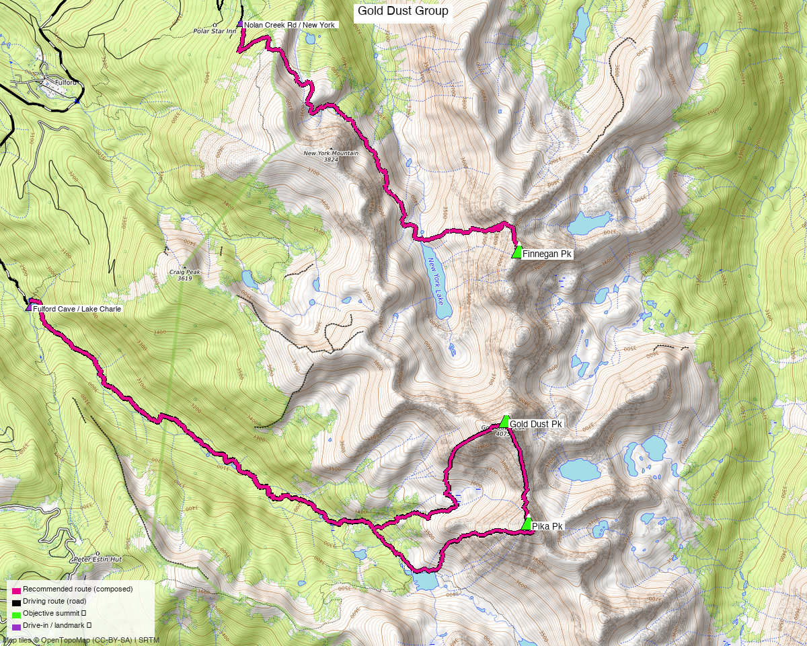

# Gold Dust Group — 2-Day Car Camp (Gold Dust + Pika, then Finnegan)

<!-- CLIMBERS_START -->
**Other climbers:** Emily Sharpe — not yet · Shawn D Keil — not yet
<!-- CLIMBERS_END -->

<!-- QUICKSTATS_START -->

!!! tip "At a glance — 2-day trip"
    **3 peaks** · **~3 h drive**

    - **Day 1 (Gold Dust + Pika):** **12.5 mi** · **4,587 ft** gain · **Class 2+** · 2 peaks · [weather](https://forecast.weather.gov/MapClick.php?lat=39.473&lon=-106.593)
    - **Day 2 (Finnegan):** **9.1 mi** · **4,391 ft** gain · **Class 3** · 1 peak · [weather](https://forecast.weather.gov/MapClick.php?lat=39.497&lon=-106.593)

<!-- QUICKSTATS_END -->

**Researched:** 2026-07-23

!!! map ""
    **CalTopo research map:** <https://caltopo.com/m/1G9S9UN>

**Status in DB:** all three unclimbed. These are the three unclimbed ranked 13ers ringing
the **Lake Charles / Mystic Island Lake** basin at the north end of the Sawatch, in the
**Holy Cross Wilderness** above Fulford (Eagle County). They split cleanly by approach into
two Class 2+/3 days from two trailheads ~45 min apart — a natural **car-camp weekend**
rather than one big push.

<!-- PROVENANCE_START -->
*Note: the recommended route was distilled from **93 recorded GPS tracks** of real trips (14ers.com · peakbagger · Kyle's recordings) — all layered on the [interactive CalTopo research map](https://caltopo.com/m/1G9S9UN).*
<!-- PROVENANCE_END -->

---

## Peaks covered

Three ranked 13ers on the ridges above Lake Charles. **Gold Dust + Pika** share a rugged
connecting ridge and are climbed together (Class 2+); **Finnegan** — "North Gold Dust" — is
1.3 mi north across a 12,569′ saddle and is reached from a different, northern trailhead, so
it gets its own day.

| Peak | Day | Elev | Class | Prom | peak_db |
|---|---|---|---|---|---|
| [Gold Dust Pk](https://www.14ers.com/peaks/10757) | 1 | 13,398' | 2+ | ~1,458' | 412 |
| ["Pika Pk"](https://listsofjohn.com/peak/688) | 1 | 13,130' | 2+ | ~410' | 688 |
| ["Finnegan Pk"](https://listsofjohn.com/peak/440) | 2 | 13,352' | 3 | ~783' | 440 |

All three sit in the **Holy Cross Wilderness**, White River NF — no permits/fees, standard
wilderness rules (no mechanized travel, Leave No Trace). Gold Dust (LoJ #322) is the high
point and the only one with a formal route description (climb13ers).

---

## Itinerary — two zones, two trailheads

Grouped by **approach**, not raw proximity:

- **Gold Dust + Pika** (Day 1) is a single **Class 2+** day from the **Fulford Cave / Lake
  Charles TH** — a long, well-trailed approach up East Brush Creek to Lake Charles, then the
  West Ridge; the two peaks connect over a rugged ridge and are climbed together in every
  trip report.
- **Finnegan** (Day 2) is a **Class 3** day from the **Nolan Creek Rd / New York Creek** side
  to the north — no recorded track links it to Gold Dust from Fulford, so it's a separate
  approach, a ~45-min vehicle reposition from the Day-1 trailhead.

So it's a clean **car-camp weekend**: base near Fulford/Yeoman Park, climb the Gold Dust
pair on the stronger-weather day, and reposition north for Finnegan.

---

## Getting there — Fulford (Eagle County)

**Drive from Boulder:** **[~3h via Google Maps](https://www.google.com/maps/dir/?api=1&origin=1162+Peakview+Circle,+Boulder,+CO+80302&destination=39.4914,-106.6587)** (origin: 1162 Peakview Circle) — I-70 W to **Eagle (exit 147)**, then south/east on **Brush Creek Rd → East Brush Creek Rd (FSR 415)** ~11 mi to the Fulford Cave Campground / Lake Charles TH.

| | |
|---|---|
| **Day-1 TH — Fulford Cave / Lake Charles** | ~39.4914,-106.6587, **~9,430'**. climb13ers: 2WD can reach it but the **last ~2 mi are rough — high-clearance assures it**. |
| **Day-2 TH — Nolan Creek Rd / New York Creek** | recorded start ~39.52196,-106.63021 (**~11,200'**, rough 4×4 spur); lower-clearance parties park lower on Nolan Creek Rd and hike the road. |
| **Reposition Day 1 → Day 2** | **~46 min / 10.3 mi** by road ([directions](https://www.google.com/maps/dir/?api=1&origin=39.4914,-106.6587&destination=39.52196,-106.63021)) — both off the Brush Creek/Fulford road system. |

---

## The days, in order

### The evening before — drive up

Boulder → **Fulford Cave / Lake Charles TH**. Car camp near the trailhead (Fulford Cave
Campground or dispersed sites along FSR 415).

### Day 1 — Gold Dust + Pika (Class 2+)

- **Route (12.5 mi / 4,587 ft):** the standard **West Ridge** approach — up the well-maintained
  East Brush Creek / Lake Charles trail toward Lake Charles, then climb Gold Dust's west
  slopes/ridge (Class 2+, tundra → talus, no exposure) and traverse the rugged connecting
  ridge south to Pika before looping back through the basin. climb13ers rates the pair a
  "long day // back for dinner," 10.5 mi / 3,950′ on their out-and-back line; the recommended
  loop here runs a bit longer for the scenic basin return.
- **Then:** drive **~46 min** north to the Nolan Creek Rd / New York Creek side; car camp.

### Day 2 — Finnegan (Class 3)

- **Route (9.1 mi / 4,391 ft):** from the Nolan Creek Rd / New York Creek side up toward the
  Finnegan–New York Lake basin, then the **Class 3** ridge/scramble to the summit (LoJ rates
  Finnegan **3+** — a short crux of blocky Class 3 scrambling near the top; take the harder
  read and bring a helmet). Return the same way.
- **Then:** drive home (~3 h).

---

## Camps & water

- **Fulford / Lake Charles (Day-1) camp:** Fulford Cave Campground or dispersed sites along
  East Brush Creek Rd (FSR 415); water in Brush Creek. ~9,400′.
- **Nolan Creek (Day-2) camp:** dispersed along Nolan Creek Rd; high and cold. Water in the
  creek/lake basins.
- Both are **car-camp** spots (no permits), but the climbs enter the **Holy Cross
  Wilderness** — follow wilderness rules on the hikes.

---

## Gear & season

- **Best window:** **mid-July through September** — the Lake Charles basin and the upper
  ridges hold snow late; climb13ers flags an **ice axe** as useful into early summer. Access
  roads (Brush Creek / Nolan Creek) melt out late.
- **Gear:** Class 2+/3 — no rope in season, but **helmet for Finnegan's Class 3(+) crux**.
  High-clearance/4×4 strongly helps on both approach roads (shortens the Finnegan day a lot).
- **Weather strategy:** put **Finnegan (Day 2)** — the Class 3 scramble — on the more stable
  forecast day if you can; Gold Dust + Pika is more storm-tolerant Class 2+ walking with a
  short ridge. Above treeline for the upper halves — early starts, off the summits by the
  early-afternoon monsoon.
- **Cell coverage:** unreliable in the Brush Creek / Nolan Creek drainages — **carry an
  InReach**.

---

## Other considerations

**Could you link all three in one day?** Geographically Finnegan ("North Gold Dust") is only
1.3 mi north of Gold Dust, so a very fit party could tag it from the Fulford side via the
connecting ridge over the 12,569′ saddle — but that ridge is Class 3+, adds ~1,600′ of
saddle drop-and-regain to an already long day, and **no recorded track does it**. The
two-trailhead / two-day split is the honest, data-backed recommendation; the one-day link-up
is a strong-party option, not the plan.

**Vehicle matters here.** Both days shorten substantially with 4×4 — especially Finnegan,
whose recorded start is high on the rough Nolan Creek spur. Without it, expect longer road
walking on both.

---

## Trip reports & GPX (all three sources)

**Sources confirmed logged in:** 14ers.com ("Basin"), listsofjohn.com ("letsgocu"),
peakbagger.com ("Kyle Knutson"). All three peaks' libraries were swept across the three
sources and deduped, plus the full OSM trail network — layered on the CalTopo map.

- **14ers.com:** peak pages [Gold Dust 10757](https://www.14ers.com/peaks/10757), [Pika 10812](https://www.14ers.com/peaks/10812), ["Finnegan" 10761](https://www.14ers.com/peaks/10761) — GPX-library tracks layered; no formal route descriptions for the soft-ranked peaks.
- **listsofjohn.com:** [Gold Dust 412](https://listsofjohn.com/peak/412), [Pika 688](https://listsofjohn.com/peak/688), [Finnegan 440](https://listsofjohn.com/peak/440) — trip reports (text; no downloadable GPX).
- **peakbagger.com:** Gold Dust pid 5723, Pika 84734, Finnegan 40415 — ascent GPX pulled (the Gold Dust+Pika loop and Finnegan tracks are the basis for the recommended routes).
- **climb13ers.com:** [Gold Dust Peak — West Ridge](https://www.climb13ers.com/colorado-13ers/gold-dust-peak) — Class 2+ route + Fulford Cave TH beta (Pika combined).

**Sources checked:** 14ers.com ✓ (logged in, "Basin") · listsofjohn.com ✓ (logged in, "letsgocu") · peakbagger.com ✓ (logged in, "Kyle Knutson")
