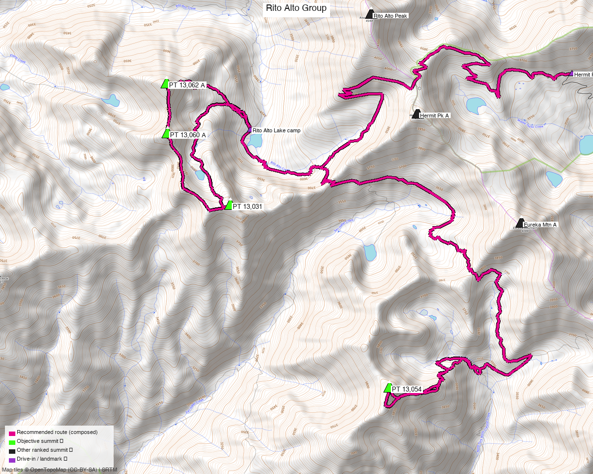

<!-- QUICKSTATS_START -->

!!! tip "At a glance — 3-day trip"
    **4 peaks** · **~4.5 h drive**

    - **Day 1 (Drive + pack in):** **5.36 mi** · **1,339 ft** gain · **Class 1**
    - **Day 2 (PT 13,054 (Pyramid Mtn)):** **13.13 mi** · **4,641 ft** gain · **Class 2** · 1 peak
    - **Day 3 (North 3 + pack out):** **9.15 mi** · **4,016 ft** gain · **Class 2** · 3 peaks

<!-- QUICKSTATS_END -->

**Researched:** 2026-07-22

!!! weather ""
    **NOAA weather link:** [Rito Alto basin weather](https://forecast.weather.gov/MapClick.php?lat=38.088&lon=-105.665)

!!! map ""
    **CalTopo research map:** <https://caltopo.com/m/QKQ438P>

**Status in DB:** all 4 unclimbed. Four ranked west-Sangre 13ers arrayed above Rito Alto
Lake — three on the north crest (**PT 13,062 A "Mas Alto"**, **PT 13,060 A "Alto"**,
**PT 13,031 "Menos Alto"**), one to the south (**PT 13,054 "Pyramid Mtn"**). All neighbors
of the crest — **Rito Alto Pk, Hermit Pk A, Eureka Mtn A** — already climbed.

<!-- PROVENANCE_START -->
*Note: the recommended route was distilled from **67 recorded GPS tracks** of real trips (14ers.com · ListsofJohn · peakbagger · Kyle's recordings) — all layered on the [interactive CalTopo research map](https://caltopo.com/m/QKQ438P).*
<!-- PROVENANCE_END -->

---

<!-- CLIMBERS_START -->
**Other climbers:** Emily Sharpe — not yet · Shawn D Keil — 3 of 4 (PT 13,062 A, PT 13,060 A, PT 13,031)
<!-- CLIMBERS_END -->

## Peaks covered

A **backpack from a Rito Alto Lake basecamp**, accessed via the **Hermit Pass Rd TH (4WD,
~11,690')** on the east side of the range — much shorter than the ~7.5 mi west approach.
Hardest move **Class 2** throughout (four standard-route PTs; no exposed connecting
ridge on this line).

| Peak | Day | Elev | Class | Prom | CO rank |
|---|---|---|---|---|---|
| [PT 13,054 "Pyramid Mtn"](https://www.14ers.com/peaks/10687) | 2 | 13,054' | 2 | 610' | #605 |
| [PT 13,062 A "Mas Alto"](https://www.14ers.com/peaks/10685) | 3 | 13,065' | 2 | 862' | #594 |
| [PT 13,060 A "Alto"](https://www.14ers.com/peaks/10686) | 3 | 13,059' | 2 | 362' | #602 |
| [PT 13,031 "Menos Alto"](https://www.14ers.com/peaks/10689) | 3 | 13,031' | 2 | 322' | #617 |

All four sit inside the **Sangre de Cristo Wilderness** (Rio Grande NF). Pyramid Mtn is the
south peak — parent Eureka Mtn A, reached from Rito Alto Lake via a mapped trail south past
San Isabel Lake. The north 3 form a **chained crest ridge** directly above the lake basin
(PT 13,062 A is line parent of PT 13,060 A and PT 13,031 both).

---

## Getting there — Hermit Pass Rd TH (east side, 4WD)

**Drive from Boulder:** **[~4h 30m via Google Maps](https://www.google.com/maps/dir/?api=1&origin=1162+Peakview+Circle,+Boulder,+CO+80302&destination=38.09612,-105.63400)**
— I-25 S to Colorado Springs, US-50 W to Cañon City, CO-69 S to Westcliffe, then the
**Hermit Pass Road** (Custer County Rd 160 → FS 160) up out of the Wet Mountain Valley to
the trailhead at ~11,690'.

| | |
|---|---|
| **Trailhead** | Hermit Pass Rd TH, 38.09612,-105.63400, **~11,690'** (end of 4WD road) |
| **Access** | **4WD required** — Hermit Pass Rd (FS 160) climbs from Westcliffe (~7,900') to ~11,690' on a rocky, high-clearance road. Multiple 14ers/LoJ TRs confirm 4WD-only above the lower switchbacks. |
| **Wilderness** | Sangre de Cristo Wilderness (Rio Grande NF, east side) — no permits/fees; standard wilderness rules (LNT, no mechanized travel). |

---

## The days, in order

### Day 1 — Drive from Boulder, pack in to Rito Alto Lake

**~5.36 mi · ~1,339 ft** on **mapped OSM trails** — first Hermit Lake Road (`highway=track`,
the 4WD dirt road extension from TH), then Rito Alto Trail over Hermit Pass (~13,000') and
down west into the Rito Alto basin. The trail passes right through camp at the lake's west
shore.

**Camp:** Rito Alto Lake (~11,880'). Documented backpack site — AllTrails "Rito Alto Lake
via Rito Alto Trail" has 14 backpacker reviews; the campsite is a **spur trail up an
embankment on the left side of the trail** in low conifers, before the NW stream crossing.

### Day 2 — PT 13,054 "Pyramid Mtn" (Class 2)

**~13.13 mi · ~4,641 ft** — the longest day, front-loaded. From camp, back on the **Rito
Alto Trail** briefly and then onto the **North Fork Crestone Trail** (which runs SE from
just east of the lake past San Isabel Lake area down to Pyramid Mtn's east basin at
~12,000'). From the trail's south end, a short off-trail east-lobe climb (~0.7 mi) reaches
the summit — this is the recorded standard route per **trk_14ers_2**. Return via the same
line.

Class 2 tundra and talus; standard route per LoJ.

### Day 3 — North 3 + pack out to trailhead

**~3.79 mi climb + ~5.36 mi pack out = 9.15 mi · ~4,016 ft** total.

**Morning climb** — camp-to-camp loop over the north 3, verbatim from **trk_loj_14848** (a
recorded east-side loop). From camp, the recorded trail ascends the west drainage NW to the
crest, tags **PT 13,062 A "Mas Alto"** (13,065'), traverses S along the ridge past
**PT 13,060 A "Alto"** (13,059'), continues to **PT 13,031 "Menos Alto"** (13,031'), then
descends the east ridge back to camp. All three saddles and both spur ridges recorded Class 2.

**Then pack out** — reverse of Day 1 back to the TH on the mapped **Rito Alto Trail** and
**Hermit Lake Road** (**~5.36 mi · ~1,679 ft** gain back over Hermit Pass, then descent).
Drive home ~4.5 h.

---

## Camps & water

- **Basecamp — Rito Alto Lake (~11,900'):** a documented and reasonably-used Sangre backpack
  site. AllTrails reports **14 backpacker reviews** including "spent the night at the lake
  and the next day fishing — lovely." Water directly from the lake; treat.
- **Nights required:** 2 (arrive Day 1 evening, sleep at camp before Day 2 climb, sleep
  again before Day 3 pack-out).
- **Alternate water on trail:** Rito Alto Creek flows below the lake (west); Middle Taylor
  Creek watersheds drain both east (toward Hermit Pass Rd) and west. Reliable through the
  standard July–September window.

---

## Gear & season

- **Best window:** **July through September** — Hermit Pass Rd melts out by mid-June; the
  basin holds snow into early July most years.
- **Vehicle:** **4WD required** for Hermit Pass Rd. Without 4WD, the west-side approach
  from the San Luis Valley (Rito Alto Trailhead, 8,255') adds ~7.5 mi one-way to the lake
  and ~1,500 ft more gain — see *Other considerations*.
- **Terrain:** Class 2 on all objectives; no rope/helmet/axe/crampons in season. Peak days
  spend meaningful time above 13,000' — plan early starts, off high ground by early
  afternoon monsoon.
- **Cell:** unreliable throughout; carry an **InReach** for this backpack. Neighbor 14ers
  have no useful cell data.

---

## Other considerations

**Why the east (Hermit Pass Rd) approach vs. the west (San Luis Valley) approach?** The
recorded objective tracks all start from the west TH (8,255') and climb 15+ mi round-trip
to reach any of the four peaks. From the east — a 4WD start at ~11,690' — the pack-in to
Rito Alto Lake is only ~4.8 mi with ~1,600 ft gain, and once at camp both peak-days shrink
substantially. **If 4WD isn't available**, the west approach becomes the default — expect
each peak-day to become a long single-push round-trip (~13–17 mi with 5,000–6,000 ft gain);
in that case a 2-day car-camp near the west TH doing the north 3 (one big day) and PT
13,054 (a separate long day) is the alternative structure, not a backpack.

**Route note on the north 3 (Day 3):** the approach and descent from camp to the crest are
**off-trail cross-country** through the Rito Alto Lake basin — no recorded track covers
those segments (all west-side TRs climb from the opposite drainage). The recommended-route
line on the map draws these as densified straight-line spurs; on the ground a hiker picks
the natural terrain up the drainage.

**Ridge-neighbor beta (informational):** Rito Alto Pk, Hermit Pk A, Eureka Mtn A are the
three climbed neighbors on the same crest. climb13ers and 14ers TRs document the
**Hermit → Eureka → Rito Alto crest traverse as Class 2/2+** ("moderately rocky, fun rock
and wildflowers, a documented 4–5 summit day") — so the connecting terrain is friendly if
one wanted to combine an unclimbed objective with a re-visit of a neighbor.

---

## Trip reports & GPX (all three sources)

**Sources confirmed logged in:** 14ers.com ("Basin"), listsofjohn.com ("letsgocu"),
peakbagger.com ("Kyle Knutson"). Recorded tracks for all 4 objectives were swept across
the 3 sources; neighbor-peak libraries (Hermit / Eureka / Rito Alto) were also swept for
ridge-access beta and layered on the CalTopo map.

### listsofjohn.com

| Date | Author | Peaks | TR |
|---|---|---|---|
| 2024-06-17 | josephnephi | PT 13,062 + 13,060 + 13,031 (north 3 crest chain) | [various](https://listsofjohn.com/peak/755) |
| 2024-05-05 | josephnephi | PT 13,054 (Pyramid Mtn) | [various](https://listsofjohn.com/peak/770) |
| 2021-04-10 | (neighbor) | Eureka → Hermit → Rito Alto (crest ridge traverse — key east-side approach beta) | — |

### 14ers.com (logged in, "Basin")

Peak pages exist for all four (10685/10686/10687/10689); no formal route descriptions
(these are LoJ-native PTs). GPX-library tracks layered on the CalTopo map.

### peakbagger.com (logged in, "Kyle Knutson")

Ascent GPX pulled for all four (verified pids 84754 / 84755 / 84756 / 84753). Neighbor
peak ascents (Hermit 19704, Eureka 14673, Rito Alto 5898) also swept — see amber tracks
on the research map for crest approaches.

**Sources checked:** 14ers.com ✓ (logged in, "Basin") · listsofjohn.com ✓ (logged in, "letsgocu") · peakbagger.com ✓ (logged in, "Kyle Knutson")
